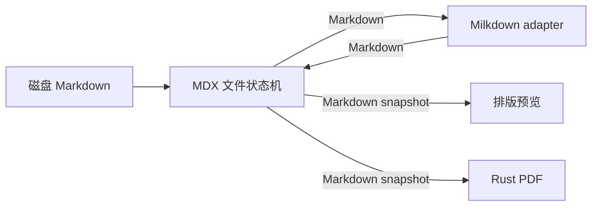
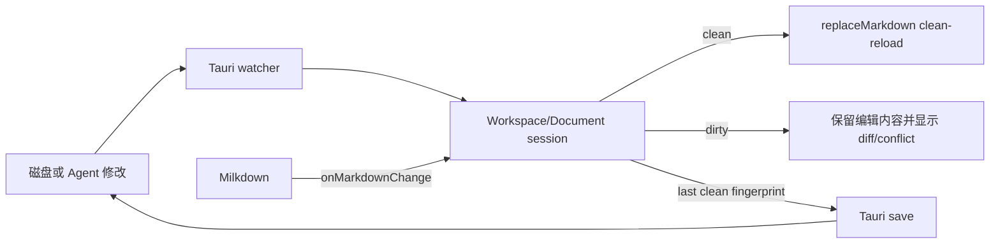

# 以 Milkdown 重建 MDX 主编辑表面，并将自研排版引擎收缩到预览与 PDF

Author(s): Codex
Last updated: 2026-08-12
Status: Accepted
Discussion: 当前用户会话（2026-08-12）
Source requirements: `.loopx/intake/2026-08-12-milkdown-editor-migration/requirements.md`；用户反馈当前自研编辑器“太难用了”，并要求在 `main` 分支上给出基于 ColaMD 扩充的设计方案
Support lenses: architecture-designer

## Abstract / 摘要

我们提议用 ColaMD 已验证的 Milkdown/ProseMirror DOM 编辑路径重建 MDX 的唯一主编辑表面，保留 MDX 的 Tauri 外壳、Workspace/Document 模式、标签页、Outline、图片资产、CLI、草稿恢复和磁盘冲突保护。Markdown 继续是唯一持久化真相；现有 Rust/WASM 排版、字体和 PDF 能力退出输入、光标与选区热路径，收缩为只读排版预览和原生 PDF 导出。

这不是整仓 fork ColaMD，也不是迁移到 Electron。我们复用其编辑器组合、主题和交互经验，但文件状态、保存安全和应用边界仍由 MDX 拥有。最重要的承诺是：日常编辑回到浏览器与成熟 ProseMirror DOM view 的原生路径，外部 Agent 修改不得静默覆盖用户未保存内容。

## Background / 背景与动机

### 当前架构把排版控制带进了输入热路径

`main` 当前由以下组件共同组成可见编辑器：

- `features/editor/components/editor-pane.tsx` 负责产品集成和复杂块行为；
- `packages/mdx-editor/react/mdx-editor-provider.tsx` 负责自研 kernel、ProseMirror state、Markdown 同步和命令；
- `packages/mdx-editor/react/hybrid-editor-host.tsx` 负责绝对定位 DOM text runs 与 Canvas/SVG 的混合表面；
- `packages/mdx-editor/react/wasm-layout-bridge.ts` 负责布局快照、hit-test、caret 和 selection geometry；
- `src-tauri/crates/layout-core`、`font-core`、`pdf-core` 负责排版、字体和 PDF。

这条路径为了获得 TeX 风格断行、数学排版和屏幕/PDF 共享布局，重新承担了浏览器和成熟编辑框架原本拥有的 caret、selection、IME、跨块操作、复制粘贴和命中映射。一个普通编辑动作需要协调 Markdown source、ProseMirror position、Layout IR、WASM snapshot、DOM text run 和 Canvas overlay。用户已经明确反馈结果“太难用了”，因此继续以投入规模或架构先进性为理由保留当前主编辑表面不再成立。

本轮文档改动前执行了 `npm test`。当前基线为 102 个 test files 中 97 个通过、5 个失败，704 个 tests 中 697 个通过、7 个因 5 秒超时失败；失败覆盖浏览器编辑行为、clipboard、schema 和布局性能。它们不能单独证明产品难用，但说明当前测试基线也需要在迁移详细设计前先稳定，避免迁移结果无法归因。

### ColaMD 证明了更短的主编辑路径，但不能替代整个 MDX

`ref/ColaMD` 使用 Electron + Milkdown，编辑器核心集中在 `src/renderer/editor/editor.ts`，由标准 ProseMirror DOM view 承担输入、光标、选区、history 和 clipboard。它已经支持 GFM、任务列表、数学、HTML、搜索、富文本复制、主题和 Agent 文件热更新，且以 MIT License 发布。

ColaMD 与 MDX 的应用边界不同：它没有 MDX 的 Workspace、标签、Memory、LLM Wiki、CLI selection bridge、draft recovery 和 fingerprint 冲突保护。它的外部文件变化会直接替换编辑内容并清除 dirty 状态，这与 `docs/loopx/specs/editor.md` 的安全合同冲突。因此，我们只能复用编辑层行为和代码，不能照搬 Electron 文件层或状态机。

## Goals And Non-Goals / 目标与非目标

### Goals

1. 把日常编辑可用性恢复为最高优先级：中文/英文输入、IME、光标、跨块选择、撤销重做和复制粘贴依赖成熟 DOM 编辑路径。
2. 保持现有数据安全合同：draft recovery、dirty 状态、磁盘 fingerprint、外部修改冲突和显式丢弃语义不得退化。
3. 保持 Markdown 为唯一持久化真相，不引入私有主文件格式。
4. 保持 Workspace/Document、文件树、标签、Outline、wikilink、图片、CLI selection/insert 和查找替换等 MDX 产品能力。
5. 保留 Rust 排版资产在高质量预览和 PDF 上的独立价值，但不让它控制交互编辑几何。
6. 通过稳定 adapter 隔离 Milkdown 私有 context、plugin key 和 DOM 实现，避免业务层重新与编辑器框架耦合。

### Non-Goals

- 不把 Tauri 迁移为 Electron。
- 不把 MDX 缩减为 ColaMD 的单文件或轻目录产品。
- 不在本次决策中重做 Workspace、Memory、LLM Wiki 或文件保存信息架构。
- 不要求 WYSIWYG 屏幕编辑与 PDF 像素级同版。
- 不让 Rust/WASM 排版参与普通输入、caret、selection 或 hit-test。
- 不长期维护两个用户可选编辑器或运行时兼容 shim。
- 不复制 ColaMD 的 Electron IPC、文件 watcher、dirty 处理或浏览器打印式 PDF。
- 不在本提案阶段制定实施任务或修改产品代码。

## Proposal / 设计方案

### 1. Milkdown 成为唯一交互式主编辑表面

MDX 新增一个 React 管理的 Milkdown adapter。Milkdown/ProseMirror DOM view 负责：

- `contenteditable`、composition 和 IME；
- caret、selection、跨块移动与删除；
- history、clipboard 和 drag/drop；
- 正文的原生 DOM、浏览器查找基础和无障碍树。

产品层只依赖稳定的 Markdown editor contract，不直接读取 Milkdown context 或实现私有 DOM class。建议的最小合同是：

```typescript
interface MarkdownEditorHandle {
    focus(): void;
    getMarkdown(): string;
    replaceMarkdown(
        markdown: string,
        reason: "open" | "clean-reload" | "restore",
    ): void;
    getSelection(): MarkdownSelection | null;
    setSelection(selection: MarkdownSelection): void;
    replaceSelection(markdown: string): void;
    insertImage(image: MarkdownImageInsert): void;
    scrollToSourceLine(line: number): void;
}

interface MarkdownEditorProps {
    documentId: string;
    markdown: string;
    editable: boolean;
    onMarkdownChange(markdown: string, origin: "user" | "command"): void;
    onSelectionChange(selection: MarkdownSelection | null): void;
    onReady(handle: MarkdownEditorHandle): void;
}
```

`MarkdownSelection` 以 Markdown source offsets 或 line/column 作为跨模块合同。ProseMirror position 的换算封装在 adapter 内，Workspace、CLI 和保存层不得依赖它。

这个决定只覆盖交互式 Markdown 编辑。HTML/MHTML 只读预览、图片预览、Memory、LLM Wiki 和其他文件 surface 保持现状。

### 2. Markdown 是编辑、外部工具与出版之间的唯一内容合同

Milkdown document 是会话状态，不是新的持久化格式。所有跨边界数据继续使用 Markdown：



对于 Milkdown 不能结构化表示的语法，沿用现有 source-preserving fallback 原则：内容必须可见，用户未编辑时必须保留原 source slice，不允许静默删除或猜测性归一化。

该规则不要求屏幕几何与 PDF 相同。两者共享内容 source，不共享 line box、caret 或 selection geometry。

### 3. MDX 文件状态机继续拥有 reload、dirty、draft 和 conflict

编辑器 adapter 不读取或写入文件，也不决定外部变更是否可接受：



保持以下现行行为：

- clean 文档可以接受外部 reload，并更新 clean baseline；
- dirty 文档发生外部变化时禁止自动覆盖；
- recovery draft 只有保存成功或显式丢弃后才能删除；
- 保存必须携带 last clean disk fingerprint，由 backend 拒绝过期写入；
- draft recovery prompt 继续提供只读 diff。

ColaMD 当前 `onFileChanged` 直接替换内容并把 `dirty` 设为 `false` 的实现属于明确禁止移植的行为。

### 4. Rust 排版、字体和 PDF 成为 publishing 子系统

现有 Rust 资产重新划分职责：

| 模块 | 新职责 | 是否处于编辑热路径 |
|---|---|---|
| `layout-core` | 从 Markdown/Layout IR 生成只读排版预览和分页输入 | 否 |
| `font-core` | 系统字体、glyph metrics、fallback、OpenType MATH | 否 |
| `pdf-core` | 原生分页和 PDF 输出 | 否 |
| WASM layout bridge | 若预览 surface 需要，在 webview 内生成布局 snapshot | 否 |
| hybrid DOM/Canvas host | 迁移验证完成后退出产品编辑入口 | 否 |

排版预览是显式只读 surface。预览或 PDF 失败不得改变 Markdown、dirty、selection 或 draft；失败必须返回明确诊断。若后续事实证明 publishing 子系统也没有产品价值，应由独立 proposal 决定删除，不能让它重新进入编辑热路径。

### 5. 复用 ColaMD 的编辑经验，不复用它的应用壳层

可以复制或改写：

- Milkdown editor composition；
- GFM、任务列表、数学、HTML 和 highlight plugin 的实现思路；
- 富文本复制；
- 主题 token/CSS；
- Agent 活动指示器的视觉语义。

实施前需重新核对依赖版本。当前安装 ColaMD 时 `@milkdown/plugin-math@7.5.9` 已产生 deprecated warning，不能未经评估直接成为 MDX 的长期依赖。

复制实质性 ColaMD 代码时，MDX 必须增加第三方 notice 或等价版权声明，保留 `Copyright (c) 2026 marswave.ai` 与 MIT License。只借鉴思想并重新实现时，也应在设计或提交说明中记录来源。

### 6. 复杂语法通过 MDX plugin 层接入

建议把语法分成三类：

| 类别 | 示例 | 编辑行为 | 保存合同 |
|---|---|---|---|
| Milkdown 原生/成熟插件 | CommonMark、GFM、表格、任务列表、链接、图片 | 结构化 WYSIWYG | 语义等价 round-trip |
| MDX plugin | frontmatter、footnote、wikilink、Mermaid、math、highlight | 专用 schema/plugin/node view | 保留语义及必要 source 信息 |
| source-preserving fallback | 未知扩展、无法安全解析的 raw HTML/directive | 明确的源码块 | 未编辑时保留原 source slice |

Mermaid 的 fence source 继续是唯一真相；preview 使用 strict security，preview DOM 不进入 serialization，查找只计算一次语义文本。数学公式在主编辑器中使用可编辑 source + KaTeX 展示，OpenType MATH 仅用于 publishing。

### 7. 迁移只在兼容边界上分阶段，不提供长期双编辑器模式

高层过渡顺序：

1. 评审本提案，明确待决产品行为。
2. 通过 `clarify` 形成带 `AC-*` / `TC-*` 的 requirements package。
3. 用 `spec` 产出详细设计和 adapter/state/plugin 合同。
4. 在非产品 fixture 中验证 Milkdown 的 IME、round-trip 和复杂语法。
5. 接入 MDX 文件状态机、CLI、图片、Outline 和两种窗口模式。
6. 达到详细设计门槛后一次切换唯一产品入口。
7. 清理不再服务 publishing 的 hybrid interaction 代码，并将旧 TeX Canvas 设计的交互部分标记为 superseded。

开发期可以存在隔离 fixture，但不新增用户级双编辑器开关。产品回滚依赖 Git revert 或回退发布版本；Markdown 格式不变，因此不需要用户数据迁移。

Design anchors: not applicable。本文件是 proposal-only 决策材料；在用户接受方向并通过 `clarify` 固定 AC/TC 之前，不为实施制造伪精确的 `D-*` 合同。

## Support Lens Checks / 专项设计检查

| Support lens | Trigger | Design checks applied | Result |
|---|---|---|---|
| architecture-designer | 主编辑器、文件状态机、publishing、插件和迁移边界发生长期变化 | 系统所有权、NFR 优先级、失败隔离、回滚、依赖维护和替代方案 | 编辑可用性与数据安全优先；Milkdown 拥有交互编辑，MDX 拥有文件状态，Rust 拥有派生出版；不采用双运行时或长期双编辑器 |

## Boundary Scenarios / 边界场景

| 场景 | 本提案的边界与结果 |
|---|---|
| 空文档或单段文档 | Milkdown 正常编辑；Markdown 仍可保存为空或单段，不引入特殊文件格式 |
| Milkdown 无法结构化表示某段 Markdown | 不能静默删除；未知语法进入明确 fallback/source 表示，只有不能保证 source preservation 的 fatal parse 才拒绝切回 WYSIWYG，详见详细设计 `D-005` / `D-006` |
| serializer 可能改写未知语法 | 拒绝结构化接管该 source slice；未编辑时保真，不用保存阶段正则猜测修复 |
| dirty 文档收到外部 Agent 更新 | 保留用户编辑，进入现有 conflict/diff；禁止采用 ColaMD 的直接覆盖行为 |
| clean 文档连续收到 atomic-save/rename 事件 | watcher 可以去抖通知，但 fingerprint 和文件状态机仍决定 reload；重复事件不得产生重复 dirty |
| 保存时 fingerprint 已过期 | backend 拒绝写入；编辑内容和 draft 保留，用户看到冲突 |
| Milkdown plugin 初始化失败 | adapter error boundary 保留 session Markdown/draft 并报告错误；不静默切换旧编辑器 |
| 排版预览或 PDF 失败/超时 | 只影响预览/导出；编辑和保存继续可用，不生成伪成功文件 |
| 迁移期间旧 hybrid 代码仍在仓库 | 只允许用于隔离验证；不能形成用户级双编辑器合同，切换后按引用证明清理 |
| 回退到旧应用版本 | Markdown 文件无需迁移；应用版本回退，新增但旧版本不支持的语法仍必须以 source 保留 |
| 文件读写权限不足 | 属于现有 Tauri/文件状态机行为；编辑器 adapter 不绕过权限或自行写文件 |
| 多用户/租户/远程协作权限 | 不涉及：MDX 仍是本地单用户文件应用，本提案不新增云协作 |
| 网络失败 | 主编辑不依赖网络；远程图片等现有行为保持，Milkdown plugin 不得擅自增加网络依赖 |
| 超大文件 | 首版固定 100 KiB/1 MiB fixture 与 `AC-014` 性能门槛；超过 1 MiB 不截断、不改格式，未来 hard limit 需另行决策 |
| Workspace/Document、draft、CLI、图片、Outline | 必须保持现有行为，除非后续 requirements 明确改变；本提案不重做这些产品面 |

## Rationale / 理由与取舍

编辑器首先是输入工具。当前方案将 TeX 级布局和屏幕/PDF 同版置于日常编辑之上，结果是把浏览器已有能力变成项目长期维护对象。Milkdown 不是零成本依赖，但它把复杂度收回成熟 ProseMirror DOM view，并允许 MDX 把工程投入集中在自己的差异化能力：本地工作区、Agent 协作、数据安全、Memory/LLM Wiki 和高质量出版。

我们接受屏幕与 PDF 不再同版，换取自然输入和更小的主编辑器表面积。两者通过 Markdown source 保持内容一致，排版差异变成 publishing 的可见属性，而不是编辑器交互风险。

| Alternative | Why Not |
|---|---|
| 继续修复 hybrid DOM/Canvas editor | caret、selection、IME 和跨层同步没有可证明的收敛边界，继续放大非差异化维护成本 |
| 整仓 fork ColaMD | 会丢失 Tauri、Workspace、draft/fingerprint、CLI、Memory/LLM Wiki 和原生 PDF 等 MDX 边界 |
| 嵌入 ColaMD Electron 应用或子进程 | 形成 Electron + Tauri 双运行时、重复文件状态和复杂 IPC，故障面大于收益 |
| 回到旧自研 ProseMirror DOM view | 虽比 hybrid 简单，但仍由 MDX 维护 parser/schema/plugin/view 全栈，不能充分复用 Milkdown 生态 |
| 长期保留两个可选编辑器 | 会要求所有 plugin、命令、恢复和测试永久实现两遍，违反最小正确系统边界 |
| 删除全部 Rust 排版代码 | 主编辑不应受沉没成本支配，但 Rust PDF/字体/排版仍有独立 publishing 价值；是否删除应由后续证据单独裁决 |

## Compatibility / 兼容性

这是一个**有意 breaking 的内部编辑器 surface 迁移**，但目标是保持用户文件、文件状态和主要业务行为兼容。

- 用户文件：Markdown 格式不变，不执行批量迁移或重写。
- 用户行为：输入、选择和复制行为会改善；复杂语法的具体可见交互可能变化，需要详细 requirements 固定。
- 内部 API：当前 hybrid host、layout snapshot、visible-text DOM contract 和部分自研 kernel exports 将被替换或删除。
- CLI：命令名和用途保持；selection mapping 改由 adapter 提供 Markdown source 坐标。
- draft/conflict/fingerprint：完全保持现行安全语义。
- PDF：继续由 Rust/native 路径生成；不保证与 WYSIWYG 屏幕像素一致。
- plugin contract：由自研 kernel plugin 转为 Milkdown adapter/plugin contract，是迁移的主要兼容成本。
- feature flag：不建立长期用户开关。开发 fixture 不构成公共兼容承诺。
- rollback：回退应用版本或 Git revert；由于持久化格式仍是 Markdown，不需要数据回滚。
- 许可证：复制 ColaMD 代码必须保留 MIT notice，属于发布兼容要求。

## Operational And Security Impact / 运行与安全影响

### Failure isolation

- Milkdown/plugin 故障只属于交互编辑层，不能删除 draft 或写坏磁盘文件。
- preview/PDF 故障属于 publishing 层，不能影响编辑、dirty 和保存。
- 外部 watcher 事件仍由文件状态机裁决，编辑器不拥有自动覆盖权限。

### Observability

详细设计至少需要定义以下本地诊断信号：editor initialization、parser/serializer diagnostic、input latency、long task、external conflict、draft recovery、fingerprint rejection、preview/PDF error。诊断不得记录完整正文。

### Security

- clipboard HTML 在 rehydrate 前必须 sanitizer；
- Mermaid 保持 strict security；
- plugin 不得未经授权加载远程资源；
- 本地图片仍走 MDX/Tauri 受控资源解析；
- Milkdown adapter 不获得额外文件系统权限；
- ColaMD 源码复用必须通过许可证检查。

### Maintainability

Milkdown 版本需要锁定，升级必须通过 adapter contract、round-trip、IME 和 plugin 测试。详细设计已固定为整组对齐受支持的 Milkdown 版本并由 lockfile 精确锁定；math 由 MDX-owned plugin 基于维护中的公开 API 实现，不使用 deprecated `@milkdown/plugin-math@7.5.9`，不能靠兼容 shim 掩盖。

## Implementation And Transition / 实现与过渡

本提案不定义任务清单。过渡必须遵守三个兼容门槛：

1. 先形成经用户批准、带量化 AC/TC 的 requirements package，再写详细设计。
2. 新 editor 必须在隔离 fixture 中证明 IME、round-trip、fallback 和复杂语法，才可连接真实文件状态。
3. 只有 Workspace/Document、draft/conflict/fingerprint、CLI、图片、Outline 和 publishing 边界全部通过验证，才能替换唯一产品入口。

旧 hybrid 代码在产品切换后的短验证期仍可留在 Git 工作树，但不得成为用户级 fallback。清理时只删除不再被 publishing 使用的 interaction code；`layout-core`、`font-core`、`pdf-core` 的去留按本提案的新职责判断，而不是按目录整块删除。

## Open Questions / 待决问题

无。用户已通过 `.loopx/intake/2026-08-12-milkdown-editor-migration/requirements.md` 确认：

- 屏幕与 PDF 内容一致但不要求同版；
- 恢复共享同一 session 的全局 CodeMirror 源码模式；
- 首版不降低现有复杂语法能力；
- 采用 requirements 中的量化性能、IME 与无障碍门槛；
- 参考 ColaMD 行为、按 MDX React/Tauri 边界重写 adapter，只选择性复制独立插件并履行 MIT notice。

## Detailed Design Handoff / 详细设计交接

提案已经接受，requirements package 已固定 AC/TC，可以进入详细设计。详细设计必须引用 `.loopx/intake/2026-08-12-milkdown-editor-migration/requirements.md`，并保持 AC → D → TC 可追溯性。

提案若被接受，详细设计必须把以下内容当作固定约束，不得重新争论：

- Milkdown/ProseMirror DOM view 是唯一交互式主编辑 surface；
- Tauri、Workspace/Document 和文件安全状态机保留；
- Markdown 是唯一跨边界内容合同；
- Rust layout/font/pdf 退出输入热路径，只服务 publishing；
- dirty 外部变化不得自动覆盖；
- 不长期维护双编辑器或用户级 fallback；
- ColaMD Electron 文件层不进入 MDX。

推荐流程：

```text
$spec .loopx/intake/2026-08-12-milkdown-editor-migration
```

## Appendix / 附录

### Repo evidence

- `PRODUCT.md`
- `docs/loopx/specs/editor.md`
- `.loopx/memory/MEMORY.md`
- `docs/loopx/design/TeX风格Canvas自绘编辑器需求设计文档.md`
- `docs/loopx/plans/2026-06-24-tex-canvas-editor-master.md`
- `features/editor/components/editor-pane.tsx`
- `packages/mdx-editor/react/mdx-editor-provider.tsx`
- `packages/mdx-editor/react/hybrid-editor-host.tsx`
- `packages/mdx-editor/react/wasm-layout-bridge.ts`
- `src-tauri/crates/layout-core`
- `src-tauri/crates/font-core`
- `src-tauri/crates/pdf-core`

### ColaMD evidence

- `ref/ColaMD/README.md`
- `ref/ColaMD/AGENT.md`
- `ref/ColaMD/src/renderer/editor/editor.ts`
- `ref/ColaMD/src/renderer/main.ts`
- `ref/ColaMD/src/main/index.ts`
- `ref/ColaMD/LICENSE`

ColaMD checkout at review time：commit `4c986a4`，version `1.8.2`。`npm ci && npm run build` 已通过。
