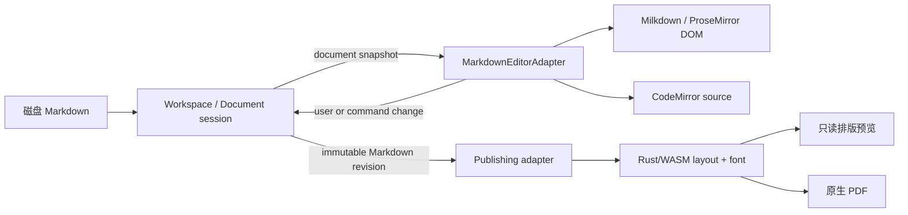

# Milkdown 主编辑器迁移设计文档

Author(s): Codex  
Last updated: 2026-08-13  
Status: Ready for planning  
Canonical requirements: `.loopx/intake/2026-08-12-milkdown-editor-migration/requirements.md`  
Approved proposal: `docs/loopx/design/2026-08-12-milkdown-editor-migration/设计提案.md`  
Support lenses: `architecture-designer`, `cli-developer`

## 一、修订历史

| 版本号 | 修订内容 | 修订时间 | 修订人 |
|---|---|---|---|
| V1.0.0 | 根据已批准 requirements 与 proposal 固定详细设计、接口、迁移和验证合同 | 2026-08-13 | Codex |

## 二、需求信息

### 2.1 需求背景

- 背景：当前产品主编辑器把 ProseMirror 文档、Markdown source、Rust/WASM layout snapshot、绝对定位 DOM text run 和 Canvas/SVG overlay 放在同一交互热路径，导致输入、IME、caret、selection、clipboard 和 drag selection 的正确性由项目自研几何承担。用户已明确反馈当前编辑体验“太难用了”。
- 需求目的：用 Milkdown/ProseMirror DOM view 重建 Workspace Mode 与 Document Mode 的唯一交互式 Markdown 主编辑表面，将日常编辑行为交回浏览器与 ProseMirror，同时保留 MDX 的文件安全、工作区、CLI 和 publishing 能力。
- 目标用户/使用方：本地 Markdown 作者；通过 MDX CLI/Agent 修改文档的自动化调用方；维护编辑器、文件 session 与 PDF 的工程人员。
- Intake package：`.loopx/intake/2026-08-12-milkdown-editor-migration/`。
- Canonical requirement contract：`.loopx/intake/2026-08-12-milkdown-editor-migration/requirements.md`，其中 `AC-*` 与 `TC-*` 为验收权威。
- Supporting evidence：`.loopx/intake/2026-08-12-milkdown-editor-migration/clarification.md`，用于记录源码模式、复杂语法、性能和 ColaMD 复用方式的确认过程。
- 已批准方向：`docs/loopx/design/2026-08-12-milkdown-editor-migration/设计提案.md`。本设计不重新讨论 Milkdown、Tauri、Markdown source of truth 或 publishing 边界是否成立。
- 仓库证据：`features/editor/components/editor-pane.tsx` 当前拥有 hybrid surface；`features/editor/hooks/use-editor-bridge.ts` 当前负责 Markdown/selection 桥；Workspace 与 Document shell 当前拥有 dirty、draft、watcher 和 fingerprint 行为；`src-tauri/src/layout_pdf.rs` 当前拥有原生 PDF 命令。
- 基线证据：设计提案阶段的 `npm test` 为 102 个 test files 中 97 个通过、5 个超时失败，704 个 tests 中 697 个通过、7 个超时失败。实施前必须先形成可归因的绿色或明确隔离的基线，不能把既有超时算作迁移回归或成功。

### 2.2 需求范围

本期范围：

- Milkdown/ProseMirror DOM view 成为 Workspace Mode 和 Document Mode 唯一的 WYSIWYG Markdown 主编辑表面。
- 恢复全局 CodeMirror 源码模式；它和 WYSIWYG 共用同一 Markdown document session，而不是第二份内容或第二套文件状态机。
- 建立产品自有的稳定 `MarkdownEditorAdapter`，隔离 Milkdown/ProseMirror/CodeMirror 私有位置、plugin key 与 DOM。
- 保持 frontmatter、footnote、wikilink、Mermaid、math、callout、安全 HTML 与未知语法的可编辑和保真合同。
- 把 Outline、图片、wikilink、CLI selection/insert、查找替换接到稳定 adapter。
- 保留 Tauri 文件/session 状态机和 Rust publishing；移除 Rust layout 对交互 caret、selection、hit-test 的参与。
- 固定 ColaMD 代码复用的来源、依赖和许可证边界。

非目标：

- 不迁移到 Electron，不复制 ColaMD 的 IPC、watcher、dirty/reload 或浏览器打印 PDF。
- 不改变 Workspace、Memory、LLM Wiki、文件树或标签页的信息架构。
- 不引入私有主文件格式、批量数据迁移、远程主编辑依赖或额外文件系统权限。
- 不要求 WYSIWYG 与 PDF 像素级同版。
- 不长期提供旧 hybrid editor 与 Milkdown 的用户级切换或运行时 fallback。
- 不在本设计中决定 Rust publishing 子系统最终是否删除；它本期继续服务只读预览与 PDF。

决策边界与约束：

- Markdown 是编辑器、磁盘、CLI 与 publishing 之间唯一内容合同；ProseMirror doc、CodeMirror state 与 layout snapshot 都是派生/会话状态。
- dirty 外部变化不得覆盖内存内容；draft 只在保存成功或显式丢弃后删除；保存继续携带 last-clean fingerprint。
- 未知或不安全语法不得静默丢失。未编辑 fallback 必须逐字节保留其原 source slice。
- 主编辑器不拥有文件读写或 reload 裁决权；publishing 不拥有编辑状态写权。
- `@milkdown/plugin-math@7.5.9` 已由 npm 标记 deprecated，不得进入依赖树。Milkdown 包统一使用同一受支持版本并由 lockfile 精确锁定；版本升级必须重新通过 adapter、round-trip、IME 与性能合同。
- CodeMirror 依赖已存在于 `package.json`，但当前没有可直接复用的产品源码表面；本设计要求按相同 adapter/session 合同接入，而非假设已有组件。
- 触发的辅助 skills：`architecture-designer`（系统所有权、失败隔离、NFR、回滚）；`cli-developer`（现有 CLI 自动化兼容）。

### 2.3 可行性分析

- 业务可行性：Milkdown 的 DOM 编辑路径直接解决用户反馈的主问题，同时 Markdown 格式不变，不要求用户迁移文件。
- 技术可行性：`ref/ColaMD` 在 commit `4c986a4e0920cf0598fb2a47cec2966fc5340c77` 上已完成 `npm ci && npm run build`；它证明 Milkdown 组合可运行，但不证明其 Electron 文件层适合 MDX。MDX 已有 React/Tauri、CodeMirror 依赖和完整文件安全状态机，可在现有边界内重写 adapter。
- 关键取舍：接受屏幕布局与 PDF 布局不一致，换取标准 DOM 输入正确性；接受 Milkdown 生态依赖，换取减少自研编辑器内核；保留 source-preserving plugin 工作，换取未知语法不丢失。
- 替代方案已由 accepted proposal 排除：继续修 hybrid、整仓 fork ColaMD、Electron/Tauri 双运行时、回到自研 DOM view、长期双编辑器、立即删除全部 Rust publishing。
- 主要风险：Milkdown serializer 对未知 source 的归一化、ProseMirror position 与 Markdown offsets 的映射、源码模式切换失败、异步图片/CLI 插入时 selection 漂移、大文档初始化与无障碍。各风险分别由 `D-002`、`D-003`、`D-004`、`D-007` 和 `D-010` 固定处理。
- 资源边界：不复制 ColaMD 的整体 `editor.ts`；只允许复制可独立测试的 plugin 片段，并逐项留下 provenance 与 MIT notice。

## 三、概要设计

### 3.1 方案总述

设计由四个所有权边界组成：

1. `Workspace/Document session` 拥有 canonical Markdown、dirty、draft、fingerprint、外部冲突和保存。
2. `MarkdownEditorAdapter` 拥有 WYSIWYG/源码两种编辑表面、source selection 坐标映射、编辑命令和诊断；产品调用方只见稳定合同。
3. `MDX syntax plugins` 拥有语法的 parse/schema/serialize/NodeView/clipboard/source-preservation 行为。
4. `Publishing` 只读取某个 Markdown revision 的不可变 snapshot，生成只读预览或 PDF，不反写编辑 session。



技术指标：

- 100 KiB 混合 Markdown 首次可编辑 `< 500 ms`，1 MiB `< 2 s`。
- 普通输入和中文 IME composition 到可见更新 `p95 < 50 ms`。
- 100 KiB WYSIWYG/源码切换 `< 1 s`。
- 1 MiB 连续滚动无 `> 100 ms` 主线程 long task。
- macOS 真机覆盖中文拼音、emoji/组合字符、跨块 selection、undo/redo、clipboard、drag selection、键盘、VoiceOver 与 WCAG 2.1 AA。

### 3.2 整体架构设计

系统边界：

| 所有者 | 拥有 | 明确不拥有 |
|---|---|---|
| Workspace/Document session | Markdown、document identity、dirty、draft、fingerprint、watcher/conflict/save | ProseMirror/CodeMirror 私有 state、DOM、layout geometry |
| MarkdownEditorAdapter | surface lifecycle、source selection、编辑事务、模式切换、诊断 | 文件 IO、dirty 裁决、draft 删除、external reload 决策 |
| Milkdown syntax layer | schema、parser/stringifier、NodeView、clipboard、fallback | Workspace 状态、Tauri IPC、发布写盘 |
| Tauri file backend | 读写、watcher、fingerprint compare-and-write、受控资产 | 编辑 surface 和 selection |
| Publishing | Markdown snapshot 到 layout/PDF 的派生流程 | interactive caret/selection/hit-test、修改 session |

模块依赖只允许朝稳定边界流动：feature 层可依赖 `packages/mdx-editor` 的公开 adapter types；不得依赖 Milkdown context、ProseMirror plugin key、CodeMirror `EditorView` 或实现 DOM class。syntax plugin 可依赖选定 Milkdown/ProseMirror API，但不得反向依赖 Workspace。

### 3.3 核心流程设计

| 流程 | 触发条件 | 主流程 | 异常/拒绝 | 输出 |
|---|---|---|---|---|
| 打开文档 | tab/document 加载完成 | session 建立 revision → adapter parse → DOM 可编辑 | 初始化失败保留 session Markdown，展示阻塞诊断；不切旧 editor | WYSIWYG surface |
| 用户编辑 | DOM/CodeMirror transaction | adapter 生成 Markdown change → session 更新 canonical Markdown/dirty/draft | stale document/revision change 被拒绝，不串写其他 tab | 新 document revision |
| 模式切换 | 用户切换 WYSIWYG/source | flush 当前事务 → 共享 source selection → 激活另一 surface | source 无法安全构建 WYSIWYG 时留在 source，保留 last-stable visual | 同一 session 的另一表面 |
| 外部变更 | Tauri watcher 读到新 fingerprint | clean 时 session 接受并 replace；dirty 时进入 conflict/diff | 重复 watcher 事件按 fingerprint 幂等；禁止 editor 自行 reload | clean baseline 或 conflict |
| CLI/图片插入 | 命令或异步资产完成 | 捕获 document/revision/selection → adapter 映射并执行 | 文档已替换且无法映射时拒绝，绝不退化到当前光标 | 确定位置的 Markdown change |
| 预览/PDF | 用户请求 publishing | 捕获不可变 Markdown revision → 解析/layout → preview/PDF | 失败只返回 publishing error，不改 session | 派生 preview/PDF |

### 3.4 功能模块

| 模块 | 职责 | 关键依赖 | 目标位置 |
|---|---|---|---|
| Document session binding | 把现有 Workspace/Document Markdown 状态接到 adapter，并阻止 stale 回调 | Workspace/Document shell | `features/editor` + existing shells |
| Markdown editor adapter | 稳定 public contract、生命周期、模式与命令 | React、Milkdown、CodeMirror | `packages/mdx-editor` public API |
| Milkdown surface | DOM editing、history、composition、clipboard、selection | aligned `@milkdown/kit` | `packages/mdx-editor/milkdown` |
| Source surface | 全局 Markdown 源码编辑与诊断 | existing CodeMirror packages | `packages/mdx-editor/source` |
| Syntax plugins | 复杂语法、safe HTML、fallback、round-trip | Milkdown plugin APIs、KaTeX、sanitizer | `packages/mdx-editor/syntax` |
| Feature integrations | Outline、wikilink、find、图片、CLI | stable adapter only | `features/editor`, `features/workspace` |
| Publishing adapter | Markdown revision 到只读 layout/PDF | existing layout/font/pdf | publishing path, not editor hot path |

### 3.5 新增/调整功能说明

- `EditorPane` 继续是 Workspace/Document 共用的产品入口，但不再直接管理 hybrid snapshot、caret overlay、Canvas hit-test 或 DOM text scan；它组合 adapter、toolbar、find、syntax diagnostics 与现有 feature callbacks。
- `packages/mdx-editor` 的产品权威从 `createMdxEditorKernel/defaultMarkdownSyntax + HybridEditorHost` 改为 `MarkdownEditorAdapter + createMdxMilkdownPlugins`。旧 kernel/hybrid exports 仅在迁移期间服务隔离 fixture，产品切换后不再公开。
- 全局源码模式是同一 `EditorDocumentSession` 的 view state；默认打开 WYSIWYG。surface mode 不写入 Markdown 文件、不进入 workspace 持久化 schema，关闭并重新打开文档时回到 WYSIWYG。
- CLI 的命令名、参数、stdout/stderr、JSON 和 exit code 不变；仅内部 selection dispatch 改走 adapter。
- Rust layout/font/pdf 目录不按目录删除；只删除/隔离 interactive geometry 调用方，保留 publishing 所需代码。

### 3.6 专项设计检查

| 辅助 skill | 触发原因 | 检查内容 | 设计结论 |
|---|---|---|---|
| `architecture-designer` | 编辑器、文件状态机、publishing 的所有权与 NFR 长期变化 | 所有权、失败隔离、性能、可恢复性、部署、回滚、依赖维护 | session、adapter、syntax、publishing 四边界单向依赖；编辑失败不写盘，publishing 失败不改编辑状态；回滚应用版本而不迁移 Markdown |
| `cli-developer` | CLI selection/insert 内部实现变化且用户脚本可能依赖现有行为 | 命令签名、机器输出、非交互行为、错误与兼容 | 公共 CLI 合同完全不变；adapter 只替换内部 source selection 映射和 pinned dispatch，不引入 prompt、flag 或新 JSON 字段 |

## 四、详细设计

### 4.1 Document session 与受控 adapter 绑定

#### 4.1.1 需求内容

- 入口：Workspace active tab 或 Document Mode 已加载 Markdown。
- 调用方：`EditorPane`、Workspace shell、Document shell。
- 前置条件：调用方提供稳定 `documentId`、canonical Markdown 和单调递增的内存 `revision`。
- 输出结果：adapter 的 user/command change 以带 `documentId`、`baseRevision` 和 source selection 的事件返回 session；session 决定 dirty/draft。

#### 4.1.2 方案设计

`EditorDocumentSnapshot` 是 adapter 唯一内容输入：`documentId` 表示文件/tab 身份，`revision` 是当前进程内的单调版本，`markdown` 是该 revision 的完整 source。revision 不持久化，不改变 Workspace schema。

adapter 内部可维护 ProseMirror/CodeMirror 派生 state，但 canonical Markdown 只存在于 session。adapter 对外发出的 change 必须带 `baseRevision`；调用方仅在 `documentId` 仍匹配且 `baseRevision` 仍是当前可接受 revision 时应用。adapter 接收新 snapshot 时区分：

- 自己刚确认的 change：确认 revision，不重建 editor、不重放 history；
- `open/clean-reload/restore/conflict-resolution`：作为外部 replace，清晰重置或恢复 selection/history；
- 其他 stale snapshot/change：拒绝并记录不含正文的诊断。

**Behavior Contract — `D-001`（source: `AC-001`, `AC-002`）**

- 决策：Workspace 与 Document 只挂载 Milkdown/ProseMirror DOM WYSIWYG surface；composition、caret、selection、history、clipboard 和 drag selection 由该 DOM view 负责。
- 边界：HTML/MHTML、图片、Memory、LLM Wiki 等非 Markdown surface 不在本合同内；Rust layout 和 hybrid host 不得作为主编辑 fallback。
- 下游期望：计划和评审必须以产品入口引用图证明两种窗口模式都不再调用 interactive layout/caret/hit-test。

**Data Contract — `D-002`（source: `AC-003`, `AC-004`）**

- 决策：完整 Markdown string 是唯一 canonical content；ProseMirror doc、CodeMirror state、source map、layout snapshot 都是可丢弃派生状态。保存无格式迁移。
- 边界：支持语法允许语义等价序列化；标记为 source-preserving 的未编辑 slice 必须原样输出，不得由全局 formatter 改写。
- 下游期望：实现必须提供完整 source round-trip fixture，并证明 adapter 卸载后仅凭 Markdown 可重建。

#### 4.1.3 流程步骤

1. shell 加载文件并建立 `{documentId, revision: 1, markdown}`。
2. `EditorPane` 把 snapshot 与 `editable` 交给 adapter。
3. adapter 初始化当前 surface；ready 事件只表示 DOM 已可输入，不表示文件已保存。
4. 用户事务产生 change；adapter 序列化并带 `baseRevision` 回调。
5. shell 校验 document/revision、更新 Markdown/dirty/draft，并回传新 revision 确认。
6. tab 切换或卸载时 adapter 先 flush 同步事务，再销毁 view；不得发出属于旧 document 的延迟 change。

#### 4.1.4 边界条件

| 场景 | 处理方式 | 用户/调用方感知 | 监控/告警 |
|---|---|---|---|
| 空文档 | 构建合法空 doc 和 `0,0` selection | 可直接输入 | 无 |
| 单字符/emoji/组合字符 | source offset 统一为 JavaScript UTF-16 offset，与 CodeMirror/现有合同一致；映射不得拆 surrogate/composition | caret 不进入字符内部 | mapping diagnostic |
| tab 快速切换后旧回调到达 | 按 documentId/baseRevision 拒绝 | 不串写文档 | `stale_editor_change` |
| editor 初始化抛错 | error boundary 保留 session Markdown/draft，展示可复制诊断和源码模式入口 | 文件内容仍安全；不能使用旧 editor | `editor_init_failed` |
| 重复相同 snapshot | 幂等确认，不重建 view/history | 无闪烁、无 dirty | debug counter |
| 只读/权限失败 | adapter `editable=false`；保存错误仍由现有 session/Tauri 展示 | 可查看不可编辑/保存 | existing file error |
| 回滚旧版本 | Markdown 可直接由旧版本打开；新语法按旧版 fallback 能力呈现 | 无数据迁移 | 发布检查 |

#### 4.1.5 不变行为

| 行为/表面 | 保持不变的原因 | 验证方式 |
|---|---|---|
| `EditorPane` 继续服务 Workspace/Document | 避免两套产品集成 | 两种 shell component test |
| Markdown 文件内容与路径 | 唯一持久化合同 | open/edit/save/reopen fixture |
| dirty/draft 由 shell/session 拥有 | 防止 editor 框架清理恢复数据 | session reducer/integration tests |
| 非 Markdown preview surface | 不属于本次迁移 | existing preview tests |

### 4.2 Milkdown 主编辑 surface 生命周期

#### 4.2.1 需求内容

- 入口：adapter 当前 mode 为 `wysiwyg` 且 document snapshot 可解析。
- 调用方：MarkdownEditorAdapter。
- 前置条件：统一版本的 Milkdown kit、产品 syntax plugin 集和 React host 已准备。
- 输出结果：标准 DOM/ProseMirror 编辑 view、source-offset selection、Markdown change 与结构化 diagnostics。

#### 4.2.2 方案设计

Milkdown instance 由 React effect 按 `documentId` 创建和销毁；普通 markdown/revision 更新通过受控 transaction/replace command 应用，不按 keystroke 重建实例。事件 callback 通过稳定 ref 注入，避免闭包持有旧 tab。Milkdown packages 必须统一到同一版本线，精确版本由 `package-lock.json` 锁定；不得混装 ColaMD 的历史版本。

产品使用 `@milkdown/kit` 提供的 commonmark/GFM/history/listener/clipboard 基础组合。math 不使用 deprecated `@milkdown/plugin-math`，而由 MDX syntax layer 基于 Milkdown 当前公开 plugin API 与现有 KaTeX 能力实现。

WYSIWYG 根 DOM 只暴露产品自定义的语义属性（例如 node kind、source block identity）；业务层不得查询 Milkdown theme class、ProseMirror plugin DOM 或第三方内部 class。NodeView 的按钮、preview 与错误 UI 必须标记为非序列化 chrome。

**Interface Contract — `D-003`（source: `AC-007`）**

- 决策：所有产品集成仅调用第七章的 `MarkdownEditorAdapterHandle`/event contracts；Milkdown context、ProseMirror positions/plugin keys、CodeMirror view 和私有 DOM 不越过 package 边界。
- 边界：syntax plugin 内部可以使用 Milkdown/ProseMirror 公开 API；测试可以在 package 内检查其 DOM，但 feature/workspace 代码不可以。
- 下游期望：依赖扫描和 code review 必须证明 `features/**`、Workspace/Document shell 不直接 import Milkdown/ProseMirror/CodeMirror editor types 或查私有 DOM。

#### 4.2.3 流程步骤

1. adapter 用 snapshot Markdown 运行 source-preservation preflight 与 syntax parse。
2. 创建 Milkdown editor、公开 schema/plugins、NodeViews 和 DOM mount。
3. 在首个可输入 animation frame 发 `ready` 性能标记。
4. transaction listener 只处理 `docChanged` 或 selection change；composition 中不做外部全文 replace。
5. Markdown serialization 在 transaction 边界合并执行；session change 携带当前 source selection。
6. 销毁时取消 listener、NodeView 异步任务和 measurement observer。

#### 4.2.4 边界条件

| 场景 | 处理方式 | 用户/调用方感知 | 监控/告警 |
|---|---|---|---|
| IME composition 中收到无关 React render | 保持 editor instance 与 composition，不 replace doc | 拼音候选不中断 | composition latency |
| 同一 document clean reload | 结束/取消当前 composition 后由 session 明确 replace；selection 按新 source clamp | 看见磁盘新内容 | clean reload event |
| plugin 初始化失败 | 整个 WYSIWYG 不进入半可用状态；保留 source session并给源码模式入口 | 明确错误 | plugin id + error code，不含正文 |
| NodeView preview 超时 | source 节点仍可编辑，preview 显示局部错误 | 编辑不受阻 | nodeview timeout |
| 重复 mount/unmount | teardown 幂等，所有异步结果检查 documentId | 无重复 toolbar/listener | leaked view counter |
| 网络不可用 | 主编辑器与本地语法照常工作；plugin 不主动 fetch | 无主编辑退化 | unexpected network test |

#### 4.2.5 不变行为

| 行为/表面 | 保持不变的原因 | 验证方式 |
|---|---|---|
| React 19 / Next / Tauri 应用生命周期 | 不迁移应用壳层 | build 与 dependency audit |
| 应用现有主题 token | 避免把 ColaMD 主题系统变成新产品范围 | visual regression/a11y |
| 本地离线编辑 | 产品基础能力 | network-disabled smoke test |
| 用户撤销重做语义 | 主编辑基本行为 | keyboard/history tests |

### 4.3 WYSIWYG 与 CodeMirror 共享 session

#### 4.3.1 需求内容

- 入口：用户切换全局 WYSIWYG/源码模式。
- 调用方：Editor toolbar/command palette，经 adapter 触发。
- 前置条件：当前 surface 已 flush；session canonical Markdown 与 source selection 可读取。
- 输出结果：另一 surface 展示同一 revision；dirty、draft、conflict 不重置。

#### 4.3.2 方案设计

`surfaceMode` 是 document session 的非持久化 view state，取值 `wysiwyg | source`，首次打开默认 `wysiwyg`。CodeMirror 直接编辑 canonical Markdown 的受控 projection；它不维护独立 dirty 或保存通道。

adapter 始终维护 `DocumentSelectionRange {anchor, head}` 的 source offsets。切换时先 flush 当前 surface，再把 selection 映射到另一 surface：精确 node/text mapping 优先；落在不可表示的 syntax delimiter 或 NodeView chrome 时按 selection affinity 收敛到该 source node 的最近合法边界，不改变 anchor/head 方向。

从 source 切回 WYSIWYG 时先对当前 Markdown 执行同一 preflight/parser。如果未知语法能进入 fallback，切换成功；只有 parser/plugin 抛出 fatal diagnostic 或不能保证 source preservation 时才拒绝切换。拒绝后 canonical source 和 dirty/draft 保持，用户留在 CodeMirror 并看到定位到 source range 的错误。adapter 保留 `lastStableVisual` 作为只读派生 cache，不能把它回写到 session。源码仍可保存，因为 Markdown source 是权威；修复后可再次切换。

**Behavior Contract — `D-004`（source: `AC-012`）**

- 决策：WYSIWYG 与 CodeMirror 是同一 `EditorDocumentSession` 的两个互斥可见 surface，共享 Markdown、revision、dirty、draft、conflict 和 source selection。
- 边界：不同时挂载两个可编辑 view，不持久化 mode，不提供旧 hybrid editor 选项。
- 下游期望：计划必须用单一 session state 和 mode-switch integration test 证明没有双写、双 dirty 或内容副本。

**Behavior Contract — `D-005`（source: `AC-004`, `AC-012`, `AC-013`）**

- 决策：source→WYSIWYG 无法安全构建时，拒绝切换并保留 canonical source、dirty/draft 和上一稳定 visual cache；显示可定位 fatal diagnostic。保存 source 仍被允许。
- 边界：普通未知语法必须由 fallback 接受，不能滥用 fatal path；lastStableVisual 只用于保持上一稳定视图/诊断，不能覆盖源码。
- 下游期望：测试必须覆盖“源码修改为 fatal → 切换失败 → 保存/修复 → 切换成功”，并断言无静默回滚。

#### 4.3.3 流程步骤

1. 用户请求 mode change；adapter 记录 current document/revision。
2. 当前 surface flush Markdown 和 selection 到 session。
3. adapter 校验回传 revision，防止在 stale source 上切换。
4. 目标为 source 时创建 CodeMirror state；目标为 WYSIWYG 时运行安全 parse。
5. 映射 selection、聚焦目标 surface，销毁旧可编辑 view。
6. 成功只更新 `surfaceMode`；失败保持 source mode 并发布 diagnostic。

#### 4.3.4 边界条件

| 场景 | 处理方式 | 用户/调用方感知 | 监控/告警 |
|---|---|---|---|
| 空文档切换 | selection 保持 `0,0` | 即时切换 | switch duration |
| source 含未知扩展 | 生成 source-preserving fallback | 可切回并看到源码块 | fallback count |
| fatal parse | 留在 source，错误定位；不替换内容 | 可继续编辑/保存 | `mode_switch_rejected` |
| 切换期间外部 clean reload | session revision 优先，取消旧切换并以新 snapshot 重试一次用户动作 | 不显示旧内容 | stale switch diagnostic |
| 切换期间 dirty conflict | conflict 属于 session；mode 可切换但不清 conflict | 冲突提示持续 | existing conflict signal |
| 连续重复快捷键 | 每个切换按 revision 串行，当前目标相同则幂等 | 不创建重复 views | view lifecycle counter |

#### 4.3.5 不变行为

| 行为/表面 | 保持不变的原因 | 验证方式 |
|---|---|---|
| 保存仍保存当前 Markdown | surface 不改变文件合同 | WYSIWYG/source save tests |
| dirty 不因切换清除 | 防止误报已保存 | session integration test |
| recovery draft 不因切换删除 | 数据安全要求 | draft lifecycle test |
| conflict/diff UI | 文件状态机不变 | external change tests |

### 4.4 复杂语法、安全预览与 source preservation

#### 4.4.1 需求内容

- 入口：包含标准或 MDX 扩展语法的 Markdown 被打开、编辑、粘贴或序列化。
- 调用方：Milkdown surface、CodeMirror source surface、clipboard、publishing。
- 前置条件：语法 registry 顺序固定且每个 plugin 声明 parse/schema/serialize/NodeView/clipboard ownership。
- 输出结果：支持语法结构化可编辑；安全 HTML/未知语法显式可见；未编辑 fallback 原 source 保真。

#### 4.4.2 方案设计

`createMdxMilkdownPlugins()` 组装三个层次：

1. Milkdown commonmark/GFM：段落、标题、列表、表格、任务、链接、图片等。
2. MDX-owned plugins：frontmatter、footnote、wikilink、Mermaid、math、callout。
3. source-preservation layer：在通用 parser 丢失信息前识别不支持/不安全 block，生成携带 raw source 与 stable source id 的 `mdx_source_fallback` 或 `mdx_html_source` node。

每个 MDX plugin 必须同时拥有 parser、schema、stringifier、NodeView、clipboard 与 focused fixture。source-preserving node 的 attrs 至少包含 raw source、syntax kind、edited flag；原始绝对 range 只用于诊断和 selection map，不作为保存真相。未编辑时 stringifier 逐字输出 raw；在 WYSIWYG source block 中显式编辑后输出用户新 raw，并重新通过安全分类。

语法行为：

| 语法 | WYSIWYG | 保存/安全合同 |
|---|---|---|
| frontmatter | 可折叠源码结构块 | delimiter 与字段 source 保持；不自动重排 key |
| footnote | 引用与定义结构化导航/编辑 | label 与定义语义等价，未知扩展保真 |
| wikilink | 原生 node/mark，点击发 product event | `[[target]]`/`[[target|alias]]` 序列化，不用临时 regex 改写 |
| Mermaid | fence source + strict preview | source 唯一真相，preview DOM 不序列化、不参与查找 |
| math | 可编辑 source + KaTeX preview | 自有 plugin；禁止 deprecated math package；publishing 可用 OpenType MATH |
| callout | directive/container 结构块 | type/title/body 可编辑，未知 attrs 保真 |
| safe HTML | 显式 source block + sanitized inert preview | 禁 script/event handler/javascript URL；preview 不回写 raw |
| unknown | 明确 fallback source block | 未编辑逐字保留，不能静默归一化 |

clipboard HTML 必须在任何 rehydrate 前 sanitizer；只接受产品签名的 syntax metadata，外部伪造 metadata 当普通 sanitized content/文本处理。Mermaid 使用 strict security 并由 app 自己显示解析错误。

**Behavior Contract — `D-006`（source: `AC-004`, `AC-013`）**

- 决策：上述复杂语法在首版都有明确 plugin/source-block 行为；无法安全结构化的输入进入 visible source-preserving node。未编辑 fallback 原样序列化。
- 边界：不承诺支持任意第三方 Markdown extension 的结构化 WYSIWYG；安全优先于渲染任意 HTML。
- 下游期望：每个 syntax family 必须有 parse→edit→serialize→reopen fixture，mixed fixture 必须覆盖 plugin 交界和 fallback 保真。

**Operational Contract — `D-007`（source: `AC-013`, `AC-015`）**

- 决策：HTML/clipboard/Mermaid preview 使用严格 sanitizer/security；主编辑 plugin 不发起未经用户动作授权的网络请求；math 由 MDX-owned maintained plugin 实现。
- 边界：远程图片的现有产品策略不在本设计扩大；publishing 的字体/图片读取仍走现有 Tauri 受控路径。
- 下游期望：安全测试覆盖 script、event attrs、javascript URL、伪造 clipboard metadata 和 Mermaid 错误；依赖审计拒绝 deprecated math package。

#### 4.4.3 流程步骤

1. preflight 按固定优先级识别 protected raw ranges。
2. remark/Milkdown parser 构建标准和 MDX syntax nodes，并保留 raw identity。
3. NodeView 渲染可编辑 source 与非序列化 preview chrome。
4. 用户编辑通过对应 plugin transaction 更新 node attrs/content 与 source map。
5. serializer 先调用 syntax-owned handlers，再逐字输出未编辑 fallback。
6. 保存前只返回 Markdown；sanitized preview DOM 永不成为 source。

#### 4.4.4 边界条件

| 场景 | 处理方式 | 用户/调用方感知 | 监控/告警 |
|---|---|---|---|
| 未闭合 fence/directive | 若可确定边界则 fallback，否则保留至 EOF 的 source block | 源码可见可修复 | parser diagnostic |
| nested callout/unknown directive | 支持层按 schema 处理；其余整体 fallback，不拆坏 raw | 明确源码块 | fallback diagnostic |
| 恶意 HTML | raw 可编辑；preview 移除/阻止危险内容并显示安全提示 | 不执行脚本 | security diagnostic |
| Mermaid/math 渲染失败 | source 保持可编辑，局部 preview error | 不阻塞文档 | plugin render error |
| 粘贴超大 HTML | sanitizer 后按既有粘贴上限/浏览器能力处理；失败保留纯文本 | 明确降为文本 | clipboard error |
| 两个 plugin 争夺同一 source | registry 优先级必须在 package 内固定；冲突视为测试/初始化错误，不猜测 | 阻止不安全 visual parse | plugin conflict |
| 旧版本写出的 legacy syntax | 对应 legacy plugin 或 fallback 读取 | 内容不丢失 | legacy fixture |

#### 4.4.5 不变行为

| 行为/表面 | 保持不变的原因 | 验证方式 |
|---|---|---|
| Mermaid fence source 是真相 | 避免 preview 反向污染 Markdown | Mermaid round-trip tests |
| 未知 Markdown 可见且保真 | 核心兼容要求 | byte-for-byte fixture |
| 图片引用仍是 Markdown | 文件格式不变 | image serialize/reopen |
| publishing 可读取同一复杂 source | 内容一致要求 | editor/PDF semantic fixture |

### 4.5 Selection、命令与产品集成

#### 4.5.1 需求内容

- 入口：selection change、Outline 跳转、wikilink 点击、find/replace、图片上传、CLI focus/insert/scroll。
- 调用方：Workspace/Document feature UI 与现有 CLI event bridge。
- 前置条件：只持有 adapter handle 和 source-coordinate contract。
- 输出结果：目标操作发生在正确 document/revision/source range，不读取私有 DOM。

#### 4.5.2 方案设计

跨模块坐标统一为 UTF-16 Markdown source offsets；line/column 只在接口边界通过当前 Markdown 计算。adapter 内部维护 ProseMirror position ↔ source offset mapping 和 transaction mapping，CodeMirror 原生 offset 直接映射。对外 selection snapshot 继续派生现有 `selected_text/before/after` CLI context；ProseMirror position 不进入 CLI payload。

命令调度使用 `{commandId, documentId, baseRevision, pinnedSelection, kind, payload}`。命令接收时立即捕获目标 tab 最后已知 source selection；异步图片存储也捕获 bookmark/revision。adapter 用本 document 的 transaction mapping 把 pinned selection 映射到执行 revision：若中间是可映射的本地 transaction，映射后执行；若发生 clean reload、restore、conflict resolution 或 tab identity 变化导致映射不再可信，命令必须拒绝，不得退化到当前光标。

具体集成：

- Outline：syntax layer 发布 heading index `{id, level, text, sourceRange}`；跳转调用 `revealSourceRange`。
- wikilink：plugin 解析原始 target/alias，点击通过 `onOpenWikilink` product event；不再做 Markdown 临时 render/restore regex。
- find/replace：adapter 的 active surface plugin 搜索语义文本并返回 source ranges；WYSIWYG 用 ProseMirror decoration/transaction，source 用 CodeMirror search。NodeView preview/chrome 不重复计数。
- 图片：资产仍由现有 Tauri `storeImage` callback 存储；返回 Markdown target 后在 pinned selection 插入。document 已失效时资产保存结果不自动写入其他文档。
- CLI：公开命令名、参数、JSON、stdout/stderr、exit code 不变；内部 pending command 增加私有 pinned metadata 或改为 handle registry 均可，但必须满足同一合同。

**Interface Contract — `D-008`（source: `AC-007`）**

- 决策：跨模块 selection 只使用 Markdown UTF-16 source offsets；Outline、wikilink、find、图片和 CLI 只通过 adapter service/handle 集成。
- 边界：feature 层不读取 rendered text DOM，不保存 ProseMirror/CodeMirror position，不查询 plugin key/class。
- 下游期望：contract tests 必须在 WYSIWYG/source 两种 surface 上运行相同 command suite。

**CLI Contract — `D-009`（source: `AC-007`）**

- 决策：CLI 现有 command/flag/payload/output/exit 行为不变；insert 使用命令接收时 pinned document selection，并通过 revision mapping 执行。
- 边界：不可可信映射时 fail fast，不在当前 caret 猜测插入；本设计不增加交互 prompt 或公开 selection 字段。
- 下游期望：CLI smoke/contract tests 必须覆盖 pipe/non-TTY、target tab 切换、异步图片/文本插入和 stale revision rejection。

#### 4.5.3 流程步骤

1. adapter selection change 生成 source offsets 与 CLI context。
2. Workspace 保存每个 tab 的最后 source selection（私有 UI state）并同步既有 CLI snapshot。
3. 命令到达时固定 documentId/revision/selection，必要时先激活目标 tab。
4. adapter 校验身份并通过 transaction map 映射 selection。
5. 执行 transaction，change 回到 session；成功后清 pending command。
6. 失败返回既有错误通道/本地诊断并清 pending command，禁止重复执行。

#### 4.5.4 边界条件

| 场景 | 处理方式 | 用户/调用方感知 | 监控/告警 |
|---|---|---|---|
| selection 为 null | 使用明确文档起点/末尾规则仅限现有命令语义；不得读取 DOM 猜测 | 与现有 CLI 行为一致 | command diagnostic |
| 多次相同 commandId | adapter 幂等拒绝重复 | 不重复插入 | duplicate command |
| 图片上传时用户继续输入 | transaction map 保持原 bookmark affinity | 图片在原逻辑位置出现 | command latency |
| 上传期间 clean reload/restore | 映射失效并拒绝插入；不污染新文档 | 显示插入失败，可重试用户动作 | `stale_pinned_selection` |
| target tab 关闭 | 取消命令，异步结果不写其他 tab | 无串写 | cancelled command |
| find 命中 preview 生成文本 | 排除 chrome/preview，只计算语义 source 一次 | 结果不重复 | find contract test |
| wikilink 含 alias/转义 | plugin 提供原 target/alias | 打开正确目标 | plugin diagnostic |
| CLI 非 TTY/pipe | 不新增 prompt/progress 到 stdout | 脚本兼容 | CLI smoke |

#### 4.5.5 不变行为

| 行为/表面 | 保持不变的原因 | 验证方式 |
|---|---|---|
| CLI 命令与机器输出 | 属于公共自动化合同 | existing CLI tests + smoke |
| 文件树与 tab 激活 | 不重做 workspace | workspace integration tests |
| 图片由 Tauri 受控存储 | 权限/路径安全 | asset tests |
| Outline/wikilink 产品回调 | 保持上层信息架构 | feature tests |

### 4.6 外部变更、保存、draft 与 conflict

#### 4.6.1 需求内容

- 入口：Tauri watcher、保存、recovery restore/discard、fingerprint rejection。
- 调用方：现有 Workspace/Document session。
- 前置条件：editor 只上报 Markdown change，不直接访问磁盘。
- 输出结果：clean reload 安全应用；dirty 外部变更进入 conflict；draft/fingerprint 合同不退化。

#### 4.6.2 方案设计

现有文件状态机保持权威。watcher 事件先由 session 对比 path/fingerprint/dirty：clean 时读取完整 Markdown、更新 clean baseline 与 revision，再以 `clean-reload` snapshot 替换 adapter；dirty 时保留内存 Markdown/draft，展示 disk-vs-session diff/conflict，不向 adapter 推送覆盖性 snapshot。

重复 atomic-save/rename watcher 事件以 fingerprint 幂等。adapter 不实现 ColaMD 式 `onFileChanged => setMarkdown + clear dirty`。保存继续带 last-clean fingerprint；backend 拒绝时 session 保留当前 Markdown、dirty 和 draft，进入现有 conflict/error 流。

**Behavior Contract — `D-010`（source: `AC-005`, `AC-006`）**

- 决策：文件 session 独占 reload/dirty/draft/conflict/fingerprint 裁决；clean external change 可 replace，dirty external change 绝不覆盖；draft 仅在 save success 或 explicit discard 后删除。
- 边界：adapter 可展示状态但不得读写文件、清 dirty、删除 draft 或吞掉 backend rejection。
- 下游期望：Workspace 与 Document 两套集成测试必须复用同一 safety scenario；代码审查拒绝任何 editor watcher/直接 save 依赖。

#### 4.6.3 流程步骤

1. watcher 报告 path 变化，session 读取/计算 fingerprint。
2. 相同 fingerprint 事件幂等忽略。
3. clean：更新 disk baseline、Markdown、revision，adapter 接收 clean-reload。
4. dirty：冻结 disk version 作为 conflict side，保留 current session/draft。
5. 保存：携带 last-clean fingerprint 调 Tauri compare-and-write。
6. success 更新 baseline 并清对应 draft；rejection 保留全部可恢复状态。

#### 4.6.4 边界条件

| 场景 | 处理方式 | 用户/调用方感知 | 监控/告警 |
|---|---|---|---|
| clean 时连续 rename/write 事件 | fingerprint 去重，只应用最终可读版本 | 单次稳定 reload | watcher duplicate counter |
| dirty 时外部删除文件 | 保留内存/draft并进入现有 missing/conflict 流 | 可保存为新路径或处理冲突（现有行为） | file conflict |
| save 前 fingerprint 变化 | backend reject，不先删除 draft | 明确冲突 | fingerprint rejection |
| recovery banner 存在时 clean reload | baseline 可更新，但 recovery draft 不删除 | 仍可查看 diff/选择恢复 | draft lifecycle |
| discard cleanup 失败 | 停止关闭/切 workspace | 明确错误 | cleanup failure |
| 文件权限失败 | 现有 Tauri error；editor 保持内容 | 可继续复制/编辑 | file error |
| editor plugin 崩溃 | 不触发自动保存或 draft 删除 | 内容仍在 session/draft | editor error |

#### 4.6.5 不变行为

| 行为/表面 | 保持不变的原因 | 验证方式 |
|---|---|---|
| draft diff/restore/discard | 已有恢复合同 | existing recovery tests |
| last-clean fingerprint compare-and-write | 防止 watcher race 丢数据 | backend + integration tests |
| Workspace/Document dirty UI | 用户数据安全反馈 | both-mode tests |
| discard cleanup 失败即停止 | 避免明文 draft 残留/误关闭 | discard failure test |

### 4.7 Publishing 只读边界

#### 4.7.1 需求内容

- 入口：显式打开排版预览或导出 PDF。
- 调用方：Editor/Document publishing UI。
- 前置条件：捕获当前 session 的不可变 `{documentId, revision, markdown}`。
- 输出结果：只读 preview 或 PDF；错误不改变编辑状态。

#### 4.7.2 方案设计

publishing adapter 只接收 Markdown snapshot，并在独立调用链中构建 Layout IR/snapshot。现有 `layout-core`、`font-core`、`pdf-core` 和 `layout_export_pdf` 可保留；WASM layout bridge 若用于只读 preview，只能被 publishing surface 引用。

导出请求绑定捕获时的 document/revision。导出期间用户可继续编辑；生成物对应捕获 revision，不要求阻塞 session。publishing parser 对 complex syntax 的语义应与 editor syntax fixture 对齐，但不共享 ProseMirror position、DOM、caret 或 line boxes。preview/PDF warning/error 通过 publishing UI 返回，不能调用 `onMarkdownChange`、改变 selection、dirty、draft 或 conflict。

**Interface Contract — `D-011`（source: `AC-008`, `AC-009`）**

- 决策：publishing 只读消费不可变 Markdown revision；Rust/WASM layout/font/pdf 不参与 interactive input、caret、selection 或 hit-test。屏幕与 PDF 要求内容一致，不要求像素同版。
- 边界：本设计不重写 PDF 格式或承诺 visual parity；publishing 失败不能自动降级成浏览器打印并伪报成功。
- 下游期望：依赖图与 failure tests 必须证明 publishing 无 editor mutation capability；语义 fixture 比较标题、正文、链接、图片、代码、数学等内容。

#### 4.7.3 流程步骤

1. 用户触发 preview/export，session 捕获 immutable snapshot。
2. publishing adapter 解析 Markdown 并生成 layout request。
3. preview 在独立 read-only host 渲染；PDF 调现有 Tauri command。
4. 成功返回 page count/warnings 或 preview result，并标识 source revision。
5. 失败返回明确 error；editor session 不执行任何补偿写入。

#### 4.7.4 边界条件

| 场景 | 处理方式 | 用户/调用方感知 | 监控/告警 |
|---|---|---|---|
| 空文档导出 | 由现有 PDF 合同生成空/最小文档或明确 validation error，不能改 source | 明确结果 | export result |
| 导出期间继续编辑 | 输出绑定旧 revision，新编辑正常 dirty | 提示导出版本（若 UI 展示） | export revision |
| 图片读取失败 | PDF 返回明确 error/warning，Markdown 不变 | 导出失败/警告 | existing PDF error |
| layout timeout/crash | 只关闭/重试 publishing 用户动作；不启用旧 interactive editor | 编辑继续可用 | publishing error |
| 输出路径无权限 | Tauri 返回现有 error | 文件不生成伪成功 | file error |
| 回滚旧版本 | Markdown 无迁移；旧 publishing 按自身能力读取 | 不需要数据回滚 | release smoke |

#### 4.7.5 不变行为

| 行为/表面 | 保持不变的原因 | 验证方式 |
|---|---|---|
| Tauri `layout_export_pdf` 边界 | 保留原生 PDF 与受控资产读取 | Rust/client tests |
| layout/font/pdf 作为 publishing 资产 | 本期不裁决删除 | dependency graph |
| Markdown 与 PDF 内容语义一致 | 产品要求 | semantic export fixture |
| 编辑可在导出时继续 | publishing 不占有 session | concurrency integration test |

### 4.8 迁移、依赖与第三方来源

#### 4.8.1 需求内容

- 入口：引入 Milkdown、参考/复制 ColaMD plugin、切换产品入口、发布或回滚。
- 调用方：构建、许可证审查、发布流程。
- 前置条件：accepted proposal 与本设计所有 AC/D/TC gate 已满足。
- 输出结果：单一 Milkdown 产品入口、无 Electron/ColaMD file state/deprecated math dependency、可追溯 notice。

#### 4.8.2 方案设计

依赖只引入/使用 Milkdown Web editor 层，不引入 Electron runtime。Milkdown packages 统一版本并锁定；当前 npm registry evidence 为 `@milkdown/kit` latest `7.22.1`（2026-08-13），实际实施可选当时受支持版本，但必须整组对齐并通过 lockfile/验证门槛，版本选择不改变公开 adapter。

ColaMD 默认只作为行为/组合参考。若复制实质性代码，必须在同一变更中记录：MDX 目标文件、上游 repo、commit `4c986a4e0920cf0598fb2a47cec2966fc5340c77`、上游 source path、修改摘要、版权和 MIT notice。没有复制时也在设计/变更说明记录“behavior reference only”。禁止整体复制 `src/renderer/editor/editor.ts`。

产品入口采用一次切换：开发期可有不出现在生产导航/设置的隔离 fixture，但发布产物中不存在用户级 old/new switch。切换完成后，interactive hybrid/layout bridge 的产品引用必须归零；publishing 所需代码保留在显式 read-only namespace/entry。

**Compatibility Contract — `D-012`（source: `AC-010`, `AC-015`）**

- 决策：保留 React/Tauri/file session；不引入 Electron、ColaMD watcher/dirty、整体 `editor.ts` 或 deprecated math package。Milkdown 依赖整组对齐并锁定。
- 边界：可参考 ColaMD behavior/CSS/plugin idea；不得把其应用 lifecycle 或文件权限带入 MDX。
- 下游期望：dependency/import/static scan 和 Tauri build 必须证明禁项不存在。

**Compatibility Contract — `D-013`（source: `AC-011`, `AC-015`）**

- 决策：实质性复制的 ColaMD 代码逐项记录 provenance 并随分发保留 MIT notice；默认优先重写稳定 adapter，只复制独立 plugin。
- 边界：通用思想无需逐行版权映射，但仍记录 behavior reference；不以“改过”作为移除 notice 的理由。
- 下游期望：review/release 必须核对 provenance manifest/third-party notice 与实际 diff 一致。

**Operational Contract — `D-014`（source: `AC-001`, `AC-010`, `AC-015`）**

- 决策：生产只存在一个 Milkdown 主编辑入口；回滚依靠应用版本/Git revert，Markdown 无迁移。开发 fixture 不能成为长期 runtime fallback。
- 边界：旧 hybrid 代码可在实施中短暂共存以便验证，但不得同时暴露给用户或形成双写；清理不删除 publishing 必需代码。
- 下游期望：planning 必须设置单入口 release gate 和引用清理证据；rollback smoke 必须用同一 Markdown 文件验证旧版本可读。

#### 4.8.3 流程步骤

1. 在隔离 fixture 验证 adapter/syntax/source mode，不接管真实文件状态。
2. 接入现有 Workspace/Document session 与所有 stable integrations。
3. 达到 TC-001 至 TC-014 后切换两个产品入口。
4. 扫描并删除/隔离 interactive hybrid/caret/hit-test 调用方。
5. 生成 dependency/provenance/license 证据并完成 Tauri release-like build。
6. 发生回滚时发布上一应用版本；不转换或回写用户 Markdown。

#### 4.8.4 边界条件

| 场景 | 处理方式 | 用户/调用方感知 | 监控/告警 |
|---|---|---|---|
| 新旧代码迁移重叠 | 只允许 fixture 与 production entry 隔离；禁止同 document 双写 | 用户只见一个 editor | entry scan |
| Milkdown dependency 版本错配 | build/test gate 失败，禁止兼容 shim | 不进入发布 | lockfile audit |
| 复制代码漏 notice | release gate 失败 | 不发布 | provenance audit |
| 新 editor 初始化失败 | 显示错误/源码入口，不运行旧 editor | 文件仍可恢复 | init error |
| 回滚后遇到新增未知语法 | 依赖旧版 fallback/source behavior；不做数据转换 | source 尽可能可见 | rollback fixture |
| Electron transitive dependency 出现 | dependency gate 失败 | 不发布 | package tree scan |

#### 4.8.5 不变行为

| 行为/表面 | 保持不变的原因 | 验证方式 |
|---|---|---|
| Tauri runtime 与命令权限 | 应用安全边界 | Tauri build/dependency scan |
| Markdown 无 migration | 可逆发布基础 | rollback smoke |
| Workspace/Document 信息架构 | 非目标 | UI integration tests |
| Rust publishing 有效调用链 | 本期保留 | PDF/preview tests |

## 七、接口设计

### 7.1 接口设计原则

- 公开的是产品语义，不是框架对象：所有 range 使用 Markdown UTF-16 source offsets；不暴露 ProseMirror position、Milkdown ctx、plugin key 或 CodeMirror `EditorView`。
- 所有异步/延迟操作携带 `documentId` 与 `baseRevision`；stale operation fail fast，不猜测当前 tab/caret。
- adapter 不抛出含完整正文的日志；诊断使用稳定 code、syntax kind 和可选 source range。
- 对外 change 只有 `user | command | source` 三种内容 origin；`open/clean-reload/restore/conflict-resolution` 是输入 replace reason，不能回显成 user change。
- 公共 CLI 接口无变化；本章 TypeScript 合同是进程内模块 API。

### 7.2 接口清单

| 接口 | 调用方 | 服务方 | 幂等/并发 | 备注 |
|---|---|---|---|---|
| `MarkdownEditorAdapterProps` | EditorPane | packages/mdx-editor | snapshot 按 document/revision 幂等 | 受控内容输入与事件输出 |
| `MarkdownEditorAdapterHandle` | feature/workspace integrations | adapter | commandId 去重，revision 校验 | focus/selection/command/find/mode |
| `EditorChangeEvent` | adapter | Workspace/Document session | baseRevision 防 stale | 完整 Markdown change |
| `PublishingSnapshot` | session | publishing adapter | immutable revision | 只读预览/PDF |
| 现有 CLI commands/events | shell/Agent | Workspace UI bridge | 保持现有语义 | 无公开字段/输出变化 |

### 7.3 接口明细

#### 7.3.1 Markdown editor adapter

```typescript
type EditorSurfaceMode = "wysiwyg" | "source";
type EditorChangeOrigin = "user" | "command" | "source";
type EditorReplaceReason =
    | "open"
    | "clean-reload"
    | "restore"
    | "conflict-resolution";

interface DocumentSelectionRange {
    /** UTF-16 offsets into snapshot.markdown; anchor/head preserve direction. */
    anchor: number;
    head: number;
}

interface EditorDocumentSnapshot {
    documentId: string;
    /** Monotonic in-memory revision; never persisted to Markdown/workspace. */
    revision: number;
    markdown: string;
    replaceReason?: EditorReplaceReason;
}

interface EditorChangeEvent {
    documentId: string;
    baseRevision: number;
    markdown: string;
    selection: DocumentSelectionRange | null;
    origin: EditorChangeOrigin;
}

interface PinnedEditorCommand {
    commandId: string;
    documentId: string;
    baseRevision: number;
    selection: DocumentSelectionRange | null;
    kind: "focus" | "replace-selection" | "insert-image" | "reveal-range";
    text?: string;
    image?: { src: string; alt?: string; title?: string };
    range?: DocumentSelectionRange;
}

interface MarkdownEditorAdapterHandle {
    focus(): void;
    getSelection(): DocumentSelectionRange | null;
    setSelection(range: DocumentSelectionRange): void;
    execute(command: PinnedEditorCommand): Promise<
        | { ok: true }
        | { ok: false; code: "stale_document" | "stale_revision" | "invalid_range" }
    >;
    setMode(mode: EditorSurfaceMode): Promise<
        | { ok: true }
        | { ok: false; code: "unsafe_visual_parse"; diagnostics: EditorDiagnostic[] }
    >;
    find(request: EditorFindRequest): EditorFindResult;
}

interface MarkdownEditorAdapterProps {
    snapshot: EditorDocumentSnapshot;
    mode: EditorSurfaceMode;
    editable: boolean;
    onChange(event: EditorChangeEvent): void;
    onSelectionChange(selection: DocumentSelectionRange | null): void;
    onModeChange(mode: EditorSurfaceMode): void;
    onDiagnostic(diagnostic: EditorDiagnostic): void;
    onOpenWikilink(target: string): void;
    onReady(): void;
}
```

合同规则：

- range 必须满足 `0 <= anchor/head <= markdown.length`；非法 range 返回 `invalid_range`，不 clamp 外部命令。仅在同一 source node 的 surface 切换映射中允许按已声明 affinity 收敛。
- `execute` 对同一 `commandId` 至多应用一次；失败也终结该 command，不静默重试。
- adapter 可合并同步输入事务，但 `onChange` 顺序必须与 ProseMirror/CodeMirror transaction 顺序一致。
- `setMode` 只有在目标 surface 安全构建后才触发 `onModeChange`；调用方回传新的 controlled `mode`。失败不触发 mode change。
- `onReady` 是性能测量点：DOM 已挂载、可 focus/输入、初始 selection 已应用。

#### 7.3.2 Find 与 syntax index

```typescript
interface EditorFindRequest {
    query: string;
    caseSensitive: boolean;
    wholeWord: boolean;
}

interface EditorFindMatch {
    id: string;
    range: DocumentSelectionRange;
}

interface EditorFindResult {
    matches: EditorFindMatch[];
    activeMatchId: string | null;
}

interface EditorOutlineEntry {
    id: string;
    level: number;
    text: string;
    range: DocumentSelectionRange;
}
```

find/outline index 从 editor semantic document/source map 生成；不得通过 `querySelector` 扫描可见 DOM。preview chrome、syntax delimiter 和隐藏 sanitizer 结果是否计入由 syntax plugin 明确，默认只计用户文档语义文本一次。

#### 7.3.3 Publishing snapshot

```typescript
interface PublishingSnapshot {
    documentId: string;
    revision: number;
    markdown: string;
}
```

publishing adapter 没有 editor handle，也不接收 dirty/draft setter。现有 Tauri `layout_export_pdf` 请求可以继续携带由 snapshot 派生的 layout document/snapshot；任何 request cache key 至少包含 documentId/revision。

## 八、系统发布

### 8.1 灰度方案

本地桌面应用不建立服务端百分比灰度或长期 feature flag。开发期使用不进入生产导航/设置的隔离 fixture；生产发布以 AC/D/TC gate 一次切换 Workspace 与 Document 两个入口。验证指标为初始化/输入/切换/long-task 门槛、两种窗口安全场景、Tauri build、依赖与 notice scan。

### 8.2 降级方案

不在运行时降级到旧 hybrid editor，因为这会恢复已经明确禁止的双 editor/data path。单个 syntax preview 失败可局部显示 source + error，但不得改变 Markdown。整 editor 初始化失败时保留 session/draft，允许进入全局源码模式；这不是旧 editor fallback。

### 8.3 关联系统/功能影响

| 系统/功能 | 影响 | 必须验证 |
|---|---|---|
| Workspace/Document | editor surface 替换，文件状态不变 | 两种模式 AC-001/005/006/012 |
| CLI | 内部 selection/command bridge 替换 | 公共合同、pinned insert、non-TTY |
| Syntax/clipboard | plugin ownership 改为 Milkdown layer | mixed fixture、安全与保真 |
| Preview/PDF | 从 editor 热路径拆为只读 snapshot consumer | failure isolation、内容一致 |
| Build/license | 新 Milkdown dependency 和可选 ColaMD provenance | 无 Electron/deprecated math、MIT notice |

### 8.4 回滚方案

- 回滚条件：任一数据安全 AC 失败；主编辑基本行为或性能门槛在 release-like build 失败；依赖/许可证 gate 失败。
- 回滚方式：回退应用版本或 Git revert 产品入口变更；不在用户机器转换 Markdown，不运行反向 migration。
- 风险：回滚版本可能不结构化支持新语法，但必须依赖其 source/fallback 能力而非改写文件；发布 smoke fixture 必须覆盖这一点。
- 禁止行为：用运行时 feature flag 同时保留两个 editor；用自动保存把新 editor state 强制写盘作为回滚准备。

## 九、系统监控与维护

### 9.1 监控与诊断

本地诊断信号：`editor_init_duration`、`editor_ready`、`input_visible_latency`、`composition_visible_latency`、`mode_switch_duration`、`main_thread_long_task`、`parser_diagnostic`、`fallback_count`、`stale_editor_change`、`stale_pinned_selection`、`external_conflict`、`fingerprint_rejection`、`preview_error`、`pdf_error`。

诊断不记录完整 Markdown、selected text、clipboard 或 HTML raw；允许记录 document type、byte-size bucket、syntax kind、error code、range length、duration 和匿名 session-local id。产品不新增远程 telemetry 要求；测试/开发构建可从 performance entries 和 structured logger 读取。

### 9.2 性能与容量

**Operational Contract — `D-015`（source: `AC-002`, `AC-014`）**

- 决策：验收基准机固定为 Apple M5 10-core、16 GB RAM、macOS 26.4（当前可重复设备）或性能不低于该基准的 Apple Silicon Mac；使用 release-like Tauri build、release web assets、无 DevTools、接电、测试前关闭无关重负载应用，并记录 WebView/app commit。
- 指标：确定性 100 KiB/1 MiB mixed-syntax fixture；首次可编辑、输入/IME p95、100 KiB mode switch 和 1 MiB long task 必须满足 `AC-014` 原值。
- 测量：首次可编辑从 adapter mount mark 到 `onReady` 后首个 animation frame；输入延迟在 100 KiB 与 1 MiB fixture 上分别从 `beforeinput`/composition commit 到含变更 DOM 的下一 paint，每类至少 200 次有效样本取 p95；mode switch 预热后各方向至少 20 次取最慢值；long task 用 `PerformanceObserver` 记录连续 30 秒人工/自动滚动。
- 边界：指标不包含文件选择对话框、首次安装下载或 PDF 生成；包含 syntax parse、NodeView 初始构建和 editor DOM 可输入所需工作。
- 下游期望：性能 harness、fixture checksum、原始 measurement artifact 与环境元数据进入验证证据；不得用 debug build 或减配语法 fixture 宣称通过。

容量策略：1 MiB 是首版明确验收上界，不代表硬性文件大小限制。超过 1 MiB 不静默截断或改格式；若无法满足交互，展示明确性能提示仍保留源码模式和完整 Markdown。任何未来 hard limit 属于新产品决策，必须返回 clarify/spec。

### 9.3 可靠性与维护

- editor/plugin 故障域、file session 故障域与 publishing 故障域彼此隔离。
- 不自动重试会重复写入的 editor command；commandId 提供至多一次应用。
- Milkdown 升级先通过 syntax round-trip、adapter contract、IME、a11y 和 performance suite，再更新 lockfile。
- sanitizer、KaTeX、Milkdown/ProseMirror 属于安全/兼容维护面；依赖告警不得通过长期 compatibility shim 隐藏。
- 本地故障恢复依赖 canonical Markdown、draft 和 fingerprint，不依赖还原 ProseMirror/CodeMirror 私有 state。

## 十、排期与规划

### 10.5 Planning Handoff

**Workflow Contract — `D-016`（source: `AC-001`–`AC-015`）**

- 决策：`plan2exec` 必须逐项保留本设计 `D-001`–`D-015`，并建立 AC→D→TC 的执行/验证覆盖；切换产品入口前必须拿到所有 TC 的新鲜证据。
- `plan2exec` 可以决定：具体文件拆分、commit slice、测试文件组织、Milkdown 当前公开 API 的封装细节、CSS 实现、在不改变合同前提下选用的受支持 Milkdown 精确版本、旧 interaction code 的依赖序清理。
- 必须返回 `spec`：需要改变 adapter public contract、source offset 语义、syntax support/fallback、安全策略、文件状态所有权、publishing 隔离、依赖/许可证、发布/回滚或性能测量定义。
- 必须返回 `clarify`：需要改变用户可见范围或 AC，例如删除某类复杂语法、禁止保存 fatal source、增加文件大小 hard limit、长期双 editor、改 CLI 命令/输出、改变 dirty/draft/conflict 行为。
- 下游 review：除代码正确性外，必须做依赖边界、数据安全、source-preservation、license 与 release gate 审查。
- 推荐下一步：

```text
$plan2exec docs/loopx/design/2026-08-12-milkdown-editor-migration/需求设计文档.md
```

## 十一、QA

### 11.2 待确认问题

没有阻塞 planning 的待确认问题。所有产品、兼容、迁移、安全、CLI、性能和回滚决策已由 canonical requirements、accepted proposal 与本设计固定；若实施事实要求改变这些合同，按 `D-016` 回到 `spec` 或 `clarify`。

已知非阻塞风险：设计阶段基线测试存在 7 个超时失败。planning 必须先建立可归因基线，但该测试稳定化不得降低本设计 AC，也不得把无关重构混入迁移。

### 11.3 Verification Strategy / TC 覆盖映射

| TC | Source AC | Related D anchors | 设计级验证策略 | 自动化/人工 | Deferred rationale |
|---|---|---|---|---|---|
| `TC-001` | `AC-001`, `AC-002` | `D-001`, `D-003`, `D-015` | Workspace/Document 共用 suite：中英文/IME、跨段 selection、undo/redo、clipboard、drag；静态证明无 hybrid geometry | 自动化 + macOS 人工 | 无 |
| `TC-002` | `AC-003`, `AC-004` | `D-002`, `D-006` | unknown fixture 未编辑保存，逐字比较 protected source slice，卸载/重开重建 | 自动化 | 无 |
| `TC-003` | `AC-005`, `AC-006` | `D-010` | clean atomic replace 接受；dirty external change 保留内存并进入 diff/conflict | 自动化集成 | 无 |
| `TC-004` | `AC-006` | `D-010` | recovery draft + clean reload，断言 draft 仍在；save/discard 才删除 | 自动化集成 | 无 |
| `TC-005` | `AC-006` | `D-010` | 变更磁盘 fingerprint 后保存，backend reject，Markdown/draft 保留 | Rust + UI 集成 | 无 |
| `TC-006` | `AC-007` | `D-008`, `D-009` | pinned text/image command；异步输入、tab activate 与可映射 transaction 后位置正确；replace 后拒绝 | 自动化集成 | 无 |
| `TC-007` | `AC-007` | `D-003`, `D-008` | Outline/wikilink/find/image contract suite；feature import/DOM query scan | 自动化 + 静态检查 | 无 |
| `TC-008` | `AC-008`, `AC-009` | `D-011` | 注入 preview/PDF error，继续输入/保存；比较 Markdown、dirty、selection、draft 前后不变 | 自动化集成 | 无 |
| `TC-009` | `AC-010` | `D-012`, `D-014` | Tauri release-like build、dependency tree 无 Electron；file path 走现有 commands | 自动化 + build audit | 无 |
| `TC-010` | `AC-011` | `D-013` | provenance manifest/notice 与 diff 一一对应；无复制则记录 behavior-only | 自动化 scan + 人工 license review | 无 |
| `TC-011` | `AC-012` | `D-004`, `D-005` | WYSIWYG→source 修改→WYSIWYG；fatal parse 保留 source/dirty/last stable，保存修复后恢复 | 自动化集成 | 无 |
| `TC-012` | `AC-004`, `AC-013` | `D-006`, `D-007` | mixed fixture 分类编辑、save/reopen；HTML attack fixture；unknown slice byte compare | 自动化 + 安全检查 | 无 |
| `TC-013` | `AC-002`, `AC-014` | `D-001`, `D-015` | 固定硬件/release-like harness；性能原始数据；真机 IME、emoji、selection、keyboard、VoiceOver/WCAG | 自动化测量 + macOS 人工 | VoiceOver/真实 IME 必须人工，不延期 |
| `TC-014` | `AC-010`, `AC-011`, `AC-015` | `D-012`, `D-013`, `D-014` | dependency/import scan、Tauri build、无 watcher/dirty/editor.ts/deprecated math、来源追踪到固定 commit | 自动化 + 人工 review | 无 |

额外验证规则：

- 新 behavior 必须有先失败后通过的 focused test；整仓 suite 在入口切换和清理后各运行一次。
- 现有 7 个 timeout 必须在迁移前被修复或用独立 issue/证据确认与本迁移无关；最终完成声明必须来自新鲜绿色输出。
- a11y：键盘仅操作完成 toolbar/mode/find/node source edit；focus 顺序可预测；semantic heading/list/table 可由 VoiceOver 读取；颜色/焦点满足 WCAG 2.1 AA。
- source preservation 的断言比较 protected slice 原始 bytes/line endings，不用渲染 DOM 或格式化后文本作为替代。

### 11.4 Design Contract Index / D-* 完整索引

| D anchor | Source AC | Contract type | Decision summary | Boundary / non-goal | Downstream expectation |
|---|---|---|---|---|---|
| `D-001` | `AC-001`, `AC-002` | behavior | 两种窗口只使用 Milkdown DOM WYSIWYG，标准 DOM 负责交互 | 不覆盖非 Markdown surface；无 old editor fallback | 入口/依赖证据与基本交互测试 |
| `D-002` | `AC-003`, `AC-004` | data | Markdown 是唯一 canonical content，fallback 未编辑逐字保真 | PM/CM/layout 都是派生状态 | round-trip 与卸载重建证明 |
| `D-003` | `AC-007` | interface | 产品只依赖稳定 adapter，不越过框架私有边界 | syntax package 内可用公开框架 API | import/DOM scan + contract tests |
| `D-004` | `AC-012` | behavior/state | WYSIWYG/source 共用单一 session 与状态 | mode 不持久化，不双挂载 | mode-switch integration tests |
| `D-005` | `AC-004`, `AC-012`, `AC-013` | behavior | visual parse fatal 时保留 source/dirty/last stable，允许保存 | unknown syntax 应走 fallback | fatal→save/fix→recover test |
| `D-006` | `AC-004`, `AC-013` | behavior/compatibility | 复杂语法 plugin 化，未知语法 visible fallback | 不承诺任意扩展结构化编辑 | per-syntax + mixed fixtures |
| `D-007` | `AC-013`, `AC-015` | security/operations | HTML/clipboard/Mermaid 严格安全，math 自有 maintained plugin | 不扩大远程资源策略 | attack tests + dependency audit |
| `D-008` | `AC-007` | interface | 所有 feature 使用 Markdown UTF-16 offsets 与 adapter services | 不读 DOM/PM/CM 私有坐标 | 两 surface 共用 command suite |
| `D-009` | `AC-007` | CLI | CLI 公共合同不变，insert 使用 pinned revision/selection | stale 时拒绝，不猜当前 caret | non-TTY/async/stale CLI tests |
| `D-010` | `AC-005`, `AC-006` | behavior/state | session 独占 reload/dirty/draft/conflict/fingerprint | editor 无文件状态写权 | 两窗口安全场景 |
| `D-011` | `AC-008`, `AC-009` | interface/operations | publishing 只读消费 Markdown revision，Rust 不参与交互几何 | 不承诺像素同版或打印 fallback | failure isolation + semantic fixture |
| `D-012` | `AC-010`, `AC-015` | compatibility | 保留 React/Tauri；无 Electron/ColaMD file state/deprecated math | 仅复用 Web editor 思路/组件 | dependency/import/build audit |
| `D-013` | `AC-011`, `AC-015` | compatibility/license | ColaMD 实质复制逐项 provenance + MIT notice | behavior idea 可重写但需记录来源 | release license review |
| `D-014` | `AC-001`, `AC-010`, `AC-015` | operations/rollout | 单一产品入口，应用版本回滚，Markdown 无迁移 | fixture 非用户级 fallback | release gate + rollback smoke |
| `D-015` | `AC-002`, `AC-014` | operations/performance | 固定硬件、fixture、采样与量化性能/a11y门槛 | 不包含 PDF/文件对话框；>1MiB 无 hard limit | 原始测量与真机证据 |
| `D-016` | `AC-001`–`AC-015` | workflow | planning 保留全部 D/AC/TC；合同变化回 spec/clarify | plan 只决定实现拆分与公开 API 内细节 | plan graph 完整覆盖与入口 gate |
