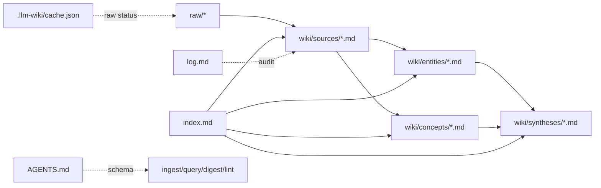

# MDX Karpathy风格LLMWiki改造设计文档

## 一、修订历史

| 版本号 | 修订内容 | 修订时间 | 修订人 |
|---|---|---|---|
| V1.0.0 | 新建初稿 | 2026-06-05 | Codex |

## 二、需求信息

### 2.1 需求背景

- 背景：当前 MDX 已有 LLM Wiki 工作区、raw/wiki/index/log/schema、ingest、query、digest、lint、graph 和 CLI 的基础能力，但 query/digest 的上下文获取仍依赖 `line.contains(query)`，没有体现 Karpathy LLM Wiki 的 index-first wiki navigation。
- 需求目的：把 MDX 的 LLM Wiki 从“关键词检索 + LLM 回答”的 MVP，改造成更贴近 Karpathy 原始设计的本地优先 LLM-maintained wiki。
- 目标用户/使用方：使用 MDX 管理本地知识库的用户、通过 `mdx-cli` 调用本地 wiki 的外部 Agent、MDX 前端 LLM Wiki 面板。
- 需求链接：不涉及外部链接。
- 关联原始材料：
  - `.loopx/intake/clarify-karpathy-llm-wiki-20260605-155637.md`
  - `docs/loopx/design/MDX本地优先LLMWiki工作区需求设计文档.md`
  - `docs/loopx/design/MDX CLI LLM Wiki查询检索能力需求设计文档.md`

### 2.2 需求范围

- 本期范围：
  - 强化 `AGENTS.md` schema。
  - 重做 ingest 的既有 wiki context 读取和多页面维护。
  - 重做 query 的 index-first page selection、wikilink expansion、引用回答。
  - 重做 digest，使其显式沉淀为 `wiki/syntheses/*.md`。
  - 扩展 lint 到机械检查和可选 LLM 语义检查。
  - 扩展 `mdx-cli llm-wiki` 命令。
  - 给长时间 LLM 操作增加阶段状态、合理超时和取消。
- 非目标：
  - 不做 query-time raw document RAG。
  - 第一版不做 hybrid BM25/vector/rerank。
  - Query 默认不自动写回 wiki 页面。
  - Ingest 不做每次人工 diff 审批。
  - 不重写编辑器和普通 workspace 文件系统。
- 决策边界：
  - 用户已确认五块范围：schema、ingest、query、digest、lint。
  - 用户已确认 CLI、阶段状态、超时、取消纳入范围。
  - 用户已确认链接规范使用 ASCII slug path + alias。
- 依赖方：
  - Rust Tauri 后端：LLM Wiki service、LLM provider、文件安全写入、CLI socket server。
  - 前端：LLM Wiki 面板、workspace tab 刷新、状态显示。
  - 本地文件系统：`raw/`、`wiki/`、`index.md`、`log.md`、`AGENTS.md`、`.llm-wiki/cache.json`。
- 约束条件：
  - 不能破坏已有 LLM Wiki workspace 目录结构。
  - 不能读取或写入安全白名单之外的文件。
  - 不能把 raw documents 用作 query-time RAG source。
  - LLM 输出必须经过严格解析和路径校验。

### 2.3 可行性分析

- 业务可行性：符合用户对 Karpathy LLM Wiki 的明确要求，也能修正现有 query/digest 的核心偏差。
- 技术可行性：现有代码已有 raw/wiki/schema/cache/log/path guard/LLM 调用/CLI/socket/front-end panel 基础，主要是重构上下文选择和 workflow。
- 团队接受能力：改造跨模块，需要分阶段实施和回归测试，但不需要替换基础框架。
- 时间成本：中等偏大。建议分 5-7 个实施阶段，而不是一次性大改。
- 资源成本：主要是开发和测试成本；运行时会增加 LLM 调用次数。
- 替代方案：
  - 只优化 keyword search：已拒绝，不符合 Karpathy 设计。
  - 直接引入 vector search：暂缓，中等规模先用 index。
  - query 自动写回 wiki：已拒绝，改用显式 digest。
- 关键风险：
  - LLM 多阶段调用带来延迟和卡住体验。
  - LLM 选择页面 JSON 不稳定。
  - 自动 ingest 更新页面可能覆盖人工内容。
  - 链接规范需要 prompt、lint、graph 和 query 一致执行。

## 三、概要设计

### 3.1 方案总述

- 设计目标：
  - 把 `index.md` 变成 query/digest/ingest 的导航入口。
  - 让 LLM 维护 wiki，而不是每次 query 从 raw 重新检索。
  - 让 wiki page、source provenance、wikilink、index、log 长期一致。
  - 让长时间 LLM 操作有阶段、有超时、有取消。
- 总体思路：
  - 新增共享的 wiki context selection 层。
  - Query/digest/ingest 都通过该层从 `index.md` 和 wiki pages 获取上下文。
  - LLM 只选择候选 wiki pages，后端负责路径校验、读取、wikilink expansion、上下文预算。
  - Lint 分为机械 lint 和可选 LLM lint。
- 核心模块：
  - Schema rules。
  - Wiki context selector。
  - Query service。
  - Digest service。
  - Ingest maintainer service。
  - Lint service。
  - CLI command layer。
  - Frontend operation stage layer。
- 主要难点：
  - 保证 LLM 输出可解析、可验证。
  - 自动合并 wiki 页面时不破坏人工编辑。
  - 在多阶段 LLM 下保持 UI 可理解。
- 技术指标：
  - Query/digest 不再调用整句 `line.contains` 作为主路径。
  - 单次 query 默认读取 index、最多 8 个 selected pages、最多一跳 wikilinks、最终上下文受字节/字符预算限制。
  - LLM request timeout 调整到 60-120 秒区间，具体值计划阶段确定。

### 3.2 整体架构设计

- 业务模式：
  - `raw/` 是 immutable facts source。
  - `wiki/` 是 LLM-maintained knowledge layer。
  - `AGENTS.md` 是 schema/rules。
  - `index.md` 是导航入口。
  - `log.md` 是审计时间线。
- 系统边界：
  - MDX 只读取本地 workspace 内的 raw/wiki/schema 文件。
  - Query 不读取 raw。
  - Ingest 可以读取 raw，并写 wiki。
- 上下游系统：
  - 上游：用户放入 raw files、编辑 wiki/schema/purpose、前端/CLI 发起操作。
  - 下游：wiki pages、index/log/progress/cache、query answer、lint report。
- 应用架构：
  - Tauri command 和 CLI socket server 作为入口。
  - Rust service 执行业务逻辑。
  - Frontend panel 显示状态和结果。
- 技术架构：
  - Rust 后端共享 path guard、LLM provider、file writer、context selector。
  - Frontend 通过 Tauri invoke 调用。
  - CLI 通过 socket 请求当前 MDX app process。
- 数据流转：
  - Ingest：raw source -> analysis -> context selection -> file blocks -> safe writer -> cache/log/progress。
  - Query：question -> index selection -> wiki pages -> wikilink expansion -> answer -> log。
  - Digest：title/prompt -> index selection -> wiki pages -> synthesis -> safe writer -> index/log。
  - Lint：wiki/index/schema -> mechanical report -> optional LLM report -> output/log。

### 3.3 核心流程设计

| 流程 | 触发条件 | 参与系统/模块 | 主流程 | 异常/补偿 | 输出 |
|---|---|---|---|---|---|
| Ingest | 用户或 CLI 指定 raw 文件 | raw reader、context selector、LLM、parser、writer | 读 raw/purpose/AGENTS/index，选相关 wiki pages，LLM 生成 file blocks，安全写入，更新 cache/log/progress | LLM 失败写 log；parse 失败不写文件；写入失败不更新 cache | source/entity/concept/synthesis/index/log/cache |
| Query | 用户或 CLI 提问 | context selector、LLM、log | 读 index，LLM 选页，读页并扩展 wikilinks，LLM 回答，写 log | 无上下文返回 insufficient；LLM 失败返回错误；取消中止操作 | answer、references、log |
| Digest | 用户显式沉淀综合 | context selector、LLM、writer | 读 index 选页，生成 synthesis markdown，写 syntheses，更新 index/log | 无上下文失败；写入失败不更新 log | `wiki/syntheses/*.md` |
| Lint | 用户或 CLI 运行检查 | mechanical lint、optional LLM lint | 扫描 wiki/index/link/source provenance，必要时 LLM 检查语义问题 | 无 LLM 配置只输出机械报告 | lint report、log |
| Stage/Cancel | 长操作启动 | frontend、backend operation registry | 前端显示阶段，用户可取消，后端阶段检查取消标记 | 超时或取消返回明确错误 | 可解释状态 |

### 3.4 功能模块

| 模块 | 职责 | 关键功能 | 依赖 | 备注 |
|---|---|---|---|---|
| Schema Rules | 定义 LLM Wiki maintainer 规则 | 页面类型、链接、引用、workflow、index/log | `AGENTS.md` | 初始化和 legacy upgrade 使用 |
| Wiki Context Selector | 选择和读取 wiki context | 读 index、LLM 选页、路径校验、wikilink expansion、预算控制 | LLM provider、path guard | query/digest/ingest 共用 |
| Query Service | 基于 wiki 回答 | 两阶段 LLM、references、log | Context selector | 不读 raw |
| Digest Service | 显式沉淀综合 | 生成 synthesis、写 index/log | Context selector、writer | 替代 query 自动写回 |
| Ingest Service | LLM 自动维护 wiki | raw analysis、existing context、file blocks、merge/write | Raw reader、selector、parser、writer | 可以改多个页面 |
| Lint Service | 健康检查 | mechanical + optional LLM semantic lint | wiki/index/schema/LLM | 第一版报告，不自动修复 |
| CLI Layer | Agent 可调用入口 | status/ingest/query/digest/lint/search | socket server | 复用后端 |
| Operation Stage Layer | 长任务状态与取消 | stage update、timeout、cancel | frontend/backend | 解决黑箱等待 |

### 3.5 新增/调整功能说明

- 后端：
  - 新增 context selection 数据结构和服务。
  - 修改 `llm_wiki_query_sync`、`llm_wiki_digest_sync`、`llm_wiki_ingest_raw_file_sync`。
  - 扩展 `mechanical_lint_report`，新增 LLM lint 聚合。
  - 调整 LLM timeout 和 streaming fallback 策略。
- CLI：
  - 扩展 `mdx-cli llm-wiki` 子命令。
  - 统一 JSON/text 输出契约。
- 前端：
  - LLM Wiki panel 显示阶段状态、错误、取消。
  - 触发 CLI 文件更新后继续刷新已打开且未修改的 tabs。
- Schema：
  - 更新默认 `AGENTS.md`。
  - 保留用户自定义 `AGENTS.md`，仅升级旧 placeholder。

## 四、详细设计

### 4.1 Schema Rules 详细设计

#### 4.1.1 需求内容

- 入口：初始化 LLM Wiki workspace、rescan 时 legacy placeholder upgrade、ingest/query/digest/lint prompt。
- 操作人/调用方：MDX 后端。
- 前置条件：workspace root 通过安全检查。
- 输出结果：稳定、明确的 `AGENTS.md` 默认规则。

#### 4.1.2 方案设计

- 核心逻辑：
  - 更新 `DEFAULT_AGENTS_MARKDOWN`，明确三层结构：raw sources、wiki、schema。
  - 明确 `raw/` 只读、不由 LLM 修改。
  - 明确 query 不读 raw。
  - 明确路径和 wikilink 规范：
    - 文件路径 ASCII slug。
    - 正文链接使用 `[[entities/foo|Label]]`、`[[concepts/foo|Label]]`、`[[sources/foo|Label]]`、`[[syntheses/foo|Label]]`。
  - 明确页面应包含 source provenance。
  - 明确 `index.md` 是导航入口，`log.md` 是审计记录。
- 状态流转：不涉及复杂状态。
- 数据变更：初始化或旧 placeholder upgrade 写 `AGENTS.md`。
- 计算公式：不涉及。
- 幂等设计：已有自定义 `AGENTS.md` 不覆盖；仅旧 placeholder 升级。
- 权限/越权控制：只允许 workspace root 内 `AGENTS.md`。
- 异常处理：路径冲突报 `path_type_conflict`。
- 补偿/重试：用户可重新初始化或 rescan。
- 日志与审计：初始化结果已有 created/preserved paths。

#### 4.1.3 流程步骤

1. 初始化或 rescan 调用 `ensure_default_agents_rules`。
2. 如果 `AGENTS.md` 是旧 placeholder，写入新默认 schema。
3. 如果用户已有自定义内容，保留。

#### 4.1.4 边界条件

| 场景 | 处理方式 | 用户/调用方感知 | 监控/告警 |
|---|---|---|---|
| 自定义 AGENTS.md | 不覆盖 | 用户规则保留 | 无 |
| 旧 placeholder | 自动升级 | 新规则生效 | 无 |
| AGENTS.md 是目录或 symlink | 报 path conflict | 初始化/scan 失败 | 错误日志 |

### 4.2 Wiki Context Selector 详细设计

#### 4.2.1 需求内容

- 入口：query、digest、ingest、LLM lint。
- 操作人/调用方：后端服务。
- 前置条件：`index.md` 存在且安全可读。
- 输出结果：已校验 wiki page references 和 page contents。

#### 4.2.2 方案设计

- 核心逻辑：
  - 读取 `index.md`。
  - 调用 LLM 选择相关 wiki paths，要求输出严格 JSON。
  - 后端校验 paths：
    - 必须位于 `wiki/sources`、`wiki/entities`、`wiki/concepts`、`wiki/syntheses`。
    - 必须是 `.md` regular file。
    - 不允许 symlink、absolute path、dot segment、hidden segment。
  - 读取 selected pages。
  - 从 selected pages 提取 wikilinks，解析到真实 wiki paths。
  - 扩展一跳，并受最大 page count 和 context budget 限制。
  - 返回 references 和 context markdown。
- 状态流转：
  - `reading_index` -> `selecting_pages` -> `reading_pages` -> `expanding_links` -> `ready`。
- 数据变更：无。
- 计算公式：
  - selected pages 默认最多 8 个。
  - wikilink expansion 默认最多新增 8 个。
  - 总 context budget 由计划阶段确定，建议按字符或 bytes 限制。
- 幂等设计：相同 index/question/model 不保证同一选择，但文件读取无副作用。
- 权限/越权控制：复用 safe read 和 no-follow 打开逻辑。
- 异常处理：
  - index 不存在或不可读：返回 managed file error。
  - LLM JSON parse 失败：返回 `llm_wiki_selection_failed`，附 preview。
  - selected path 不存在：忽略并记录 warning，或返回 structured warning；计划阶段可决定。
- 补偿/重试：用户可重试；query 可降级为 insufficient context。
- 日志与审计：query/digest/ingest 顶层写 log，selector 不直接写 log。

#### 4.2.3 流程步骤

1. 读取 `index.md`。
2. 构造 selection prompt，包含 question/prompt、purpose、AGENTS 摘要、index。
3. LLM 输出 JSON：

```json
{
  "paths": ["wiki/concepts/llm-wiki.md"],
  "reason": "The index links this page to the topic."
}
```

4. 解析并校验 paths。
5. 读取 selected pages。
6. 解析稳定 wikilinks，扩展一跳。
7. 构造 `---PAGE: path---` context。

#### 4.2.4 边界条件

| 场景 | 处理方式 | 用户/调用方感知 | 监控/告警 |
|---|---|---|---|
| Index 为空 | 返回 no context | Query 显示上下文不足 | log |
| LLM 选到不存在 path | 忽略或 warning | references 不含该页 | debug log |
| LLM 输出非 JSON | 返回 selection failed | 明确错误 | error log |
| Wikilink 指向断链 | 不扩展，lint 报告 | Query 可继续 | lint |

### 4.3 Query 详细设计

#### 4.3.1 需求内容

- 入口：前端提问、`mdx-cli llm-wiki query`。
- 操作人/调用方：用户或外部 Agent。
- 前置条件：LLM Wiki workspace ready；query 非空；LLM config 存在。
- 输出结果：中文回答、references、insufficient_context 标记、log。

#### 4.3.2 方案设计

- 核心逻辑：
  - Query 不读取 raw。
  - 调用 context selector 获取 wiki context。
  - 如果 context 为空，返回 insufficient context。
  - 调用 answer LLM，要求只使用 wiki context，必须引用 page path。
  - 写 `log.md`：`query <question>`，可附 selected count。
- 状态流转：
  - `reading_index` -> `selecting_pages` -> `reading_pages` -> `answering` -> `logging` -> `completed`。
- 数据变更：只追加 `log.md`。
- 计算公式：不涉及。
- 幂等设计：query 非严格幂等，因为写 log。
- 权限/越权控制：只读 wiki/index，只写 log。
- 异常处理：
  - 无 LLM config：返回 config error。
  - LLM timeout：返回 timeout error，前端结束 querying。
  - cancel：返回 cancelled。
- 补偿/重试：用户可重试；log 只在进入 query 后追加或在完成时追加由计划阶段决定。
- 日志与审计：`log.md` 记录 query。

#### 4.3.3 流程步骤

1. 校验 question。
2. 启动 operation stage。
3. 通过 selector 读取 context。
4. 无 context 时返回 insufficient。
5. 有 context 时调用 LLM answer。
6. 写 log。
7. 返回 answer/references。

#### 4.3.4 边界条件

| 场景 | 处理方式 | 用户/调用方感知 | 监控/告警 |
|---|---|---|---|
| 空问题 | invalid_question | 表单/CLI 报错 | 无 |
| Index 无相关页 | insufficient_context | 显示上下文不足 | log |
| LLM 超时 | llm_timeout/llm_failed | 查询结束并显示错误 | error log |
| 用户取消 | cancelled | 按钮恢复 | operation log |

### 4.4 Digest 详细设计

#### 4.4.1 需求内容

- 入口：前端综述、`mdx-cli llm-wiki digest`。
- 操作人/调用方：用户或 Agent。
- 前置条件：title slug 合法；prompt 非空；LLM config 存在。
- 输出结果：`wiki/syntheses/<slug>.md`、index/log 更新。

#### 4.4.2 方案设计

- 核心逻辑：
  - Digest 使用与 query 相同的 context selector。
  - LLM 输出完整 Markdown synthesis page。
  - 生成内容必须使用稳定 wikilinks 和 source provenance。
  - `write_digest_page` 继续负责安全写入、index/log 更新，但 index entry 应使用稳定路径 alias。
- 状态流转：
  - `reading_index` -> `selecting_pages` -> `reading_pages` -> `writing_synthesis` -> `updating_index_log` -> `completed`。
- 数据变更：
  - 写 `wiki/syntheses/<slug>.md`。
  - 更新 `index.md`。
  - 更新 `log.md`。
- 幂等设计：
  - 同 title 会覆盖既有 synthesis 页面，计划阶段需决定是否允许覆盖或报 conflict。
- 权限/越权控制：title slug ASCII，路径白名单。
- 异常处理：无 context 报 `insufficient_context`。
- 补偿/重试：写入失败不更新 log/index，或使用事务式临时文件顺序；计划阶段细化。
- 日志与审计：`log.md` 记录 digest。

#### 4.4.3 流程步骤

1. 校验 title/prompt。
2. Selector 获取 context。
3. LLM 生成 synthesis markdown。
4. 校验输出基本格式和链接规范。
5. 写 synthesis。
6. 更新 index/log。

#### 4.4.4 边界条件

| 场景 | 处理方式 | 用户/调用方感知 | 监控/告警 |
|---|---|---|---|
| title 非 ASCII slug | invalid title | 表单/CLI 报错 | 无 |
| 无上下文 | insufficient_context | 综述失败 | log |
| 同名页面存在 | 计划阶段决定覆盖或 conflict | 明确提示 | log |

### 4.5 Ingest 详细设计

#### 4.5.1 需求内容

- 入口：前端 ingest pending raw、`mdx-cli llm-wiki ingest <raw-path>`。
- 操作人/调用方：用户或 Agent。
- 前置条件：raw path 在 `raw/` 下，文件存在且支持。
- 输出结果：source page、entity/concept/synthesis/index/log/cache/progress 更新。

#### 4.5.2 方案设计

- 核心逻辑：
  - 读取 raw source。
  - 读取 `purpose.md`、`AGENTS.md`、`index.md`。
  - 先做 raw analysis，输出 source summary、entities、concepts、potential conflicts、suggested wiki paths。
  - 用 analysis + index 调用 selector 或规则定位相关既有 wiki pages。
  - 读取相关 pages。
  - generation prompt 要求 LLM 输出 file blocks：
    - 至少一个 `wiki/sources/*.md`。
    - 可输出 `wiki/entities/*.md`、`wiki/concepts/*.md`、`wiki/syntheses/*.md`、`index.md`、`log.md`。
    - 必须使用稳定 wikilinks。
    - 必须保留 source provenance。
  - Parser 校验 file blocks。
  - Writer 安全写入。
  - Cache 记录 raw hash、source_page、model、时间。
- 状态流转：
  - `reading_raw` -> `analyzing_raw` -> `selecting_existing_pages` -> `generating_updates` -> `writing_pages` -> `updating_cache_log` -> `completed`。
- 数据变更：wiki pages、index/log/progress/cache。
- 计算公式：pending batch size 继续沿用当前策略，计划阶段可调整。
- 幂等设计：
  - raw size/modified/hash 未变化时不重复 ingest。
  - 同 raw 重新 ingest 可更新对应 source page 和相关 pages。
- 权限/越权控制：raw path 只允许 `raw/` 内 regular file；输出 path 白名单。
- 异常处理：
  - analysis LLM 失败：写 ingest failed log。
  - generation parse 失败：不写文件，写 failed log。
  - unsafe path：不写文件。
- 补偿/重试：用户可重新 ingest；cache 未更新时仍 pending。
- 日志与审计：成功和失败都写 log。

#### 4.5.3 流程步骤

1. 校验 raw path。
2. 更新 progress 为 processing。
3. 读取 raw/purpose/AGENTS/index。
4. Analysis LLM 输出 JSON。
5. 选择相关已有 pages。
6. Generation LLM 输出 file blocks。
7. Parse 和 path validate。
8. Safe writer 写文件。
9. 更新 cache/log/progress。

#### 4.5.4 边界条件

| 场景 | 处理方式 | 用户/调用方感知 | 监控/告警 |
|---|---|---|---|
| raw 在 skip_paths | invalid raw path | ingest 失败 | log |
| LLM 输出 unsafe path | 拒绝写入 | ingest 失败 | error log |
| parse failed | 不写文件 | ingest 失败，可重试 | failed log |
| 用户手改 entity 页面 | LLM 可能覆盖 | 通过 log/lint 审阅 | residual risk |

### 4.6 Lint 详细设计

#### 4.6.1 需求内容

- 入口：前端 lint、`mdx-cli llm-wiki lint`。
- 操作人/调用方：用户或 Agent。
- 前置条件：LLM Wiki workspace ready。
- 输出结果：lint report，log。

#### 4.6.2 方案设计

- 核心逻辑：
  - Mechanical lint：
    - 断链。
    - 孤儿页。
    - index 未收录页面。
    - index 指向不存在页面。
    - 重要 pages 缺 backlink。
    - source page 缺 raw provenance。
    - wikilink 不符合 stable path + alias 规范。
  - LLM lint：
    - 潜在矛盾。
    - 过时陈述。
    - 重复页面。
    - 重要概念缺页面。
    - 需要进一步调查的问题。
  - LLM lint 只报告，不自动修改。
- 状态流转：
  - `mechanical_linting` -> `semantic_linting` -> `logging` -> `completed`。
- 数据变更：只写 log。
- 幂等设计：非严格幂等，因为写 log；报告内容可能随 LLM 变化。
- 权限/越权控制：只读 wiki/index/schema，只写 log。
- 异常处理：无 LLM config 时跳过 semantic lint。
- 补偿/重试：可重复运行。
- 日志与审计：`log.md` 记录 lint。

#### 4.6.3 流程步骤

1. 扫描 wiki pages。
2. 构建 page index 和 link graph。
3. 输出 mechanical report。
4. 如有 LLM config，读取 index 和有限 pages summary，运行 semantic lint。
5. 合并报告。
6. 写 log。

#### 4.6.4 边界条件

| 场景 | 处理方式 | 用户/调用方感知 | 监控/告警 |
|---|---|---|---|
| 无 LLM config | 跳过语义 lint | 报告说明未运行 | 无 |
| 大量页面 | 预算截断 | 报告说明抽样/截断 | debug |
| LLM 误报 | 只报告不修改 | 用户判断 | 无 |

### 4.7 CLI 详细设计

#### 4.7.1 需求内容

- 入口：`mdx-cli llm-wiki ...`。
- 操作人/调用方：用户、外部 Agent。
- 前置条件：MDX app process 可用并有 current workspace。
- 输出结果：文本或 JSON。

#### 4.7.2 方案设计

- 核心逻辑：
  - 扩展 CLI enum 和 socket protocol。
  - Server handler 定位 current root，校验 LLM Wiki ready。
  - 调用同一后端 service。
  - `--json` 输出结构化响应，默认输出适合终端阅读的文本。
- 状态流转：CLI 本身不保存复杂状态。
- 数据变更：取决于调用命令。
- 幂等设计：
  - status/search 幂等。
  - query/digest/ingest/lint 非严格幂等，因为写 log 或 wiki。
- 权限/越权控制：CLI 不直接读写用户路径，由 app server 执行。
- 异常处理：server 错误映射到 JSON stderr 和 non-zero exit。
- 补偿/重试：用户重新执行。
- 日志与审计：复用后端 log。

#### 4.7.3 流程步骤

1. CLI 解析命令。
2. 发送 socket request。
3. Server 获取 current workspace。
4. 调用后端。
5. 返回响应。
6. CLI 格式化输出。

#### 4.7.4 边界条件

| 场景 | 处理方式 | 用户/调用方感知 | 监控/告警 |
|---|---|---|---|
| 无 app process | socket error | CLI exit 1 | 无 |
| 无 workspace | no_workspace | CLI stderr | 无 |
| 非 LLM Wiki workspace | llm_wiki_not_ready | CLI stderr | 无 |

### 4.8 Operation Stage/Cancel 详细设计

#### 4.8.1 需求内容

- 入口：前端触发 query/digest/ingest/lint。
- 操作人/调用方：用户。
- 前置条件：后端支持 operation id 或等价取消机制。
- 输出结果：阶段状态、可取消操作、合理 timeout。

#### 4.8.2 方案设计

- 核心逻辑：
  - 长操作创建 operation id。
  - 后端在关键阶段更新 stage。
  - 前端订阅或轮询 stage。
  - 用户点击取消后，后端标记 cancellation。
  - 后端在 LLM 调用前后和文件写入前检查 cancellation。
  - LLM HTTP timeout 降到 60-120 秒。
- 状态流转：
  - `idle` -> `running(stage)` -> `completed|failed|cancelled|timed_out`。
- 数据变更：取消前已完成的安全写入是否回滚由命令决定；query 无需回滚，ingest 写入前检查取消。
- 幂等设计：取消请求幂等。
- 权限/越权控制：operation id 仅当前 app process 内有效。
- 异常处理：operation missing 返回 not_found 或 no-op。
- 补偿/重试：用户可重新发起。
- 日志与审计：失败、取消、超时可写 log，计划阶段决定哪些命令写。

#### 4.8.3 流程步骤

1. 前端发起长操作。
2. 后端创建 operation id。
3. 后端执行阶段并更新 stage。
4. 前端显示 stage。
5. 用户可取消。
6. 后端返回最终状态。

#### 4.8.4 边界条件

| 场景 | 处理方式 | 用户/调用方感知 | 监控/告警 |
|---|---|---|---|
| LLM request 已发出 | 依赖 HTTP timeout 或 client cancel 能力 | 显示 cancelling/timeout | error log |
| 取消发生在写文件前 | 不写文件 | cancelled | log |
| 取消发生在写文件后 | 保留已写结果并记录 | completed/cancelled with note | log |

## 五、存储类设计

### 5.1 库表设计

#### 5.1.1 数据库模型图

不涉及数据库。使用本地 Markdown 文件和 JSON cache。



#### 5.1.2 表结构

| 表名 | 用途 | 主键 | 关键索引 | 数据量预估 | 备注 |
|---|---|---|---|---|---|
| 不涉及 | 本项目不用数据库 | 不涉及 | 不涉及 | 不涉及 | 本地文件系统 |

字段明细：

| 字段 | 类型 | 是否必填 | 默认值 | 含义 | 来源/取值逻辑 | 备注 |
|---|---|---|---|---|---|---|
| 不涉及 | 不涉及 | 不涉及 | 不涉及 | 不涉及 | 不涉及 | 不涉及 |

### 5.2 数据迁移/初始化

- DDL：不涉及。
- DML：不涉及。
- 数据回填：
  - 既有 workspace 不强制迁移。
  - `AGENTS.md` 仅在旧 placeholder 时自动升级。
  - 既有 wiki pages 不批量改写链接；lint 报告链接不符合规范的页面。
- 老数据兼容：
  - 继续接受旧 wiki pages。
  - Graph/lint 继续兼容 `[[Name]]`，但 lint 会提示新规范。
  - Query selector 可读取旧 index。
- 新老系统读写关系：
  - 新 query/digest/ingest 写出的新页面应遵循稳定路径链接规范。
  - 旧页面逐步由 ingest/digest/lint 发现并修正。

### 5.3 缓存设计

| 场景 | Key | Value | 数据结构 | 过期时长 | 容量预估 | 失效/刷新策略 |
|---|---|---|---|---|---|---|
| Raw ingest cache | raw relative path | hash/source_page/ingested_at/model/raw_size/raw_modified_ms | JSON object | 不过期 | raw 文件数同级 | raw size/modified/hash 变化或 source page 缺失 |
| Operation stage | operation id | stage/status/cancel flag | process memory | 进程生命周期 | 当前长操作数 | completed 后清理 |

## 六、其他组件设计

### 6.1 消息设计

| 场景 | Group | Topic | 生产者 | 消费者 | 幂等键 | 失败补偿 |
|---|---|---|---|---|---|---|
| 前端操作阶段事件 | 不涉及 | Tauri event 或轮询接口 | 后端 operation registry | 前端 LLM Wiki panel | operation id | 前端可重新查询状态 |
| CLI 文件更新通知 | 不涉及 | 既有 app event | CLI server handler | workspace shell | path | 已打开未修改 tab 刷新 |

### 6.2 配置设计

| 配置项 | 环境 | 默认值 | 是否动态生效 | 说明 | 风险 |
|---|---|---|---|---|---|
| LLM request timeout | 本地 app | 60-120 秒，计划阶段定值 | 重启或重新创建 client 生效 | 降低黑箱等待 | 太短会中断慢模型 |
| LLM api mode | 本地 app | chat | 是 | 继续支持 chat/responses | chat streaming 兼容性问题 |
| LLM Wiki paused | workspace | false | 是 | 控制 ingest/rescan | paused 不阻止 query/lint |
| skip_paths | workspace | [] | 是 | raw 扫描跳过路径 | 配置错误导致 raw 不 ingest |

### 6.3 定时任务/批处理

| 任务 | 触发时间 | 处理范围 | 幂等 | 失败重试 | 影响评估 |
|---|---|---|---|---|---|
| Raw rescan | 用户打开面板或手动触发 | `raw/` | 根据 cache 判定 | 用户重试 | 更新 progress |
| Ingest pending batch | 用户触发或现有流程触发 | pending raw files | cache 控制 | 用户重试 | 写 wiki |
| Lint | 用户手动或 CLI | wiki/index/schema | 非严格幂等 | 用户重试 | 写 log |

### 6.4 技术组件

- 分布式锁：不涉及，本地单 app process。
- 唯一 ID：operation id 可用 monotonic counter 或 UUID。
- 加解密/验签：LLM API key 继续使用当前 secret config 保存策略。
- 字典转换：LLM selection JSON 和 lint JSON 需要 serde model。
- Excel/文件处理：不涉及。
- 用户信息透传：不涉及。
- 限流/熔断：通过 timeout、取消、串行 ingest 降低风险。

## 七、接口设计

### 7.1 接口设计原则

- 接口和字段注释必须完整，明确必填、非必填、默认值和枚举。
- 非纯查询接口必须说明幂等策略。
- 异常码、异常文案和抛出条件必须明确。
- 重要接口必须说明日志、链路字段、性能、限流、熔断和数据流水。
- 本项目接口为 Tauri command 和本地 CLI socket protocol，不维护外部 OpenAPI。

### 7.2 接口清单

| 接口 | 调用方 | 服务方 | 权限/认证 | 幂等 | 文档地址 | 备注 |
|---|---|---|---|---|---|---|
| `llm_wiki_query` | 前端 | Tauri backend | workspace path guard | 否 | 本文 | 写 log |
| `llm_wiki_digest` | 前端 | Tauri backend | workspace path guard | 否 | 本文 | 写 synthesis/index/log |
| `llm_wiki_ingest_raw_file` | 前端 | Tauri backend | workspace path guard | 否 | 本文 | 写 wiki/cache/log |
| `llm_wiki_lint` | 前端/CLI | Tauri backend | workspace path guard | 否 | 本文 | 写 log |
| `llm_wiki_operation_cancel` | 前端 | Tauri backend | operation id | 是 | 本文 | 取消长任务 |
| `mdx-cli llm-wiki status` | CLI | App socket server | current workspace | 是 | 本文 | 新增 |
| `mdx-cli llm-wiki ingest` | CLI | App socket server | current workspace | 否 | 本文 | 新增 |
| `mdx-cli llm-wiki query` | CLI | App socket server | current workspace | 否 | 本文 | 调整 |
| `mdx-cli llm-wiki digest` | CLI | App socket server | current workspace | 否 | 本文 | 新增 |
| `mdx-cli llm-wiki lint` | CLI | App socket server | current workspace | 否 | 本文 | 新增 |
| `mdx-cli llm-wiki search` | CLI | App socket server | current workspace | 是 | 本文 | 调整为 wiki-aware search |

### 7.3 接口明细

#### 7.3.1 `llm_wiki_query`

- 路径/方法：Tauri command。
- 请求头：不涉及。
- 请求参数：
  - `root_path: String`，必填。
  - `question: String`，必填。
  - 可选 `operation_id` 由计划阶段决定。
- 响应参数：
  - `answer: String`。
  - `references: WikiSearchResult[]`。
  - `insufficient_context: bool`。
  - 可选 `selection_reason`、`warnings` 由计划阶段决定。
- 错误码：
  - `invalid_question`。
  - `llm_wiki_selection_failed`。
  - `llm_failed`。
  - `cancelled`。
  - `path_type_conflict`。
- 业务校验：query 不读 raw。
- 数据变更：追加 `log.md`。
- 日志字段：question、selected page count、error。

#### 7.3.2 `llm_wiki_digest`

- 路径/方法：Tauri command。
- 请求头：不涉及。
- 请求参数：
  - `root_path: String`。
  - `title: String`，ASCII slug。
  - `prompt: String`。
- 响应参数：
  - `path: String`。
- 错误码：
  - `invalid_llm_wiki_digest_title`。
  - `insufficient_context`。
  - `llm_failed`。
  - `cancelled`。
- 业务校验：title 只能 ASCII slug。
- 数据变更：写 synthesis/index/log。
- 日志字段：title、selected page count、error。

#### 7.3.3 `llm_wiki_ingest_raw_file`

- 路径/方法：Tauri command。
- 请求头：不涉及。
- 请求参数：
  - `root_path: String`。
  - `raw_relative_path: String`。
- 响应参数：当前保持 `Result<(), WorkspaceError>`，计划阶段可扩展为包含 written paths。
- 错误码：
  - `invalid_llm_wiki_raw_path`。
  - `llm_failed`。
  - `llm_wiki_parse_failed`。
  - `invalid_llm_wiki_output_path`。
  - `cancelled`。
- 业务校验：raw path 必须在 `raw/` 内。
- 数据变更：写 wiki/index/log/cache/progress。
- 日志字段：raw path、source page、model、failed reason。

#### 7.3.4 `llm_wiki_lint`

- 路径/方法：Tauri command。
- 请求头：不涉及。
- 请求参数：
  - `root_path: String`。
  - 可选 `include_semantic: bool` 由计划阶段决定。
- 响应参数：
  - Markdown report，或 JSON report 由 CLI `--json` 输出。
- 错误码：
  - `path_type_conflict`。
  - `llm_failed`，仅 semantic lint 失败且计划阶段决定不降级时使用。
- 业务校验：无 LLM config 时 mechanical-only 不失败。
- 数据变更：写 log。
- 日志字段：issue counts、semantic lint skipped/running。

#### 7.3.5 `llm_wiki_operation_cancel`

- 路径/方法：Tauri command。
- 请求头：不涉及。
- 请求参数：
  - `operation_id: String`。
- 响应参数：
  - `cancelled: bool`。
- 错误码：
  - `operation_not_found`，或 no-op，计划阶段决定。
- 业务校验：只能取消当前 process 内 operation。
- 数据变更：内存 cancel flag。
- 日志字段：operation id、stage。

## 八、系统发布

### 8.1 灰度方案

- 灰度范围：本地桌面应用，不做服务端灰度。
- 灰度开关：
  - 可通过保留旧 `search` 命令行为的兼容测试降低风险。
  - 不建议新增用户可见 feature flag，除非实施阶段发现兼容性风险过高。
- 验证指标：
  - 单元测试和集成测试通过。
  - Query 自然语言问题能通过 index 找到页面。
  - LLM timeout 后前端不会持续显示正在查询。
- 放量节奏：打包前本地完整验证，随 app build 发布。

### 8.2 降级方案

- 降级触发条件：
  - LLM selection 连续失败。
  - LLM provider 不支持 streaming 或长时间挂起。
  - Lint semantic LLM 失败。
- 降级行为：
  - Query/digest selection 失败时返回明确错误或 insufficient，不读 raw。
  - Semantic lint 失败时保留 mechanical report。
  - Chat streaming 失败可使用 non-stream fallback。
- 用户影响：
  - 回答或综述无法生成，但不会错误读取 raw 或越权写文件。
- 恢复方式：
  - 调整 LLM config、重试、改用 responses mode、或等待 provider 恢复。

### 8.3 关联系统/功能影响

| 系统/功能 | 影响 | 依赖动作 | 负责人 | 验证方式 |
|---|---|---|---|---|
| LLM Wiki 面板 | 增加阶段/取消/错误状态 | 前端状态扩展 | 开发者 | 前端测试、手动 smoke |
| CLI | 新增多个命令和响应字段 | protocol/server/client 同步 | 开发者 | Rust CLI tests |
| Query/digest | 语义改变 | 后端 selector | 开发者 | Rust tests |
| Ingest | 上下文和 prompt 改变 | prompt/parser/writer tests | 开发者 | Rust tests |
| Lint | 报告范围扩大 | mechanical/LLM lint tests | 开发者 | Rust tests |
| Graph | 链接规范更严格 | link resolver 兼容 | 开发者 | graph tests |

### 8.4 回滚方案

- 回滚条件：
  - 新 query/digest 无法稳定返回。
  - Ingest 自动写入造成明显数据破坏。
  - CLI protocol 破坏现有自动化。
- 回滚步骤：
  - 代码层回退相关改动。
  - 保留用户已经生成的 wiki 文件，不自动删除。
- 数据回滚：
  - 本地 wiki 用户数据不自动回滚。
  - 用户可通过版本控制或手动编辑恢复。
- 配置回滚：
  - 恢复 LLM timeout 或 api mode 配置。
- 风险：
  - 已写入的 wiki 页面和 log 不应由 app 自动撤销。

## 九、系统监控与维护

### 9.1 监控与告警

- 系统异常：
  - path guard error。
  - LLM config parse/load error。
  - parser error。
- 业务异常：
  - insufficient context。
  - unsafe LLM output path。
  - broken wikilink。
- 重试异常：
  - 同 raw 文件反复 ingest failed。
  - LLM selection JSON 反复 parse failed。
- 超时：
  - LLM request timeout。
  - operation cancelled。
- 关键接口指标：
  - 本地 app 不上报远程指标；通过 log、前端错误、测试覆盖维护。
- 告警渠道：
  - 不涉及服务端告警。

### 9.2 性能与容量

- TPS/吞吐：本地个人使用，低并发。
- CPU/内存/磁盘 IO/网络 IO：
  - 多阶段 LLM 增加网络等待。
  - Wiki scan 和 link graph 受页面数影响。
- 数据容量：
  - 中等规模 wiki 以 index navigation 为主。
  - 大规模后再考虑 BM25/vector/rerank。
- 缓存容量：
  - `.llm-wiki/cache.json` 与 raw 文件数量同级。
  - operation state 仅进程内临时数据。
- 跑批耗时：
  - Ingest pending batch 受 LLM latency 影响。
- 是否压测：
  - 不做传统压测；需要 fixture 覆盖 100-500 pages 的 selector/lint 性能边界。

### 9.3 可靠性与兜底

- 幂等击穿：
  - query/lint 写 log，非严格幂等。
  - ingest 由 raw cache 降低重复处理。
- 并发失效：
  - 多个 ingest/digest 同时写 index/log 有冲突风险。
  - 建议计划阶段设计同 workspace 串行化写操作。
- 冷热备：不涉及。
- 关键任务独立性：
  - mechanical lint 不依赖 LLM。
  - graph 不依赖 LLM。
- 字段兜底：
  - LLM selection warnings 可选。
  - 缺 LLM config 时 query/digest/ingest 失败，lint 降级。
- 老新数据兼容：
  - 旧 wikilink 可解析，但 lint 提示规范问题。
  - 旧 index 可被 selector 使用。

## 十、排期与规划

### 10.1 任务拆分与工作量评估

| 任务 | 范围 | 负责人 | 工作量 | 依赖 | 备注 |
|---|---|---|---|---|---|
| Schema/link contract | AGENTS、link parser/lint contract | 开发者 | 中 | 无 | 先做 |
| Context selector | index selection、path validation、wikilink expansion | 开发者 | 大 | Schema | query/digest/ingest 共用 |
| Query/digest 改造 | 两阶段 LLM、references、log、synthesis | 开发者 | 中 | Selector | 优先修用户痛点 |
| Ingest maintainer 改造 | related pages、prompt、file blocks、cache/log | 开发者 | 大 | Selector/schema | 风险最高 |
| Lint 扩展 | mechanical + semantic report | 开发者 | 中 | link contract | 可分步 |
| CLI 扩展 | commands/protocol/server/client/tests | 开发者 | 中 | services | Agent 可用 |
| Stage/cancel/timeout | operation registry、frontend state、LLM timeout | 开发者 | 大 | service stages | 解决卡住 |
| 验证和打包 | lint/test/build/tauri build | 开发者 | 中 | 全部 | 发布前 |

### 10.2 计划时间

- 数据方案评审：本地文件设计，无数据库评审。
- 开发开始/结束：待 `$plan` 拆分。
- CR：实现后进行代码审查。
- 联调完成/提测：本地测试和桌面 smoke。
- 测试用例评审：计划阶段列出。
- 测试开始/结束：每阶段 TDD 验证。
- 预发布：不涉及传统预发布。
- 上线：本地打包发布。
- 线上验证：打开 app 和 CLI smoke。

### 10.3 发布计划

1. 完成设计评审。
2. 编写实施计划。
3. 分阶段 TDD 实现。
4. 运行 Rust、前端、构建验证。
5. 运行桌面 smoke 和 CLI smoke。
6. 重新打包 Tauri app。

### 10.4 遗留问题与后续规划

| 问题 | 影响 | 处理计划 | 负责人 | 截止时间 |
|---|---|---|---|---|
| hybrid BM25/vector/rerank | 大规模 wiki 的召回 | 本期不做，等 index 不够时再设计 | 待定 | 后续 |
| 自动修复 lint 问题 | 可提升维护效率但风险高 | 本期只报告，不自动修 | 待定 | 后续 |
| Wiki 页面 merge 策略 | 影响人工编辑保护 | 计划阶段细化最小安全策略 | 开发者 | plan 前 |

### 10.5 Planning Handoff

- `plan` 可以决定：
  - 具体 Rust struct、函数名和文件拆分。
  - LLM timeout 在 60-120 秒内的具体值。
  - selected pages/context budget 的具体默认值。
  - CLI JSON 字段细节。
  - 同名 digest 是覆盖还是 conflict，但需要在计划中显式测试。
  - operation stage 是 Tauri event 还是 polling。
- 必须返回 `spec` 的事项：
  - 要引入 vector/BM25/rerank。
  - 要让 query 默认自动写回 wiki。
  - 要让 LLM lint 自动修改页面。
  - 要改变 raw/query 边界，让 query 读取 raw。
- 必须返回 `clarify` 的事项：
  - 用户改变自动 ingest 写入策略。
  - 用户不再接受 ASCII slug + alias link contract。
  - 用户要求人工审批每次写入。
- 推荐下一步：

```text
$plan docs/loopx/design/MDX Karpathy风格LLMWiki改造需求设计文档.md
```

## 十一、QA

### 11.1 评审记录

| 评审时间 | 评审人 | 评审问题 | 处理进展 | 结论 |
|---|---|---|---|---|
| 2026-06-05 | 用户 | 当前实现不贴近 Karpathy LLM Wiki | 已扩大范围并形成设计 | 待用户确认 |

### 11.2 待确认问题

| 问题 | 需要谁确认 | 阻塞阶段 | 推荐答案 | 状态 |
|---|---|---|---|---|
| 是否包含 schema/ingest/query/digest/lint | 用户 | clarify | 包含 | closed |
| Ingest 是否自动写入 wiki | 用户 | clarify | 自动写入 | closed |
| Query 是否默认自动写回 wiki | 用户 | clarify | 不默认写回，显式 digest | closed |
| Query/digest 是否允许两阶段 LLM | 用户 | clarify | 允许 | closed |
| 链接规范是否使用 ASCII slug + alias | 用户 | clarify | 使用 | closed |
| Lint 是否包含 LLM 语义检查 | 用户 | clarify | 分层包含 | closed |
| CLI 是否纳入范围 | 用户 | clarify | 纳入 | closed |
| 阶段状态、timeout、取消是否纳入范围 | 用户 | clarify | 纳入 | closed |
