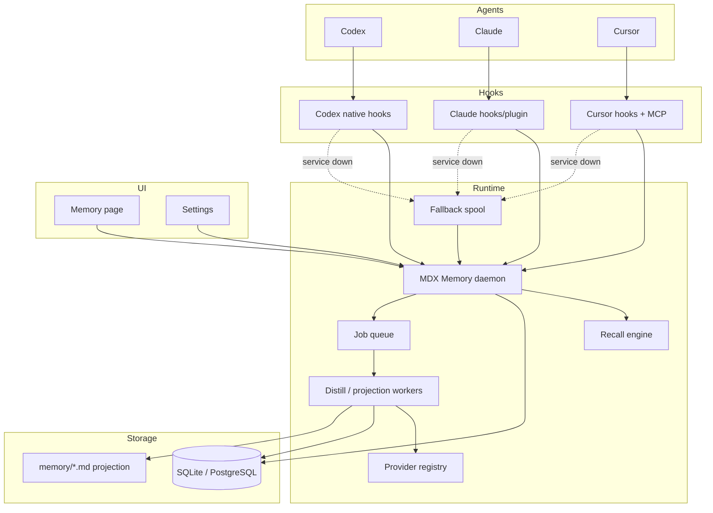
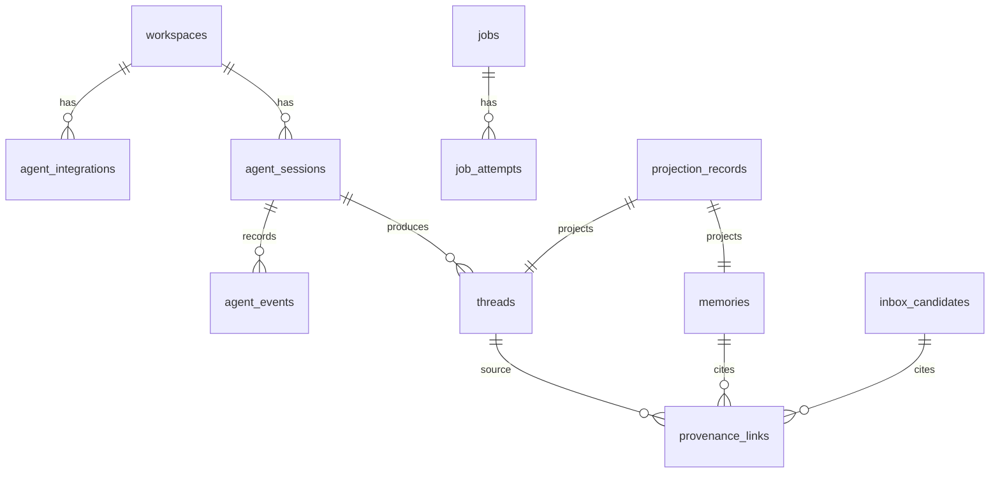

# MDX Memory Agent Backend 自动化记忆系统设计文档

## 一、修订历史

| 版本号 | 修订内容 | 修订时间 | 修订人 |
|---|---|---|---|
| V1.0.0 | 新建设计：固定 MDX Memory 作为 Codex/Claude/Cursor 外挂 agent memory backend 的产品定位，覆盖 hooks、后台服务、SQLite/PostgreSQL、迁移、自动 capture/recall/distill、UI 诊断和功能开关 | 2026-06-14 | Codex |

## 二、需求信息

### 2.1 需求背景

- 背景：MDX 当前已有本地优先 Markdown Workspace、LLM Wiki、Memory 基础文件层、CLI/MCP/daemon 雏形和 Memory UI。前一版 Memory 更偏 Markdown 文件和手工操作，用户明确要求 Memory 的主定位不是笔记面板，而是外挂给 Codex、Claude、Cursor 等 agent 的本地优先自动化记忆系统。
- 需求目的：把 MDX Memory 设计为 agent-first backend。Codex、Claude、Cursor 通过 native hooks、CLI、MCP、本地协议自动写入原始对话事件、自动 recall 相关记忆、自动触发 distill；用户通过 UI 审核、诊断、配置和校正。
- 目标用户/使用方：
  - 同时使用 Codex、Claude、Cursor 的开发者。
  - 需要跨 agent 保存原始对话、项目决策、偏好、约定和可追溯长期记忆的用户。
  - 需要 SQLite 本机模式，也可能在 NAS/服务化/多端场景使用 PostgreSQL 的用户。
- 需求链接：本轮 `$clarify` 对话，澄清包见 `.loopx/intake/clarify-mdx-memory-agent-backend-20260614-184656.md`。
- 关联原始材料：
  - `AGENT.md`
  - `docs/loopx/specs/memory.md`
  - `docs/loopx/specs/llm-wiki.md`
  - `docs/loopx/design/MDX Memory完整能力设计文档.md`
  - `docs/loopx/design/MDX Memory层与LLM Wiki并列架构需求设计文档.md`
  - Codex 源码 hook schema 和 runtime 研究：`/tmp/mdx-memory-research/codex`
  - claude-mem 源码研究：`/tmp/mdx-memory-research/claude-mem`

### 2.2 需求范围

- 本期范围：
  - 本地 Memory daemon、后台队列、fallback spool。
  - Codex、Claude、Cursor 三个一等 agent 集成，参考 claude-mem 完成度。
  - Agent lifecycle hooks 自动 capture、recall injection、distill enqueue。
  - Event log、thread 快照、long-term memory、inbox candidate、provenance。
  - SQLite 和 PostgreSQL runtime DB 后端。
  - SQLite -> PostgreSQL 完整迁移，PostgreSQL -> SQLite 快照导出/回退。
  - Markdown 投影异步生成和 repair/rebuild/export。
  - 独立 Memory 页面：概览、Agent 集成、会话、长期记忆、待确认、工作上下文、诊断。
  - 安装/修复向导和 CLI：`install/status/doctor/repair/uninstall`。
  - 全局、workspace、agent 三级开关，支持硬关闭某个能力。
  - 独立 Memory provider 配置，支持 OpenAI-compatible、Anthropic、Gemini、OpenRouter。
- 非目标：
  - 不把 Memory 做成手工笔记系统。
  - 不要求用户手动提示 agent 写入记忆作为主路径。
  - 不默认把 Memory 自动写入 `wiki/`。
  - 不做 SQLite/PostgreSQL 实时双向同步、双写复制或冲突合并。
  - 不把 Claude Code 或外部 agent 作为默认 distill 依赖。
  - 不让原始 thread 默认注入 agent 上下文。
  - Gemini/OpenCode/Windsurf 等不进入 V1 最高完成度目标。
- 决策边界：
  - DB 是 runtime 事实来源；Markdown 是异步可读投影。
  - Memory 与 LLM Wiki 继续并列；Promote to Wiki 必须显式触发。
  - Hook 必须轻量，不能直接跑大模型长任务。
  - Codex、Claude、Cursor 都是 V1 一等集成，不分主次。
  - 自动捕获必须显式按 `workspace + agent_source` 授权。
  - 关闭功能不删除历史数据，删除必须走单独清理入口。
- 依赖方：
  - Rust/Tauri 后端、`mdx-cli`、`mdx-mcp`、Workspace Mode 前端、现有 Memory 文件层、现有 LLM provider 配置、路径安全模块、agent 本地配置文件。
- 约束条件：
  - 当前主目标仍是 macOS，但 CLI/daemon/DB/adapter 设计应尽量跨平台。
  - 所有 workspace 路径写入必须经过 path guard 和 symlink guard。
  - API key 不写入 workspace Markdown。
  - Hook 超时必须返回空 context 或降级结果，不能拖死 agent。
  - 现有 Memory Markdown 数据必须可迁移或重建投影。

### 2.3 可行性分析

- 业务可行性：用户已经明确 Memory 是 agent backend，且当前 Codex/Claude/Cursor 都具备 hook/MCP/CLI 接入空间。产品定位和 MDX 本地优先、可审计方向一致。
- 技术可行性：
  - 现有 `src-tauri/src/memory_*` 已有 thread、memory、inbox、working、capture、distill、promote、daemon dispatch 基础。
  - Codex 源码已确认 native hooks 和 `additional_context` 输出，可支持自动 recall 注入。
  - claude-mem 已验证 Codex native hooks、Claude plugin hooks、Cursor hooks + MCP 的集成思路。
  - SQLite 默认模式和 PostgreSQL 高级模式可通过同一 repository/DAO 抽象实现。
- 团队接受能力：功能跨度大，必须拆成多个实现计划，但设计上作为 V1 agent backend 一次性目标。
- 时间成本：明显高于现有 Memory UI/CLI 小改，需要分层实施：DB/daemon、hook adapter、installer、worker、UI、migration、verification。
- 资源成本：本地 daemon、SQLite/PostgreSQL、队列和 Markdown 投影会增加磁盘、CPU 和 provider 调用成本；通过开关、预算、异步 worker 控制。
- 替代方案：
  - 只做文件扫描 capture：实现简单，但错过 Codex/Claude/Cursor lifecycle，体验不自动。
  - 只做 MCP/CLI 主动写入：仍要求 agent 或用户记得调用，不符合定位。
  - 只支持 SQLite：简单，但不能覆盖用户 PostgreSQL 场景。
  - 让 LLM Wiki 承载 Memory：会污染长期知识层，已拒绝。
- 关键风险：
  - 上游 agent hook schema 变化。
  - 自动接受记忆误存敏感内容。
  - PostgreSQL 模式的凭证、连接和迁移复杂度。
  - Hook 慢或失败影响 agent 体验。
  - DB 与 Markdown 投影不一致导致用户困惑。

## 三、概要设计

### 3.1 方案总述

- 设计目标：让 MDX Memory 成为 Codex、Claude、Cursor 的本地优先外挂机器记忆后端，提供自动 recall、自动 capture、自动 distill、可审计 provenance 和可诊断运行状态。
- 总体思路：
  - Hook 负责轻量事件采集和低延迟 recall 注入。
  - 本地 daemon 负责授权、写 DB、spool 导入、queue、worker、diagnostics。
  - Worker 异步 distill，把高置信低风险信息写入长期记忆，把敏感/低置信信息写入待确认。
  - DB 是运行时事实来源；Markdown 投影异步生成，保留本地可读和 LLM Wiki/Obsidian 兼容。
  - UI 从“手工编辑 memory”转为“agent backend 控制台”。
- 核心模块：
  - Agent Hook Adapter：Codex、Claude、Cursor。
  - Install/Repair Manager：安装、状态、诊断、卸载。
  - Memory Daemon：local API、auth、spool、queue。
  - Storage Repository：SQLite/PostgreSQL 双后端。
  - Event/Thread/Memory/Inbox Stores。
  - Recall Engine、Distill Worker、Provider Registry。
  - Markdown Projection Worker。
  - Memory UI Console。
- 主要难点：
  - 三个 agent 生命周期差异。
  - Hook 超时和服务不可用降级。
  - 自动接受和隐私安全边界。
  - SQLite/PostgreSQL 迁移和 schema 兼容。
  - DB 与 Markdown 投影一致性和 repair。
- 技术指标：
  - Hook capture P95 < 100ms，不含服务启动。
  - Hook recall P95 < 500ms；超时返回空 context。
  - SessionStart/UserPromptSubmit 注入默认 2-4KB，可配置。
  - Worker job 至少一次执行，基于幂等键避免重复记忆。
  - SQLite -> PostgreSQL dry-run 能报告记录数、冲突和不可迁移项。

### 3.2 整体架构设计

- 业务模式：用户在设置或 Memory 页面启用某 workspace 的 Codex/Claude/Cursor 集成。Agent 启动或提交 prompt 时触发 hook，MDX 自动 recall 并注入 context；agent 工作过程事件进入 DB；回合结束或 compact 前后台生成 thread 和候选记忆；用户在 UI 审核和诊断。
- 系统边界：
  - Memory 管理 DB、`memory/**` 投影、`.mdx/memory-*` 状态、hook 安装和本地 daemon。
  - LLM Wiki 管理 `raw/**`、`wiki/**`、`index.md`，不默认读取 Memory。
  - Promote to Wiki 是唯一跨层写入路径。
- 上下游系统：
  - 上游：Codex hooks、Claude hooks/plugin、Cursor hooks、Cursor MCP、手动 CLI/MCP。
  - 下游：SQLite/PostgreSQL、Markdown projection、LLM provider、UI diagnostics。
- 应用架构：



- 技术架构：
  - Rust/Tauri 后端增加 storage trait 和 SQLite/PostgreSQL 实现。
  - Daemon 提供 loopback HTTP 或 Unix socket，本机鉴权。
  - Hook adapter 是轻量 CLI 子命令或脚本 wrapper，统一调用 daemon。
  - Worker 与 queue 可先内置进 daemon 进程，后续可拆进独立进程。
  - Provider registry 复用现有 LLM config 结构但允许 Memory 覆盖。
- 数据流转：
  - Hook event -> auth check -> DB event log -> optional recall -> queue -> worker -> candidates/memories -> Markdown projection -> UI diagnostics。

### 3.3 核心流程设计

| 流程 | 触发条件 | 参与系统/模块 | 主流程 | 异常/补偿 | 输出 |
|---|---|---|---|---|---|
| Agent 安装 | 用户点击连接 Agent 或 CLI install | Install Manager, agent config | 检测 agent -> 写 hook/MCP/rules -> 启动 daemon -> 发送测试事件 | 保留用户配置；失败写 doctor report | 安装状态 |
| SessionStart recall | agent 启动/恢复 session | Hook, daemon, recall | 校验授权 -> 创建 session -> 查询项目 memory -> 返回 additional_context | daemon 不可用返回空；事件写 spool | 简短项目上下文 |
| UserPromptSubmit recall/capture | 用户提交 prompt | Hook, event store, recall | 写 user event -> prompt-specific recall -> 返回 context | 超时返回空；capture 可后补 | 本轮相关记忆 |
| Tool/文件事件捕获 | 工具、shell、文件编辑后 | Hook, event store | 写 event metadata 和截断摘要 | 大输出写引用；未授权跳过 | event log |
| Stop/PreCompact distill | 回合结束或 compact 前 | Hook, queue, worker | flush session -> enqueue distill job -> worker 提取候选 | 无 Stop 时定时补偿；provider 不可用标记 waiting | memory/inbox |
| Markdown 投影 | DB 记录变化或 repair | Projection Worker | 根据 DB 生成 `memory/threads`、`memory/memories`、`memory/inbox` | iCloud/文件慢时异步重试 | 可读 Markdown |
| DB 迁移 | 用户切换后端 | Migration Manager | dry-run -> backup -> copy rows -> validate -> switch config | 失败保持旧 DB；可 resume | 新后端 |
| 功能硬关闭 | 设置关闭 feature | Config, hooks, daemon | 写配置 -> hook 读取关闭状态 -> 停止对应行为 | UI 诊断显示 disabled | 不再产生新数据 |

### 3.4 功能模块

| 模块 | 职责 | 关键功能 | 依赖 | 备注 |
|---|---|---|---|---|
| `memory_config` | 配置与 feature flags | 全局/workspace/agent 开关、provider、storage、retention | fs/keychain/db | 新增或扩展现有 config |
| `memory_storage` | DB 抽象 | SQLite/PostgreSQL repository、transaction、migration | sqlx/rusqlite 待计划决定 | 计划阶段可定具体 crate |
| `memory_event_log` | 原始事件 | session、turn、tool、assistant、compact 事件 | storage | distill/provenance 事实来源 |
| `memory_queue` | 后台任务 | enqueue、retry、status、dead-letter | storage | daemon 内置 |
| `memory_daemon` | 本地服务 | health、API、auth、spool import、worker lifecycle | storage/config | 现有 dispatch 升级 |
| `memory_hooks` | Hook adapter | normalize Codex/Claude/Cursor 输入输出 | daemon/CLI | 保持低延迟 |
| `memory_agent_setup` | 安装修复 | install/status/doctor/repair/uninstall | fs/agent config | 现有雏形升级 |
| `memory_recall` | Recall engine | project scoped recall、budget、additional_context | storage/index | 无 provider 也可用 |
| `memory_distill_worker` | 自动提取 | provider 调用、分类、auto-accept/inbox | queue/provider/storage | 不在 hook 内执行 |
| `memory_projection` | Markdown 投影 | thread/memory/inbox 文件生成、repair | storage/fs | PostgreSQL 模式异步 |
| `memory_migration` | 后端迁移 | SQLite/PostgreSQL 迁移、dry-run、validate | storage | 不做实时同步 |
| `features/memory` | UI 控制台 | 概览、集成、会话、长期记忆、待确认、诊断 | daemon API | agent backend 导向 |

### 3.5 新增/调整功能说明

- 后端：
  - 从 Markdown-first 运行时调整为 DB-first 运行时。
  - 保留现有 Markdown 文件能力作为投影和导入兼容。
  - 增加 event log、queue、job、provenance、integration status。
- CLI：
  - 增加 `mdx memory daemon`。
  - 增加 `mdx memory install/status/doctor/repair/uninstall --agent ...`。
  - 增加 `mdx memory migrate storage ...`。
  - 增加 hook 子命令：`mdx memory hook codex|claude|cursor <event>`。
- UI：
  - Memory 从右侧栏/附属面板改为独立页面。
  - 设置页增加 Memory 功能硬开关和 provider/storage 配置。
- Agent 集成：
  - Codex native hooks 返回 `additional_context`。
  - Claude native hooks/plugin 覆盖 context/session/observation/summarize。
  - Cursor hooks + MCP，必要时 rules/context 文件兜底。

## 四、详细设计

### 4.1 Hook Adapter 详细设计

#### 4.1.1 需求内容

- 入口：agent lifecycle hook 调用 `mdx memory hook <agent> <event>`。
- 操作人/调用方：Codex、Claude、Cursor。
- 前置条件：workspace 和 agent 已授权，hook 已安装。
- 输出结果：capture event 写入 DB 或 spool，recall context 返回给 agent。

#### 4.1.2 方案设计

- 核心逻辑：
  - Hook 从 stdin 读取 agent 原始 JSON。
  - Adapter 解析为统一 `AgentHookEvent`。
  - 读取本机全局配置和 workspace 授权。
  - 未授权或功能关闭时返回空 context，exit 0。
  - 调用 daemon `/hook/events`；daemon 不可用时写 spool。
  - 对支持 context 注入的事件返回 agent 原生格式。
- 状态流转：
  - installed -> enabled -> disabled/paused -> uninstalled。
  - event_received -> stored/spooled -> processed。
- 数据变更：
  - 写 `agent_sessions`、`agent_events`。
  - 可能写 `spool/*.json`。
- 计算公式：
  - Hook timeout budget = agent 配置 timeout 的 70%，留 30% 给 shell/进程退出。
  - Context budget 默认 4096 bytes，按 workspace 配置覆盖。
- 幂等设计：
  - 幂等键：`agent_source + session_id + turn_id + event_name + event_seq/hash`。
- 权限/越权控制：
  - 必须匹配 `workspace_root + agent_source` 授权记录。
  - cwd 不在授权 workspace root 下时跳过。
- 异常处理：
  - JSON 解析失败写 hook log，返回空 context。
  - Daemon 超时写 spool，返回空 context。
  - Spool 写失败只写 stderr 诊断，不能阻塞 agent。
- 补偿/重试：
  - Daemon 启动时扫描 spool 并导入。
  - 重复 spool 通过幂等键跳过。
- 日志与审计：
  - hook log 记录 event_name、agent、workspace、duration、result、disabled_reason。

#### 4.1.3 流程步骤

1. Hook 读取 stdin。
2. Adapter normalize 事件。
3. 检查全局、workspace、agent 开关。
4. 调用 daemon。
5. 返回 `additional_context` 或空输出。
6. 出错时写 spool 并 exit 0。

#### 4.1.4 边界条件

| 场景 | 处理方式 | 用户/调用方感知 | 监控/告警 |
|---|---|---|---|
| Memory 总开关关闭 | 返回空 context，不写 DB/spool | Agent 无注入 | 诊断显示 disabled |
| workspace 未授权 | 跳过 capture/recall | Agent 无注入 | integration status 显示 unauthorized |
| daemon 未启动 | 写 spool，返回空 | Agent 不阻塞 | 最近错误显示 daemon_unavailable |
| hook JSON 变更 | 保存 raw payload，adapter 标记 unsupported_field | 不阻塞 | doctor 提示升级 adapter |

### 4.2 Agent 一等集成详细设计

#### 4.2.1 需求内容

- 入口：UI 连接 Agent、CLI install/status/doctor/repair/uninstall。
- 操作人/调用方：用户、MDX desktop、`mdx-cli`。
- 前置条件：本机安装目标 agent 或允许写其配置目录。
- 输出结果：Codex/Claude/Cursor 完成 hook/MCP/rules 安装和可诊断状态。

#### 4.2.2 方案设计

- Codex：
  - 使用 native hooks，不把 transcript scan 作为主路径。
  - 覆盖 `SessionStart`、`UserPromptSubmit`、`PreToolUse`、`PostToolUse`、`Stop`、`PreCompact`、`PostCompact`。
  - 对 `SessionStart` 和 `UserPromptSubmit` 返回 `additional_context`。
- Claude：
  - 使用 native hooks/plugin 路径。
  - 覆盖 context、session-init、observation、file-context、summarize。
  - 不把 Claude Code 作为默认 distill worker。
- Cursor：
  - 同时安装 hooks 和 MCP。
  - hooks 负责 beforeSubmitPrompt、after shell/MCP/file edit、stop。
  - MCP/CLI 供 Cursor 主动查询和写入。
  - 生成 `.cursor/rules/mdx-memory.mdc` 或 context 文件作为兜底。
- 安装器：
  - 必须 preserve 用户已有配置，使用可替换的 MDX block 或命名 hook entry。
  - 支持 dry-run 和 diff 预览。
  - status 能识别旧版本 hook 并提示 upgrade。
  - uninstall 只删除 MDX 自己管理的 block/entry。
- 幂等设计：
  - Hook entry 使用 stable id/name。
  - 重复 install 更新已有 entry，不重复追加。
- 权限/越权控制：
  - 安装前写 workspace authorization。
  - enterprise/global 路径需要系统权限时只提示，不静默失败。
- 异常处理：
  - 配置 JSON/TOML 损坏时写 repair 建议，不覆盖。
  - 目标 agent 未安装时仍可生成手动步骤。

#### 4.2.3 流程步骤

1. 检测 agent 和版本。
2. 读取现有配置。
3. 生成变更计划和 dry-run summary。
4. 写授权配置。
5. 写 hook/MCP/rules。
6. 启动 daemon 或注册启动项。
7. 发送测试事件并更新 status。

#### 4.2.4 边界条件

| 场景 | 处理方式 | 用户/调用方感知 | 监控/告警 |
|---|---|---|---|
| 配置文件损坏 | 不覆盖，doctor 标红 | 需用户修复或备份重建 | install_failed |
| Hook 旧版本 | repair/upgrade 替换 MDX entry | 显示可升级 | outdated_hook |
| Cursor hook 能力缺失 | MCP + rules/context 兜底 | 标记 partial | degraded_integration |
| uninstall | 仅删除 MDX block | 用户配置保留 | audit uninstall |

### 4.3 Daemon、Queue 与 Worker 详细设计

#### 4.3.1 需求内容

- 入口：桌面 App 启动、`mdx memory daemon`、hook 调用 daemon API。
- 操作人/调用方：MDX、agent hooks、CLI。
- 前置条件：Memory 功能未全局关闭。
- 输出结果：本机服务、事件入库、任务队列、后台 worker。

#### 4.3.2 方案设计

- 核心逻辑：
  - Daemon 监听 loopback 或 Unix socket。
  - API key 或 socket 权限用于本机认证。
  - 接收 hook events，写 DB，按事件类型触发 recall 或 enqueue。
  - Worker 消费 distill、projection、spool_import、retention、migration jobs。
- 状态流转：
  - daemon stopped -> starting -> running -> degraded -> stopped。
  - job queued -> running -> succeeded/failed/retry/dead。
- 数据变更：
  - 写 `agent_events`、`jobs`、`hook_logs`、`diagnostics`。
- 幂等设计：
  - 每类 job 有 `idempotency_key`。
  - distill job 基于 `session_id + event_range_hash + provider_config_hash`。
- 权限/越权控制：
  - 只接受本机连接。
  - Hook 请求必须带 installation id 或 workspace secret。
- 异常处理：
  - DB 暂不可用时 hook 写 spool。
  - Provider 不可用时 distill job 标记 waiting_provider。
- 补偿/重试：
  - transient job 指数退避。
  - dead-letter 在诊断页展示，可手动 retry。
- 日志与审计：
  - daemon health、job metrics、last error、queue depth。

#### 4.3.3 流程步骤

1. Daemon 启动并加载配置。
2. 打开 DB，运行 migration。
3. 导入 fallback spool。
4. 启动 worker loop。
5. 接收 hook/API 请求。
6. 更新 diagnostics。

#### 4.3.4 边界条件

| 场景 | 处理方式 | 用户/调用方感知 | 监控/告警 |
|---|---|---|---|
| DB locked | 短重试，失败转 spool | Hook 不阻塞 | db_busy |
| Provider 未配置 | capture 正常，distill waiting | UI 提示配置模型 | provider_missing |
| Queue 堆积 | 限流 distill，优先 PreCompact | UI 显示积压 | queue_depth |
| Daemon 多实例 | 文件锁/端口锁选主 | 第二实例退出或代理 | daemon_duplicate |

### 4.4 Storage 与 Markdown 投影详细设计

#### 4.4.1 需求内容

- 入口：daemon startup、storage config change、migration、projection job。
- 操作人/调用方：daemon、worker、UI/CLI。
- 前置条件：选择 SQLite 或 PostgreSQL 后端。
- 输出结果：DB runtime source of truth 和 Markdown readable projection。

#### 4.4.2 方案设计

- 核心逻辑：
  - SQLite 默认，数据库放在 `.mdx/memory.sqlite` 或用户配置目录。
  - PostgreSQL 使用连接串或安全凭证引用。
  - Repository trait 隐藏后端差异。
  - Markdown projection worker 根据 DB 生成 `memory/threads/`、`memory/memories/`、`memory/inbox/`、`memory/working.md`。
  - DB 和 Markdown 不一致时以 DB 为准。
- 状态流转：
  - projection clean -> dirty -> rebuilding -> clean/failed。
- 数据变更：
  - DB 写入同步，Markdown 异步写入。
- 幂等设计：
  - Markdown 文件 frontmatter 含 stable id 和 projection version。
  - 相同 content hash 不重复写。
- 权限/越权控制：
  - Projection 只写 workspace memory allowlist。
  - PostgreSQL 凭证不写 Markdown。
- 异常处理：
  - iCloud 文件读取/写入卡顿时 job 超时重试，不阻塞 hook。
  - Markdown 被用户修改时根据 id 和 updated_at 检测冲突，repair 提示。
- 补偿/重试：
  - `memory projection rebuild` 全量重建。
  - `memory projection status` 显示 dirty/failed 文件。
- 日志与审计：
  - 投影失败写 diagnostics，不作为业务 DB 失败。

#### 4.4.3 流程步骤

1. 写 DB 记录。
2. 标记 projection dirty。
3. Projection worker 读取变更。
4. 生成 Markdown。
5. 校验 hash。
6. 清除 dirty 标记。

#### 4.4.4 边界条件

| 场景 | 处理方式 | 用户/调用方感知 | 监控/告警 |
|---|---|---|---|
| Markdown 删除 | DB 仍保留，projection 可重建 | UI 显示投影缺失 | projection_missing |
| Markdown 手改冲突 | 保留用户文件，生成 conflict report | repair 页面处理 | projection_conflict |
| PostgreSQL 网络断开 | hook spool，daemon degraded | UI 显示 DB disconnected | db_disconnected |

### 4.5 Recall 与 Distill 详细设计

#### 4.5.1 需求内容

- 入口：SessionStart、UserPromptSubmit、manual recall、Stop/PreCompact distill job。
- 操作人/调用方：agent hooks、worker、UI/CLI。
- 前置条件：recall 功能开启；distill 需要 provider。
- 输出结果：context bundle、长期记忆或待确认候选。

#### 4.5.2 方案设计

- Recall：
  - 默认按 `project_key + workspace_root` 限定。
  - 检索长期记忆、必要的 working context、可选 thread summary。
  - 原始 thread 不默认注入。
  - 无 provider 时使用关键词/FTS/metadata。
  - 可选 rerank 使用 provider 或 embedding。
- Distill：
  - Hook 只 enqueue，不直接调用模型。
  - Worker 读取 event range 和 thread snapshot。
  - 输出 candidate JSON，经过 schema 校验、敏感检测、置信度分类。
  - 高置信低风险可 auto-accept；敏感/低置信进入 inbox。
  - 每条 memory 必须保存 provenance。
- 状态流转：
  - event_range captured -> thread_snapshot_ready -> distill_queued -> candidate_created -> accepted/pending/rejected。
- 数据变更：
  - 写 `memories`、`inbox_candidates`、`provenance_links`。
- 幂等设计：
  - candidate digest = normalized body + source event range + provider prompt version。
- 权限/越权控制：
  - 敏感内容不自动接受。
  - 禁止保存 secrets。
- 异常处理：
  - Provider 未配置：job waiting_provider，不丢 thread。
  - Provider parse 失败：job failed，可 retry。
- 补偿/重试：
  - `memory distill retry` 可重跑失败 job。
  - provider 配置后自动恢复 waiting jobs。
- 日志与审计：
  - 记录 provider、model、prompt version、tokens、confidence、auto_accept_reason。

#### 4.5.3 流程步骤

1. Hook enqueue distill job。
2. Worker 读取 event range。
3. 构建 prompt。
4. 调用 provider。
5. 解析 candidate。
6. 运行安全分类。
7. 写 active memory 或 inbox。
8. 更新 provenance 和 projection。

#### 4.5.4 边界条件

| 场景 | 处理方式 | 用户/调用方感知 | 监控/告警 |
|---|---|---|---|
| 包含 secret | candidate drop 或进入安全拒绝 | 不进入长期记忆 | secret_detected |
| 低置信 | 进入待确认 | UI 待审核 | low_confidence |
| provider 超时 | retry，保留 job | 诊断显示失败 | provider_timeout |
| auto_accept=false | 全部进待确认 | 待确认数量增加 | normal |

### 4.6 UI 与设置详细设计

#### 4.6.1 需求内容

- 入口：Workspace Mode Memory 页面、设置页面。
- 操作人/调用方：用户。
- 前置条件：打开 workspace。
- 输出结果：可观察、可配置、可修复的 Memory agent backend。

#### 4.6.2 方案设计

- Memory 页面：
  - `概览`：服务状态、DB 后端、队列积压、今日捕获事件、待确认数量、最近错误。
  - `Agent 集成`：Codex/Claude/Cursor 安装、授权、最后事件、最后错误、hook 版本、修复/暂停/卸载。
  - `会话`：agent、项目、消息数/事件数、捕获状态、distill 状态、来源路径。
  - `长期记忆`：搜索、过滤、provenance、撤销、归档。
  - `待确认`：接受、编辑后接受、拒绝、批量操作。
  - `工作上下文`：当前任务临时上下文和 agent 调试。
  - `诊断`：hook logs、spool、DB、projection、migration、doctor。
- 设置：
  - 全局开关：Memory 总开关、自动捕获、自动 Recall 注入、自动提取、自动接受长期记忆、Markdown 投影、PostgreSQL 后端、MCP Server。
  - Workspace 开关：capture/recall/distill/auto_accept/exclude。
  - Agent 开关：Codex/Claude/Cursor pause。
  - Provider 配置：复用全局 LLM 或单独覆盖。
  - Storage 配置：SQLite/PostgreSQL 和迁移入口。
- 状态流转：
  - enabled -> paused -> disabled。
  - healthy -> degraded -> error。
- 异常处理：
  - disabled 不显示为错误，显示关闭原因。
  - degraded 提供 repair 操作。

#### 4.6.3 流程步骤

1. 用户打开 Memory 页面。
2. UI 拉取 daemon health、integration status、queue status。
3. 用户安装/修复 agent。
4. UI 展示测试事件结果。
5. 用户审核候选和查看 provenance。

#### 4.6.4 边界条件

| 场景 | 处理方式 | 用户/调用方感知 | 监控/告警 |
|---|---|---|---|
| Memory 总开关关闭 | 首页显示已关闭和开启按钮 | 明确不是错误 | disabled |
| Daemon 未运行 | 提供启动/修复 | degraded | daemon_down |
| DB 后端切换中 | 禁用写操作或进入维护模式 | migration_running | migration |

## 五、存储类设计

### 5.1 库表设计

#### 5.1.1 数据库模型图



#### 5.1.2 表结构

| 表名 | 用途 | 主键 | 关键索引 | 数据量预估 | 备注 |
|---|---|---|---|---|---|
| `workspaces` | workspace 配置 | `workspace_id` | `workspace_root` unique | 每用户 1-100 | root canonical hash |
| `agent_integrations` | agent 授权和安装状态 | `integration_id` | `(workspace_id, agent_source)` unique | 每 workspace 3+ | Codex/Claude/Cursor |
| `agent_sessions` | agent 会话 | `session_pk` | `(agent_source, session_id)` | 每月数百到数千 | project_key/cwd/model |
| `agent_events` | 原始事件日志 | `event_id` | `session_pk,event_name,created_at,idempotency_key` | 最大 | distill 事实来源 |
| `threads` | thread 快照元数据 | `thread_id` | `workspace_id,agent_source,content_hash` | 每月数百 | body 可存在 DB 或 blob |
| `memories` | 长期记忆 | `memory_id` | `workspace_id,status,project_key,tags` | 数百到数万 | recall 主对象 |
| `inbox_candidates` | 待确认候选 | `inbox_id` | `workspace_id,status,created_at` | 数百到数千 | 审核队列 |
| `provenance_links` | 来源引用 | `link_id` | `target_type,target_id,source_event_id` | 随 memory 增长 | 审计/撤销 |
| `jobs` | 后台任务 | `job_id` | `status,kind,next_run_at,idempotency_key` | 数千 | queue |
| `job_attempts` | job 尝试 | `attempt_id` | `job_id,created_at` | 数千 | 错误诊断 |
| `hook_logs` | hook 运行日志 | `log_id` | `agent_source,event_name,created_at` | 30 天滚动 | 诊断 |
| `projection_records` | Markdown 投影状态 | `projection_id` | `target_type,target_id,status` | 与对象相当 | dirty/rebuild |
| `feature_flags` | 功能开关 | `flag_id` | `scope,key` unique | 少量 | global/workspace/agent |

字段明细：

| 字段 | 类型 | 是否必填 | 默认值 | 含义 | 来源/取值逻辑 | 备注 |
|---|---|---|---|---|---|---|
| `agent_source` | text/enum | 是 | 无 | `codex`/`claude`/`cursor` | hook adapter | 后续可扩展 |
| `project_key` | text | 是 | workspace hash | 项目作用域 | workspace root + repo root/cwd | recall 默认过滤 |
| `idempotency_key` | text | 是 | 无 | 幂等键 | adapter 计算 | unique nullable 需谨慎 |
| `event_payload` | json/jsonb | 是 | `{}` | 原始事件 | hook stdin | 可脱敏 |
| `provenance` | json/jsonb | 否 | null | 来源信息 | worker 生成 | provider/model/prompt |
| `disabled_reason` | text | 否 | null | 关闭原因 | config resolver | UI 诊断 |

### 5.2 数据迁移/初始化

- DDL：
  - SQLite 和 PostgreSQL 使用同一逻辑 schema version。
  - PostgreSQL 使用 `jsonb`，SQLite 使用 `text json`。
  - 索引策略按后端差异实现，但 repository contract 一致。
- DML：
  - 初始化写默认 feature flags、workspace、agent integration disabled rows。
  - 现有 Markdown memory 可 import 成 DB records。
- 数据回填：
  - 扫描 `memory/memories`、`memory/inbox`、`memory/threads` 生成 DB 记录。
  - 保留 existing frontmatter ids。
  - 没有 message_count 的旧 thread 显示“消息数未知”，不误写 0。
- 老数据兼容：
  - 支持现有 `.mdx/memory-config.json`。
  - 旧 Markdown-first 结构可作为迁移源。
- 新老系统读写关系：
  - 新系统写 DB，再异步投影 Markdown。
  - 迁移完成后 DB 为准。
  - repair/export 可从 DB 重新生成 Markdown。

### 5.3 缓存设计

| 场景 | Key | Value | 数据结构 | 过期时长 | 容量预估 | 失效/刷新策略 |
|---|---|---|---|---|---|---|
| recall query | workspace + project + query hash | top memories | memory cache | 1-5 分钟 | 小 | memory 写入后失效 |
| feature flags | scope + key | resolved flag | in-process map | 30 秒 | 小 | 设置保存后广播失效 |
| agent status | workspace + agent | install/health | in-process map | 10 秒 | 小 | doctor/repair 后刷新 |

## 六、其他组件设计

### 6.1 消息设计

| 场景 | Group | Topic | 生产者 | 消费者 | 幂等键 | 失败补偿 |
|---|---|---|---|---|---|---|
| distill | local queue | `memory.distill` | hook/daemon | distill worker | session + range hash | retry/dead-letter |
| projection | local queue | `memory.projection` | storage layer | projection worker | target id + version | rebuild |
| spool import | local queue | `memory.spool_import` | daemon startup | spool worker | spool file hash | quarantine |
| retention | local queue | `memory.retention` | scheduler | retention worker | date + workspace | rerun |
| migration | local queue | `memory.migration` | user action | migration worker | migration id | resume/rollback |

### 6.2 配置设计

| 配置项 | 环境 | 默认值 | 是否动态生效 | 说明 | 风险 |
|---|---|---|---|---|---|
| `memory.enabled` | global | true | 是 | Memory 总开关 | false 时全部硬关闭 |
| `capture.enabled` | workspace | false | 是 | 自动捕获 | 需显式启用 |
| `recall.inject_enabled` | workspace/agent | true | 是 | Hook recall 注入 | 关闭后只 capture |
| `distill.enabled` | workspace | true | 是 | 自动提取 | provider 缺失时 waiting |
| `distill.auto_accept` | workspace | false 或保守默认 | 是 | 自动接受长期记忆 | 隐私风险 |
| `projection.enabled` | workspace | true | 是 | Markdown 投影 | 关闭后不生成文件 |
| `storage.backend` | global/workspace | sqlite | 否/重启 | sqlite/postgresql | 切换需迁移 |
| `provider.memory.mode` | global | reuse_llm | 是 | 复用或独立 provider | provider 成本 |
| `agent.codex.enabled` | workspace | false | 是 | Codex 集成 | hook 安装后仍需授权 |
| `agent.claude.enabled` | workspace | false | 是 | Claude 集成 | 同上 |
| `agent.cursor.enabled` | workspace | false | 是 | Cursor 集成 | 同上 |

### 6.3 定时任务/批处理

| 任务 | 触发时间 | 处理范围 | 幂等 | 失败重试 | 影响评估 |
|---|---|---|---|---|---|
| spool import | daemon startup + 每 1 分钟 | spool 目录 | spool hash | 是 | 补采集 |
| pending distill scan | 每 5 分钟 | 未 distill session | event range hash | 是 | 防漏 Stop |
| projection rebuild | 手动/dirty | dirty records | target id | 是 | 文件 IO |
| retention cleanup | 每天 | hook/job 日志 | date bucket | 是 | 降低磁盘 |
| integration doctor | 手动/打开页面 | agent config | no-op | 否 | 诊断 |

### 6.4 技术组件

- 分布式锁：本机文件锁/DB advisory lock；PostgreSQL 模式使用 DB lock 避免多 daemon worker 并发。
- 唯一 ID：workspace hash、session uuid、event uuid、memory id slug + hash。
- 加解密/验签：API key/DB 密码走系统 keychain 或安全配置文件，hook 与 daemon 使用本机 secret。
- 字典转换：agent 原生事件转换为统一 `AgentHookEvent`。
- Excel/文件处理：不涉及。
- 用户信息透传：仅记录 agent_source、workspace_root、cwd、model，不采集系统用户隐私。
- 限流/熔断：provider 调用并发限制、hook timeout、queue retry 上限。

## 七、接口设计

### 7.1 接口设计原则

- Hook API 必须低延迟、幂等、可降级。
- 非查询接口必须有 idempotency key 或幂等语义。
- 所有返回给 hook 的 context 必须遵守 byte budget。
- 所有错误码必须能在 UI 诊断页显示。
- Provider/API key 不在响应和日志中明文出现。

### 7.2 接口清单

| 接口 | 调用方 | 服务方 | 权限/认证 | 幂等 | 文档地址 | 备注 |
|---|---|---|---|---|---|---|
| `POST /hook/events` | hook adapter | daemon | local secret | event idempotency key | 本文 | capture + optional recall |
| `GET /health` | UI/CLI/hook | daemon | optional | 无 | 现有扩展 | 服务状态 |
| `GET /integrations/status` | UI/CLI | daemon | local | 无 | 本文 | 三 agent 状态 |
| `POST /integrations/install` | UI/CLI | daemon | local | install plan hash | 本文 | 安装/升级 |
| `POST /integrations/repair` | UI/CLI | daemon | local | repair plan hash | 本文 | 修复 |
| `POST /integrations/uninstall` | UI/CLI | daemon | local | target id | 本文 | 卸载 |
| `POST /memory/recall` | UI/CLI/MCP/hook | daemon | local/workspace | query hash | 现有扩展 | recall |
| `POST /storage/migrate/dry-run` | UI/CLI | daemon | local | migration config hash | 本文 | 迁移预检 |
| `POST /storage/migrate` | UI/CLI | daemon | local | migration id | 本文 | 正式迁移 |
| `POST /config/set` | UI/CLI | daemon | local | key scope | 本文 | 功能开关 |

### 7.3 接口明细

#### 7.3.1 Hook Event

- 路径/方法：`POST /hook/events`
- 请求头：`Authorization: Bearer <local-secret>`，`X-MDX-Hook-Version`
- 请求参数：

```json
{
  "agent_source": "codex",
  "event_name": "UserPromptSubmit",
  "workspace_root": "/path/to/workspace",
  "cwd": "/path/to/workspace",
  "session_id": "session",
  "turn_id": "turn",
  "idempotency_key": "stable-key",
  "raw_payload": {},
  "deadline_ms": 400
}
```

- 响应参数：

```json
{
  "ok": true,
  "captured": true,
  "disabled_reason": null,
  "additional_context": "short memory context",
  "warnings": []
}
```

- 错误码：
  - `unauthorized_workspace`
  - `feature_disabled`
  - `daemon_degraded`
  - `db_unavailable`
  - `invalid_hook_payload`
- 业务校验：workspace 必须授权；agent 必须启用；cwd 必须在 workspace 下。
- 数据变更：写 event/session，可能 enqueue job。
- 日志字段：agent_source、event_name、workspace_id、session_id、duration_ms、result。

#### 7.3.2 Integration Status

- 路径/方法：`GET /integrations/status?workspace=<id>`
- 请求头：local auth。
- 请求参数：workspace id/root。
- 响应参数：Codex/Claude/Cursor 每个 agent 的 installed、enabled、authorized、hook_version、last_event_at、last_error、doctor_status。
- 错误码：`workspace_not_found`、`doctor_failed`。
- 业务校验：workspace root canonicalize。
- 数据变更：可选刷新 last_checked_at。
- 日志字段：workspace_id、duration_ms。

#### 7.3.3 Storage Migration

- 路径/方法：`POST /storage/migrate`
- 请求头：local auth。
- 请求参数：

```json
{
  "from": "sqlite",
  "to": "postgresql",
  "target": "postgresql://...",
  "dry_run": false,
  "backup": true,
  "resume": true
}
```

- 响应参数：migration_id、records_seen、records_copied、records_skipped、validation_errors、backup_path。
- 错误码：`migration_in_progress`、`target_unreachable`、`validation_failed`、`backup_failed`。
- 业务校验：正式迁移前必须 dry-run 或显式 force。
- 数据变更：写 migration job，切换 storage config。
- 日志字段：migration_id、from、to、duration_ms、result。

## 八、系统发布

### 8.1 灰度方案

- 灰度范围：
  - 先隐藏在 Memory 设置的 experimental 开关下。
  - 默认不启用任何 agent 自动捕获。
  - SQLite 后端优先，PostgreSQL 作为高级配置。
- 灰度开关：
  - `memory.enabled`
  - `memory.agent_backend.enabled`
  - `agent.<name>.enabled`
  - `storage.postgresql.enabled`
- 验证指标：
  - hook 成功率、hook P95、spool 数量、queue depth、distill 成功率、projection dirty 数。
- 放量节奏：
  - 先 Codex/Claude/Cursor install dry-run。
  - 再单 workspace 启用 capture。
  - 再启用 recall injection。
  - 最后启用 distill/auto-accept。

### 8.2 降级方案

- 降级触发条件：
  - hook 超时明显影响 agent。
  - DB 不可用或迁移失败。
  - provider 错误造成 job 堆积。
  - 用户关闭功能。
- 降级行为：
  - hook 返回空 context。
  - capture 写 spool 或完全停止。
  - distill 暂停。
  - projection 暂停。
- 用户影响：
  - agent 正常工作但无自动记忆。
  - UI 诊断显示 degraded/disabled。
- 恢复方式：
  - 修复 daemon/DB/provider 后重试 spool/job。
  - 重新开启 feature flag。

### 8.3 关联系统/功能影响

| 系统/功能 | 影响 | 依赖动作 | 负责人 | 验证方式 |
|---|---|---|---|---|
| LLM Wiki | 不默认读取 Memory；Promote 显式 | 保持边界测试 | Codex | promote/query 测试 |
| Memory UI | 信息架构重构 | 前端改造 | Codex | Playwright/组件测试 |
| mdx-cli | 新增 daemon/install/migrate/hook | CLI parser | Codex | CLI 单测 |
| mdx-mcp | 增加 agent backend tools | MCP schema | Codex | MCP smoke |
| Agent 配置 | 写 Codex/Claude/Cursor 配置 | installer | Codex | dry-run/status |

### 8.4 回滚方案

- 回滚条件：
  - hook 安装导致 agent 启动失败。
  - DB 迁移校验失败。
  - Memory daemon 崩溃影响 MDX。
- 回滚步骤：
  1. `mdx memory uninstall --agent all --keep-data` 删除 hook/MCP entry。
  2. 关闭 `memory.agent_backend.enabled`。
  3. 停止 daemon。
  4. 如发生 storage 切换，恢复 migration backup config。
- 数据回滚：
  - 关闭功能不删数据。
  - SQLite -> PostgreSQL 失败保持旧 SQLite。
  - PostgreSQL -> SQLite 导出不影响源库。
- 配置回滚：
  - installer 保存变更前备份或只删除 MDX block。
- 风险：
  - 已生成 Markdown 投影不会自动删除，需用户显式清理。

## 九、系统监控与维护

### 9.1 监控与告警

- 系统异常：
  - daemon down、DB unavailable、migration failed、projection failed。
- 业务异常：
  - unauthorized events、disabled events、distill parse failed、secret detected。
- 重试异常：
  - job retry exhausted、spool import failed。
- 超时：
  - hook timeout、provider timeout、projection IO timeout。
- 关键接口指标：
  - hook count/success/failure/P95。
  - recall count/P95/context bytes。
  - queue depth/job age。
  - provider tokens/errors。
- 告警渠道：
  - V1 先在 UI/CLI doctor 中展示，本地通知可后续加入。

### 9.2 性能与容量

- TPS/吞吐：
  - 本机 hook 事件低吞吐但要求低延迟。
  - Tool output 大文本必须截断或引用。
- CPU/内存/磁盘 IO/网络 IO：
  - Recall 应避免每次全量扫描。
  - Projection worker 限制并发。
  - Provider 调用限制并发和 token budget。
- 数据容量：
  - Event log 和 thread 默认长期保存，需 retention/清理入口。
  - Hook/job 日志默认 30 天或按大小滚动。
- 缓存容量：
  - recall cache 小容量即可。
- 跑批耗时：
  - projection rebuild 和 storage migration 可能较长，必须有进度。
- 是否压测：
  - 需要本机 fixtures：1k sessions、100k events、10k memories、iCloud 慢文件模拟。

### 9.3 可靠性与兜底

- 幂等击穿：
  - 所有 hook event 和 job 使用 idempotency key。
- 并发失效：
  - daemon 单主；DB transaction；projection dirty marker。
- 冷热备：
  - SQLite backup；PostgreSQL dump；Markdown projection 可重建。
- 关键任务独立性：
  - Hook 与 worker 解耦，distill 不影响 agent。
- 字段兜底：
  - message_count unknown 不能显示 0。
  - unsupported hook fields 存 raw payload。
- 老新数据兼容：
  - 现有 Markdown memory 可 import。
  - 旧 config alias 保留读取。

## 十、排期与规划

### 10.1 任务拆分与工作量评估

| 任务 | 范围 | 负责人 | 工作量 | 依赖 | 备注 |
|---|---|---|---|---|---|
| Storage schema | SQLite/PostgreSQL repository、schema、迁移 | Codex | 大 | 设计确认 | 先定 crate |
| Daemon/queue | 常驻服务、job、spool | Codex | 大 | storage | hook 依赖 |
| Hook adapters | Codex/Claude/Cursor normalize 和返回 | Codex | 大 | daemon | 三者同级 |
| Installer/doctor | install/status/repair/uninstall | Codex | 大 | hook adapters | preserve config |
| Recall/distill worker | recall 注入、provider、auto-accept/inbox | Codex | 大 | storage/queue | 安全分类 |
| Markdown projection | async projection、repair/rebuild | Codex | 中 | storage | DB 为准 |
| UI console | 概览、集成、会话、长期、待确认、诊断 | Codex | 大 | API | 独立页面 |
| Migration | SQLite <-> PostgreSQL 边界迁移 | Codex | 中 | storage | 不做同步 |
| Verification | fixtures、integration smoke、性能 | Codex | 大 | 全部 | 必须覆盖三 agent |

### 10.2 计划时间

- 数据方案评审：进入 `$plan` 前完成。
- 开发开始/结束：由 implementation plan 决定。
- CR：每个独立模块完成后。
- 联调完成/提测：Codex/Claude/Cursor 三者 smoke 通过后。
- 测试用例评审：storage、hook、worker、UI、migration 分组评审。
- 测试开始/结束：由 plan 分阶段排。
- 预发布：本机灰度，默认不开自动捕获。
- 上线：默认关闭 agent 自动捕获，由用户显式启用。
- 线上验证：本地 doctor 和集成状态页。

### 10.3 发布计划

1. 合入 schema 和 storage 抽象。
2. 合入 daemon/queue/spool。
3. 合入 hook adapters 和 installer dry-run。
4. 合入 Codex/Claude/Cursor install/status/doctor。
5. 合入 recall injection 和 capture。
6. 合入 distill worker 和 provider registry。
7. 合入 Markdown projection 和 migration。
8. 合入 UI 控制台和设置硬开关。
9. 完成端到端验证后开放入口。

### 10.4 遗留问题与后续规划

| 问题 | 影响 | 处理计划 | 负责人 | 截止时间 |
|---|---|---|---|---|
| 具体 Rust DB crate 未定 | 影响实现计划 | `$plan` 阶段结合现有依赖决定 | Codex | plan |
| Cursor hook lifecycle 兼容性 | 可能 partial | 以 claude-mem 为参考并加 MCP/rules 兜底 | Codex | implementation |
| 自动敏感检测策略细节 | 影响 auto-accept | spec 已定边界，plan 拆安全分类任务 | Codex | implementation |
| 多设备 PostgreSQL 并发 | 影响高级模式 | V1 做单用户/低并发服务化，不做冲突同步 | Codex | implementation |

### 10.5 Planning Handoff

- `plan` 可以决定：
  - 具体 Rust DB crate 和 migration 工具。
  - Daemon 使用 loopback HTTP、Unix socket 或两者组合的实现细节。
  - UI 组件拆分和文件命名。
  - 分几个 PR/任务落地。
  - 首批测试 fixture 的文件组织。
- 必须返回 `spec` 的事项：
  - 要加入实时双向同步。
  - 要把 Memory 自动写入 Wiki。
  - 要把外部 agent 设为默认 distill 依赖。
  - 要改变 DB 为 runtime 事实来源的决策。
- 必须返回 `clarify` 的事项：
  - V1 是否不再要求 Codex/Claude/Cursor 三者一等完成度。
  - 自动捕获是否改为默认全局开启。
  - 敏感内容是否允许自动进入长期记忆。
- 推荐下一步：

```text
$plan docs/loopx/design/MDX Memory Agent Backend 自动化记忆系统需求设计文档.md
```

## 十一、QA

### 11.1 评审记录

| 评审时间 | 评审人 | 评审问题 | 处理进展 | 结论 |
|---|---|---|---|---|
| 2026-06-14 | 用户、Codex | MDX Memory 是否是 agent backend 而非手工笔记 | 已写入 `AGENT.md` 和本文 | closed |
| 2026-06-14 | 用户、Codex | V1 agent 范围是否 Codex 优先 | 用户要求 Codex/Claude/Cursor 都最高完成度 | closed |
| 2026-06-14 | 用户、Codex | SQLite/PostgreSQL 是否支持迁移 | 已纳入 SQLite -> PostgreSQL 和 PostgreSQL -> SQLite 快照 | closed |
| 2026-06-14 | 用户、Codex | 设置能否完整关闭某功能 | 已纳入硬关闭模型 | closed |

### 11.2 待确认问题

| 问题 | 需要谁确认 | 阻塞阶段 | 推荐答案 | 状态 |
|---|---|---|---|---|
| 具体 DB crate 和 migration 机制 | Codex/实现计划 | plan | 在 plan 阶段基于现有 Rust 依赖选择 | open |
| PostgreSQL V1 是否需要 Docker/compose 辅助启动 | 用户/Codex | plan | V1 先支持连接外部 PostgreSQL，不内置托管数据库 | open |
| 是否加入系统通知提醒待确认候选 | 用户 | 后续 | V1 先 UI/诊断展示，通知后置 | open |
