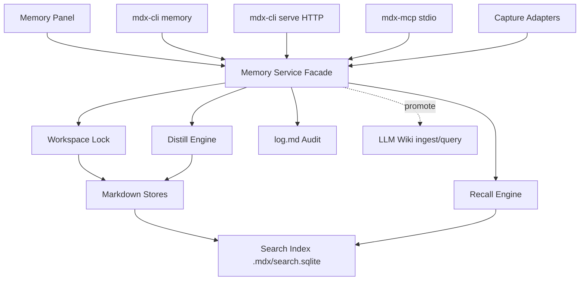
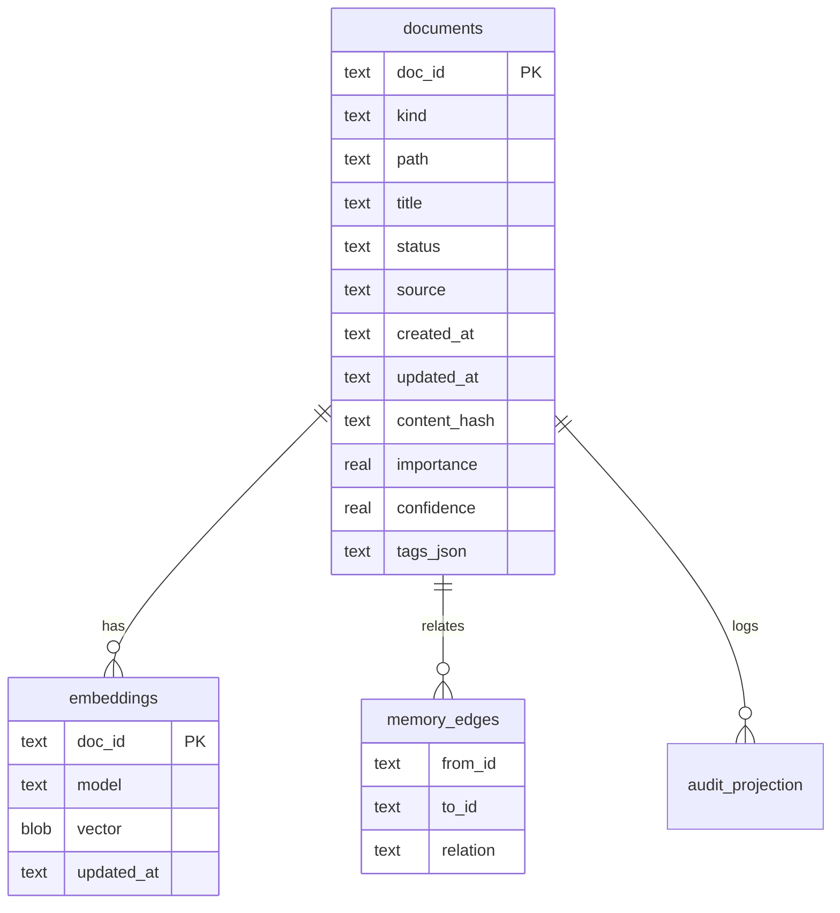

# MDX Memory 完整能力设计文档

## 一、修订历史

| 版本号 | 修订内容 | 修订时间 | 修订人 |
|---|---|---|---|
| V1.0.0 | 新建完整能力设计：取消 Phase 切分，覆盖 Memory 基础层、检索、MCP/daemon、自动捕获、蒸馏、UI、同步与运维 | 2026-06-13 | Codex |

## 二、需求信息

### 2.1 需求背景

- 背景：MDX 已具备本地优先 Markdown Workspace、LLM Wiki、CLI socket 与 Phase 1 Memory 基础实现。现有 Memory 设计按 Phase 拆分，其中检索增强、MCP/daemon、自动捕获、Smart Distill、UI、同步只停留在概要。用户需要一份不再分 Phase、可作为完整交付源头的设计方案。
- 需求目的：把 MDX Memory 设计收敛为一个完整产品能力：本地保存完整对话、提炼原子记忆、跨工具自动捕获、对 Agent 提供快速 recall、按需提升到 LLM Wiki，并通过 CLI、HTTP、MCP、UI 提供一致接口。
- 目标用户/使用方：
  - 同时使用 MDX、Codex、Cursor、Claude Code 与其他 MCP Agent 的开发者。
  - 需要本地、可读、可 git、可审计地保存 AI 对话、项目决策、偏好、约束和上下文的用户。
  - 需要把短期 Agent Memory 与长期 LLM Wiki 知识演化分离管理的用户。
- 需求链接：本轮用户要求“完全实现所有 Phase 的设计方案，而不是拆分成好几个 Phase 的方案”。
- 关联原始材料：
  - [docs/loopx/design/MDX Memory层与LLM Wiki并列架构需求设计文档.md](/Users/zhangyukun/project/mdx/docs/loopx/design/MDX%20Memory层与LLM%20Wiki并列架构需求设计文档.md)
  - [docs/loopx/specs/memory.md](/Users/zhangyukun/project/mdx/docs/loopx/specs/memory.md)
  - [docs/loopx/specs/llm-wiki.md](/Users/zhangyukun/project/mdx/docs/loopx/specs/llm-wiki.md)
  - [docs/loopx/design/MDX本地优先LLMWiki工作区需求设计文档.md](/Users/zhangyukun/project/mdx/docs/loopx/design/MDX本地优先LLMWiki工作区需求设计文档.md)

### 2.2 需求范围

- 本期范围：
  - Memory workspace 初始化、检测、迁移与修复。
  - Thread 完整对话存档、导入、列表、展示、归档。
  - Memory 原子记忆 CRUD、inbox 审核、演化关系、归档。
  - Working Memory 读写、追加、session startup bundle。
  - Search Index Service：SQLite FTS5 检索、可选 embedding 投影、可重建索引、增量更新。
  - Hybrid recall：working + memories + optional thread summaries + optional wiki references，输出 context bundle。
  - Smart Distill：从 thread 自动提炼候选 memories，进入 inbox 或自动入库。
  - Transcript Capture：Codex、Cursor、Claude Code、manual 四类来源。
  - Agent Protocol：`mdx-cli serve` HTTP API、MCP stdio server、CLI headless/socket 一致接口。
  - Memory UI：Workspace Mode 中的 Memory 面板，支持 recall、inbox、memories、threads、working、promote。
  - Promote to Wiki：thread 或 memory 显式复制到 `raw/promoted/`，可选 ingest。
  - Export/import bundle、git 同步指南、冲突检测。
  - 审计日志、错误码、文件锁、并发控制、测试和运维。
- 非目标：
  - 不做托管云同步服务；同步第一版以本地 bundle 和 git 为准。
  - 不做浏览器 web clipper。
  - 不做多模态图片/音频理解。
  - 不把 Memory 默认写入 `wiki/`；只有显式 promote 才进入 LLM Wiki ingest 流程。
  - 不改变 LLM Wiki 的 query 边界：`llm-wiki query` 不读取 raw/thread 全文。
  - 不做复杂交互知识图谱 UI；图关系以 Markdown wikilink、Mermaid 和索引元数据表达。
- 决策边界：
  - Markdown 文件仍是 source of truth；SQLite 和 embedding 是可删除、可重建投影。
  - Memory 与 LLM Wiki 是并列层；共享 workspace、审计、索引与 LLM provider，但查询契约独立。
  - Agent recall 默认不注入 thread 全文，只返回 thread summary 或显式指定 thread 的摘录。
  - 自动捕获默认关闭；用户或 Agent 配置后开启。
  - Smart Distill 默认进入 inbox；只有配置 `auto_accept=true` 且置信度达标时才直接写入 active memory。
- 依赖方：
  - Rust/Tauri 后端、`mdx-cli`、Workspace Mode 前端、LLM Wiki 现有 ingest/query、LLM provider 配置、文件系统 path guard。
- 约束条件：
  - macOS 是当前主目标；HTTP/MCP/CLI 代码应避免无必要平台绑定。
  - 所有 workspace 文件写入必须经过 path guard、symlink guard 和 workspace lock。
  - 不破坏现有 Phase 1 Memory 文件；新实现必须兼容并可迁移。

### 2.3 可行性分析

- 业务可行性：该能力补齐 Agent Memory 产品闭环，且与现有 MDX 本地优先和 Markdown 可审计定位一致。
- 技术可行性：现有 Rust Memory 基础、LLM Wiki provider、CLI socket、path guard、Markdown/frontmatter 解析已经存在；需新增 SQLite、HTTP/MCP、捕获适配器、UI 和同步模块。
- 团队接受能力：功能跨度大，必须拆成可测试子系统执行，但设计上作为一次完整交付验收。
- 时间成本：完整实现预估大于当前 Phase 1 一个数量级；实施计划必须分任务但不分产品 Phase。
- 资源成本：本地磁盘容量增加；embedding 会增加 LLM/provider 成本，默认可关闭。
- 替代方案：
  - 只保留 CLI Memory：实现快，但不能满足跨工具 Agent recall。
  - 做独立托管服务：体验统一，但违背本地优先和可 git 目标。
  - 把 Memory 并入 Wiki：简化存储，但会污染 LLM Wiki 的长期知识边界。
- 关键风险：
  - 自动蒸馏产生噪声记忆：用 inbox、置信度阈值、来源引用和人工审核兜底。
  - 捕获适配器被上游格式变更破坏：用 fixture、版本探测、失败降级为 manual import。
  - daemon/GUI/CLI 并发写冲突：workspace 级文件锁 + 索引事务 + 原子写。
  - embedding provider 不可用：FTS5 为基础检索，embedding 为可选增强。

## 三、概要设计

### 3.1 方案总述

- 设计目标：让 MDX Memory 成为本地优先、Markdown 可审计、跨 Agent 可调用的完整记忆系统。
- 总体思路：
  - 以 `memory/` 下 Markdown 文件作为事实源，保存完整 threads、原子 memories、inbox 和 working memory。
  - 以 `.mdx/search.sqlite` 作为可重建投影，提供 FTS5、元数据查询、可选 embedding 排序。
  - 以统一 Memory service 暴露 CLI、HTTP、MCP 和 UI 接口。
  - 自动捕获 thread 后触发 distill，产出 inbox 或 active memory；显式 promote 才进入 LLM Wiki。
- 核心模块：
  - Memory Store、Thread Store、Working Store、Inbox Store。
  - Search Index、Recall Engine、Distill Engine、Capture Adapters。
  - Agent Server、MCP Server、CLI adapter、Frontend Memory Panel。
  - Workspace Lock、Audit Log、Bundle Import/Export。
- 主要难点：
  - 本地文件与 SQLite 投影一致性。
  - 多入口并发写入。
  - 自动捕获格式兼容。
  - recall 的上下文预算和安全边界。
- 技术指标：
  - 500 条 memories 下 recall P95 < 200ms（FTS only）。
  - 5000 条 memories 下 recall P95 < 800ms（FTS + optional embedding disabled）。
  - `memory index rebuild` 可从空 SQLite 完整恢复。
  - 所有写操作失败不得留下半写 Markdown 文件。

### 3.2 整体架构设计

- 业务模式：用户在 MDX Workspace 中编辑和浏览；Agent 通过 CLI/MCP/HTTP 获取 recall 或写入 memory；捕获适配器从本地工具 transcript 导入 thread；LLM Distill 将 thread 提炼为候选记忆。
- 系统边界：
  - Memory API 管理 `memory/**` 和 `.mdx/memory-*`。
  - LLM Wiki API 管理 `raw/**`、`wiki/**`、`index.md`、LLM Wiki cache。
  - Search Index 可索引 memory 与 wiki，但 recall 默认只返回 memory；跨 wiki 需显式 `include_wiki_refs=true`。
- 上下游系统：
  - 上游：Codex local session history/export、Cursor transcript、本地 Claude Code hooks/manual export、MCP clients、mdx-cli、Workspace UI。
  - 下游：Markdown filesystem、SQLite、LLM provider、LLM Wiki ingest。
- 应用架构：



- 技术架构：
  - Rust modules under `src-tauri/src/`.
  - SQLite via `rusqlite` with bundled SQLite and FTS5.
  - Optional embeddings through existing LLM provider HTTP config; no local model dependency in first complete design.
  - HTTP server uses a small local-only Rust server; MCP uses stdio JSON-RPC compatible transport.
- 数据流转：
  - Capture/import -> thread markdown -> thread index -> optional distill -> inbox/memory markdown -> search index -> recall bundle.

### 3.3 核心流程设计

| 流程 | 触发条件 | 参与系统/模块 | 主流程 | 异常/补偿 | 输出 |
|---|---|---|---|---|---|
| 初始化/迁移 | 用户运行 init 或打开 workspace | memory_fs, migration, index | 补齐目录、配置、索引 schema、日志模板 | 已存在文件保留；旧字段迁移写 backup | Memory-ready workspace |
| 保存 thread | CLI/MCP/HTTP/UI/capture | memory_thread, lock, index, audit | 校验 source/thread_id/body -> 原子写 Markdown -> 更新 index -> 写审计 | hash 相同 skipped；写失败回滚 index 事务 | ThreadSaveResult |
| 添加 memory | 用户/Agent/distill | memory_store, index, audit | 校验 frontmatter/body -> create_new 写入 -> index upsert -> audit | 路径冲突自动 suffix；index 失败标记 dirty | MemoryRecord |
| Recall | Agent/UI/CLI | recall, index, working, stores | 读 working -> FTS/metadata/embedding candidate -> rerank -> budget trim -> bundle | index dirty 时 fallback 扫描并提示 rebuild | RecallResult |
| Distill | thread saved/manual command | distill, LLM provider, inbox/store | 读取 thread -> 过滤 skip patterns -> LLM JSON -> 校验 -> 写 inbox/active | LLM 失败写 distill_failed；不修改 thread distilled | DistillResult |
| Inbox 审核 | 用户/UI/CLI | inbox_store, memory_store | accept/edit/reject -> 写 active memory 或 archived inbox | 幂等按 inbox_id/status | InboxReviewResult |
| Promote | 用户/Agent 显式请求 | memory_promote, llm_wiki | 复制 thread/memory 到 raw/promoted -> 可选 ingest -> 标记 promoted | wiki 未就绪返回 llm_wiki_not_ready | PromoteResult |
| Export/import | 用户/CLI/UI | bundle, stores, index | 打包 memory 和 metadata；导入时校验冲突策略 | 冲突写 report，不覆盖除非指定 | BundleResult |

### 3.4 功能模块

| 模块 | 职责 | 关键功能 | 依赖 | 备注 |
|---|---|---|---|---|
| `memory.rs` | Service facade | 统一 Rust API、错误映射、跨模块编排 | 子模块 | CLI/HTTP/MCP/UI 共用 |
| `memory_models.rs` | DTO/schema | frontmatter、requests、responses、config | serde | 字段命名统一 snake_case |
| `memory_fs.rs` | 文件安全 | path guard、symlink guard、atomic write、lock | std fs | 不承载业务逻辑 |
| `memory_thread.rs` | Thread store | save/get/list/archive/import | fs/index/audit | 完整对话事实源 |
| `memory_store.rs` | Memory store | add/update/get/list/archive | fs/index/audit | active memories |
| `memory_inbox.rs` | Inbox store | candidate CRUD、accept/reject/edit | memory_store | distill 默认入口 |
| `memory_working.rs` | Working memory | get/set/append/sections | fs/audit | startup context |
| `search_index.rs` | SQLite 投影 | schema, rebuild, upsert, FTS, dirty flag | rusqlite | 可删除重建 |
| `memory_recall.rs` | Recall engine | hybrid candidate、rerank、budget、bundle | index/store | 不默认读 thread body |
| `memory_distill.rs` | Smart Distill | prompt、LLM JSON parse、candidate validation | llm_wiki_llm/store | 默认写 inbox |
| `memory_capture.rs` | 捕获抽象 | source adapters、poll/hook/import | thread_store | Codex/Cursor/Claude/manual |
| `memory_daemon.rs` | HTTP server | local API、auth、health | service | `mdx-cli serve` |
| `bin/mdx_mcp.rs` | MCP server | stdio tools | service | 独立 binary |
| `memory_bundle.rs` | 可移植 | export/import/conflict report | stores | zip/tar json manifest |
| `features/memory/*` | UI | Memory panel | Tauri commands | Workspace only |

### 3.5 新增/调整功能说明

- CLI：补齐 Memory 全部命令，并支持 `--root` headless。
- HTTP：新增 `mdx-cli serve --workspace <path>`，提供 local-only API。
- MCP：新增 `mdx-mcp` stdio server，工具与 CLI 语义一致。
- UI：Workspace Mode 新增 Memory panel，不影响 Document Mode。
- LLM Wiki：仅新增 promote 调用链，不让 LLM Wiki query 默认读取 Memory。

## 四、详细设计

### 4.1 Workspace 初始化、迁移与锁详细设计

#### 4.1.1 需求内容

- 入口：`mdx-cli memory init`、`mdx-cli memory repair`、Workspace UI 初始化按钮、daemon startup 检查。
- 操作人/调用方：用户、CLI、HTTP/MCP server。
- 前置条件：workspace root 存在且不是 symlink。
- 输出结果：Memory-ready workspace、配置文件、可选 SQLite 投影、审计日志。

#### 4.1.2 方案设计

- 核心逻辑：
  - 必需目录：`memory/threads`、`memory/memories`、`memory/inbox`、`.mdx`.
  - 必需文件：`memory/working.md`、`memory/MEMORY.md`、`.mdx/memory-config.json`、`.mdx/thread-index.json`、`log.md`.
  - `memory/threads/{codex,cursor,claude-code,import,manual}`、`memory/archive` 可按需创建；`.mdx/search.sqlite` 是可重建投影，不属于 ready-state 必需文件。
  - 初始化只补缺，不覆盖用户 Markdown。
  - 旧配置迁移：接受 camelCase 和 snake_case，写回 snake_case。
- 状态流转：
  - ordinary -> memory_ready。
  - memory_ready + missing index -> memory_ready_index_dirty。
  - config_old_version -> migrated。
- 数据变更：
  - 写默认 config、thread index、SQLite schema version。
- 幂等设计：
  - 多次 init 返回 created/preserved/migrated 列表。
- 权限/越权控制：
  - 所有路径必须在 workspace root 内，拒绝 symlink parent。
- 异常处理：
  - 类型冲突返回 `path_type_conflict`。
  - SQLite 打不开返回 `index_open_failed`，但 Markdown 不回滚。
- 补偿/重试：
  - `memory repair --rebuild-index` 删除并重建 SQLite。
- 日志与审计：
  - init 成功追加 `memory_init` 事件，含 created/preserved/migrated。

#### 4.1.3 流程步骤

1. Canonicalize root 并检查目录。
2. 获取 `.mdx/memory.lock` 排他锁。
3. 创建缺失目录和文件。
4. 读取并迁移 config。
5. 创建或迁移 SQLite schema。
6. 写 `log.md` 审计事件。
7. 释放锁。

#### 4.1.4 边界条件

| 场景 | 处理方式 | 用户/调用方感知 | 监控/告警 |
|---|---|---|---|
| `.mdx/search.sqlite` 损坏 | 标记 index dirty，提示 rebuild | `index_dirty=true` | warn log |
| 必需路径是 symlink | 拒绝初始化或读写 | `path_type_conflict` | error log |
| config 是旧 camelCase | 读入并写回 snake_case | migrated 列表 | info log |

### 4.2 Thread Store 详细设计

#### 4.2.1 需求内容

- 入口：`memory thread save/show/list`、capture adapters、MCP `memory_thread_save`。
- 操作人/调用方：用户、Agent、自动捕获。
- 前置条件：Memory-ready workspace。
- 输出结果：完整 thread Markdown、thread index、search index 更新。

#### 4.2.2 方案设计

- 核心逻辑：
  - source 枚举：`codex`、`cursor`、`claude-code`、`import`、`manual`。
  - 路径：`memory/threads/{source}/{yyyy-mm-dd}-{slug(thread_id)}.md`。
  - body 保存完整对话，推荐 message section，但 import 可保留原始 Markdown。
  - 同 thread_id + 同 hash -> skipped；同 thread_id + 新 hash -> 覆盖同路径完整快照。
- 状态流转：
  - active -> archived。
  - active -> promoted。
  - active -> distilled。
- 数据变更：
  - `.mdx/thread-index.json` 保存 `thread_id/path/content_hash/updated_at/source/title/archived`。
  - SQLite `documents` 和 `fts_threads` upsert metadata，不索引 thread full body 到 recall 默认结果。
- 幂等设计：
  - content_hash 是 normalized body sha256。
- 权限/越权控制：
  - import 文件可在 workspace 外读取，但写入必须在 workspace 内。
- 异常处理：
  - 非法 source 返回 `invalid_thread_source`。
  - 空 body 返回 `invalid_thread_body`。
- 补偿/重试：
  - Markdown 写成功、index 失败：写 `.mdx/memory-progress.md` dirty entry，后续 rebuild 修复。
- 日志与审计：
  - 事件名固定 `thread_save`、`thread_archive`、`thread_import`。

#### 4.2.3 流程步骤

1. 校验 source、thread_id、body。
2. 计算 content hash。
3. 查询 thread index。
4. 根据 hash 决定 skipped/created/updated。
5. 原子写 thread Markdown。
6. 更新 thread index 和 SQLite。
7. 写审计日志。

#### 4.2.4 边界条件

| 场景 | 处理方式 | 用户/调用方感知 | 监控/告警 |
|---|---|---|---|
| thread_id 改 source | 以 index 既有 path 为准，不搬移 | action updated | warn log |
| message_count 无法识别 | 存 null 或 0，不失败 | 正常保存 | 无 |
| thread 文件被用户删除 | list 时跳过并报告 stale index | warnings | warn log |

### 4.3 Memory 与 Inbox Store 详细设计

#### 4.3.1 需求内容

- 入口：`memory add/update/show/list/archive`、`memory inbox list/accept/reject/edit`、distill。
- 操作人/调用方：用户、Agent、Smart Distill。
- 前置条件：Memory-ready workspace。
- 输出结果：active memory Markdown 或 inbox candidate Markdown。

#### 4.3.2 方案设计

- 核心逻辑：
  - active path：`memory/memories/{yyyy-mm-dd}-{slug}[-n].md`。
  - inbox path：`memory/inbox/{yyyy-mm-dd}-{slug}[-n].md`。
  - Memory frontmatter 必含：`schema_version/kind/memory_id/title/status/created_at`。
  - 推荐字段：`source_thread/source_message_refs/importance/confidence/tags/evolves_from/promoted_to_wiki`。
  - update 不覆盖旧记录时可用 `evolves_from` 创建新 memory；直接 edit 只用于修正文案。
- 状态流转：
  - inbox -> active。
  - inbox -> rejected。
  - active -> archived。
  - active -> superseded。
- 数据变更：
  - Markdown 写入后 upsert SQLite `documents`、`fts_memories`、`memory_edges`。
- 幂等设计：
  - add 总是 create_new，不覆盖。
  - accept inbox 按 inbox_id/status 幂等，已 accepted 返回已有 memory_id。
- 权限/越权控制：
  - source_thread 若提供，必须是 workspace 内 thread path 或 thread_id。
- 异常处理：
  - importance/confidence 超出 0..1 返回 `invalid_score`。
  - title/body 空返回 `invalid_memory`。
- 补偿/重试：
  - index dirty 可 rebuild；Markdown 是事实源。
- 日志与审计：
  - `memory_add`、`memory_archive`、`inbox_accept`、`inbox_reject`。

#### 4.3.3 流程步骤

1. 校验请求。
2. 分配 memory_id 或 inbox_id。
3. create_new 写 Markdown。
4. upsert SQLite。
5. 写审计日志。

#### 4.3.4 边界条件

| 场景 | 处理方式 | 用户/调用方感知 | 监控/告警 |
|---|---|---|---|
| slug 冲突 | 自动追加 `-n` | 返回最终 path | 无 |
| source_thread 不存在 | 允许保存但写 warning，distill 不允许 | warnings | warn log |
| 用户手改 frontmatter 无法解析 | list 跳过并返回 warning | degraded list | warn log |

### 4.4 Working Memory 详细设计

#### 4.4.1 需求内容

- 入口：`memory working get/set/append/sections`、MCP `memory_working_get`、UI editor。
- 操作人/调用方：用户、Agent。
- 前置条件：Memory-ready workspace。
- 输出结果：`memory/working.md`。

#### 4.4.2 方案设计

- 核心逻辑：
  - Working memory 是 session startup 的第一块上下文。
  - append 支持向指定二级标题追加 bullet；不存在则创建。
  - set 覆盖整文件前写 backup 至 `.mdx/backups/working-{timestamp}.md`。
- 状态流转：无业务状态。
- 数据变更：只写 `memory/working.md` 和 audit。
- 幂等设计：set 非幂等但可审计；append 非幂等。
- 权限/越权控制：只能操作固定路径。
- 异常处理：空 section 返回 `invalid_section`。
- 补偿/重试：用户可从 backup 恢复。
- 日志与审计：`memory_working_update`。

#### 4.4.3 流程步骤

1. 校验 action 和参数。
2. 获取 workspace lock。
3. 读旧 working。
4. set 或 append。
5. 原子写文件并记录审计。

#### 4.4.4 边界条件

| 场景 | 处理方式 | 用户/调用方感知 | 监控/告警 |
|---|---|---|---|
| working 文件过大 | recall 按 byte budget 截断 | truncated=true | warn log |
| section 大小写不同 | 精确匹配，不自动合并 | 新建 section | 无 |

### 4.5 Search Index 与 Hybrid Recall 详细设计

#### 4.5.1 需求内容

- 入口：`memory recall/search/index rebuild/index status`、写操作后的增量索引、daemon startup。
- 操作人/调用方：用户、Agent、后台维护流程。
- 前置条件：Memory-ready workspace。
- 输出结果：RecallResult 或 SearchResult。

#### 4.5.2 方案设计

- 核心逻辑：
  - SQLite 是投影，schema version 管理在 `metadata` 表。
  - FTS5 索引 active memories、inbox candidates、thread metadata、可选 wiki page metadata。
  - Embedding 可选：仅当 `memory-config.json.recall.embeddings.enabled=true` 且 LLM provider 支持 embedding 时生成。
  - Recall 默认读取 working + active memories；`include_threads` 只返回 thread summary；`thread_ids` 才允许读取指定 thread excerpt。
  - `include_wiki_refs` 返回 wiki page references，不把 wiki 正文混入 memory recall，除非调用方显式请求 `include_wiki_snippets`。
- 状态流转：
  - clean -> dirty -> rebuilding -> clean。
- 数据变更：
  - Upsert `documents`、FTS rows、embedding rows、dirty queue。
- 计算公式：
  - FTS score：BM25 normalized。
  - Recency：`0.5 ^ (age_days / half_life_days)`。
  - Importance：`0.5 + importance`。
  - Confidence：`0.5 + confidence * 0.5`。
  - Final FTS only：`bm25_score * recency * importance_weight * confidence_weight`。
  - Hybrid：RRF 合并 FTS rank 和 vector rank，`1/(60+rank)`。
- 幂等设计：
  - rebuild 删除投影后从 Markdown 重建。
  - upsert 以 `doc_id` 幂等。
- 权限/越权控制：
  - 索引只读取 workspace allowlist 路径。
- 异常处理：
  - SQLite 失败返回 `index_failed`，recall fallback 到 Markdown scan 并标记 `index_degraded=true`。
- 补偿/重试：
  - dirty queue 下次 startup 或 `index rebuild` 处理。
- 日志与审计：
  - `memory_index_rebuild`、`memory_index_dirty`。

#### 4.5.3 流程步骤

1. Load config defaults。
2. 读取 working（如 include_working）。
3. 从 index 查询 candidates；index 不可用则扫描 Markdown。
4. 可选查询 embeddings。
5. 过滤 tag/status/since/source。
6. rerank。
7. 按 byte budget 输出 context bundle。
8. 返回 warnings、references、truncated。

#### 4.5.4 边界条件

| 场景 | 处理方式 | 用户/调用方感知 | 监控/告警 |
|---|---|---|---|
| query 为空 | 返回 working + recent high importance memories，或 CLI 拒绝 | CLI `invalid_query` | 无 |
| embedding provider 失败 | fallback FTS | warning | warn log |
| SQLite locked | retry 3 次后 fallback scan | index_degraded=true | warn log |

### 4.6 Smart Distill 详细设计

#### 4.6.1 需求内容

- 入口：`memory distill --thread <id>`、thread save 后自动触发、UI distill button、MCP tool。
- 操作人/调用方：用户、Agent、capture pipeline。
- 前置条件：Memory-ready workspace；LLM config 可用；thread 存在。
- 输出结果：0-N 个 inbox candidates 或 active memories。

#### 4.6.2 方案设计

- 核心逻辑：
  - 读取 thread frontmatter/body。
  - 按 config `skip_patterns` 删除终端噪声和大段生成物。
  - LLM 输出严格 JSON 数组，每项含 title/body/tags/importance/confidence/source_message_refs。
  - 后端验证 JSON、分数、长度、来源引用。
  - 默认写 inbox；若 `auto_accept=true` 且 confidence >= threshold 才写 active memory。
- 状态流转：
  - thread.distilled=false -> distilling -> distilled=true。
  - distill_failed 不设置 distilled=true。
- 数据变更：
  - inbox/memory Markdown，thread frontmatter `distilled=true/distilled_at`。
- 幂等设计：
  - distill_run_id = sha256(thread content_hash + config version)。
  - 同 run_id 已完成时返回 existing result，除非 `--force`。
- 权限/越权控制：
  - LLM 输出的 source path 不可信，只接受当前 thread。
- 异常处理：
  - 无 LLM config 返回 `llm_config_missing`。
  - JSON parse 失败返回 `distill_parse_failed`。
- 补偿/重试：
  - `--force` 重新运行，不删除旧 inbox；新候选用新 run_id。
- 日志与审计：
  - `memory_distill_start`、`memory_distill_complete`、`memory_distill_failed`。

#### 4.6.3 流程步骤

1. 读取 thread。
2. 检查 min_messages 和 skip patterns。
3. 构造 distill prompt。
4. 调 LLM。
5. 解析和验证 JSON。
6. 写 inbox 或 memories。
7. 标记 thread distilled。
8. 写审计。

#### 4.6.4 边界条件

| 场景 | 处理方式 | 用户/调用方感知 | 监控/告警 |
|---|---|---|---|
| LLM 返回空数组 | 成功，created_count=0 | 正常 | info log |
| 候选 body 太长 | 截断或拒绝，按 config | warning | warn log |
| thread 太大 | chunk 后 distill，再合并去重 | slower | info log |

### 4.7 Capture Adapters 详细设计

#### 4.7.1 需求内容

- 入口：`memory capture scan`、`memory capture import`、Codex session export/history import、Claude Code hook、daemon polling。
- 操作人/调用方：用户、Agent 工具、daemon。
- 前置条件：capture config enabled；source path 授权。
- 输出结果：thread save request。

#### 4.7.2 方案设计

- 核心逻辑：
  - `memory_capture` 定义 `CaptureSource` trait：`discover() -> sessions`、`load(session) -> ThreadSaveRequest`。
  - Codex adapter：支持从用户配置的 Codex 本地会话历史、导出的 transcript 文件或 hook 传入的 transcript path/stdin JSON 导入；实现不得硬编码未经验证的全局路径，必须通过 config allowlist 或显式 CLI 参数读取。
  - Cursor adapter：从配置路径读取本地 transcript；只读用户授权目录。
  - Claude Code adapter：支持 Stop hook 传入 transcript path 或 stdin JSON。
  - Manual adapter：读取 Markdown/JSON 文件。
  - Capture state 存 `.mdx/memory-progress.md` 或 `.mdx/capture-state.json`，记录 source/session/hash/status。
- 状态流转：
  - discovered -> imported -> distilled -> failed/ignored。
- 数据变更：
  - 新 thread Markdown、capture state、audit。
- 幂等设计：
  - source_session_id + content_hash 去重。
- 权限/越权控制：
  - 自动扫描目录必须在 config allowlist 中。
- 异常处理：
  - 格式未知返回 `capture_parse_failed`，不写 thread。
- 补偿/重试：
  - failed session 记录在 capture state；后续重新 `capture scan` 或显式 `capture import` 时按 source+hash 幂等处理。
- 日志与审计：
  - `memory_capture_import`、`memory_capture_failed`。

#### 4.7.3 流程步骤

1. 读取 capture config。
2. 遍历 enabled sources。
3. discover 新 session。
4. parse transcript。
5. 调 `memory_thread_save`。
6. 根据 config 可选触发 distill。
7. 更新 capture state。

#### 4.7.4 边界条件

| 场景 | 处理方式 | 用户/调用方感知 | 监控/告警 |
|---|---|---|---|
| 上游格式变化 | parse failed，保留 raw path | failed list | warn log |
| transcript 包含秘密 | 本地保存；不自动上传，distill 调 LLM 前提示配置风险 | documented | 无 |
| 重复 session | skipped | skipped_count | 无 |

### 4.8 Agent Protocol、HTTP 与 MCP 详细设计

#### 4.8.1 需求内容

- 入口：`mdx-cli serve --workspace <path>`、`mdx-mcp --workspace <path>`、MCP client config。
- 操作人/调用方：用户、Agent。
- 前置条件：workspace root 存在；Memory-ready 或可 init。
- 输出结果：HTTP/MCP 可调用 Memory tools。

#### 4.8.2 方案设计

- 核心逻辑：
  - HTTP server 只监听 `127.0.0.1`，默认端口 `14243`。
  - 可选 API key：`--api-key` 或环境变量 `MDX_MEMORY_API_KEY`。
  - MCP stdio server 不开放网络端口。
  - HTTP/MCP 都调用同一 `memory` facade，不能绕过锁和 path guard。
- 状态流转：server starting -> ready -> stopping。
- 数据变更：仅具体 API 写入会变更数据。
- 幂等设计：写接口沿用 store 幂等。
- 权限/越权控制：
  - HTTP 只允许 local host。
  - API key 存在时要求 `Authorization: Bearer`。
- 异常处理：
  - no_workspace、memory_not_ready、unauthorized、invalid_request。
- 补偿/重试：客户端可重试幂等接口。
- 日志与审计：server access debug log；业务写入走 audit。

#### 4.8.3 流程步骤

1. 解析 workspace。
2. 检查或初始化 Memory。
3. 启动 HTTP/MCP loop。
4. 每个请求反序列化为 Memory request。
5. 调 service facade。
6. 序列化响应。

#### 4.8.4 边界条件

| 场景 | 处理方式 | 用户/调用方感知 | 监控/告警 |
|---|---|---|---|
| 端口占用 | 返回 `port_in_use` | CLI stderr | error log |
| API key 错误 | 401 | unauthorized | warn log |
| MCP client 传非法 JSON | JSON-RPC error | tool error | debug log |

### 4.9 Memory UI 详细设计

#### 4.9.1 需求内容

- 入口：Workspace Mode 左/右侧 Memory panel。
- 操作人/调用方：用户。
- 前置条件：Workspace Mode；Document Mode 不显示。
- 输出结果：可视化管理 Memory。

#### 4.9.2 方案设计

- 核心逻辑：
  - Panel tabs：Recall、Working、Memories、Inbox、Threads、Settings。
  - Recall tab：输入 query，显示 bundle、scores、references、copy context。
  - Working tab：Markdown editor for `working.md`。
  - Memories tab：list/search/filter/edit/archive。
  - Inbox tab：accept/edit/reject distilled candidates。
  - Threads tab：list/show/archive/promote/distill。
  - Settings tab：capture/distill/recall/index config。
- 状态流转：UI local loading/error/saving 状态；不引入新的业务状态。
- 数据变更：通过 Tauri commands 调 Memory facade。
- 幂等设计：UI buttons 防重复提交。
- 权限/越权控制：只能操作当前 workspace root。
- 异常处理：展示 WorkspaceError code 和 message。
- 补偿/重试：失败可 retry；编辑前保留 dirty state。
- 日志与审计：后端写操作审计。

#### 4.9.3 流程步骤

1. Panel mount 调 `memory_detect_workspace`。
2. 未初始化时显示 init action。
3. 初始化后并行加载 working/status/index status。
4. 用户执行操作时调用 Tauri command。
5. 成功后刷新相关 tab。

#### 4.9.4 边界条件

| 场景 | 处理方式 | 用户/调用方感知 | 监控/告警 |
|---|---|---|---|
| workspace 切换 | 清空旧状态，重新 detect | loading | 无 |
| 后端文件被外部修改 | reload 后显示最新 | refresh | 无 |
| 编辑冲突 | dirty diff prompt | conflict dialog | warn log |

### 4.10 Promote、Bundle 与同步详细设计

#### 4.10.1 需求内容

- 入口：`memory promote`、`memory export`、`memory import`、UI actions。
- 操作人/调用方：用户、Agent。
- 前置条件：Memory-ready workspace。
- 输出结果：promoted raw、bundle 文件或 import report。

#### 4.10.2 方案设计

- 核心逻辑：
  - promote 支持 thread 和 memory：复制到 `raw/promoted/{date}-{slug}[-n].md`，加 provenance frontmatter。
  - `--ingest` 要求 LLM Wiki ready，否则 `llm_wiki_not_ready`。
  - export bundle 包含 `manifest.json`、`memory/**`、`.mdx/thread-index.json`、可选 `log.md`，不包含 `.mdx/search.sqlite`。
  - import 支持策略：当前实现只支持 `skip`；默认 skip。
  - git 同步以 Markdown 为准；SQLite rebuild。
- 状态流转：无独立业务状态。
- 数据变更：thread promote 成功后修改 source frontmatter `promoted_to_wiki=true`；memory record promote 不修改 source memory；import 写入 memory files。
- 幂等设计：promote create_new，不覆盖；import manifest item id 去重。
- 权限/越权控制：bundle 解包必须防 zip-slip/path traversal。
- 异常处理：bundle manifest 缺失返回 `invalid_bundle`。
- 补偿/重试：import 先 dry-run report，再 apply。
- 日志与审计：`memory_promote`、`memory_export`、`memory_import`。

#### 4.10.3 流程步骤

1. promote/import/export 获取 lock。
2. 校验参数和路径。
3. 执行文件复制或 bundle 操作。
4. 更新 frontmatter/index。
5. 写 audit。

#### 4.10.4 边界条件

| 场景 | 处理方式 | 用户/调用方感知 | 监控/告警 |
|---|---|---|---|
| import ID 冲突 | 默认 skip，report 冲突 | conflict report | 无 |
| bundle 含绝对路径 | 拒绝 | invalid_bundle | warn log |
| promote ingest 失败 | 不标记 promoted | error | error log |

## 五、存储类设计

### 5.1 库表设计

#### 5.1.1 数据库模型图



#### 5.1.2 表结构

| 表名 | 用途 | 主键 | 关键索引 | 数据量预估 | 备注 |
|---|---|---|---|---|---|
| `metadata` | schema/version/dirty flag | `key` | 无 | <100 | SQLite 投影状态 |
| `documents` | memory/thread/wiki 元数据 | `doc_id` | `kind,status,updated_at` | 1k-50k | 不保存完整 thread body |
| `fts_memories` | active/inbox memory FTS | virtual rowid | FTS5 | 1k-50k | body 可索引 |
| `fts_threads` | thread metadata FTS | virtual rowid | FTS5 | 1k-50k | 默认只索引 title/tags/id |
| `fts_wiki` | wiki metadata/snippet FTS | virtual rowid | FTS5 | 1k-50k | include_wiki_refs 使用 |
| `embeddings` | 可选 vector 投影 | `doc_id` | `model` | 0-50k | 可删除 |
| `memory_edges` | evolves/promotes/source 关系 | composite | `from_id,to_id` | 0-100k | 图关系 |
| `audit_projection` | log.md 查询投影 | `event_id` | `event_type,created_at` | 0-100k | 可重建 |

字段明细：

| 字段 | 类型 | 是否必填 | 默认值 | 含义 | 来源/取值逻辑 | 备注 |
|---|---|---|---|---|---|---|
| `doc_id` | TEXT | 是 | 无 | 稳定文档 ID | memory_id/thread_id/wiki path | 主键 |
| `kind` | TEXT | 是 | 无 | `memory/inbox/thread/wiki` | frontmatter/path | 枚举 |
| `path` | TEXT | 是 | 无 | workspace 相对路径 | 写入时生成 | 唯一 |
| `status` | TEXT | 是 | active | active/inbox/archived/rejected | frontmatter | 过滤 |
| `content_hash` | TEXT | 否 | null | 内容 hash | normalized body | dedup |
| `importance` | REAL | 否 | 0.5 | 重要性 | frontmatter/distill | 0..1 |
| `confidence` | REAL | 否 | 0.5 | 置信度 | frontmatter/distill | 0..1 |

### 5.2 数据迁移/初始化

- DDL：
  - 创建 `.mdx/search.sqlite`，启用 FTS5 virtual tables。
  - `metadata.schema_version = 1`。
- DML：
  - 首次 rebuild 扫描 `memory/memories`、`memory/inbox`、`.mdx/thread-index.json`、可选 `wiki/**`。
- 数据回填：
  - 从现有 Phase 1 Markdown 生成 `documents` 与 FTS。
  - 旧 config camelCase 读入后写回 snake_case。
- 老数据兼容：
  - 缺失新 frontmatter 字段时使用默认值，不强制改写文件。
  - `memory repair --rewrite-frontmatter` 才批量补字段。
- 新老系统读写关系：
  - 新系统继续读写现有 Phase 1 路径。
  - 旧 CLI 对新 frontmatter 额外字段应保持 serde ignore 或兼容。

### 5.3 缓存设计

| 场景 | Key | Value | 数据结构 | 过期时长 | 容量预估 | 失效/刷新策略 |
|---|---|---|---|---|---|---|
| Recall LRU | query+filters+index_version | Recall candidates | memory LRU | 5 分钟 | 100 entries | 写操作清空 |
| Parsed frontmatter | path+mtime | parsed record | memory map | 进程内 | 10k records | mtime 变化失效 |
| LLM distill result | distill_run_id | candidate ids | json file/index | 永久 | 1 per run | --force 新 run |

## 六、其他组件设计

### 6.1 消息设计

不涉及外部 MQ。内部异步任务使用进程内队列：

| 场景 | Group | Topic | 生产者 | 消费者 | 幂等键 | 失败补偿 |
|---|---|---|---|---|---|---|
| 增量索引 | local | `memory.index.upsert` | stores | index worker | doc_id+hash | dirty queue |
| 自动蒸馏 | local | `memory.distill.thread` | capture/thread save | distill worker | distill_run_id | failed state retry |
| 捕获扫描 | local | `memory.capture.scan` | daemon/UI | capture worker | source+session+hash | 重新 scan/import |

### 6.2 配置设计

| 配置项 | 环境 | 默认值 | 是否动态生效 | 说明 | 风险 |
|---|---|---|---|---|---|
| `recall.default_limit` | workspace | 10 | 是 | 默认返回 memory 数 | 过大拖慢 |
| `recall.context_byte_budget` | workspace | 65536 | 是 | recall 输出预算 | 过大影响 Agent prompt |
| `recall.half_life_days` | workspace | 30 | 是 | 时间衰减 | 影响排序 |
| `recall.embeddings.enabled` | workspace | false | 是 | 是否生成/使用 embedding | 成本/隐私 |
| `recall.include_wiki_refs_default` | workspace | false | 是 | recall 是否默认返回 wiki references | 可能混淆边界 |
| `distill.enabled` | workspace | false | 是 | 保存 thread 后是否蒸馏 | LLM 成本 |
| `distill.auto_accept` | workspace | false | 是 | 是否直接写 active memory | 噪声风险 |
| `distill.confidence_threshold` | workspace | 0.85 | 是 | 自动接受阈值 | 过低污染 |
| `capture.enabled` | workspace | false | 是 | 是否自动捕获 | 隐私 |
| `capture.sources` | workspace | [] | 是 | codex/cursor/claude-code/manual | 格式风险 |
| `server.host` | local | 127.0.0.1 | 重启 | HTTP 监听 host | 暴露风险 |
| `server.port` | local | 14243 | 重启 | HTTP 端口 | 端口冲突 |

### 6.3 定时任务/批处理

| 任务 | 触发时间 | 处理范围 | 幂等 | 失败重试 | 影响评估 |
|---|---|---|---|---|---|
| index rebuild | 手动/repair/startup dirty | 全部 memory/wiki metadata | 是 | 用户重跑 | CPU/IO 中等 |
| capture scan | daemon interval/manual | enabled sources | source+hash 去重 | failed retry | IO 中等 |
| distill queue | thread save 后/manual | pending distill runs | run_id 去重 | failed retry | LLM 成本 |
| stale index check | startup | documents paths | 是 | 下次 startup | 快 |

### 6.4 技术组件

- 分布式锁：不做跨机器分布式锁；本地 workspace 使用 `.mdx/memory.lock` advisory/exclusive lock。
- 唯一 ID：memory_id/inbox_id 使用 path-derived id；distill_run_id 使用 sha256；event_id 使用 timestamp + hash。
- 加解密/验签：不新增 secret 存储；LLM API key 沿用现有配置策略；HTTP API key 可由 env 提供，不写 workspace。
- 字典转换：serde models 统一 snake_case；CLI 支持兼容旧 camelCase JSON alias。
- Excel/文件处理：不涉及。
- 用户信息透传：不涉及多用户；source/workspace_root 可记录 provenance。
- 限流/熔断：HTTP local server 每进程简单并发上限；LLM 调用沿用 provider timeout。

## 七、接口设计

### 7.1 接口设计原则

- CLI、HTTP、MCP、Tauri commands 必须调用同一 Rust service facade。
- 所有非查询接口必须获取 workspace lock，并写审计日志。
- 所有 request/response 字段使用 snake_case；兼容输入 alias 可保留。
- 错误码必须稳定，CLI/HTTP/MCP 只做传输层映射，不改业务码。
- Markdown 文件是事实源；SQLite 失败不得丢失已写 Markdown。

### 7.2 接口清单

| 接口 | 调用方 | 服务方 | 权限/认证 | 幂等 | 文档地址 | 备注 |
|---|---|---|---|---|---|---|
| `memory status/init/repair` | CLI/UI/HTTP/MCP | Memory service | workspace access | init/repair 幂等 | 本文 | workspace 管理 |
| `memory thread save/show/list` | CLI/UI/HTTP/MCP/capture | Thread store | workspace access | save hash 幂等 | 本文 | 完整对话 |
| `memory add/update/show/list/archive` | CLI/UI/HTTP/MCP/distill | Memory store | workspace access | add create_new | 本文 | 原子记忆 |
| `memory inbox list/accept/reject/edit` | CLI/UI/HTTP/MCP | Inbox store | workspace access | accept/reject 幂等 | 本文 | 审核 |
| `memory working get/set/append` | CLI/UI/HTTP/MCP | Working store | workspace access | get 幂等 | 本文 | 当前上下文 |
| `memory recall/search` | CLI/UI/HTTP/MCP | Recall engine | workspace access | 查询幂等 | 本文 | Context bundle |
| `memory distill` | CLI/UI/HTTP/MCP | Distill engine | LLM config | run_id 幂等 | 本文 | LLM |
| `memory capture scan/import` | CLI/UI/HTTP | Capture | source allowlist | source+hash 幂等 | 本文 | 自动捕获 |
| `memory index status/rebuild` | CLI/UI/HTTP | Search index | workspace access | rebuild 幂等 | 本文 | 投影 |
| `memory promote` | CLI/UI/HTTP/MCP | Promote | workspace access | create_new | 本文 | 到 LLM Wiki |
| `memory export/import` | CLI/UI/HTTP | Bundle | workspace access | import 策略决定 | 本文 | 可移植 |

### 7.3 接口明细

#### 7.3.1 Recall

- 路径/方法：
  - CLI: `mdx-cli memory recall [--json] [--limit N] [--byte-budget N] [--no-working] [--include-threads] [--tag tag] [--since iso] <query...>`
  - HTTP: `POST /memory/recall`
  - MCP: `memory_recall`
- 请求头：HTTP 可选 `Authorization: Bearer <api_key>`。
- 请求参数：

```json
{
  "query": "auth jwt",
  "limit": 10,
  "byte_budget": 65536,
  "include_working": true,
  "include_threads": false,
  "thread_ids": [],
  "tag": "auth",
  "since": "2026-06-01T00:00:00Z",
  "include_wiki_refs": false,
  "include_wiki_snippets": false
}
```

- 响应参数：

```json
{
  "working": "# Working Memory\n...",
  "memories": [
    {
      "memory_id": "mem_20260613_auth",
      "title": "Auth uses JWT",
      "path": "memory/memories/2026-06-13-auth.md",
      "snippet": "Use JWT...",
      "score": 2.4,
      "importance": 0.8,
      "confidence": 0.9,
      "tags": ["auth"]
    }
  ],
  "threads": [],
  "wiki_refs": [],
  "truncated": false,
  "byte_count": 1200,
  "index_degraded": false,
  "warnings": []
}
```

- 错误码：`memory_not_ready`、`invalid_query`、`index_failed`。
- 业务校验：limit 1..100，byte_budget 1024..1048576。
- 数据变更：无。
- 日志字段：query hash、limit、duration_ms、degraded。

#### 7.3.2 Distill

- 路径/方法：
  - CLI: `mdx-cli memory distill --thread <id|path> [--accept] [--force] [--json]`
  - HTTP: `POST /memory/distill`
  - MCP: `memory_distill`
- 请求参数：

```json
{
  "target": "cursor:abc123",
  "accept": false,
  "force": false
}
```

- 响应参数：

```json
{
  "run_id": "distill_...",
  "created_inbox_ids": ["inbox_20260613_auth"],
  "created_memory_ids": [],
  "skipped": false,
  "warnings": []
}
```

- 错误码：`thread_not_found`、`llm_config_missing`、`distill_parse_failed`、`distill_failed`。
- 业务校验：thread must exist；thread body non-empty。
- 数据变更：inbox/memory files，thread frontmatter。
- 日志字段：thread_id、run_id、created_count、accepted_count。

#### 7.3.3 MCP Tool Set

- `memory_status`
- `memory_recall`
- `memory_add`
- `memory_working_get`
- `memory_thread_save`
- `memory_thread_show`
- `memory_inbox_list`
- `memory_inbox_accept`
- `memory_distill`
- `memory_search`
- `memory_promote`

MCP 使用 JSON-RPC 2.0 响应；成功结果放在 `result`，失败结果放在 `error`：

```json
{
  "jsonrpc": "2.0",
  "id": 1,
  "result": {}
}
```

失败：

```json
{
  "jsonrpc": "2.0",
  "id": 1,
  "error": {
    "code": -32603,
    "message": "memory_not_ready: memory workspace is not initialized"
  }
}
```

#### 7.3.4 HTTP Health

- 路径/方法：`GET /health`
- 请求头：无；若启用 api key，health 仍返回有限状态。
- 响应参数：

```json
{
  "ok": true,
  "workspace": "/path/to/ws",
  "has_memory": true,
  "can_initialize": false,
  "mode": "memory",
  "missing_paths": [],
  "memory_status": {
    "mode": "memory",
    "has_memory": true,
    "can_initialize": false,
    "missing_paths": []
  }
}
```

- 错误码：无 workspace 时 HTTP 200 + `has_memory=false`。
- 业务校验：无。
- 数据变更：无。
- 日志字段：duration_ms。

## 八、系统发布

### 8.1 灰度方案

- 灰度范围：本地应用功能，默认不自动开启 capture/distill/embeddings/daemon。
- 灰度开关：
  - `memory-config.json.capture.enabled=false`
  - `memory-config.json.distill.enabled=false`
  - `memory-config.json.recall.embeddings.enabled=false`
- 验证指标：
  - 现有 Phase 1 Memory tests 通过。
  - LLM Wiki tests 无回归。
  - 新 CLI/HTTP/MCP smoke 通过。
- 放量节奏：先 CLI/headless，再 UI，再 daemon/MCP 默认文档化。

### 8.2 降级方案

- 降级触发条件：
  - SQLite 损坏、LLM provider 不可用、capture 格式变化、daemon 端口冲突。
- 降级行为：
  - Recall fallback 到 Markdown scan。
  - Embedding disabled。
  - Distill/capture disabled。
  - HTTP/MCP 不启动不影响 CLI headless。
- 用户影响：
  - 检索变慢或自动化不可用，但 Markdown memory 仍可读写。
- 恢复方式：
  - `mdx-cli memory index rebuild`
  - 修正 config 后重启 daemon。

### 8.3 关联系统/功能影响

| 系统/功能 | 影响 | 依赖动作 | 负责人 | 验证方式 |
|---|---|---|---|---|
| LLM Wiki | promote 可调用 ingest；query 边界不变 | 回归测试 | 开发者 | `llm_wiki_tests` |
| Workspace UI | 新增 Memory panel | 前端组件和 Tauri commands | 开发者 | Vitest + manual |
| mdx-cli | 命令族扩大 | CLI parser/renderer | 开发者 | Rust tests |
| 文件树 | 显示 memory 文件取决于现有规则 | 不强制改动 | 开发者 | 手动 |
| LLM config | distill/embedding 复用 | provider 能力检测 | 开发者 | mock provider tests |

### 8.4 回滚方案

- 回滚条件：Memory 写入损坏、UI 严重阻塞、daemon/MCP 安全问题。
- 回滚步骤：
  1. 回滚 binary。
  2. 保留 `memory/**` Markdown，不删除用户数据。
  3. 删除或忽略 `.mdx/search.sqlite`。
  4. 将 `capture.enabled/distill.enabled/embeddings.enabled` 置 false。
- 数据回滚：不自动删除新 memory；用户可用 git 回滚。
- 配置回滚：新字段旧版本忽略；若旧版本严格解析，应保留兼容 serde。
- 风险：旧版本可能不理解 inbox 新字段；但 Markdown 仍可人工读取。

## 九、系统监控与维护

### 9.1 监控与告警

- 系统异常：
  - path guard failure、SQLite open failure、lock timeout、daemon startup failure。
- 业务异常：
  - distill parse failed、capture parse failed、promote ingest failed。
- 重试异常：
  - dirty index queue 长期未清。
- 超时：
  - LLM distill/embedding timeout。
- 关键接口指标：
  - recall duration、index rebuild duration、distill success rate、capture import count。
- 告警渠道：
  - 本地 log、UI warning banner、CLI stderr；不接远程告警。

### 9.2 性能与容量

- TPS/吞吐：
  - 本地单用户，设计目标 1-5 并发请求。
- CPU/内存/磁盘 IO/网络 IO：
  - Index rebuild 主要消耗磁盘 IO 和 CPU。
  - Distill/embedding 消耗网络。
- 数据容量：
  - 目标支持 50k documents metadata。
  - Thread 文件按完整 transcript 保存，用户通过 git/磁盘管理。
- 缓存容量：
  - 进程内 parsed metadata cache 默认 <100MB。
- 跑批耗时：
  - 5000 memories rebuild 目标 <30s（无 embedding）。
- 是否压测：
  - 使用 fixture 500、5000、50000 documents 做本地 benchmark。

### 9.3 可靠性与兜底

- 幂等击穿：
  - thread hash、distill_run_id、doc_id upsert 防重复。
- 并发失效：
  - workspace lock 串行化写；SQLite transaction 保证索引一致。
- 冷热备：
  - 不涉及服务端备份；用户可 git 或 export bundle。
- 关键任务独立性：
  - capture/distill/index worker 失败不阻塞 manual memory add。
- 字段兜底：
  - 缺失 importance/confidence 默认 0.5。
  - 缺失 created_at 用文件 mtime 生成 warning。
- 老新数据兼容：
  - 新 parser 忽略未知字段；旧字段 alias 兼容。

## 十、排期与规划

### 10.1 任务拆分与工作量评估

| 任务 | 范围 | 负责人 | 工作量 | 依赖 | 备注 |
|---|---|---|---|---|---|
| 契约收敛与迁移 | docs/spec/config/log/source 校验 | 开发者 | 中 | 现有 Phase 1 | 先修偏差 |
| SQLite Search Index | schema/rebuild/upsert/dirty fallback | 开发者 | 大 | rusqlite | recall 基础 |
| Hybrid Recall | FTS/rerank/budget/wiki refs | 开发者 | 大 | index | Agent 核心 |
| Inbox + Memory Update | inbox CRUD/update/evolve | 开发者 | 中 | store | distill 前置 |
| Smart Distill | prompt/LLM JSON/validation | 开发者 | 大 | LLM config | 默认 inbox |
| Capture Adapters | codex/cursor/claude/manual/state | 开发者 | 大 | thread store | fixture 驱动 |
| HTTP Daemon | mdx-cli serve/auth/routes | 开发者 | 中 | service facade | local only |
| MCP Server | stdio tools/json-rpc | 开发者 | 中 | service facade | Agent 接入 |
| UI Panel | React/Tauri commands | 开发者 | 大 | service APIs | Workspace only |
| Bundle Import/Export | manifest/conflict/dry-run | 开发者 | 中 | stores | 同步 |
| Verification/Docs | README/spec/tests/smoke | 开发者 | 中 | 全部 | release gate |

### 10.2 计划时间

- 数据方案评审：执行计划前完成。
- 开发开始/结束：由 `plan-to-exec` 生成任务后确定。
- CR：每个可独立测试任务完成后进行。
- 联调完成/提测：HTTP/MCP/UI 完成后。
- 测试用例评审：执行计划生成后、实现前。
- 测试开始/结束：随任务 TDD 执行。
- 预发布：本地 build 通过后。
- 上线：macOS build 验证后。
- 线上验证：本地 smoke checklist。

### 10.3 发布计划

1. 收敛 Memory contract 和现有实现偏差。
2. 引入 SQLite index 和 recall 改造。
3. 加入 inbox/distill/capture。
4. 加入 HTTP/MCP。
5. 加入 UI panel。
6. 加入 bundle import/export。
7. 完成全量回归、文档和 smoke。

### 10.4 遗留问题与后续规划

| 问题 | 影响 | 处理计划 | 负责人 | 截止时间 |
|---|---|---|---|---|
| Codex session history/export 格式需真实 fixture | capture adapter 准确性 | 实现前收集本机 fixture；第一版支持显式 path/stdin 导入，扫描路径走 allowlist | 用户/开发者 | 执行前 |
| Cursor transcript 路径和格式需真实 fixture | capture adapter 准确性 | 实现前收集本机 fixture 或做用户配置输入 | 用户/开发者 | 执行前 |
| Claude Code hook 输入格式需确认 | capture adapter 准确性 | 先支持 stdin/path manual contract，再扩展 hook | 开发者 | 执行中 |
| Embedding provider 接口差异 | vector recall | 第一版默认关闭，provider adapter mock 测试 | 开发者 | 执行中 |

### 10.5 Planning Handoff

- `plan-to-exec` 可以决定：
  - 具体任务拆分顺序、测试文件布局、每个模块的最小 TDD 步骤。
  - SQLite crate 具体启用 feature，只要满足 FTS5 和本地可构建。
  - HTTP server crate，只要保持 local-only、auth 和 route contract。
  - UI 组件拆分和样式细节，只要满足功能范围和现有 MDX 设计风格。
- 必须返回 `spec` 的事项：
  - 改变 Markdown source-of-truth。
  - 让 LLM Wiki query 默认读取 Memory/thread。
  - 引入托管云同步。
  - 改变自动捕获默认开启。
- 必须返回 `clarify` 的事项：
  - 用户要求支持浏览器/web clipper。
  - 用户要求保存/上传敏感 transcript 到远程。
  - 用户要求多用户权限模型。
- 推荐下一步：

```text
$plan-to-exec docs/loopx/design/MDX Memory完整能力设计文档.md
```

## 十一、QA

### 11.1 评审记录

| 评审时间 | 评审人 | 评审问题 | 处理进展 | 结论 |
|---|---|---|---|---|
| 2026-06-13 | 用户 | 不要拆 Phase，需要完整能力设计 | 已创建完整设计文档 | 待确认 |

### 11.2 待确认问题

| 问题 | 需要谁确认 | 阻塞阶段 | 推荐答案 | 状态 |
|---|---|---|---|---|
| Codex session history/export 真实路径/格式 | 用户/开发者 | plan/subagent-exec | 执行前用本机 fixture 固化；避免硬编码未验证路径 | open |
| Cursor transcript 真实路径/格式 | 用户/开发者 | plan/subagent-exec | 执行前用本机 fixture 固化 | open |
| Claude Code hook 输入合同 | 用户/开发者 | plan/subagent-exec | 先支持 path/stdin，再补 hook 模板 | open |
| Embedding 是否第一版实现 provider 调用 | 用户 | plan | 默认关闭但代码支持配置开启 | closed |
