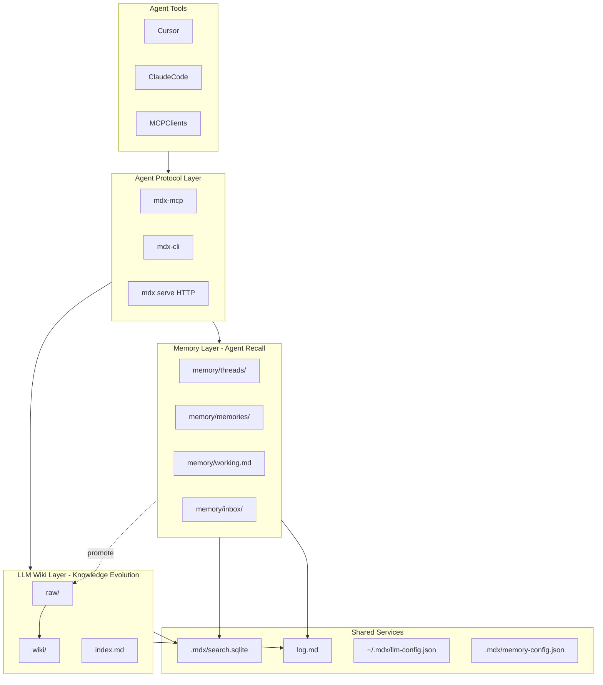

# MDX Memory 层与 LLM Wiki 并列架构设计文档

## 一、修订历史

| 版本号 | 修订内容 | 修订时间 | 修订人 |
|---|---|---|---|
| V1.0.0 | 新建初稿：Memory 与 LLM Wiki 并列架构、目录模型、模块边界、分阶段范围 | 2026-06-12 | Codex |

## 二、需求信息

### 2.1 需求背景

- 背景：MDX 当前已是「本地优先 LLM Wiki Markdown 工作区」（见 `AGENT.md` 与 `docs/loopx/design/MDX本地优先LLMWiki工作区需求设计文档.md`）。用户希望在不破坏 Karpathy Wiki 准则的前提下，补齐 **Agent Memory** 能力：跨会话 recall、完整对话存档、Working Memory、MCP 接入。
- 需求目的：新增与 LLM Wiki **并列** 的 Memory 层，而不是把 Memory 做成 LLM Wiki 的子功能；Memory 负责 **快、面向 Agent 的 recall**；LLM Wiki 继续负责 **慢、面向长期知识的演化**。
- 目标用户/使用方：
  - 同时使用 Cursor / Claude Code / 其他 MCP Agent 的开发者与知识工作者；
  - 需要在本地文件夹中 **可读、可 git、可审计** 地保存 AI 对话与决策的用户；
  - 已有 LLM Wiki 工作区、希望把高价值 thread 提升为 wiki 页面的用户。
- 需求链接：本轮架构澄清对话（Memory 不应集成进 `llm_wiki` 模块内部）。
- 关联原始材料：
  - [AGENT.md](/Users/zhangyukun/project/mdx/AGENT.md)
  - [docs/loopx/specs/llm-wiki.md](/Users/zhangyukun/project/mdx/docs/loopx/specs/llm-wiki.md)
  - [docs/loopx/design/MDX本地优先LLMWiki工作区需求设计文档.md](/Users/zhangyukun/project/mdx/docs/loopx/design/MDX本地优先LLMWiki工作区需求设计文档.md)
  - [docs/loopx/design/MDX CLI LLM Wiki查询检索能力需求设计文档.md](/Users/zhangyukun/project/mdx/docs/loopx/design/MDX CLI LLM Wiki查询检索能力需求设计文档.md)
  - 竞品参考：Nowledge Mem（Thread + Memory 双层、MCP、本地优先）

### 2.2 需求范围

#### 2.2.1 总体架构原则

1. **Memory 与 LLM Wiki 是并列产品层**，共享 workspace、路径安全、审计、LLM 配置、可选搜索索引，但 **查询契约、写入路径、生命周期各自独立**。
2. **Markdown 文件是 source of truth**；`.mdx/search.sqlite` 等索引是 **可删除、可重建的投影**。
3. **Thread（完整对话）与 Memory（原子记忆）分离**，对齐 Nowledge Mem 的双层模型，但数据形态以 Markdown 为主。
4. **LLM Wiki 的 query 边界不变**：`llm-wiki query` 仍不读取 query-time raw/thread 全文；Memory recall 走独立 API。
5. **跨层提升是显式动作**：thread → wiki 通过 `memory promote`，不是每次聊天自动 ingest。

#### 2.2.2 分阶段范围

| 阶段 | 名称 | 范围摘要 |
|---|---|---|
| Phase 1 | Memory 基础层 | 目录初始化、`memory/threads`、`memory/memories`、`memory/working.md`、CRUD、CLI、审计 |
| Phase 2 | 检索增强 | `.mdx/search.sqlite` FTS5、可选向量、hybrid recall |
| Phase 3 | Agent 协议 | `mdx serve` daemon、MCP server、Context Bundle |
| Phase 4 | 自动捕获 | Cursor / Claude Code transcript 适配、Smart Distill、inbox |
| Phase 5 | 可移植与多设备 | export/import bundle、git 同步指南、远程 API key |

**本期设计文档以 Phase 1 实施目标为准；Phase 2–3 保留架构草图，Phase 4–5 仅概要，待 Phase 3 验收后细化。**

#### 2.2.3 非目标

- 不做 Nowledge Mem 式内置图数据库；继续 wikilink + 静态 Mermaid（LLM Wiki 已有能力）。
- 不做复杂交互知识图谱 UI。
- 不做 web clipper（Phase 4 也不做浏览器扩展，仅本地 transcript）。
- 不做多模态 / 图片理解。
- 不做 Nowledge 式托管云同步；多设备第一版仅文档化 git 方案。
- 不修改 LLM Wiki 的 Karpathy 核心准则（raw 只 ingest 读、query 不读 raw）。
- 不把 Memory 条目默认写入 `wiki/` 目录。
- Phase 1 不做 embedding；Phase 2 才引入可选向量索引。
- 不验收 Windows/Linux（延续 MDX 当前 macOS MVP 策略，但 daemon/MCP 设计预留跨平台）。

#### 2.2.4 决策边界

| 决策 | 结论 |
|---|---|
| Memory 模块是否放在 `llm_wiki_*` 内 | **否**。独立 `memory_*` Rust 模块组 |
| 完整对话存哪 | `memory/threads/` |
| 原子记忆存哪 | `memory/memories/` |
| Working Memory 存哪 | `memory/working.md` |
| LLM Wiki 的 raw/wiki 是否改动 | **保留**；提升时仅复制到 `raw/promoted/` |
| CLI 命令命名 | `mdx-cli memory *` 与 `mdx-cli llm-wiki *` 并列 |
| Memory-only 工作区是否允许 | **允许**；`memory init` 不创建 wiki 结构 |
| `memory --root` 行为 | **仅 `memory *` 支持**；有 `--root` 时优先走 headless 直读写 |
| `memory promote --ingest` 在 wiki 未就绪时 | 返回 `llm_wiki_not_ready` |

### 2.3 可行性分析

- 业务可行性：MDX 已有 `mdx-cli`、LLM Wiki ingest/query、路径 guard、log 审计；Memory 层是增量模块，产品叙事清晰。
- 技术可行性：Thread/Memory 皆为 Markdown + frontmatter；可复用 `path_guard`、`llm_wiki_llm`（蒸馏）、`state_store` 模式。
- 关键风险：
  - Cursor/Claude transcript 格式变更（Phase 4）→ 适配器 + fixture
  - 自动蒸馏垃圾记忆 → inbox + 阈值 + 人工确认
  - daemon 与 GUI 双写 → workspace 级文件锁
  - Memory 与 LLM Wiki 边界被实现时揉在一起 → 本设计用模块与路径硬隔离

---

## 三、概要设计

### 3.1 方案总述

- 设计目标：让 MDX 成为 **「本地 LLM Wiki + Agent Memory」双引擎工作区**。
- 总体思路：
  - 新增 **Memory 层** 目录与 Rust 服务；
  - **LLM Wiki 层** 保持现有 `raw/` + `wiki/` 工作流；
  - 共享 **Search Index Service**（Phase 2）与 **Agent Protocol**（Phase 3）；
  - Thread 全文保存在 Memory 层；高价值内容 **显式 promote** 到 LLM Wiki。
- 与 Nowledge Mem 的差异：
  - MDX：**文件透明、git 友好、Karpathy wiki 演化**；
  - Nowledge Mem：**统一图数据库、自动捕获、跨工具 recall 产品化**。

### 3.2 整体架构设计



- 系统边界：
  - **Memory API**：`recall`、`thread_save`、`memory_add`、`working_get/set`
  - **LLM Wiki API**：`query`、`digest`、`ingest`、`lint`、`graph`（现有，不扩展读 thread）
  - **共享**：workspace root guard、log、LLM config、search index

### 3.3 工作区目录结构

初始化 Memory 层后，workspace 目录如下（可与已有 LLM Wiki 结构共存）：

```
workspace/
├── memory/                          # Memory 层（Agent 域）
│   ├── threads/                     # 完整对话；Phase 1 以 thread_id 全量快照替换
│   │   ├── cursor/
│   │   ├── claude-code/
│   │   ├── import/
│   │   └── manual/
│   ├── memories/                    # 原子记忆
│   ├── inbox/                       # 待确认记忆（Phase 4 自动蒸馏）
│   ├── working.md                   # 当前关注 / session 启动上下文
│   └── MEMORY.md                    # Memory 层规则（schema，类比 AGENTS.md）
├── raw/                             # LLM Wiki 一手素材（现有）
│   ├── notes/
│   ├── articles/
│   ├── promoted/                    # 从 thread 提升的副本（可选）
│   └── ...
├── wiki/                            # LLM Wiki 知识页（现有）
├── index.md                         # LLM Wiki 导航（现有）
├── log.md                           # 统一审计（扩展 memory 事件类型）
├── purpose.md
├── AGENTS.md                        # LLM Wiki 规则（现有）
├── llm-wiki-progress.md
└── .mdx/                            # 机器状态（新命名空间，与 .llm-wiki 并存）
    ├── memory-config.json
    ├── memory-progress.md           # 捕获/蒸馏队列（Phase 4）
    ├── search.sqlite                # Phase 2：FTS + 可选向量
    └── thread-index.json            # thread_id → 文件路径、hash（Phase 1 可先用 json）
```

**迁移说明：**

- 已有 `.llm-wiki/` **保留**，LLM Wiki cache/config 不搬家。
- 新 Memory 状态放 `.mdx/`，避免与 LLM Wiki 混淆。
- 初始化 Memory 层 **不要求** 工作区已是 LLM Wiki；两者可独立启用。

### 3.4 核心流程设计

| 流程 | 触发 | 参与模块 | 主流程 | 输出 |
|---|---|---|---|---|
| 初始化 Memory | 用户/CLI | `memory_fs`, initializer | 创建 `memory/`、`.mdx/`、模板 | Memory-ready 工作区 |
| 保存 Thread | Agent/CLI/捕获 | `memory_thread` | 校验 → 写 `memory/threads/` → 更新 thread-index → log | 完整对话文件 |
| 添加 Memory | Agent/CLI | `memory_store` | 校验 → 写 `memory/memories/` → 更新索引 → log | 原子记忆文件 |
| Recall | Agent/MCP/CLI | `memory_recall` | FTS/扫描 → 排序 → 预算截断 | context bundle |
| Smart Distill | 捕获后/手动 | `memory_distill`, `llm_wiki_llm` | 读 thread → LLM 提取 → inbox 或 memories | 0–N 条 memory |
| Promote to Wiki | 用户/CLI | `memory_promote`, `llm_wiki_ingest` | 复制 thread → `raw/promoted/` → 可选 ingest | wiki 页面 |
| LLM Wiki Query | 用户/CLI | `llm_wiki`（现有） | index 选页 + wiki 上下文 + LLM | 回答（不读 thread） |
| 索引重建 | 启动/手动 | `search_index` | 扫描 memory + wiki → sqlite | search.sqlite |

### 3.5 功能模块

| 模块 | 层级 | 职责 |
|---|---|---|
| `memory_fs.rs` | Memory | 路径 allowlist、初始化、原子写 |
| `memory_models.rs` | Memory | Thread/Memory/Working 结构体 |
| `memory_thread.rs` | Memory | Thread CRUD、dedup、版本 |
| `memory_store.rs` | Memory | Memory CRUD |
| `memory_working.rs` | Memory | working.md 读写 |
| `memory_recall.rs` | Memory | recall 检索与打分 |
| `memory_distill.rs` | Memory | thread → memory（Phase 4） |
| `memory_promote.rs` | Memory→Wiki | thread → raw → ingest |
| `memory_capture_*.rs` | Memory | 各 Agent transcript 适配（Phase 4） |
| `search_index.rs` | Shared | FTS/向量投影（Phase 2） |
| `memory_daemon.rs` | Protocol | headless serve（Phase 3） |
| `mdx_mcp` | Protocol | MCP stdio server（Phase 3） |
| `llm_wiki_*` | Wiki | **现有，不内嵌 memory 逻辑** |

---

## 四、详细设计

### 4.1 Memory 工作区识别与初始化

#### 4.1.1 识别规则

工作区满足以下路径即视为 **Memory-enabled**（可与 LLM Wiki 独立）：

- 必须：`memory/`、`memory/working.md`、`memory/MEMORY.md`、`.mdx/memory-config.json`
- 可选：`memory/threads/`、`memory/memories/`、`memory/inbox/`

检测 API：`memory_detect_workspace(root) -> MemoryWorkspaceStatus`

#### 4.1.2 初始化

- 入口：Phase 1 仅 `mdx-cli memory init` / `mdx-cli memory --root <workspace> init`；Memory 面板延后到 Phase 1.5
- 行为：只 **补缺**，不覆盖已有 Markdown
- 默认 `memory-config.json`：

```json
{
  "version": 1,
  "recall": {
    "defaultLimit": 10,
    "contextByteBudget": 65536
  },
  "distill": {
    "enabled": false,
    "minMessages": 4,
    "skipPatterns": ["^Running terminal command"]
  },
  "capture": {
    "enabled": false,
    "sources": []
  }
}
```

#### 4.1.3 `memory/MEMORY.md` 模板要点

- Thread 保存完整快照；Phase 1 同 `thread_id` + 新 `content_hash` 覆盖已索引快照路径，相同 hash 跳过
- Memory 有来源 thread 时必须记录 `source_thread`；手动添加且无来源 thread 时可为空
- Recall 默认不编造；不足则返回空
- 与 `AGENTS.md`（Wiki 规则）分工明确，互相引用

### 4.2 Thread 详细设计（完整对话存档）

#### 4.2.1 文件路径

```
memory/threads/{source}/{yyyy-mm-dd}-{thread_id}.md
```

- `source`：`cursor` | `claude-code` | `import` | `manual`
- `thread_id`：来源稳定 ID（如 Cursor session id）；若无则用 content hash 前 12 位

#### 4.2.2 Frontmatter Schema

```yaml
---
schema_version: 1
kind: thread
thread_id: "cursor:abc123"
source: cursor
title: "Implement auth middleware"
started_at: 2026-06-12T09:00:00Z
ended_at: 2026-06-12T10:30:00Z
message_count: 42
content_hash: "sha256:..."
model: "claude-sonnet-4"
workspace_root: "/Users/me/project/foo"
tags: [auth, mdx]
distilled: false
promoted_to_wiki: false
---
```

#### 4.2.3 正文格式

采用 **逐条消息** Markdown，便于人工阅读与 LLM 二次处理：

```markdown
## Message 1 — user — 2026-06-12T09:00:01Z

Implement JWT middleware for the API.

## Message 2 — assistant — 2026-06-12T09:00:15Z

...
```

#### 4.2.4 写入语义

| 操作 | 语义 |
|---|---|
| `thread save`（新） | 创建新文件 |
| `thread save`（同 thread_id） | **Phase 1 仅支持全量快照替换**：同 `thread_id` + 新 `content_hash` 覆盖同一路径文件；相同 hash 跳过 |
| `thread import` | 从外部 JSON/MD 导入到 `import/` |
| 删除 | 默认 **不物理删除**；frontmatter `archived: true` |

#### 4.2.5 幂等与 dedup

- `.mdx/thread-index.json` 维护 `thread_id → { path, content_hash, updated_at }`
- 相同 `thread_id` + 相同 `content_hash` → 跳过写入
- API 返回 `{ created | updated | skipped, path }`

**回答产品问题：本设计会像 Nowledge Mem 一样保存对话全部内容——是的，存在 `memory/threads/`，Phase 1 支持 CLI/API 写入，Phase 4 支持自动捕获。**

### 4.3 Memory 条目详细设计（原子记忆）

#### 4.3.1 文件路径

```
memory/memories/{yyyy-mm-dd}-{slug}.md
```

#### 4.3.2 Frontmatter Schema

```yaml
---
schema_version: 1
kind: memory
memory_id: "mem_20260612_auth_jwt"
title: "Auth uses JWT with 15m access token"
source_thread: "memory/threads/cursor/2026-06-12-abc123.md"
source_message_refs: [2, 5]
importance: 0.8
confidence: 0.9
tags: [auth, jwt]
created_at: 2026-06-12T10:35:00Z
evolves_from: "mem_20260501_auth_plan"
status: active   # active | inbox | archived
---
```

#### 4.3.3 正文

- 1–3 段简洁陈述 + 可选 bullet
- 必须可被 Agent 直接注入 prompt
- 允许 wikilink 指向 wiki 页：`[[wiki/concepts/jwt-auth|JWT Auth]]`（仅链接，不自动创建 wiki 页）

#### 4.3.4 CRUD API（Rust 内部）

```rust
memory_add(root, MemoryAddRequest) -> MemoryRecord
memory_update(root, memory_id, MemoryUpdateRequest) -> MemoryRecord
memory_archive(root, memory_id) -> ()
memory_get(root, memory_id) -> MemoryRecord
memory_list(root, MemoryListFilter) -> Vec<MemoryRecord>
```

### 4.4 Working Memory 详细设计

- 单文件：`memory/working.md`
- 结构建议：

```markdown
# Working Memory

## Updated
2026-06-12T08:00:00Z

## Focus
- Shipping MDX memory Phase 1
- Review auth middleware PR

## Open Questions
- ...

## Recent Decisions
- ...
```

- Agent session 启动时 **优先读取**（Context Bundle 第一部分）
- 更新方式：`memory working get|set|append`
- 变更写入 `log.md`（event: `memory_working_update`）

### 4.5 Recall 详细设计

#### 4.5.1 查询契约

```rust
memory_recall(root, RecallRequest {
  query: String,
  limit: usize,           // default 10
  byte_budget: usize,     // default 65536
  include_working: bool,  // default true
  include_threads: bool,  // default false — 全文 thread 默认不注入
  thread_ids: Vec<String>,
  tags: Vec<String>,
  since: Option<DateTime>,
}) -> RecallResult
```

#### 4.5.2 Phase 1 检索（无 sqlite）

1. 扫描 `memory/memories/*.md`
2. 子串匹配 title + body + tags
3. 按 `importance`、时间衰减、`since` 过滤排序
4. 读取 `working.md`（若启用）
5. 截断到 `byte_budget`
6. **不扫描** `memory/threads/` 正文（除非 `include_threads: true` 且 `thread_ids` 非空）

#### 4.5.3 Phase 2 检索（hybrid）

1. FTS5 BM25 on memories + wiki pages（可选）
2. 可选向量 top-k
3. RRF 融合
4. 仍遵守 byte budget

#### 4.5.4 与 LLM Wiki query 的边界

| 能力 | API | 读取范围 |
|---|---|---|
| Agent recall | `memory recall` | `memory/memories/` + `working.md` |
| 深度问答 | `llm-wiki query` | `index.md` + `wiki/**` |
| 需要 thread 原文 | `memory thread show` | 单个 thread 文件 |
| 跨层综合 | 先 recall，再按需 wiki query | 调用方编排 |

**禁止：** 在 `llm_wiki_context.rs` 中默认合并 thread 全文。

### 4.6 Promote to Wiki 详细设计

#### 4.6.1 命令

```bash
mdx-cli memory promote --thread <thread_id|path> [--ingest] [--title "..."]
```

#### 4.6.2 流程

1. 读取 source thread
2. 复制到 `raw/promoted/{date}-{slug}.md`（加 frontmatter 指向原 thread）
3. 更新 thread frontmatter `promoted_to_wiki: true`
4. 若 `--ingest`：LLM Wiki ready 时调用现有 `llm_wiki_ingest_raw_file_sync`；未初始化时返回 `llm_wiki_not_ready`，不得静默跳过 ingest
5. 写 `log.md`

#### 4.6.3 非目标

- 不自动 promote
- promote 不删除 thread

### 4.7 审计日志扩展

在现有 `log.md` 追加 Memory 事件，示例：

```markdown
## 2026-06-12T10:35:00Z — memory_add

- memory_id: mem_20260612_auth_jwt
- source_thread: memory/threads/cursor/2026-06-12-abc123.md

## 2026-06-12T10:40:00Z — thread_save

- thread_id: cursor:abc123
- path: memory/threads/cursor/2026-06-12-abc123.md
- result: updated
```

LLM Wiki 事件格式 **不变**。

### 4.8 CLI 协议设计（Phase 1–3）

#### 4.8.1 Phase 1 命令

```bash
mdx-cli memory init
mdx-cli memory status [--json]

mdx-cli memory thread save --source manual [--thread-id id] [--title t] [--file path|--stdin]
mdx-cli memory thread show <thread_id|path> [--json]
mdx-cli memory thread list [--source cursor] [--since 7d] [--json]

mdx-cli memory add --title t --body b [--tags a,b] [--source-thread path]
mdx-cli memory show <memory_id|path> [--json]
mdx-cli memory list [--tag t] [--since 7d] [--json]
mdx-cli memory search <query> [--limit N] [--json]
mdx-cli memory archive <memory_id>

mdx-cli memory working get [--json]
mdx-cli memory working set --file path
mdx-cli memory working append --section Focus --text "..."

mdx-cli memory recall <query> [--json] [--include-threads] [--thread-id id]...
mdx-cli memory promote --thread <id> [--ingest]
```

#### 4.8.2 Phase 1 运行时补充

- Workspace Mode + `~/.mdx/cli.sock` 可用时，`mdx-cli memory *` 默认针对当前活动 workspace root。
- `mdx-cli memory --root <workspace> ...` 直接调用 Rust Memory 服务，不依赖 GUI 或 socket。
- 当 `--root` 与 socket 同时可用时，**以 `--root` 为准**。
- `llm-wiki *` 仍保持既有 socket-only 行为，不在本期补 headless。

#### 4.8.3 Phase 3：`mdx serve`

```bash
mdx serve --workspace /path/to/ws [--port 14243] [--api-key mdx_...]
```

- 提供 HTTP：`/memory/*`、`/health`
- MCP 挂载于 `/mcp/` 或独立 stdio binary
- **不要求** Workspace Mode GUI 运行
- GUI 与 daemon 通过 **文件锁** 协调写操作

#### 4.8.4 `CliRequest` 扩展原则

- 新增 `Memory*` 变体于 `cli_protocol.rs`
- 与 `LlmWiki*` **平级**，不嵌套

### 4.9 MCP 工具设计（Phase 3）

| Tool | 说明 |
|---|---|
| `memory_recall` | 主 recall API |
| `memory_add` | 添加记忆 |
| `memory_working_get` | session 启动 |
| `memory_thread_save` | 保存/替换完整 thread 快照 |
| `memory_thread_show` | 读 thread 原文 |
| `memory_search` | 轻量搜索 |
| `wiki_query` | 薄包装 `llm-wiki query`（可选） |

**Context Bundle 建议顺序：**

1. `memory_working_get`
2. `memory_recall`（query=用户首条消息或项目名）
3. Agent 开始任务；结束时 `memory_add` + 可选 `memory_thread_save`

### 4.10 Search Index Service（Phase 2 概要）

#### 4.10.1 表结构

```sql
CREATE VIRTUAL TABLE fts_memories USING fts5(
  memory_id, title, body, tags, tokenize='unicode61'
);

CREATE TABLE embeddings (
  doc_id TEXT PRIMARY KEY,
  kind TEXT,  -- memory | wiki_page
  vector BLOB,
  updated_at INTEGER
);
```

#### 4.10.2 重建策略

- `mdx-cli memory index rebuild`
- Memory/Wiki 写入成功后 **异步增量更新**
- 删除 sqlite 不影响数据完整性

### 4.11 自动捕获（Phase 4 概要）

| 来源 | 适配器 | 输出 |
|---|---|---|
| Cursor | `memory_capture_cursor.rs` | 读本地 transcript 路径 |
| Claude Code | `memory_capture_claude_code.rs` | Stop hook / 导出 |
| 手动 | `thread import` | 已有 |

- 捕获 → `thread save` → 可选 `distill` → `inbox/` 或 `memories/`
- 配置：`memory-config.json` 的 `capture`、`distill`

### 4.12 前端设计（Phase 1.5 以后）

- Memory UI 面板不是 Phase 1 验收项。
- Phase 1 只交付 Rust 服务、CLI、审计和文档契约。

### 4.13 Rust 模块与文件规划

```
src-tauri/src/
├── memory_fs.rs
├── memory_models.rs
├── memory_thread.rs
├── memory_store.rs
├── memory_working.rs
├── memory_recall.rs
├── memory_promote.rs
├── memory_distill.rs          # Phase 4
├── memory_capture_cursor.rs   # Phase 4
├── memory_capture_claude_code.rs
├── search_index.rs            # Phase 2
├── memory_daemon.rs           # Phase 3
├── bin/mdx_mcp.rs             # Phase 3
├── cli_protocol.rs            # 扩展 Memory* 请求
├── cli_server.rs              # 扩展 dispatch
└── llm_wiki_*.rs              # 不新增 memory 依赖；promote 单向调用 ingest
```

**依赖规则：**

- `memory_*` **不得** import `llm_wiki_context`
- `llm_wiki_*` **不得** import `memory_recall`
- `memory_promote` 可调用 `llm_wiki_ingest`
- `search_index` 可被两者调用

---

## 五、分阶段验收标准

### Phase 1

- [ ] `memory init` 创建约定目录与模板
- [ ] CLI 可 thread save / memory add / recall / working get|set
- [ ] Thread 全文可在 Finder 中打开阅读
- [ ] 相同 thread_id + hash dedup 生效
- [ ] `log.md` 记录 memory 事件
- [ ] 未启用 Memory 时 LLM Wiki 行为不变
- [ ] Rust 单测覆盖 path guard、dedup、recall 排序

### Phase 2

- [ ] FTS 检索优于纯子串（fixture 10 条）
- [ ] `index rebuild` 可恢复检索
- [ ] recall 延迟 P95 < 200ms（500 memories fixture）

### Phase 3

- [ ] `mdx serve` 无 GUI 可 recall + add
- [ ] Cursor MCP 配置后可 session recall
- [ ] Context Bundle 文档与 smoke test 通过

### Phase 4

- [ ] Cursor session 结束自动 thread save
- [ ] distill 产生 inbox 或 memories
- [ ] promote + ingest 生成 wiki 页面

---

## 六、测试策略

| 类型 | 内容 |
|---|---|
| Rust unit | frontmatter 解析、path allowlist、dedup、recall rank |
| Integration | 临时 workspace fixture + CLI 命令 golden |
| Contract | `docs/loopx/specs/memory.md` 与实现一致 |
| Regression | 全量 `llm_wiki_tests.rs` 无回归 |

---

## 七、风险与缓解

| 风险 | 缓解 |
|---|---|
| Memory/Wiki 边界被实现揉合 | CODEOWNERS 规则 + 模块 import lint + 本设计 4.5.4 |
| Thread 文件过大 | Phase 1 仍保存完整快照；单文件上限 configurable，后续阶段再评估分片或压缩策略 |
| daemon/GUI 写冲突 | workspace file lock + 写队列 |
| 自动蒸馏噪声 | inbox + importance 阈值 + 默认关闭 distill |

---

## 八、后续文档

- 契约细则：[docs/loopx/specs/memory.md](/Users/zhangyukun/project/mdx/docs/loopx/specs/memory.md)
- 实施计划：Phase 1 已输出 `docs/loopx/plans/2026-06-12-memory-phase-one.md`
