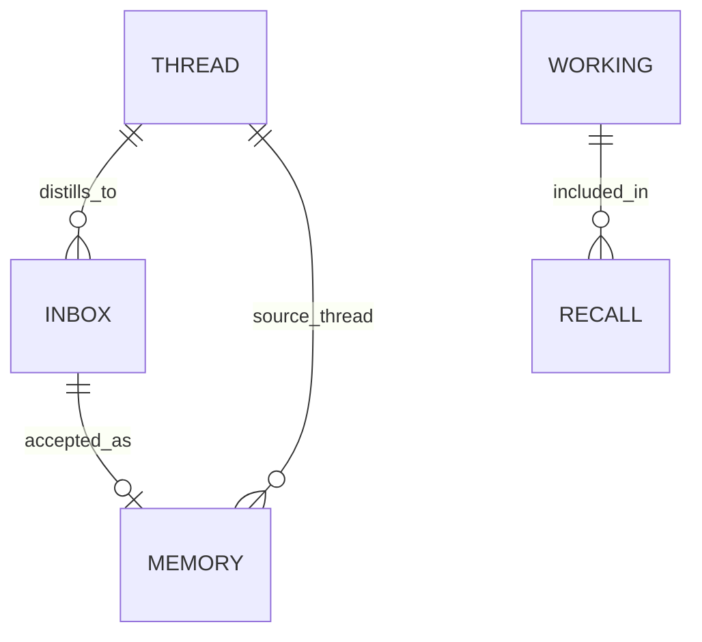

# MDX会话中自动Memory提取设计文档

## 一、修订历史

| 版本号 | 修订内容 | 修订时间 | 修订人 |
|---|---|---|---|
| V1.0.0 | 新建初稿，明确“会话过程中由 Agent 主动提取 Memory”的产品与技术方案 | 2026-06-14 | Codex |

## 二、需求信息

### 2.1 需求背景

- 背景：
  - 当前 MDX Memory 已具备 `memory_add`、`memory_recall`、`memory_distill`、`memory_thread_save`、`memory_inbox_accept` 等 MCP/CLI 能力。
  - 当前 Claude/Cursor 可通过 pre-compact hook 在压缩前尝试捕获并提炼；Codex 目前没有已验证的 lifecycle hook 暴露稳定 `transcript_path`。
  - 现有 `.mdx/memory-config.json` 包含 `capture.enabled`、`distill.enabled`、`distill.auto_accept` 等字段，但代码侧尚未把这些配置接成“会话中自动提取”的稳定 Agent 行为。
- 需求目的：
  - 让 Memory 提取成为 Agent 正常对话流程的一部分，而不是依赖用户手动运行 `capture scan --distill`、后台服务或显式 distill 命令。
  - Agent 在会话中主动识别并保存长期偏好、项目决策、稳定事实、可复用经验。
- 目标用户/使用方：
  - 使用 MDX Memory 的用户。
  - Codex、Claude、Cursor 等接入 MDX MCP 的 Agent。
- 需求链接：
  - 无外部链接；来自本次会话澄清。
- 关联原始材料：
  - 用户明确表达：“我期望在会话的过程中会自动做这些操作，而不是需要我后台再调用别的服务做 memory 提取。”
  - Repo 证据：
    - `src-tauri/src/bin/mdx_mcp.rs` 已暴露 `memory_recall`、`memory_working_get`、`memory_add`、`memory_distill` 等工具。
    - `src-tauri/src/memory_models.rs` 与 `src-tauri/src/memory.rs` 已定义 `MemoryConfig` 默认值，其中 `distill.enabled=false`、`capture.enabled=false`。
    - `src-tauri/src/memory_agent_setup.rs` 的 skill 文案说明 Claude/Cursor pre-compact hook 可捕获，Codex 仍依赖显式 MCP/CLI。
    - `docs/loopx/design/MDX Memory完整能力设计文档.md` 已描述 Smart Distill 与 Capture Adapter，但当前实现尚未覆盖“Agent 会话中主动提取”的行为契约。

### 2.2 需求范围

- 本期范围：
  - 定义 Agent 在会话开始、会话过程中、会话结束/压缩前的 Memory 读写行为。
  - 调整 MDX Memory skill / agent setup 生成内容，让 Agent 明确“主动提取”是默认工作流。
  - 增加轻量的“提取候选判定规则”和去重策略，优先使用 `memory_add` 写入稳定 Memory。
  - 保留 `memory_distill` 作为批处理/历史 thread 的补充，不作为日常自动提取的唯一入口。
  - 明确安全边界：不自动保存 secrets、凭据、未确认的敏感个人信息。
- 非目标：
  - 不要求本期实现后台 daemon 自动轮询 Codex sessions。
  - 不要求依赖 Codex pre-compact hook；如果未来 Codex 提供稳定 hook，可作为增强入口。
  - 不把所有 thread 自动转为 memory；thread 归档是 provenance，不等同于长期记忆。
  - 不改变 LLM Wiki promote 流程。
- 决策边界：
  - Agent 可直接保存明确稳定、低风险的偏好和项目决策。
  - 对敏感、含糊、可能有争议的内容，Agent 必须先询问或放入最终答复中的“建议保存”。
  - 是否直接写 `memories/` 或先写 `inbox/` 由配置和风险等级决定。
- 依赖方：
  - MDX MCP server。
  - MDX Memory CLI/后端。
  - Agent skill 注入系统。
  - 可选：LLM provider，用于历史 thread distill。
- 约束条件：
  - 本地优先，不默认上传完整会话到外部服务。
  - Agent 提取应低打扰、可审计、可回滚。
  - 不依赖后台服务才能完成核心体验。

### 2.3 可行性分析

- 业务可行性：
  - 用户已经明确希望“会话中自动提取”，该能力直接提升 Memory 的可用性和信任感。
- 技术可行性：
  - MCP 已有 `memory_add`、`memory_recall`、`memory_working_get` 工具，Agent 可在会话中直接调用。
  - 现有 store、index、frontmatter、recall 机制可复用。
- 团队接受能力：
  - 主要改动集中在 agent skill、MCP 工具描述、配置解释、少量后端/测试增强，复杂度低于实现完整 daemon。
- 时间成本：
  - 中等。核心行为可先通过 skill/contract 落地，再逐步增强 UI/配置。
- 资源成本：
  - 无新增常驻服务要求；自动提取默认使用 Agent 对话上下文，不额外调用 distill LLM。
- 替代方案：
  - 仅做后台 capture+distill：不满足“不需要后台再调用别的服务”的核心诉求。
  - 仅依赖 pre-compact hook：Codex 无稳定 hook，且会错过会话中已确认的决策。
- 关键风险：
  - 自动保存噪声污染 memories。
  - 保存敏感信息。
  - Agent 忘记执行提取契约。
  - 不同 Agent 的行为不一致。

## 三、概要设计

### 3.1 方案总述

- 设计目标：
  - 将 Memory 从“用户显式命令”升级为“Agent 会话内的默认能力”。
  - Agent 对稳定信息主动 `memory_add`，对不确定信息询问确认或写入 inbox。
  - 历史 thread distill 与后台 capture 作为补充，不阻断核心体验。
- 总体思路：
  - 建立三层机制：
    1. 会话开始：自动 recall，加载相关上下文。
    2. 会话中：事件驱动的主动提取，直接写 memory 或提出保存建议。
    3. 会话结束/压缩前：总结本轮可复用结论，补充保存。
  - 修改 Agent skill 与 MCP tool descriptions，使 Agent 明确必须执行该契约。
  - 后端保持幂等和审计，防止重复保存。
- 核心模块：
  - Agent Memory Policy。
  - MDX Memory Skill / Agent Setup。
  - MCP 工具层。
  - Memory Store / Search Index。
  - 可选 Inbox Review。
- 主要难点：
  - 噪声与遗漏之间的平衡。
  - 自动保存与用户确认的边界。
  - 跨 Agent 行为一致性。
- 技术指标：
  - 明确稳定偏好/决策在同一会话内保存成功。
  - 对重复内容不产生大量重复 memory。
  - 不保存 secrets 和明显短期命令。
  - recall 默认可检索到新保存的 memory。

### 3.2 整体架构设计

- 业务模式：
  - Agent 是 Memory 提取的第一执行者。
  - MDX Memory 后端负责存储、去重、检索、审计。
- 系统边界：
  - 本方案处理 MDX Memory 内部和 Agent 接入规范。
  - 不处理 LLM Wiki promote、外部云同步、跨设备冲突。
- 上下游系统：
  - 上游：用户对话、Agent runtime、可选 Codex/Cursor/Claude transcript。
  - 下游：`memory/memories/`、`memory/inbox/`、`.mdx/search.sqlite`、`memory/threads/`。
- 应用架构：
  - Agent skill 负责行为约束。
  - MCP server 暴露能力。
  - Tauri/Rust Memory 后端执行写入、索引、检索。
- 技术架构：
  - 不新增必需后台进程。
  - 可选新增配置控制 agent-time extraction。
  - 保持现有 Markdown + frontmatter 存储。
- 数据流转：
  - 用户对话事件 -> Agent 判断候选 -> `memory_add` / `memory_inbox_add` -> memory markdown -> search index -> 后续 `memory_recall`。

### 3.3 核心流程设计

| 流程 | 触发条件 | 参与系统/模块 | 主流程 | 异常/补偿 | 输出 |
|---|---|---|---|---|---|
| 会话开始 Recall | Agent 开始实质任务 | Agent skill、MCP、memory_recall | 读取 working；按任务 query recall；合并到当前上下文 | MCP 不可用时记录降级并继续 | 当前任务上下文 |
| 会话中主动保存 | 用户确认长期偏好/决策/约定 | Agent policy、memory_add | 判断是否稳定；生成独立 body；调用 memory_add；继续工作 | 保存失败时在最终答复说明 | active memory |
| 会话中待确认保存 | 信息可能敏感/含糊/争议 | Agent policy、用户 | Agent 简短询问是否保存，或最终列出建议 | 用户拒绝则不保存 | 用户确认后 memory |
| 会话结束总结保存 | 完成较大任务、发生方向变化、形成经验 | Agent policy、memory_add | 提取本轮 durable lessons；保存 0-N 条 | 无候选则不写 | active memory |
| 历史 thread distill | 用户显式要求或批处理 | memory_distill、LLM provider | 读取 thread；LLM 提取；写 inbox/memory | LLM 不可用则返回错误，不影响 thread | inbox/memories |

### 3.4 功能模块

| 模块 | 职责 | 关键功能 | 依赖 | 备注 |
|---|---|---|---|---|
| Agent Memory Policy | 定义 Agent 何时读写 Memory | 候选判定、安全边界、去重前查询 | Skill/MCP | 核心新增设计 |
| MDX Memory Skill | 注入 Agent 行为规范 | 启动 recall、会话中主动保存、结束保存 | agent setup | 需要更新文案 |
| MCP Tool Descriptors | 暴露工具语义 | 强化 `memory_add`、`memory_recall` 描述 | mdx_mcp | 让工具选择更稳定 |
| Memory Store | 保存 active memory | frontmatter、body、index | memory_store | 复用现有 |
| Inbox | 保存待审核候选 | add/list/accept/reject | memory_inbox | 可选路径 |
| Distill | 历史 thread 批处理 | LLM JSON 提取 | llm config | 非核心入口 |

### 3.5 新增/调整功能说明

- Agent 侧：
  - 开始任务时默认执行 recall。
  - 会话中遇到 durable signal 时主动保存。
  - 保存前可用 `memory_search` 做轻量去重。
  - 保存后无需打断用户，只在必要时简短说明。
- 后端侧：
  - 本期可复用 `memory_add`，不强制新增接口。
  - 可增强 memory_add 返回 duplicate/similar warning，但不是本 spec 的硬依赖。
- UI/配置侧：
  - 可新增设置项说明“Agent 会话中主动提取 Memory”。
  - 不把后台 capture 作为必需步骤。

## 四、详细设计

### 4.1 Agent Memory Policy 详细设计

#### 4.1.1 需求内容

- 入口：
  - Agent 正常对话循环。
  - Agent 完成任务前。
  - Agent 处理用户“以后记得/保存/沉淀”类表达时。
- 操作人/调用方：
  - Agent。
- 前置条件：
  - 当前 workspace 已初始化 Memory。
  - MCP 或 CLI 可访问。
- 输出结果：
  - 0-N 条 active memory。
  - 必要时给用户一个确认问题。

#### 4.1.2 方案设计

- 核心逻辑：
  - 将对话中的信息分为四类：
    1. 必存：明确长期偏好、明确项目决策、用户要求记住。
    2. 可存但需确认：个人敏感信息、第三方私密信息、模糊偏好。
    3. 不存：一次性命令、运行日志、临时路径、凭据/API key。
    4. 延后总结：较长任务中的经验，任务完成时统一判断。
  - 对必存项直接调用 `memory_add`。
  - 对需确认项询问用户或放入最终答复建议。
- 状态流转：
  - observed -> candidate -> saved | needs_confirmation | rejected。
- 数据变更：
  - 写入 `memory/memories/*.md`。
  - 触发现有 search index 更新或标记 dirty。
- 计算公式：
  - importance 建议：
    - 用户偏好：0.8-0.95。
    - 架构决策：0.75-0.95。
    - 临时项目状态：0.5-0.7。
  - confidence 建议：
    - 用户明确表达：0.9-1.0。
    - Agent 推断：不得直接保存，需确认。
- 幂等设计：
  - 保存前按 title/body keywords 调用 `memory_search`。
  - 若已有同义 active memory，优先不新增；需要演化时后续设计 memory update/evolves_from。
- 权限/越权控制：
  - Agent 只能写当前 configured workspace。
  - 不保存 secrets、token、私钥、账号密码。
- 异常处理：
  - `memory_add` 失败时不重试多次；在最终答复说明保存失败。
- 补偿/重试：
  - 用户可重新要求“记住”触发再次保存。
- 日志与审计：
  - 复用 memory_add 审计日志。

#### 4.1.3 流程步骤

1. Agent 接收用户消息。
2. 判断是否包含 durable signal。
3. 若是明确可保存内容，构造 title/body/tags。
4. 可选搜索相似 memory。
5. 调用 `memory_add`。
6. 若保存失败，在最终答复中报告。
7. 若内容敏感或不确定，先询问用户。

#### 4.1.4 边界条件

| 场景 | 处理方式 | 用户/调用方感知 | 监控/告警 |
|---|---|---|---|
| 用户明确说“记住” | 直接 `memory_add` | 可简短说明已保存 | memory log |
| 用户表达长期偏好但未说记住 | 低风险则保存；敏感则询问 | 通常无打断 | memory log |
| API key、token、密码 | 禁止保存 | 提醒不保存敏感信息 | warn log 可选 |
| 一次性命令或调试输出 | 不保存 | 无 | 无 |
| MCP 不可用 | 继续任务，最终说明 Memory 保存失败 | 看到降级说明 | stderr/log |

### 4.2 会话开始 Recall 详细设计

#### 4.2.1 需求内容

- 入口：
  - 新任务开始。
  - 用户提到历史上下文、偏好、项目约定。
- 操作人/调用方：
  - Agent。
- 前置条件：
  - MCP 可用或 CLI fallback 可用。
- 输出结果：
  - 当前任务相关 working memory 和 recalled memories。

#### 4.2.2 方案设计

- 核心逻辑：
  - 先调用 `memory_working_get`。
  - 再用任务 query 调用 `memory_recall`。
  - 只使用与当前任务相关的条目；显式用户指令优先。
- 状态流转：
  - no_context -> recalled -> applied。
- 数据变更：
  - 无写入。
- 幂等设计：
  - 同一任务不需要每轮重复 recall；可在任务切换或明显新主题时再次 recall。
- 权限/越权控制：
  - 只读取当前 workspace Memory。
- 异常处理：
  - recall 失败时继续任务，不阻断。
- 补偿/重试：
  - 用户要求“查 memory”时可重试。
- 日志与审计：
  - 读操作可不写审计；如已有日志策略则沿用。

#### 4.2.3 流程步骤

1. Agent 判断任务是否需要上下文。
2. 调用 `memory_working_get`。
3. 构造 query 调用 `memory_recall`。
4. 将结果压缩为当前任务可用事实。
5. 执行用户任务。

#### 4.2.4 边界条件

| 场景 | 处理方式 | 用户/调用方感知 | 监控/告警 |
|---|---|---|---|
| recall 返回大量结果 | 按 byte budget 和相关性筛选 | 无 | 无 |
| memory 与当前用户指令冲突 | 当前用户指令优先 | 必要时说明 | 无 |
| working.md 为空 | 继续 recall/search | 无 | 无 |

### 4.3 会话结束/压缩前提取详细设计

#### 4.3.1 需求内容

- 入口：
  - Agent 准备 final。
  - 长任务结束。
  - 上下文压缩前 hook 可用时。
- 操作人/调用方：
  - Agent 或 hook。
- 前置条件：
  - 当前会话中形成可复用结论。
- 输出结果：
  - 0-N 条 memory。

#### 4.3.2 方案设计

- 核心逻辑：
  - Agent 在 final 前检查本轮是否产生：
    - 新用户偏好。
    - 已确认架构/产品决策。
    - 项目工作流约定。
    - 未来会复用的排障结论。
  - 若有，调用 `memory_add`。
  - hook 仅作为补充，不作为核心依赖。
- 状态流转：
  - session_delta -> durable_candidate -> saved/skipped。
- 数据变更：
  - active memory 或 inbox。
- 幂等设计：
  - 按本轮内容生成短标题，保存前搜索类似 memory。
- 权限/越权控制：
  - 同 4.1。
- 异常处理：
  - 保存失败不影响 final，但必须告知。
- 补偿/重试：
  - 用户可要求重新保存。
- 日志与审计：
  - 复用 memory_add。

#### 4.3.3 流程步骤

1. Agent 完成用户任务。
2. 检查是否有 durable candidate。
3. 去重。
4. 写入 memory。
5. 输出 final。

#### 4.3.4 边界条件

| 场景 | 处理方式 | 用户/调用方感知 | 监控/告警 |
|---|---|---|---|
| 没有长期信息 | 不写 | 无 | 无 |
| 有多个候选 | 分成多条 atomic memory | 可简短说明 | memory log |
| 用户要求不要保存 | 不写并遵守 | 无 | 无 |

### 4.4 Thread Distill 补充路径详细设计

#### 4.4.1 需求内容

- 入口：
  - 用户要求从历史 thread 批量提取。
  - UI 手动 distill。
  - 可选 capture import 后自动 distill。
- 操作人/调用方：
  - 用户、Agent、批处理。
- 前置条件：
  - thread 存在。
  - LLM provider 配置可用。
- 输出结果：
  - inbox candidates 或 active memories。

#### 4.4.2 方案设计

- 核心逻辑：
  - 继续复用 `memory_distill`。
  - `distill.enabled` 只控制自动/批处理路径，不影响 Agent 直接 `memory_add`。
  - 本路径用于历史补录，不作为会话内自动提取的必需依赖。
- 状态流转：
  - imported thread -> distilled candidates -> inbox/active memory。
- 数据变更：
  - inbox/memories。
- 幂等设计：
  - 复用现有 `distill_run_id` 逻辑。
- 权限/越权控制：
  - LLM 输出只作为候选，不信任其 source path。
- 异常处理：
  - LLM unavailable 返回错误，不影响 thread 保存。
- 补偿/重试：
  - `--force` 可重跑。
- 日志与审计：
  - 复用 distill 日志。

#### 4.4.3 流程步骤

1. 读取 thread。
2. 调 LLM distill。
3. 解析 JSON。
4. 写 inbox 或 memories。
5. 返回结果。

#### 4.4.4 边界条件

| 场景 | 处理方式 | 用户/调用方感知 | 监控/告警 |
|---|---|---|---|
| LLM 未配置 | 不执行，返回 distill_unavailable | 明确错误 | warn log |
| thread 太长 | 后续支持 chunk；本期保持现状 | 可能失败 | warn log |
| 候选置信度低 | 默认进 inbox | 用户可审核 | 无 |

## 五、存储类设计

### 5.1 库表设计

#### 5.1.1 数据库模型图



#### 5.1.2 表结构

本系统使用 Markdown 文件与 frontmatter 作为主存储，SQLite search index 是可重建投影。

| 表名 | 用途 | 主键 | 关键索引 | 数据量预估 | 备注 |
|---|---|---|---|---|---|
| `memory/memories/*.md` | active durable memory | `memory_id` | search index | 千级到万级 | 本方案核心写入目标 |
| `memory/inbox/*.md` | 待审核候选 | `inbox_id` | status/source_thread | 千级 | 可选路径 |
| `memory/threads/*/*.md` | 原始会话材料 | `thread_id` | `.mdx/thread-index.json` | 千级到万级 | provenance，不是默认提取入口 |
| `memory/working.md` | 当前工作上下文 | 文件路径 | 无 | 单文件 | recall 默认上下文 |
| `.mdx/search.sqlite` | 检索投影 | internal row id | FTS/token index | 可重建 | 非权威存储 |

字段明细：

| 字段 | 类型 | 是否必填 | 默认值 | 含义 | 来源/取值逻辑 | 备注 |
|---|---|---|---|---|---|---|
| `memory_id` | string | 是 | path-derived | Memory 唯一 ID | memory_add | 现有 |
| `title` | string | 是 | 无 | 简短标题 | Agent 生成 | 应可独立理解 |
| `body` | markdown | 是 | 无 | 长期记忆正文 | Agent 生成 | 独立、上下文充足 |
| `tags` | string[] | 否 | [] | 分类 | Agent 生成 | 建议含 preference/decision/workflow |
| `importance` | number | 否 | 0.5 | 重要性 | Agent 或默认 | 后续可增强 |
| `confidence` | number | 否 | 0.5 | 置信度 | Agent 或默认 | 明确用户表达应较高 |
| `source_thread` | string | 否 | null | 来源 thread | 有 provenance 时填写 | 会话中直接保存可为空 |
| `source_message_refs` | string[] | 否 | [] | 来源消息引用 | 有 thread message 编号时填写 | 会话中直接保存可为空 |

### 5.2 数据迁移/初始化

- DDL：
  - 不涉及新增数据库表。
- DML：
  - 不需要批量迁移。
- 数据回填：
  - 历史 thread 可通过现有 `memory_distill` 批量补录，但不是本期必要上线条件。
- 老数据兼容：
  - 现有 memories、inbox、threads 保持兼容。
- 新老系统读写关系：
  - 新 Agent 行为写入同一 `memory/memories/`，旧 recall/search 不变。

### 5.3 缓存设计

| 场景 | Key | Value | 数据结构 | 过期时长 | 容量预估 | 失效/刷新策略 |
|---|---|---|---|---|---|---|
| 相似 memory 去重 | query text | search result | 内存临时变量 | 单次会话 | 小 | 每次保存前重新查询 |
| recall 结果 | task query | recalled memories | Agent 上下文 | 单任务 | 小 | 任务切换失效 |

## 六、其他组件设计

### 6.1 消息设计

不涉及消息队列。若后续实现后台 worker，可增加本地队列；本期核心不依赖。

| 场景 | Group | Topic | 生产者 | 消费者 | 幂等键 | 失败补偿 |
|---|---|---|---|---|---|---|
| 不涉及 | 无 | 无 | 无 | 无 | 无 | 无 |

### 6.2 配置设计

| 配置项 | 环境 | 默认值 | 是否动态生效 | 说明 | 风险 |
|---|---|---|---|---|---|
| `agent_memory.enabled` | workspace | true | 是 | Agent 会话中是否主动提取 Memory | 关闭后回到显式操作 |
| `agent_memory.write_mode` | workspace | `direct_safe` | 是 | `direct_safe` 低风险直写，高风险确认；`inbox_first` 全部进 inbox；`off` 禁用 | 直写可能有噪声 |
| `agent_memory.confirm_sensitive` | workspace | true | 是 | 敏感/私密信息保存前确认 | 过严会多打扰 |
| `agent_memory.dedupe_search` | workspace | true | 是 | 保存前搜索相似 memory | 增加一次工具调用 |
| `agent_memory.max_writes_per_turn` | workspace | 3 | 是 | 单轮最多自动写入条数 | 太低可能遗漏 |
| `distill.enabled` | workspace | false | 是 | 历史 thread/批处理自动 distill | LLM 成本 |
| `distill.auto_accept` | workspace | false | 是 | distill 高置信结果直接 active | 噪声风险 |
| `capture.enabled` | workspace | false | 是 | 后台/批处理 capture | 隐私与 IO |

说明：

- `agent_memory.*` 是本方案建议新增配置；如为降低实现成本，也可先不落配置，仅通过 skill 默认启用。
- `distill.enabled` 与 `capture.enabled` 不应控制 Agent 会话中直接 `memory_add`。

### 6.3 定时任务/批处理

| 任务 | 触发时间 | 处理范围 | 幂等 | 失败重试 | 影响评估 |
|---|---|---|---|---|---|
| 会话中 Memory 提取 | Agent 对话循环 | 当前会话增量 | memory_search 去重 | 不自动重试，最终说明 | 低 |
| 会话结束 Memory 总结 | Agent final 前 | 当前任务增量 | memory_search 去重 | 不自动重试 | 低 |
| 历史 thread distill | 用户显式/可选批处理 | selected threads | distill_run_id | `--force` | 中，依赖 LLM |

### 6.4 技术组件

- 分布式锁：
  - 复用现有 workspace memory lock。
- 唯一 ID：
  - 复用 memory path-derived id。
- 加解密/验签：
  - 不新增；敏感信息默认不保存。
- 字典转换：
  - 复用 serde snake_case。
- Excel/文件处理：
  - 不涉及。
- 用户信息透传：
  - Agent 只使用当前 workspace，不能跨 workspace 写入。
- 限流/熔断：
  - `max_writes_per_turn` 防止异常循环写入。

## 七、接口设计

### 7.1 接口设计原则

- 会话中自动提取优先复用现有 MCP 工具，减少后端接口膨胀。
- 非纯查询接口必须具备幂等或去重策略。
- 自动写入必须能审计，失败必须能对用户说明。
- Agent-facing 文档比纯后端 API 更关键，因为触发方是 Agent。

### 7.2 接口清单

| 接口 | 调用方 | 服务方 | 权限/认证 | 幂等 | 文档地址 | 备注 |
|---|---|---|---|---|---|---|
| `memory_working_get` | Agent | MDX MCP | 当前 workspace | 查询 | `src-tauri/src/bin/mdx_mcp.rs` | 会话开始读取 |
| `memory_recall` | Agent | MDX MCP | 当前 workspace | 查询 | `src-tauri/src/bin/mdx_mcp.rs` | 会话开始/任务切换 |
| `memory_search` | Agent | MDX MCP | 当前 workspace | 查询 | `src-tauri/src/bin/mdx_mcp.rs` | 保存前去重 |
| `memory_add` | Agent | MDX MCP | 当前 workspace | path/id 去重，建议增强相似去重 | `src-tauri/src/bin/mdx_mcp.rs` | 主写入接口 |
| `memory_inbox_add` | Agent/后端 | Memory 后端 | 当前 workspace | inbox_id/run_id | `src-tauri/src/memory_inbox.rs` | MCP 当前未暴露，可选新增 |
| `memory_distill` | Agent/用户 | MDX MCP | 当前 workspace + LLM config | distill_run_id | `src-tauri/src/bin/mdx_mcp.rs` | 历史 thread 补充 |

### 7.3 接口明细

#### 7.3.1 `memory_add`

- 路径/方法：
  - MCP tool: `memory_add`。
  - CLI fallback: `mdx-cli memory add`。
- 请求头：
  - 不涉及。
- 请求参数：
  - `title`: 必填，简短标题。
  - `body`: 必填，独立可读正文。
  - `tags`: 必填数组，可为空。
  - `importance`: 可选。
  - `confidence`: 可选。
  - `source_thread`: 可选。
  - `source_message_refs`: 可选。
- 响应参数：
  - MemoryRecord。
- 错误码：
  - 沿用现有 `WorkspaceError`。
- 业务校验：
  - title/body 不为空。
  - 禁止 Agent 主动保存 secrets。
- 数据变更：
  - 写 `memory/memories/*.md`。
  - 更新或影响 search index。
- 日志字段：
  - memory_id、title、tags、source_thread。

#### 7.3.2 `memory_recall`

- 路径/方法：
  - MCP tool: `memory_recall`。
- 请求头：
  - 不涉及。
- 请求参数：
  - `query`: 当前任务描述。
  - `include_working`: 默认 true。
  - `include_threads`: 默认 false。
  - `byte_budget`: 可选。
- 响应参数：
  - working、memories、threads、wiki refs。
- 错误码：
  - 沿用现有。
- 业务校验：
  - query 应与当前任务相关。
- 数据变更：
  - 无。
- 日志字段：
  - 可选 query 摘要和结果数量。

#### 7.3.3 `memory_inbox_add` 可选 MCP 暴露

- 路径/方法：
  - 建议新增 MCP tool: `memory_inbox_add`。
- 请求头：
  - 不涉及。
- 请求参数：
  - title、body、tags、importance、confidence、source_thread、source_message_refs。
- 响应参数：
  - InboxRecord。
- 错误码：
  - 沿用现有。
- 业务校验：
  - 用于不确定但值得候选的信息。
- 数据变更：
  - 写 `memory/inbox/*.md`。
- 日志字段：
  - inbox_id、title、source_thread。

## 八、系统发布

### 8.1 灰度方案

- 灰度范围：
  - 先在 MDX 本地 workspace 和当前 Codex Agent skill 中启用。
- 灰度开关：
  - 初期通过 skill 文案启用；后续接入 `agent_memory.enabled`。
- 验证指标：
  - 明确偏好是否被保存。
  - recall 能否找回。
  - 自动保存条数是否过多。
  - 用户是否需要纠正误保存。
- 放量节奏：
  - 先当前 workspace。
  - 再推广到 agent setup 生成的 Claude/Cursor/Codex 配置。

### 8.2 降级方案

- 降级触发条件：
  - 用户反馈自动保存噪声过多。
  - 保存敏感信息风险升高。
  - MCP 写入不稳定。
- 降级行为：
  - 设置 `agent_memory.write_mode=inbox_first` 或 `agent_memory.enabled=false`。
  - Agent 只提出建议，不自动写入。
- 用户影响：
  - Memory 需要更多手动确认。
- 恢复方式：
  - 调整配置并重新生成 agent setup/skill。

### 8.3 关联系统/功能影响

| 系统/功能 | 影响 | 依赖动作 | 负责人 | 验证方式 |
|---|---|---|---|---|
| MDX MCP | 工具描述需强化 | 更新 tool descriptor 文案 | 开发者 | MCP list snapshot |
| Agent skill | 行为契约需更新 | 更新 mdx-memory skill 和 agent setup 生成内容 | 开发者 | 生成文件检查 |
| Memory Store | 复用 | 无或增加去重增强 | 开发者 | memory_add 测试 |
| Inbox | 可选增强 | 暴露 MCP inbox_add | 开发者 | inbox 测试 |
| Distill | 补充路径 | 文档澄清，不作为核心依赖 | 开发者 | distill 测试 |

### 8.4 回滚方案

- 回滚条件：
  - 自动写入错误率不可接受。
  - 用户不希望 agent 主动写 Memory。
- 回滚步骤：
  - 恢复 skill 文案。
  - 关闭 `agent_memory.enabled`。
  - 保留已写 memory，由用户手动 archive 错误条目。
- 数据回滚：
  - 不自动删除 memories；使用 archive 保留审计。
- 配置回滚：
  - `agent_memory.enabled=false`。
- 风险：
  - 已被 recall 使用过的错误 memory 需要人工纠正。

## 九、系统监控与维护

### 9.1 监控与告警

- 系统异常：
  - MCP tool call failure。
  - memory_add write failure。
- 业务异常：
  - 单轮写入超过 `max_writes_per_turn`。
  - 用户 reject/archive 自动保存内容数量高。
- 重试异常：
  - 本期不做自动重试，避免重复写。
- 超时：
  - memory_search 和 memory_add 超时应降级。
- 关键接口指标：
  - memory_add success/failure。
  - auto memory writes per session。
  - archive/reject rate。
- 告警渠道：
  - 本地日志；不需要远程告警。

### 9.2 性能与容量

- TPS/吞吐：
  - 本地单用户低吞吐。
- CPU/内存/磁盘 IO/网络 IO：
  - `memory_add` 为小文件写入，开销低。
  - `memory_search` 去重会访问 index，开销低到中等。
- 数据容量：
  - 长期 memory 预计千级到万级。
- 缓存容量：
  - 无常驻缓存。
- 跑批耗时：
  - 不涉及核心路径。
- 是否压测：
  - 不需要压测；需要做大量 memory 下 search 性能回归。

### 9.3 可靠性与兜底

- 幂等击穿：
  - 相似内容可能重复保存；通过 search 去重和后续 memory update 缓解。
- 并发失效：
  - 复用现有 memory lock。
- 冷热备：
  - 本地文件系统；用户自行备份 workspace。
- 关键任务独立性：
  - Memory 保存失败不得阻断用户主任务。
- 字段兜底：
  - importance/confidence 缺省使用现有默认。
- 老新数据兼容：
  - 现有 memories 不需要迁移。

## 十、排期与规划

### 10.1 任务拆分与工作量评估

| 任务 | 范围 | 负责人 | 工作量 | 依赖 | 备注 |
|---|---|---|---|---|---|
| 更新 Agent Memory Policy 文档 | mdx-memory skill、agent setup 文案 | 开发者 | 0.5-1 天 | 无 | 首先落地 |
| 强化 MCP tool descriptions | `mdx_mcp.rs` 工具描述 | 开发者 | 0.5 天 | 无 | 提升工具选择稳定性 |
| 增加可选配置 `agent_memory.*` | config model、默认配置、文档 | 开发者 | 1-2 天 | 配置兼容 | 可分阶段 |
| 保存前去重策略 | Agent 指令 + 可选后端 helper | 开发者 | 1 天 | search 可用 | 可先由 Agent 执行 |
| 可选暴露 `memory_inbox_add` MCP | MCP server + tests | 开发者 | 1 天 | inbox 后端已有 | 用于不确定候选 |
| 回归测试与 smoke | MCP、CLI、agent setup | 开发者 | 1 天 | 上述完成 | 包含安全边界 |

### 10.2 计划时间

- 数据方案评审：开发前 0.5 天。
- 开发开始/结束：2-5 个工作日，按是否增加配置和 MCP inbox_add 调整。
- CR：开发结束后。
- 联调完成/提测：CR 后 0.5-1 天。
- 测试用例评审：与 CR 并行。
- 测试开始/结束：1-2 天。
- 预发布：不涉及远程服务；本地安装包验证。
- 上线：本地应用版本发布。
- 线上验证：本地 smoke + 用户实际会话验证。

### 10.3 发布计划

1. 需求纳入发布版本。
2. 更新 skill/agent setup，并完成单测。
3. 如纳入配置，完成 config 兼容测试。
4. 代码 CR。
5. 本地构建安装。
6. 用一段真实会话验证自动提取。
7. 观察 memories 噪声率并调整策略。

### 10.4 遗留问题与后续规划

| 问题 | 影响 | 处理计划 | 负责人 | 截止时间 |
|---|---|---|---|---|
| Codex 无稳定 pre-compact hook | 无法在压缩事件层自动捕获完整 transcript | 继续以 in-agent extraction 为主，hook 可用后再接入 | 开发者 | 后续 |
| memory update/evolve 尚不完整 | 重复偏好可能产生多条 memory | 后续设计 memory update/evolves_from | 开发者 | 后续 |
| 自动保存质量评估缺少 UI | 用户难以批量审查噪声 | 后续增强 Memory UI 审核视图 | 开发者 | 后续 |

### 10.5 Planning Handoff

- `plan-to-exec` 可以决定：
  - 具体先改 skill 文案还是先改 MCP tool descriptions。
  - 是否把 `agent_memory.*` 配置作为第一阶段实现，或先仅用 skill 默认启用。
  - 测试文件和 smoke 命令的拆分。
  - 具体文案措辞，只要不改变“会话中主动提取是默认行为”的设计目标。
- 必须返回 `spec` 的事项：
  - 要把后台 daemon 自动 capture/distill 纳入本期核心路径。
  - 要改变存储主模型，例如从 Markdown 改为数据库主存。
  - 要引入远程同步或远程 telemetry。
- 必须返回 `clarify` 的事项：
  - 用户希望默认把所有自动候选直接写 active memory，还是先 inbox。
  - 用户希望保存敏感个人信息的策略与确认规则。
  - 需要支持多 workspace 全局共享 Memory 的行为。
- 推荐下一步：

```text
$plan-to-exec docs/loopx/design/MDX会话中自动Memory提取需求设计文档.md
```

## 十一、QA

### 11.1 评审记录

| 评审时间 | 评审人 | 评审问题 | 处理进展 | 结论 |
|---|---|---|---|---|
| 2026-06-14 | Codex | 初稿是否符合“会话中自动提取，不依赖后台服务” | 已在概要与详细设计中将 Agent 主动提取设为核心路径 | 待用户评审 |

### 11.2 待确认问题

| 问题 | 需要谁确认 | 阻塞阶段 | 推荐答案 | 状态 |
|---|---|---|---|---|
| 自动提取默认写 active memory 还是先 inbox | 用户 | plan/subagent-exec | 低风险明确偏好/决策直接 active；不确定内容先询问或 inbox | open |
| 是否需要第一阶段新增 `agent_memory.*` 配置 | 用户/开发者 | plan | 第一阶段可先通过 skill 默认启用，第二阶段补配置 | open |
| 是否要求本期支持后台 daemon 自动扫描 Codex sessions | 用户 | clarify/spec | 不作为本期核心；仅作为后续增强 | closed |
