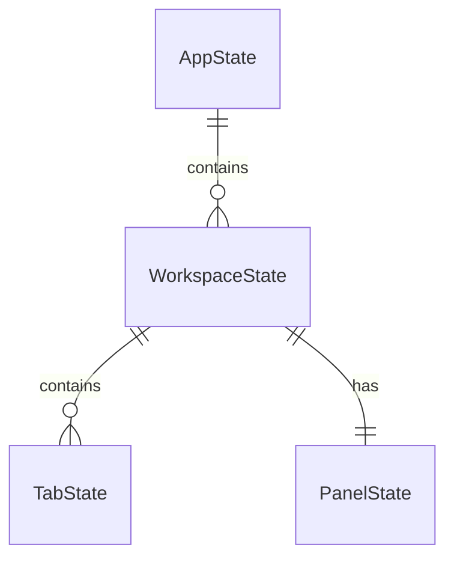

# MDX工作区文件树与标题目录设计文档

## 一、修订历史

| 版本号 | 修订内容 | 修订时间 | 修订人 |
|---|---|---|---|
| V1.0.0 | 新建初稿，基于 clarify 结果形成桌面工作区、多标签、文件树、标题目录和 CLI 设计 | 2026-06-01 | Codex |

## 二、需求信息

### 2.1 需求背景

- 背景：DOMD 当前更接近单文件 Markdown 编辑器。用户希望基于 DOMD 参考源码，在 `/Users/hugh/project/mdx` 创建自己的桌面编辑器，并将最重要的能力定为“左侧文件夹树 + 右侧文档标题目录”。
- 需求目的：把编辑器从单文件模型升级为桌面工作区模型，支持单根文件夹、多标签编辑、文件树操作、标题目录导航和 CLI 自动化。
- 目标用户/使用方：用户本人，以及后续可能通过 `mdx-cli` 驱动编辑器的本地自动化/Agent。
- 需求链接：无外部 PRD。
- 关联原始材料：
  - 参考仓库：`/Users/hugh/project/ref/domd`
  - 新项目目录：`/Users/hugh/project/mdx`
  - 澄清记录：`.loopx/intake/clarify-workspace-tabs-outline-2026-06-01-215630.md`

### 2.2 需求范围

- 本期范围：
  - 在 `/Users/hugh/project/mdx` 创建独立项目，复制 DOMD 应用层和 Tauri 壳作为起点。
  - App 名为 `MDX`，bundle identifier 为 `com.hugh.mdx`，CLI 为 `mdx-cli`，本地配置目录为 `~/.mdx`。
  - 桌面版/Tauri 优先；Web 产品形态移除。
  - 单窗口单根文件夹工作区。
  - 多标签页，tab 只对应真实文件。
  - 左侧文件夹树显示文件夹、`.md`、`.markdown`，支持新建、重命名、移到废纸篓、拖拽移动、搜索、刷新、切换根文件夹。
  - 右侧文档标题目录显示当前 tab 的 H1-H6 标题，支持折叠、点击滚动和实时更新。
  - 左右侧栏可折叠、可拖拽调整宽度，不做移动端适配。
  - 保存工作区状态到 `~/.mdx/state.json`。
  - 图片优先保存到工作区 `.assets/` 并写相对路径，异常时退回 `~/.mdx/assets`。
  - 保留并扩展 CLI socket / CLI 能力。
- 非目标：
  - 不修改 `ref/domd`。
  - 不发布 Web 产品；不保留 landing、Web 保存、URL 打开、GitHub README 加载。
  - 不做 Quick Look 扩展。
  - 不做自动更新、签名、公证发布脚本迁移。
  - 不重写 `@do-md/react` 编辑核心。
  - 不支持 `.mdx` 文件显示。
  - 不做全文搜索。
  - 不做实时文件系统监听。
  - 不做复制粘贴文件/文件夹、批量操作。
  - CLI 删除文件/文件夹不做 MVP。
- 决策边界：
  - 可由 plan 决定：组件文件命名、局部状态库选择、CSS 实现细节、具体错误文案微调。
  - 必须回 spec：替换编辑核心、引入全文搜索、引入实时监听、恢复 Web/Quick Look、改变 CLI 协议能力边界。
  - 必须回 clarify：多根工作区、未落盘草稿 tab、永久删除、支持其他文件类型。
- 依赖方：
  - `@do-md/react` 黑盒编辑器内核。
  - Tauri 2 文件系统/窗口/dialog 能力。
  - macOS 废纸篓能力，可能需要 Rust crate 或系统 API。
- 约束条件：
  - `/Users/hugh/project/mdx` 当前为空目录。
  - `@do-md/react` 仅以 `.packages/@do-md/dist/index.js` 构建产物提供，采用 PolyForm Noncommercial 许可。
  - MVP 继续使用黑盒内核，但需要 adapter 降低后续替换成本。

### 2.3 可行性分析

- 业务可行性：目标清晰，用户已接受桌面优先、Web 移除、Quick Look 不做、黑盒内核继续使用等关键取舍。
- 技术可行性：文件树、tabs、标题目录、CLI 扩展均可在 DOMD 应用层和 Tauri 壳基础上实现，不要求修改编辑核心。
- 团队接受能力：新项目从 DOMD 复制改造，初期成本低于从零搭建。
- 时间成本：中等偏高，核心复杂度在 workspace/tab 状态模型、Tauri 文件 API、CLI 协议重塑和 dirty 状态一致性。
- 资源成本：本地单机应用，无后端资源。
- 替代方案：
  - 从零搭建 Tauri + React：可控但慢。
  - 替换编辑核心为开源编辑器：长期可控，但 MVP 风险高。
  - 继续维护 Web + 桌面双形态：用户不需要，复杂度高。
- 关键风险：
  - 黑盒编辑器 DOM 结构可能影响标题滚动定位。
  - 文件移动/重命名与 dirty tab 路径同步复杂。
  - macOS 废纸篓实现需要验证。
  - 目录扫描大仓库性能需要保护。

## 三、概要设计

### 3.1 方案总述

- 设计目标：
  - 将 DOMD 单文件编辑体验迁移为 MDX 桌面工作区编辑器。
  - 建立稳定 workspace、file tree、tabs、outline、CLI 的状态模型。
  - 保留 `@do-md/react` 编辑体验，同时隔离编辑核心依赖。
- 总体思路：
  - 复制 DOMD 到 `mdx`，删除 Web/Quick Look/自动更新等非目标能力。
  - 前端建立 `WorkspaceShell`，包含左侧 `FileTreePanel`、中间 `TabbedEditorArea`、右侧 `OutlinePanel`。
  - Rust 提供 workspace 文件系统 commands 和 CLI socket server。
  - 本地状态持久化到 `~/.mdx/state.json`。
  - 对 `@do-md/react` 建立 `EditorKernelAdapter`，封装 `DOMDProvider`、`toMarkdown`、selection、insert、reset。
- 核心模块：
  - Workspace State
  - File Tree
  - Tab Manager
  - Editor Kernel Adapter
  - Outline Parser/Scroller
  - Image Asset Manager
  - Tauri FS Commands
  - CLI Server/Client
  - App State Persistence
- 主要难点：
  - tab dirty 状态、路径变更、文件树变更的一致性。
  - 文件夹拖拽移动后同步已打开 tabs。
  - 标题目录点击定位依赖黑盒渲染 DOM。
  - CLI 对多 tab/工作区的新协议兼容。
- 技术指标：
  - 目录扫描默认跳过大目录，文件/目录数量超过 5000 时提示并限制深层扫描。
  - 外部变化不实时监听，手动刷新。
  - 图片资产使用内容 hash 去重。

### 3.2 整体架构设计

- 业务模式：本地桌面 Markdown 工作区编辑器。
- 系统边界：
  - 前端负责 UI、tabs、outline、编辑器内核适配、交互状态。
  - Rust/Tauri 负责文件系统访问、废纸篓、窗口、状态文件、CLI socket。
  - 不涉及服务端。
- 上下游系统：
  - 上游：用户文件系统、CLI 请求。
  - 下游：本地 Markdown 文件、`.assets/` 图片目录、`~/.mdx/state.json`。
- 应用架构：
  - Next/Tauri 前端：只保留桌面编辑器入口。
  - Tauri Rust 后端：commands + CLI socket。
  - 本地配置：JSON 文件。
- 技术架构：
  - React 19 + Next 静态导出 + Tauri 2。
  - `@do-md/react` 继续作为编辑内核。
  - Prism 继续用于代码高亮。
  - Rust side 使用 serde 结构定义 command/CLI contracts。
- 数据流转：
  1. 启动读取 `~/.mdx/state.json`。
  2. 恢复最近 workspace 和 tabs。
  3. Rust 扫描 workspace 返回树。
  4. 前端打开 active tab 文件内容并注入编辑器。
  5. 编辑器变化转 Markdown，更新 tab dirty 和 Rust CLI content snapshot。
  6. 保存写入文件，必要时首次命名，更新 state/tree/tabs。

### 3.3 核心流程设计

| 流程 | 触发条件 | 参与系统/模块 | 主流程 | 异常/补偿 | 输出 |
|---|---|---|---|---|---|
| 启动恢复工作区 | App 启动 | Rust StateStore, WorkspaceShell, FileTree | 读取 state，校验最近根目录，扫描树，恢复 tabs 和 active tab | 根目录不存在则提示选择新文件夹 | 可编辑工作区 |
| 选择/切换根文件夹 | 用户菜单/按钮 | Dialog, WorkspaceStore, FileTree, Tabs | 用户选择目录，保存 workspace state，扫描文件树，恢复该 workspace tabs | dirty tabs 未处理则阻止切换 | 新 workspace |
| 打开文件 tab | 点击文件树文件 | FileTree, TabManager, EditorAdapter | 如果路径已打开则切换，否则读取文件并新建 tab | 读取失败提示，不创建 tab | active tab |
| 保存 tab | Cmd+S/按钮/CLI | TabManager, EditorAdapter, Rust FS | 获取 Markdown，若临时 Untitled 则要求命名，写入磁盘，更新 dirty/tree/state | 命名冲突阻止，写入失败提示 | 文件已保存 |
| 新建文件 | 文件树操作/CLI | Rust FS, FileTree, TabManager | 在目标目录创建 Untitled 系列文件，打开为 tab，标记 needsRenameOnFirstSave | 创建失败提示 | 新 tab |
| 重命名/移动 | 文件树操作/CLI | Rust FS, FileTree, TabManager | 校验冲突和非法目标，执行 rename/move，同步相关 tab 路径 | 冲突阻止；dirty tab 内容保留 | 树和 tabs 更新 |
| 删除 | 文件树操作 | Rust FS, FileTree, TabManager | 确认后移到废纸篓，关闭或标记受影响 tabs | 废纸篓失败提示，不永久删除 | 树更新 |
| 标题目录更新 | 当前 tab 内容变化 | OutlineParser, EditorAdapter | 从 Markdown 解析 H1-H6，渲染缩进目录 | 解析失败显示空目录 | 可导航目录 |
| CLI 插入 | `mdx-cli insert` | CLI server, Window/Tab state, FE event | 解析目标 tab，等待 ready，发事件给前端插入 | tab 不存在/dirty 状态不影响插入 | 文档内容变化 |

### 3.4 功能模块

| 模块 | 职责 | 关键功能 | 依赖 | 备注 |
|---|---|---|---|---|
| WorkspaceShell | 桌面主 UI 容器 | 三栏布局、折叠、拖拽宽度、启动恢复 | StateStore | 替代 DOMD landing/editor page 结构 |
| WorkspaceStore | 前端工作区状态 | rootPath、fileTree、tabs、activeTab、panel UI | Tauri commands | 可用 React reducer/context 或轻量 store |
| FileTreePanel | 左侧文件树 | 展示、搜索、高亮、新建、重命名、删除、拖拽移动、刷新 | WorkspaceStore, FS commands | 搜索仅名称 |
| TabManager | 多标签 | 打开/复用/关闭/切换/dirty/保存状态 | EditorAdapter | tab 只对应文件 |
| EditorKernelAdapter | 黑盒编辑器适配 | DOMDProvider、toMarkdown、insert、selection、reset、change subscribe | `@do-md/react` | 后续替换核心的隔离层 |
| OutlinePanel | 右侧标题目录 | 解析 H1-H6、实时更新、点击滚动 | EditorAdapter, DOM 查询 | 同名按顺序 |
| ImageAssetManager | 图片资产 | 粘贴/拖入、hash、写 `.assets/`、fallback 全局 | FS commands | Markdown 写相对路径 |
| TauriFsApi | 文件系统后端 | scan/read/write/create/rename/move/trash/state | Rust std/fs + dialog | 不做实时 watch |
| CliServer | 本地自动化 | workspace/tabs/content/selection/insert/save/focus/close/create/rename | Tauri state + FE events | 改名 `mdx-cli` |

### 3.5 新增/调整功能说明

- 桌面端：
  - 根路径直接进入工作区编辑器。
  - 不再提供 Web landing 页面。
  - 文件夹树和标题目录成为主界面一部分。
  - 菜单调整为新建文件/文件夹、打开文件夹、保存、关闭 tab、刷新文件树等。
- CLI：
  - 从单窗口单文件协议升级为 workspace/tab 协议。
  - 保留 socket 通信和 JSON line 响应模式。
- 构建：
  - 移除 Quick Look 扩展和自动更新发布流程的 MVP 依赖。

## 四、详细设计

### 4.1 项目迁移与产品壳详细设计

#### 4.1.1 需求内容

- 入口：`/Users/hugh/project/mdx`
- 操作人/调用方：开发者、本地用户
- 前置条件：`ref/domd` 已克隆且只读参考；`mdx` 目录为空。
- 输出结果：独立 MDX 桌面项目，可运行 Tauri UI。

#### 4.1.2 方案设计

- 核心逻辑：
  - 复制 DOMD 基础结构到 `mdx`。
  - 将 package、Tauri productName、identifier、CLI binary 从 DOMD/domd 改为 MDX/mdx。
  - 删除 landing、Web 保存、URL 打开、Quick Look、updater、release 脚本的 MVP 依赖。
  - 保留 Next/Tauri 开发链路，仍使用静态导出给 Tauri。
- 状态流转：无运行时状态。
- 数据变更：package metadata、Tauri config、Rust binary 名称、本地路径和菜单项。
- 幂等设计：重复迁移应避免覆盖用户后续改动；实施计划应从空目录开始执行。
- 权限/越权控制：不涉及。
- 异常处理：复制失败、依赖安装失败、Tauri 构建失败需要在 plan 阶段列出验证命令。
- 补偿/重试：失败时可删除未完成 `mdx` 目录重来，前提是确认没有用户改动。
- 日志与审计：不涉及。

#### 4.1.3 流程步骤

1. 复制参考项目基础文件。
2. 删除/裁剪非目标模块。
3. 改名和配置。
4. 保留 `@do-md/react`、Prism、Tauri 基础。
5. 运行 lint/build 级验证。

#### 4.1.4 边界条件

| 场景 | 处理方式 | 用户/调用方感知 | 监控/告警 |
|---|---|---|---|
| `mdx` 不为空 | 停止并要求确认 | 避免覆盖用户文件 | 不涉及 |
| `@do-md/react` 许可不满足商业用途 | 明确风险，不改变依赖 | 用户知道后续需授权或替换 | 不涉及 |

### 4.2 工作区与文件树详细设计

#### 4.2.1 需求内容

- 入口：应用启动、菜单“打开文件夹”、左侧树刷新/操作。
- 操作人/调用方：用户、CLI。
- 前置条件：桌面 Tauri 环境。
- 输出结果：左侧树展示根目录下可编辑 Markdown 文件和文件夹。

#### 4.2.2 方案设计

- 核心逻辑：
  - 工作区由一个绝对根路径 `rootPath` 标识。
  - Rust command `scan_workspace(rootPath)` 递归扫描。
  - 只返回文件夹和 `.md/.markdown` 文件。
  - 默认跳过 `node_modules`、`.git`、`dist`、`build`、`.next`、`target`。
  - dotfiles/dotfolders 默认隐藏；`.assets` 需要被保护，不作为普通 Markdown 文件区域。实现可选择显示 `.assets` 文件夹但不展开图片，或隐藏但删除保护必须覆盖。
  - 空文件夹显示。
  - 数量超过阈值时返回 `truncated: true` 和提示信息。
- 状态流转：
  - `empty` -> `workspaceLoading` -> `workspaceReady`
  - 扫描失败进入 `workspaceError`
  - 手动刷新重新进入 `workspaceLoading`
- 数据变更：
  - 新建、重命名、移动、删除后重新扫描或局部更新。
- 幂等设计：
  - 新建 `Untitled` 使用 next available name，避免覆盖。
  - 重命名/move 前检查目标是否存在。
- 权限/越权控制：
  - 所有文件操作必须限制在当前 `rootPath` 内。
  - 拖拽移动禁止移到自身或子目录。
  - CLI open 文件不在当前工作区时失败，不自动切换根目录。
- 异常处理：
  - 无权限、文件不存在、冲突、非法路径返回结构化错误。
- 补偿/重试：
  - 操作失败不更新前端树；提示用户刷新。
- 日志与审计：
  - Rust 对文件操作记录 debug/error 日志，CLI 返回 error_code。

#### 4.2.3 流程步骤

1. 用户选择根目录。
2. Rust 规范化路径并保存为工作区。
3. 扫描目录返回树。
4. 前端渲染树并保存最近工作区。
5. 用户操作树时调用 Rust command。
6. 成功后更新树和相关 tabs。

#### 4.2.4 边界条件

| 场景 | 处理方式 | 用户/调用方感知 | 监控/告警 |
|---|---|---|---|
| 根目录不存在 | 要求重新选择 | 弹窗/空状态 | CLI error |
| 目录过大 | 截断扫描并提示 | 左侧显示提示和刷新入口 | debug log |
| 同名冲突 | 阻止 | 提示改名 | CLI error |
| 移动到自身子目录 | 阻止 | 提示非法移动 | CLI error |
| 删除失败 | 不永久删除，提示失败 | 文件保留 | error log |

### 4.3 多标签与保存详细设计

#### 4.3.1 需求内容

- 入口：点击文件、CLI open/focus、关闭 tab、保存。
- 操作人/调用方：用户、CLI。
- 前置条件：已有工作区。
- 输出结果：多个文件可在 tabs 中切换编辑，保存状态可靠。

#### 4.3.2 方案设计

- 核心逻辑：
  - `TabState` 以唯一 `tabId` 标识，绑定一个 workspace 内文件路径。
  - 打开文件时按 canonical path 去重；已打开则切换。
  - tab 内容来自文件读取，编辑器内容变化后 tab dirty。
  - tab 只对应文件；新建时立即创建真实 `Untitled*.md`。
  - `needsRenameOnFirstSave=true` 的 tab 保存时必须弹出命名输入并执行 rename，再写入内容。
- 状态流转：
  - `clean` -> `dirty` -> `saving` -> `clean`
  - `needsRenameOnFirstSave` 在首次成功命名保存后变为 false。
- 数据变更：
  - 保存写入文件。
  - rename 更新 tab path、file tree、workspace state。
- 幂等设计：
  - 保存同一内容可重复执行。
  - 首次保存命名冲突不写入新路径。
- 权限/越权控制：
  - 保存路径必须在工作区内。
  - 用户输入文件名需要 sanitize，禁止路径分隔符。
- 异常处理：
  - 关闭 dirty tab 弹保存、放弃、取消。
  - 切换工作区/关闭窗口时统一处理 dirty tabs。
- 补偿/重试：
  - 保存失败保持 dirty 状态。
  - rename 成功但 write 失败时保留新路径和 dirty 状态，并提示。
- 日志与审计：
  - CLI save 返回 path 和 dirty 状态变化。

#### 4.3.3 流程步骤

1. 用户点击文件树文件。
2. TabManager 查找已打开 tab。
3. 未打开则读取文件并创建 tab。
4. EditorAdapter 注入内容。
5. 内容变化更新 dirty 和 outline。
6. 保存时读取 Markdown，必要时先命名，再写文件。

#### 4.3.4 边界条件

| 场景 | 处理方式 | 用户/调用方感知 | 监控/告警 |
|---|---|---|---|
| 文件被外部删除 | 保存失败并提示，可另存为后续设计 | 用户看到错误 | error log |
| 文件夹移动影响已打开 tab | 同步更新 tab 路径 | tab 继续打开 | debug log |
| dirty tab 对应文件被移动 | 路径更新，dirty 内容保留 | 无内容丢失 | debug log |
| 首次保存命名冲突 | 阻止 | 提示改名 | CLI error |

### 4.4 编辑内核适配与标题目录详细设计

#### 4.4.1 需求内容

- 入口：打开 tab、编辑内容、点击右侧标题。
- 操作人/调用方：用户、CLI insert。
- 前置条件：`@do-md/react` 可用。
- 输出结果：编辑器可显示/编辑 Markdown，标题目录实时导航。

#### 4.4.2 方案设计

- 核心逻辑：
  - 新建 `EditorKernelAdapter`，统一封装：
    - 初始化 Markdown。
    - 导出 Markdown。
    - 插入文本。
    - 插入图片。
    - 获取 selection。
    - reset 当前文档。
    - subscribe 内容变化。
  - Outline 不直接依赖黑盒 AST，从当前 Markdown 文本解析标题。
  - 标题正则以 CommonMark 基础 ATX heading 为主：`^(#{1,6})\s+(.+?)\s*#*\s*$`。
  - 点击 outline 时，查询 DOMD 渲染出的 `h1`-`h6` 元素，按出现顺序定位。
- 状态流转：
  - `markdown` 变化 -> parse outline -> render outline。
  - 点击 outline -> scroll editor container。
- 数据变更：无持久数据变更。
- 幂等设计：相同 Markdown 解析结果稳定。
- 权限/越权控制：不涉及。
- 异常处理：
  - 找不到 DOM heading 时不崩溃，可滚动到顶部或无操作。
  - 同名标题按出现顺序匹配。
- 补偿/重试：
  - 下一次内容变化重新解析。
- 日志与审计：不涉及。

#### 4.4.3 流程步骤

1. 当前 tab 内容变化。
2. Adapter 导出 Markdown。
3. OutlineParser 解析 H1-H6。
4. OutlinePanel 渲染。
5. 用户点击标题。
6. OutlineScroller 按 index 找到对应 heading DOM 并滚动。

#### 4.4.4 边界条件

| 场景 | 处理方式 | 用户/调用方感知 | 监控/告警 |
|---|---|---|---|
| 黑盒 DOM 结构变化 | adapter 内集中调整 selector | 目录定位可能临时失效 | 不涉及 |
| 标题很多 | 列表正常滚动，长标题截断 | 可扫描 | 不涉及 |
| 标题重复 | 按出现顺序 | 可定位 | 不涉及 |

### 4.5 图片资产详细设计

#### 4.5.1 需求内容

- 入口：粘贴图片、拖入图片。
- 操作人/调用方：用户。
- 前置条件：当前 tab 和工作区存在。
- 输出结果：图片保存到 `.assets/` 并插入相对 Markdown 图片链接。

#### 4.5.2 方案设计

- 核心逻辑：
  - 图片按 SHA-256 hash 命名去重。
  - 优先写入 `${rootPath}/.assets/<hash>.<ext>`。
  - Markdown 插入相对路径 `.assets/<hash>.<ext>`。
  - 无工作区或无法写入时写入 `~/.mdx/assets/<hash>.<ext>` 并插入绝对路径。
- 状态流转：无独立状态。
- 数据变更：写入图片文件，编辑器插入 Markdown。
- 幂等设计：同 hash 文件已存在则复用。
- 权限/越权控制：工作区写入限制在 root 下；fallback 限制在 `~/.mdx/assets`。
- 异常处理：写入失败提示，不插入链接。
- 补偿/重试：用户可重试粘贴。
- 日志与审计：error log。

#### 4.5.3 流程步骤

1. 捕获 paste/drop 图片。
2. 计算 hash 和扩展名。
3. 调 Rust command 写文件。
4. 返回插入路径。
5. Adapter 调用 `insertImage`。

#### 4.5.4 边界条件

| 场景 | 处理方式 | 用户/调用方感知 | 监控/告警 |
|---|---|---|---|
| `.assets` 不存在 | 自动创建 | 无感 | 不涉及 |
| 工作区无权限 | fallback 全局目录 | 可能提示使用全局路径 | error/debug |
| 不支持 MIME | 使用 `.bin` 或阻止，plan 阶段细化 | 提示 | error |

### 4.6 CLI 详细设计

#### 4.6.1 需求内容

- 入口：`mdx-cli` 命令。
- 操作人/调用方：本地用户、Agent。
- 前置条件：MDX app 可启动并监听 `~/.mdx/cli.sock`。
- 输出结果：CLI 可驱动窗口、工作区、tabs、编辑内容和部分文件树操作。

#### 4.6.2 方案设计

- 核心逻辑：
  - 继承 DOMD JSON lines Unix socket 模式。
  - socket 路径改为 `~/.mdx/cli.sock`。
  - CLI 与 Rust server 使用 serde 枚举定义协议。
  - 默认目标为当前 focused window + active tab。
  - `open <path>` 仅打开当前工作区内文件；否则失败，不自动切换 root。
  - 支持 create/rename 文件树，删除不做。
- 状态流转：
  - CLI request -> Rust resolve target -> command 或 FE event -> response。
- 数据变更：
  - create/rename/save 会写磁盘。
  - insert 会修改前端编辑器状态，再由 autosave/用户 save 写磁盘。
- 幂等设计：
  - create 目标存在返回冲突。
  - rename 目标存在返回冲突。
  - save 可重复。
- 权限/越权控制：
  - 所有 path 必须在当前 workspace root 下。
  - 不允许 `..` 逃逸。
- 异常处理：
  - 结构化 JSON error，非零 exit。
- 补偿/重试：
  - 调用方可根据 error_code 重试。
- 日志与审计：
  - server stderr/debug log。

#### 4.6.3 流程步骤

1. CLI 连接 socket，失败则尝试启动 app。
2. 发送 JSON request。
3. Rust 解析目标 window/workspace/tab。
4. 对纯 Rust 文件操作直接执行。
5. 对编辑器操作 emit 到前端 tab。
6. 返回 JSON 或纯文本结果。

#### 4.6.4 边界条件

| 场景 | 处理方式 | 用户/调用方感知 | 监控/告警 |
|---|---|---|---|
| App 未启动 | CLI 尝试启动并等待 socket | 延迟后成功或超时 | stderr |
| 无工作区 | 返回 no_workspace | JSON error | stderr |
| path 不在 root | 返回 outside_workspace | JSON error | stderr |
| tab 不存在 | 返回 tab_not_found | JSON error | stderr |

## 五、存储类设计

### 5.1 库表设计

#### 5.1.1 数据库模型图

不使用数据库。使用本地 JSON 文件保存应用状态。



#### 5.1.2 表结构

| 表名 | 用途 | 主键 | 关键索引 | 数据量预估 | 备注 |
|---|---|---|---|---|---|
| 不涉及 | 不使用数据库 | 不涉及 | 不涉及 | 不涉及 | 使用 JSON 文件 |

字段明细：

| 字段 | 类型 | 是否必填 | 默认值 | 含义 | 来源/取值逻辑 | 备注 |
|---|---|---|---|---|---|---|
| stateVersion | number | 是 | 1 | 状态文件版本 | 应用写入 | 用于未来迁移 |
| recentWorkspaceRoot | string/null | 否 | null | 最近根目录 | 用户选择 | 启动恢复 |
| workspaces | Record<string, WorkspaceState> | 是 | {} | 按 rootPath 保存工作区状态 | 应用维护 | key 为 canonical root path |
| WorkspaceState.rootPath | string | 是 | 无 | 根目录 | 用户选择 | 绝对路径 |
| WorkspaceState.tabs | TabState[] | 是 | [] | 已打开 tabs | TabManager | 只保存路径和 UI 状态，不保存正文 |
| WorkspaceState.activeTabId | string/null | 否 | null | 当前 tab | TabManager | 启动恢复 |
| WorkspaceState.panels | PanelState | 是 | 默认宽度 | 左右栏 UI 状态 | UI 操作 | 按工作区记忆 |
| TabState.tabId | string | 是 | 生成 | tab id | 前端生成 | 稳定用于 CLI |
| TabState.path | string | 是 | 无 | 文件绝对路径 | 打开/移动/重命名 | 必须在 root 下 |
| TabState.needsRenameOnFirstSave | boolean | 是 | false | Untitled 首次保存命名标记 | 新建文件 | 成功命名后 false |
| TabState.dirty | boolean | 否 | false | 是否未保存 | 运行时 | 可不落盘，启动后从文件恢复为 clean |
| PanelState.leftCollapsed | boolean | 是 | false | 左栏折叠 | UI |  |
| PanelState.leftWidth | number | 是 | 280 | 左栏宽度 | UI | px |
| PanelState.rightCollapsed | boolean | 是 | false | 右栏折叠 | UI |  |
| PanelState.rightWidth | number | 是 | 240 | 右栏宽度 | UI | px |

### 5.2 数据迁移/初始化

- DDL：不涉及。
- DML：不涉及。
- 数据回填：无旧 MDX 状态。首次启动创建 `~/.mdx/state.json`。
- 老数据兼容：不兼容 DOMD 旧状态；DOMD 旧项目无同名 `~/.mdx` 状态。
- 新老系统读写关系：MDX 不读写 DOMD 的 `~/.domd` 状态和 assets；图片 fallback 使用 `~/.mdx/assets`。

### 5.3 缓存设计

| 场景 | Key | Value | 数据结构 | 过期时长 | 容量预估 | 失效/刷新策略 |
|---|---|---|---|---|---|---|
| 文件树 | rootPath | FileTreeNode[] | 内存对象 | 进程内 | 受目录大小影响 | 手动刷新、文件操作后刷新 |
| 文件内容 | tabId | Markdown string/renderData | 编辑器状态 | tab 生命周期 | 每 tab 一个文档 | 关闭 tab 释放 |
| outline | tabId + contentVersion | Heading[] | 数组 | 内容变化 | 标题数量 | 内容变化重算 |

## 六、其他组件设计

### 6.1 消息设计

不涉及消息队列。前端与 Rust 之间使用 Tauri invoke/event；CLI 使用 Unix socket JSON lines。

| 场景 | Group | Topic | 生产者 | 消费者 | 幂等键 | 失败补偿 |
|---|---|---|---|---|---|---|
| CLI insert | 不涉及 | `cli-insert` Tauri event | Rust CLI server | 前端 active tab | request id 可选 | CLI 返回 emit_failed |
| saved by CLI | 不涉及 | `saved-by-cli` Tauri event | Rust CLI server | 前端 TabManager | tabId/path | 前端重置 dirty baseline |

### 6.2 配置设计

| 配置项 | 环境 | 默认值 | 是否动态生效 | 说明 | 风险 |
|---|---|---|---|---|---|
| ignoredDirs | desktop | `node_modules,.git,dist,build,.next,target` | 否 | 扫描跳过目录 | 可能隐藏用户需要的目录 |
| maxTreeEntries | desktop | 5000 | 否 | 扫描保护阈值 | 过低影响大工作区 |
| statePath | desktop | `~/.mdx/state.json` | 否 | 应用状态文件 | 文件损坏需兜底 |
| globalAssetsDir | desktop | `~/.mdx/assets` | 否 | 图片 fallback | 绝对路径可迁移性差 |

### 6.3 定时任务/批处理

不涉及定时任务。状态保存可采用 debounce 写入，但不是后台定时任务。

| 任务 | 触发时间 | 处理范围 | 幂等 | 失败重试 | 影响评估 |
|---|---|---|---|---|---|
| 状态保存 debounce | workspace/tabs/panel 变化后 | `~/.mdx/state.json` | 覆盖写 | 下次变化重试 | 写失败会影响启动恢复 |

### 6.4 技术组件

- 分布式锁：不涉及。
- 唯一 ID：tabId 使用 `nanoid` 或等价短 ID。
- 加解密/验签：不涉及。
- 字典转换：文件扩展名白名单 `.md/.markdown`。
- Excel/文件处理：Rust std/fs + macOS trash API/crate。
- 用户信息透传：不涉及。
- 限流/熔断：目录扫描通过 ignored dirs 和 max entries 保护。

## 七、接口设计

### 7.1 接口设计原则

- Tauri commands 和 CLI 协议字段必须使用 serde/TypeScript 类型双向定义或手工同步。
- 所有 path 入参必须 canonicalize，并校验在 workspace root 下。
- 非查询接口必须先校验冲突和权限，再执行写操作。
- 错误返回必须包含稳定 `error_code`。
- CLI 默认目标为 focused window + active tab；支持显式 `--tab`。

### 7.2 接口清单

| 接口 | 调用方 | 服务方 | 权限/认证 | 幂等 | 文档地址 | 备注 |
|---|---|---|---|---|---|---|
| scan_workspace | 前端 | Rust command | 本机 Tauri | 查询幂等 | 本文 | 扫描树 |
| read_markdown_file | 前端/CLI | Rust command | root 内路径 | 查询幂等 | 本文 | 只读 md/markdown |
| write_markdown_file | 前端/CLI | Rust command | root 内路径 | 覆盖幂等 | 本文 | 保存 |
| create_markdown_file | 前端/CLI | Rust command | root 内路径 | 非幂等 | 本文 | Untitled 或指定名 |
| create_folder | 前端/CLI | Rust command | root 内路径 | 非幂等 | 本文 | 冲突失败 |
| rename_path | 前端/CLI | Rust command | root 内路径 | 非幂等 | 本文 | 文件/文件夹 |
| move_path | 前端 | Rust command | root 内路径 | 非幂等 | 本文 | 拖拽移动 |
| trash_path | 前端 | Rust command | root 内路径 | 非幂等 | 本文 | 移到废纸篓 |
| save_app_state | 前端/Rust | Rust command | `~/.mdx` | 覆盖幂等 | 本文 | 状态持久化 |
| load_app_state | 前端/Rust | Rust command | `~/.mdx` | 查询幂等 | 本文 | 启动恢复 |
| save_image_asset | 前端 | Rust command | root 或 `~/.mdx/assets` | hash 幂等 | 本文 | 图片 |
| CLI socket | `mdx-cli` | Rust CLI server | 本机 socket 0600 | 按命令 | 本文 | JSON lines |

### 7.3 接口明细

#### 7.3.1 scan_workspace

- 路径/方法：Tauri invoke `scan_workspace`
- 请求头：不涉及。
- 请求参数：
  - `rootPath: string`
- 响应参数：
  - `rootPath: string`
  - `nodes: FileTreeNode[]`
  - `truncated: boolean`
  - `entryCount: number`
  - `warnings: string[]`
- 错误码：
  - `root_not_found`
  - `not_directory`
  - `permission_denied`
  - `scan_failed`
- 业务校验：root 必须存在且是目录。
- 数据变更：无。
- 日志字段：rootPath、entryCount、durationMs、truncated。

#### 7.3.2 create_markdown_file

- 路径/方法：Tauri invoke `create_markdown_file`
- 请求参数：
  - `rootPath: string`
  - `parentDir: string`
  - `name?: string`
  - `temporaryUntitled?: boolean`
- 响应参数：
  - `path: string`
  - `name: string`
  - `needsRenameOnFirstSave: boolean`
- 错误码：
  - `outside_workspace`
  - `invalid_name`
  - `already_exists`
  - `write_failed`
- 业务校验：
  - parentDir 必须在 root 下。
  - name 不能包含路径分隔符。
  - temporaryUntitled 生成 `Untitled.md`、`Untitled1.md`。
- 数据变更：创建空 Markdown 文件。
- 日志字段：rootPath、parentDir、path。

#### 7.3.3 rename_path

- 路径/方法：Tauri invoke `rename_path`
- 请求参数：
  - `rootPath: string`
  - `fromPath: string`
  - `newName: string`
- 响应参数：
  - `oldPath: string`
  - `newPath: string`
  - `affectedPrefix?: { oldPrefix: string; newPrefix: string }`
- 错误码：
  - `outside_workspace`
  - `invalid_name`
  - `already_exists`
  - `not_found`
  - `rename_failed`
- 业务校验：目标不存在；路径不逃逸 root。
- 数据变更：文件系统 rename。
- 日志字段：fromPath、newPath。

#### 7.3.4 move_path

- 路径/方法：Tauri invoke `move_path`
- 请求参数：
  - `rootPath: string`
  - `fromPath: string`
  - `targetDir: string`
- 响应参数：
  - `oldPath: string`
  - `newPath: string`
  - `affectedPrefix?: { oldPrefix: string; newPrefix: string }`
- 错误码：
  - `outside_workspace`
  - `move_into_self`
  - `already_exists`
  - `not_found`
  - `move_failed`
- 业务校验：不能拖入自身或子目录；目标不存在同名。
- 数据变更：文件系统 rename/move。
- 日志字段：fromPath、targetDir、newPath。

#### 7.3.5 trash_path

- 路径/方法：Tauri invoke `trash_path`
- 请求参数：
  - `rootPath: string`
  - `path: string`
- 响应参数：
  - `trashedPath: string`
- 错误码：
  - `outside_workspace`
  - `not_found`
  - `trash_failed`
- 业务校验：只允许 root 内路径；不允许删除 root 本身。
- 数据变更：移动到 macOS 废纸篓。
- 日志字段：path。

#### 7.3.6 CLI socket

- 路径/方法：Unix socket `~/.mdx/cli.sock`，JSON line request/response。
- 请求头：不涉及。
- 请求参数：按命令。
- 响应参数：`{ ok, error?, error_code?, ...data }`
- 错误码：沿用并扩展 Rust command 错误码。
- 业务校验：默认当前 window/tab；显式 `window_id`/`tab_id` 必须存在。
- 数据变更：取决于命令。
- 日志字段：cmd、window_id、tab_id、error_code。

MVP CLI 命令建议：

| 命令 | 行为 |
|---|---|
| `mdx-cli new` | 打开/聚焦应用窗口 |
| `mdx-cli open <path>` | 打开当前工作区内文件，不在 root 下则失败 |
| `mdx-cli list` | 列出窗口、工作区、tabs、active tab、dirty |
| `mdx-cli content [--tab <id>]` | 输出 tab Markdown |
| `mdx-cli selection [--tab <id>]` | 输出 selection JSON |
| `mdx-cli insert [--tab <id>] <text>` | 插入文本 |
| `mdx-cli save [--tab <id>]` | 保存 tab |
| `mdx-cli focus [--tab <id>]` | 聚焦 tab |
| `mdx-cli close [--tab <id>] [--force]` | 关闭 tab |
| `mdx-cli create-file <dir> [name]` | 创建 Markdown 文件 |
| `mdx-cli create-folder <dir> <name>` | 创建文件夹 |
| `mdx-cli rename <path> <new-name>` | 重命名 |

## 八、系统发布

### 8.1 灰度方案

- 灰度范围：本地开发环境。
- 灰度开关：不涉及。
- 验证指标：可启动、可选择工作区、可打开/保存 tabs、文件树操作成功、CLI 基本命令成功。
- 放量节奏：不涉及公开发布。

### 8.2 降级方案

- 降级触发条件：
  - 工作区扫描失败。
  - 状态文件损坏。
  - 文件操作失败。
- 降级行为：
  - 状态损坏时备份损坏文件并使用空状态启动。
  - 扫描失败时要求重新选择工作区。
  - 文件操作失败时保持当前 UI 状态并提示。
- 用户影响：不丢编辑器内 dirty 内容。
- 恢复方式：刷新、重新选择工作区、修复权限。

### 8.3 关联系统/功能影响

| 系统/功能 | 影响 | 依赖动作 | 负责人 | 验证方式 |
|---|---|---|---|---|
| DOMD 参考项目 | 不修改 | 无 | 不涉及 | git status 保持干净 |
| `@do-md/react` | 继续依赖 | 复制 dist 和类型声明或保持路径映射 | 开发者 | 编辑器可打开和保存 |
| CLI | 从 domd-cli 改为 mdx-cli | Rust bin/协议改造 | 开发者 | CLI smoke test |
| Quick Look | 不迁移 | 删除构建依赖 | 开发者 | 项目不引用 preview-extension |

### 8.4 回滚方案

- 回滚条件：MDX 项目迁移不可用或设计方向变化。
- 回滚步骤：
  - 删除或重置 `/Users/hugh/project/mdx` 中未需要的生成文件。
  - 保留 `ref/domd` 不变，可重新复制。
- 数据回滚：
  - 删除或备份 `~/.mdx/state.json` 和 `~/.mdx/assets`。
  - 用户工作区文件操作无法自动回滚；计划阶段需避免 destructive 操作测试真实重要目录。
- 配置回滚：恢复 package/Tauri 名称需通过 git diff。
- 风险：文件树操作会改用户工作区，测试应使用临时 fixture 目录。

## 九、系统监控与维护

### 9.1 监控与告警

- 系统异常：
  - Rust command 返回结构化 error。
  - 前端显示 toast/dialog。
- 业务异常：
  - 路径冲突、越界、无权限、目录过大。
- 重试异常：
  - 状态保存失败下次变更重试。
- 超时：
  - CLI 等待窗口 ready 需要 timeout。
  - 扫描大目录需要 duration log。
- 关键接口指标：
  - scan duration、entry count、truncated。
  - save duration、write errors。
  - CLI command success/failure。
- 告警渠道：本地应用无远程告警；使用 console/log/stderr。

### 9.2 性能与容量

- TPS/吞吐：本地单用户，不按 TPS 设计。
- CPU/内存/磁盘 IO/网络 IO：
  - 扫描递归目录是主要 IO。
  - 每 tab 保存和内容导出可能消耗 CPU。
  - 不使用网络。
- 数据容量：
  - state JSON 小量。
  - 图片 `.assets` 随用户内容增长。
- 缓存容量：
  - 文件树最多 5000 entry 默认阈值。
  - tabs 数量用户控制，MVP 不设硬限制，UI 可后续优化。
- 跑批耗时：不涉及。
- 是否压测：MVP 用 fixture 目录验证 100/1000/5000 entry 扫描。

### 9.3 可靠性与兜底

- 幂等击穿：文件创建/重命名前先检查目标存在。
- 并发失效：
  - CLI 和 UI 同时操作同一路径时以 Rust command 校验为准。
  - 保存时文件被移动/删除需返回错误，不覆盖未知路径。
- 冷热备：不涉及。
- 关键任务独立性：文件树扫描失败不应导致已打开 dirty tab 内容丢失。
- 字段兜底：
  - stateVersion 不识别时备份并使用空状态。
  - tabs 指向不存在文件时启动时跳过并提示。
- 老新数据兼容：不读取 DOMD 状态。

## 十、排期与规划

### 10.1 任务拆分与工作量评估

| 任务 | 范围 | 负责人 | 工作量 | 依赖 | 备注 |
|---|---|---|---|---|---|
| 项目迁移与裁剪 | 复制 DOMD、改名、删除 Web/Quick Look/updater | 开发者 | 中 | DOMD 参考项目 | 需保持可运行 |
| Tauri 文件系统 API | scan/read/write/create/rename/move/trash/state/assets | 开发者 | 中高 | Rust/Tauri | 文件安全边界重要 |
| Workspace UI | 三栏布局、侧栏折叠/拖宽、状态恢复 | 开发者 | 中 | FS API | 桌面优先 |
| File Tree | 展示、搜索、新建、重命名、删除、拖拽、刷新 | 开发者 | 高 | Workspace UI, FS API | 拖拽边界复杂 |
| Tab Manager | 多 tab、dirty、保存、首次命名、关闭保护 | 开发者 | 高 | EditorAdapter | 核心状态机 |
| EditorAdapter | 封装 DOMDProvider/toMarkdown/insert/selection | 开发者 | 中 | @do-md/react | 为未来替换内核铺垫 |
| Outline | H1-H6 解析、实时更新、点击滚动 | 开发者 | 中 | EditorAdapter | DOM 匹配有风险 |
| Image Assets | `.assets` 写入、fallback、插入链接 | 开发者 | 中 | FS API, EditorAdapter | 路径策略明确 |
| CLI 改造 | `mdx-cli`、workspace/tab 协议、create/rename | 开发者 | 高 | Tauri state, TabManager | 需 smoke test |
| 验证 | lint/build/桌面 smoke/CLI smoke/文件操作 fixture | 开发者 | 中 | 全部模块 | 不用真实重要目录 |

### 10.2 计划时间

- 数据方案评审：plan 前评审本设计。
- 开发开始/结束：由后续 `plan` 拆分决定。
- CR：每个阶段完成后。
- 联调完成/提测：本地 Tauri smoke 通过后。
- 测试用例评审：文件树、tabs、CLI、dirty 状态用例需先列出。
- 测试开始/结束：由 plan 决定。
- 预发布：不涉及公开发布。
- 上线：本地可用版本。
- 线上验证：不涉及。

### 10.3 发布计划

1. 确认设计文档。
2. 生成实施计划。
3. 在 `/Users/hugh/project/mdx` 迁移项目。
4. 阶段性实现工作区和 Tauri FS API。
5. 实现 tabs 和 editor adapter。
6. 实现 file tree 操作和 outline。
7. 改造 CLI。
8. 完成本地验证。

### 10.4 遗留问题与后续规划

| 问题 | 影响 | 处理计划 | 负责人 | 截止时间 |
|---|---|---|---|---|
| `@do-md/react` 黑盒 | 长期可维护性和许可风险 | MVP adapter 隔离，后续评估替换或授权 | 用户/开发者 | MVP 后 |
| 全文搜索 | 用户可能需要内容查找 | 后续单独设计索引/结果定位 | 待定 | 后续 |
| 实时文件监听 | 外部变更无法自动刷新 | 后续引入 watcher | 待定 | 后续 |
| Quick Look | Finder 预览缺失 | 核心体验稳定后再决定 | 待定 | 后续 |
| 自动更新/发布 | 无公开发布能力 | 本地 MVP 后再设计 | 待定 | 后续 |

### 10.5 Planning Handoff

- `plan` 可以决定：
  - 具体文件拆分和组件命名。
  - 使用 React Context/reducer 或小型 store 的局部实现方式。
  - Tauri Rust 模块拆分。
  - UI 控件具体样式。
  - 测试 fixture 目录结构和验证命令。
- 必须返回 `spec` 的事项：
  - 新增实时 watcher。
  - 新增全文搜索。
  - 替换编辑器内核。
  - 改变 CLI 命令能力边界。
  - 恢复 Web/Quick Look/自动更新。
- 必须返回 `clarify` 的事项：
  - 改变工作区为多根。
  - 改变文件类型支持范围。
  - 改变 tab 为未落盘草稿。
  - 改变删除为永久删除。
- 推荐下一步：

```text
$plan --direct docs/loopx/design/MDX工作区文件树与标题目录需求设计文档.md
```

## 十一、QA

### 11.1 评审记录

| 评审时间 | 评审人 | 评审问题 | 处理进展 | 结论 |
|---|---|---|---|---|
| 2026-06-01 | 用户 + Codex | 明确文件树/标题目录、桌面优先、项目目录、黑盒内核、tabs、CLI、Quick Look、文件操作范围 | 已澄清并写入设计 | 可进入 plan |

### 11.2 待确认问题

| 问题 | 需要谁确认 | 阻塞阶段 | 推荐答案 | 状态 |
|---|---|---|---|---|
| 是否继续使用 `@do-md/react` 黑盒内核 | 用户 | clarify | MVP 接受，adapter 隔离 | closed |
| Quick Look 是否做 MVP | 用户 | clarify | 不做 | closed |
| Web 是否保留 | 用户 | clarify | 不保留 Web 产品形态 | closed |
| 是否支持 `.mdx` 文件 | 用户 | clarify | 不支持，仅 `.md/.markdown` | closed |
| 删除语义 | 用户 | clarify | 移到 macOS 废纸篓 | closed |
