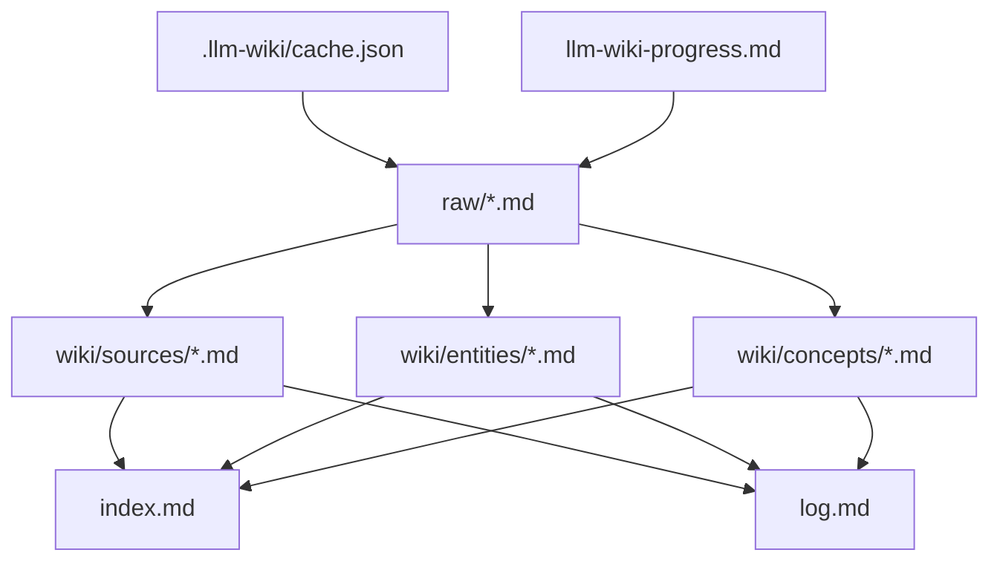

# MDX 本地优先 LLM Wiki 工作区设计文档

## 一、修订历史

| 版本号 | 修订内容 | 修订时间 | 修订人 |
|---|---|---|---|
| V1.0.0 | 新建初稿 | 2026-06-02 | Codex |

## 二、需求信息

### 2.1 需求背景

- 背景：`AGENT.md` 已将 MDX 定位为本地优先的 LLM Wiki Markdown 工作区。用户希望 MDX 打开文件夹后，应用可以在后台按照 Karpathy LLM Wiki 思路对知识库进行自动维护。
- 需求目的：在当前 Markdown 桌面工作区基础上，增加完整 LLM Wiki 能力，让用户写在 `raw/` 的文档被后台 LLM 消化，并持续维护 `wiki/`、`index.md`、`log.md`、`llm-wiki-progress.md`。
- 目标用户/使用方：使用本地 Markdown 文件夹维护长期知识的用户，以及通过 MDX 桌面应用配置 LLM 并自动整理知识库的用户。
- 需求链接：无外部产品需求链接。
- 关联原始材料：
  - [AGENT.md](/Users/zhangyukun/project/mdx/AGENT.md)
  - [.loopx/intake/clarify-llm-wiki-product-20260602-153309.md](/Users/zhangyukun/project/mdx/.loopx/intake/clarify-llm-wiki-product-20260602-153309.md)
  - [ref/karpathy-llm-wiki-gist/llm-wiki.md](/Users/zhangyukun/project/mdx/ref/karpathy-llm-wiki-gist/llm-wiki.md)
  - [ref/llm-wiki-agent](/Users/zhangyukun/project/mdx/ref/llm-wiki-agent)
  - [ref/llm_wiki](/Users/zhangyukun/project/mdx/ref/llm_wiki)
  - [ref/llm-wiki-skill](/Users/zhangyukun/project/mdx/ref/llm-wiki-skill)

### 2.2 需求范围

- 本期范围：
  - 普通 Markdown 工作区保留现状。
  - 用户可将当前文件夹初始化为 LLM Wiki 工作区。
  - 初始化生成 `raw/`、`wiki/`、`index.md`、`log.md`、`purpose.md`、`AGENTS.md`、`llm-wiki-progress.md`、`.llm-wiki/`。
  - 应用内配置 OpenAI-compatible LLM 参数。
  - 桌面版后台扫描 `raw/`，按 cache 处理新增或变更文件。
  - 后台 ingest 自动写入 source、entity、concept 页面，并维护 index/log/progress。
  - 提供 query、digest、lint、Mermaid knowledge graph 能力。
  - 提供 LLM Wiki 面板，展示队列、进度、错误、query/digest/lint/graph 操作入口。
- 非目标：
  - 不做 Web 产品。Web dev shell 可保留，但不作为 LLM Wiki 验收目标。
  - 不做 embedding/vector search。
  - 不做 web clipper。
  - 不做多模态/image understanding。
  - 不做复杂交互图谱系统。
  - 不做实时文件系统监听。
  - 不自动迁移 `raw/` 外的已有 Markdown。
  - 不验收 Windows/Linux。
- 决策边界：
  - Karpathy LLM Wiki 是产品准则。原文没有提到的增强项默认不做。
  - 仅 `raw/` 是一手素材输入，`wiki/` 是派生知识层。
  - 默认允许后台写入 wiki 生成文件。
- 依赖方：
  - 当前 MDX workspace UI。
  - Tauri/Rust 文件系统边界。
  - 软件级 LLM 配置。
  - 用户配置的 LLM provider。
- 约束条件：
  - API Key 不写入知识库。
  - 仅 macOS 桌面版作为第一版完整验收目标。
  - 自动写入必须经过路径安全校验，只能写入约定路径。

### 2.3 可行性分析

- 业务可行性：当前 MDX 已是本地 Markdown 工作区，和 LLM Wiki 的本地文件夹形态一致。
- 技术可行性：现有 Tauri 文件系统、工作区状态、文件树、多标签和 CLI socket 为本地自动化提供基础。新增复杂度主要在 LLM 任务编排、结构化输出校验和 wiki 合并写入。
- 团队接受能力：本需求跨前端、Rust、LLM prompt、文件系统安全和测试，需要先设计再拆计划。
- 时间成本：高。完整第一版包含多个工作流，不应作为单一小改动执行。
- 资源成本：需要用户自备 LLM provider/API Key；应用需要处理模型失败和成本可见性。
- 替代方案：
  - 只做 source summary MVP，已被用户否决。
  - 依赖外部 Agent 执行，已被用户否决。
  - 复制 `ref/llm_wiki` 全量能力，范围超出用户定义的 Karpathy 原始准则。
- 关键风险：
  - 默认后台写入可能产生错误合并。
  - entity/concept merge 质量难以完全用单元测试保证。
  - LLM 输出格式不稳定，需要强解析、降级和重试。
  - 长文档和大目录会带来成本和耗时问题。

## 三、概要设计

### 3.1 方案总述

- 设计目标：
  - 将 MDX 从普通 Markdown 工作区升级为可选 LLM Wiki 工作区。
  - 在桌面版中实现完整 LLM Wiki 核心工作流。
  - 保持用户知识库为普通 Markdown 文件夹，可迁移、可审计。
- 总体思路：
  - 前端保持 workspace shell，新增 LLM Wiki 面板和状态 store。
  - Tauri 新增 LLM Wiki 文件系统命令、配置命令和任务命令。
  - 应用内 LLM service 执行 init/ingest/query/lint/digest/graph。
  - `.llm-wiki/` 存储机器状态，根目录 Markdown 存储用户可见运行文档。
- 核心模块：
  - LLM Wiki workspace detector/initializer。
  - LLM config。
  - Background ingest queue。
  - Wiki writer and path guard。
  - Query/digest/lint/graph services。
  - LLM Wiki panel。
- 主要难点：
  - 自动写入的安全边界。
  - entity/concept merge。
  - 任务中断恢复。
  - progress/log/cache 一致性。
- 技术指标：
  - raw 文件未变化时不得重复调用 LLM。
  - 所有写入必须限制在 workspace root 内。
  - LLM Wiki 功能在无 LLM 配置时可初始化但不 ingest。

### 3.2 整体架构设计

- 业务模式：用户打开本地文件夹，选择初始化或识别为 LLM Wiki 工作区。后台扫描 `raw/` 并维护派生 wiki。
- 系统边界：
  - MDX 桌面应用负责 UI、任务调度和文件写入。
  - 用户配置的 LLM provider 负责内容分析和生成。
  - 用户知识库文件夹是唯一数据载体。
- 上下游系统：
  - 上游：用户写入的 `raw/` Markdown。
  - 下游：`wiki/`、`index.md`、`log.md`、`llm-wiki-progress.md`。
- 应用架构：
  - Frontend: workspace shell + LLM Wiki panel + hooks/state。
  - Tauri/Rust: file system commands, app config, secure path operations。
  - LLM service: OpenAI-compatible HTTP calls, prompts, parsers。
- 技术架构：
  - 复用现有 `features/workspace` 作为 UI 容器。
  - 新增 `features/llm-wiki` 作为前端领域模块。
  - 新增 `src-tauri/src/llm_wiki*.rs` 作为 Rust 命令和存储边界。
- 数据流转：
  1. 用户打开 workspace。
  2. detector 判断是否为 LLM Wiki。
  3. 若启用，扫描 `raw/`。
  4. cache 判断 pending 文件。
  5. ingest queue 调用 LLM。
  6. writer 写入 wiki/index/log/progress/cache。
  7. UI 面板展示状态。

### 3.3 核心流程设计

| 流程 | 触发条件 | 参与系统/模块 | 主流程 | 异常/补偿 | 输出 |
|---|---|---|---|---|---|
| 初始化 LLM Wiki | 用户在普通工作区启用 | UI、Tauri FS、initializer | 创建目录和模板文件，刷新文件树 | 文件已存在则保留并补缺；写失败显示错误 | LLM Wiki 工作区结构 |
| 打开扫描 | 打开已启用工作区 | detector、scanner、cache、queue | 扫描 `raw/`，写 progress，enqueue pending | 无 LLM 配置则只统计 pending | pending/active/completed 状态 |
| 保存触发 ingest | 保存 `raw/` 下 Markdown | editor save、queue | 保存后检查 hash，enqueue changed file | 文件不在 raw 则不处理 | 单文件 ingest 任务 |
| 手动重新扫描 | 用户点击按钮 | panel、scanner、queue | 重新扫描 raw 并 enqueue | 暂停状态只刷新统计不处理 | 更新 progress |
| Ingest | queue 执行任务 | LLM service、parser、writer | Step 1 分析，Step 2 生成/合并，写文件，更新 cache/log/progress | LLM/解析/写入失败记录失败并可重试 | source/entity/concept/index/log |
| Query | 用户提问 | panel、search、LLM | 搜索 index/wiki，读取上下文，LLM 回答并引用 | 无相关页面提示资料不足 | 即时回答 |
| Digest | 用户发起综合 | panel、search、LLM、writer | 找相关页面，生成 synthesis 文件，更新 index/log | 写入失败不更新 log/cache | `wiki/syntheses/*.md` |
| Lint | 用户发起或建议 | mechanical lint、LLM lint | 查断链/孤立/index，必要时 LLM 检查矛盾 | LLM 不可用则只跑机械检查 | lint 报告 |
| Graph | batch 完成或手动刷新 | graph builder、writer | 扫描 wikilinks 生成 Mermaid | 无边生成空图说明 | `wiki/knowledge-graph.md` |

### 3.4 功能模块

| 模块 | 职责 | 关键功能 | 依赖 | 备注 |
|---|---|---|---|---|
| Workspace Detector | 判断工作区类型 | 检查 raw/wiki/index/log/AGENTS | Tauri FS | 普通模式不启用后台 LLM |
| Initializer | 初始化结构 | 创建目录和模板 | Tauri FS | 不迁移已有 Markdown |
| LLM Config | 软件级 LLM 设置 | baseUrl/model/apiKey | Tauri app config | API Key 不进 workspace |
| Scanner/Cache | 发现待处理 raw 文件 | hash、skip、pending | `.llm-wiki/cache.json` | 不处理 wiki |
| Ingest Queue | 后台处理任务 | pause/resume/retry/status | LLM service | 串行优先，避免写入竞争 |
| Wiki Writer | 安全写入 | path allowlist、merge、atomic write | Tauri FS | source 可覆盖，entity/concept merge |
| Query/Digest | 问答和综合 | 检索、上下文预算、引用 | index/wiki/LLM | query 默认不保存 |
| Lint/Graph | 健康检查和关联图 | mechanical lint、Mermaid | wiki links | graph 不推断关系 |
| LLM Wiki Panel | 用户操作面 | 状态、进度、query、digest、lint、graph | frontend state | 接入现有 workspace shell |

### 3.5 新增/调整功能说明

- 前端：新增 `features/llm-wiki`，在 `WorkspaceShell` 中集成 LLM Wiki 面板。
- Rust/Tauri：新增 LLM Wiki 命令和软件配置存储。
- 文件系统：新增初始化、扫描、读写 wiki 文件、cache/progress 更新。
- 当前普通 Markdown 编辑体验保留。

## 四、详细设计

### 4.1 LLM Wiki 工作区识别与初始化详细设计

#### 4.1.1 需求内容

- 入口：打开工作区后自动检测；用户在面板点击初始化。
- 操作人/调用方：用户、`useWorkspaceBootstrap` 后续 LLM Wiki bootstrap hook。
- 前置条件：Tauri 桌面运行时，已打开本地文件夹。
- 输出结果：已初始化或识别的 LLM Wiki 工作区状态。

#### 4.1.2 方案设计

- 核心逻辑：
  - 检测根目录是否包含 `raw/`、`wiki/`、`index.md`、`log.md`、`AGENTS.md`。
  - 未初始化时，普通 Markdown 模式继续可用，并在面板提示可初始化。
  - 初始化只补齐缺失目录/文件，不迁移已有 Markdown。
- 状态流转：
  - `ordinary` → `initializing` → `llm_wiki_ready`
  - `ordinary` → `initialization_failed`
- 数据变更：
  - 创建目录和模板文件。
  - 创建 `.llm-wiki/cache.json`、`.llm-wiki/config.json`。
- 幂等设计：
  - 已存在文件不覆盖，除非是空模板且用户确认。本期默认不覆盖。
- 权限/越权控制：
  - 所有路径通过 workspace root guard。
- 异常处理：
  - 写失败显示错误，不进入 LLM Wiki ready。
- 补偿/重试：
  - 用户可再次点击初始化，补齐缺失项。
- 日志与审计：
  - 初始化写入 `log.md` 初始记录。

#### 4.1.3 流程步骤

1. 用户打开文件夹。
2. 前端请求 Tauri 检测 LLM Wiki 状态。
3. 若未初始化，面板显示初始化入口。
4. 用户确认后，Tauri 创建约定结构。
5. 刷新文件树并进入 ready 状态。

#### 4.1.4 边界条件

| 场景 | 处理方式 | 用户/调用方感知 | 监控/告警 |
|---|---|---|---|
| 部分文件已存在 | 只补缺，不覆盖 | 初始化成功并说明已保留 | debug log |
| 无权限写入 | 初始化失败 | 面板错误 | error log |
| Web dev shell | 禁用初始化 | 显示桌面版可用 | 无 |

### 4.2 后台扫描、缓存与任务队列详细设计

#### 4.2.1 需求内容

- 入口：打开扫描、保存触发、手动重新扫描。
- 操作人/调用方：LLM Wiki bootstrap hook、editor save hook、panel action。
- 前置条件：LLM Wiki ready。
- 输出结果：progress 更新和 ingest 队列。

#### 4.2.2 方案设计

- 核心逻辑：
  - 只扫描 `raw/` 下 `.md` / `.markdown`。
  - 排除 `.llm-wiki/config.json` 中 skip 的文件/目录。
  - 计算相对路径 + 内容 hash。
  - cache miss/hash changed 入队。
  - 无 LLM 配置时只更新 progress，不调用 LLM。
- 状态流转：
  - `idle` → `scanning` → `queued` → `processing` → `completed` / `failed`
  - `paused` 阻止 processing，但允许刷新统计。
- 数据变更：
  - `.llm-wiki/cache.json`
  - `.llm-wiki/config.json`
  - `llm-wiki-progress.md`
- 幂等设计：
  - 同一 raw path 同一 hash 只处理一次。
  - 队列同一 key 去重。
- 权限/越权控制：
  - 只读取 workspace root 内 raw。
- 异常处理：
  - 单文件失败记录到 progress，不阻塞其他文件。
- 补偿/重试：
  - 用户可重试失败项或重新扫描。
- 日志与审计：
  - 每个完成/失败任务追加到 `log.md` 或 progress 对应区域。

#### 4.2.3 流程步骤

1. 扫描 raw。
2. 读取 skip 配置。
3. 计算 hash 并对比 cache。
4. 更新 progress。
5. 若可运行 LLM，则入队。
6. 队列串行处理。

#### 4.2.4 边界条件

| 场景 | 处理方式 | 用户/调用方感知 | 监控/告警 |
|---|---|---|---|
| API Key 未配置 | 不 ingest，只统计 | 面板提示配置 LLM | 无 |
| 用户暂停 | 队列不继续 | 显示 paused | 无 |
| 文件过大 | 标为 failed 或 skipped | progress 显示原因 | warn |
| 文件删除 | cache 标记 stale 或移除 | progress 更新 | debug |

### 4.3 Ingest 详细设计

#### 4.3.1 需求内容

- 入口：队列消费 raw 文件。
- 操作人/调用方：Ingest Queue。
- 前置条件：LLM 配置可用，raw 文件未被 skip。
- 输出结果：source/entity/concept 页面、index/log/progress/cache 更新。

#### 4.3.2 方案设计

- 核心逻辑：
  - 参考 `ref/llm_wiki` 的两阶段 ingest 和 `ref/llm-wiki-agent` 的结构化输出。
  - Step 1 输出 JSON：source summary、entities、concepts、connections、contradictions、suggested updates。
  - Step 2 输出文件块或结构化 page updates。
  - source 页面可按 raw 当前内容重新生成。
  - entity/concept 页面读取已有内容后 merge 更新。
  - contradictions 写入相关页面和 `log.md`。
- 状态流转：
  - `analyzing` → `generating` → `writing` → `done`
  - 任一阶段失败进入 `failed`。
- 数据变更：
  - `wiki/sources/*.md`
  - `wiki/entities/*.md`
  - `wiki/concepts/*.md`
  - `index.md`
  - `log.md`
  - `llm-wiki-progress.md`
  - `.llm-wiki/cache.json`
- 幂等设计：
  - cache 只在写入成功后更新。
  - 写入失败不标记完成。
- 权限/越权控制：
  - parser 只允许写入 `wiki/sources`、`wiki/entities`、`wiki/concepts`、`wiki/syntheses`、`index.md`、`log.md`、`llm-wiki-progress.md`。
  - 拒绝 absolute path、`..`、Windows unsafe names。
- 异常处理：
  - JSON 解析失败：记录失败，可重试。
  - 文件块路径非法：丢弃本次输出并记录失败。
  - LLM 超时：记录失败。
- 补偿/重试：
  - 原子写入。批量写入失败时不更新 cache。
  - 可保留 `.llm-wiki/checkpoints/` 作为中间状态，计划阶段决定是否需要。
- 日志与审计：
  - `log.md` 记录 ingest raw path、生成/更新页面、contradictions、model。

#### 4.3.3 流程步骤

1. 读取 raw 文件、purpose、AGENTS、index、相关已有页面。
2. 调用 LLM Step 1。
3. 验证 JSON。
4. 调用 LLM Step 2。
5. 解析文件块并校验路径。
6. 写入 source，merge entity/concept，更新 index/log/progress。
7. 更新 cache。
8. batch 完成后刷新 graph。

#### 4.3.4 边界条件

| 场景 | 处理方式 | 用户/调用方感知 | 监控/告警 |
|---|---|---|---|
| LLM 输出非法路径 | 拒绝写入 | 任务失败 | error |
| entity merge 失败 | 任务失败，不更新 cache | progress 显示 | error |
| purpose 默认 | 继续处理 | 面板提示完善 purpose | info |
| 发现矛盾 | 写入矛盾小节 | 面板显示待关注 | info |

### 4.4 Query、Digest、Lint 与 Graph 详细设计

#### 4.4.1 需求内容

- 入口：LLM Wiki 面板。
- 操作人/调用方：用户。
- 前置条件：LLM Wiki ready；query/digest 的 LLM 部分需要 LLM 配置。
- 输出结果：回答、synthesis 页面、lint 报告、knowledge graph 页面。

#### 4.4.2 方案设计

- Query：
  - 读取 `index.md`。
  - 关键词搜索 `wiki/`。
  - 读取 3 到 8 个相关页面。
  - LLM 回答，要求使用 `[[页面名]]` 引用。
  - 默认不保存回答。
- Digest：
  - 搜索相关页面。
  - 生成 `wiki/syntheses/<topic>.md`。
  - 更新 index/log。
- Lint：
  - 机械检查断链、孤立页、index 缺失、反向 index 缺失。
  - LLM 可检查矛盾和缺失关联。
  - 输出报告到面板，可选保存到 `wiki/syntheses/` 不作为默认。
- Graph：
  - 扫描 `wiki/` 的 `[[wikilink]]`。
  - 生成 `wiki/knowledge-graph.md` Mermaid。
  - batch ingest 完成后自动刷新一次，也可手动刷新。
- 状态流转：
  - `idle` → `running` → `done` / `failed`
- 数据变更：
  - query 无默认写入。
  - digest 写 syntheses/index/log。
  - graph 写 knowledge-graph.md。
- 幂等设计：
  - graph 每次覆盖。
  - digest 文件名冲突时追加短 hash 或时间戳。
- 权限/越权控制：
  - 只读写约定 wiki 路径。
- 异常处理：
  - 无相关页面时 query 返回资料不足。
  - LLM 不可用时禁用 query/digest 的 LLM 部分。
- 日志与审计：
  - digest 和 graph 写 log；query 不默认写 log，计划阶段可决定是否记录轻量 usage。

#### 4.4.3 流程步骤

1. 用户在面板选择 query/digest/lint/graph。
2. 服务读取 index/wiki。
3. 执行对应检索或检查。
4. 需要 LLM 时调用 provider。
5. 写入或展示结果。

#### 4.4.4 边界条件

| 场景 | 处理方式 | 用户/调用方感知 | 监控/告警 |
|---|---|---|---|
| 无 LLM 配置 | 禁用 LLM query/digest | 显示配置入口 | 无 |
| 搜索不到页面 | 返回资料不足 | 用户看到空结果说明 | 无 |
| graph 无链接 | 生成空图说明 | 页面可打开 | info |
| lint 发现断链 | 报告问题 | 面板展示 | info |

### 4.5 LLM Wiki 面板详细设计

#### 4.5.1 需求内容

- 入口：现有工作区 shell。
- 操作人/调用方：用户。
- 前置条件：桌面版 workspace ready。
- 输出结果：可视化 LLM Wiki 状态和操作入口。

#### 4.5.2 方案设计

- 核心逻辑：
  - 在现有文件树和编辑器旁增加 LLM Wiki 面板。
  - 面板显示普通/LLM Wiki 模式。
  - 面板提供初始化、配置、暂停、重新扫描、query、digest、lint、graph 操作。
- 状态流转：
  - `ordinary`、`not_configured`、`ready`、`scanning`、`processing`、`paused`、`error`
- 数据变更：
  - 操作触发 Tauri 命令和本地状态刷新。
- 幂等设计：
  - 初始化和 rescan 可重复点击但需要按钮 loading/disable。
- 权限/越权控制：
  - Web dev shell 显示不可用，不调用 Tauri。
- 异常处理：
  - 错误显示在面板。
- 补偿/重试：
  - 支持重试失败文件和重新扫描。
- 日志与审计：
  - 面板展示最近 log 摘要。

#### 4.5.3 流程步骤

1. Workspace ready 后加载 LLM Wiki 状态。
2. 面板根据状态显示入口。
3. 用户操作后触发 Tauri 命令。
4. 命令返回后刷新 progress 和文件树。

#### 4.5.4 边界条件

| 场景 | 处理方式 | 用户/调用方感知 | 监控/告警 |
|---|---|---|---|
| 普通工作区 | 显示初始化入口 | 无后台 LLM | 无 |
| API Key 缺失 | 显示配置入口 | 不 ingest | 无 |
| 后台失败 | 显示失败列表 | 可重试 | error |

## 五、存储类设计

### 5.1 库表设计

#### 5.1.1 数据库模型图

不涉及数据库。核心存储是用户 workspace 内的 Markdown/JSON 文件，以及软件级配置。

#### 5.1.2 表结构

不涉及数据库表。

文件模型：

| 文件/目录 | 用途 | 关键字段/内容 | 备注 |
|---|---|---|---|
| `raw/` | 一手素材 | 用户 Markdown | 仅处理 `.md`/`.markdown` |
| `wiki/sources/` | 素材摘要 | frontmatter、summary、links | source 页可覆盖 |
| `wiki/entities/` | 实体页 | sources、观点、链接 | merge 更新 |
| `wiki/concepts/` | 概念页 | sources、定义、关系 | merge 更新 |
| `wiki/syntheses/` | 综合报告 | digest 结果 | digest 默认保存 |
| `index.md` | 内容导览 | wikilink 列表 | LLM 和用户导航 |
| `log.md` | 操作日志 | ingest/digest/graph/lint | 可审计 |
| `purpose.md` | 研究方向 | 目标、问题、范围 | 空也可 ingest |
| `AGENTS.md` | wiki schema | 工作流、语言、规则 | 用户知识库 schema |
| `llm-wiki-progress.md` | 解析进度 | pending/completed/failed | 根目录可见 |
| `.llm-wiki/cache.json` | 机器缓存 | hash、source page、time | 不直接面向用户 |
| `.llm-wiki/config.json` | 知识库处理设置 | paused、skip paths | 不含 API Key |

### 5.2 数据迁移/初始化

- DDL：不涉及。
- DML：不涉及。
- 数据回填：普通文件夹初始化时不迁移已有 Markdown。
- 老数据兼容：现有普通 Markdown 工作区继续可用。
- 新老系统读写关系：
  - 普通模式只使用现有 workspace 文件读写。
  - LLM Wiki 模式新增对 LLM Wiki 目录和状态文件的读写。

### 5.3 缓存设计

| 场景 | Key | Value | 数据结构 | 过期时长 | 容量预估 | 失效/刷新策略 |
|---|---|---|---|---|---|---|
| raw ingest cache | raw 相对路径 | content hash、source page、ingestedAt、model | JSON object | 不过期 | 和 raw 文件数同级 | hash 变化或 source 缺失失效 |
| skip 配置 | raw 相对路径或目录 | skipped true/reason | JSON object | 不过期 | 小 | 用户取消跳过后失效 |
| 队列状态 | raw 相对路径 | pending/processing/failed | 内存 + progress | app 会话 | 文件数级别 | 扫描重建 |

## 六、其他组件设计

### 6.1 消息设计

不涉及外部消息队列。前端和 Tauri 之间使用 Tauri command 和事件。

| 场景 | Group | Topic | 生产者 | 消费者 | 幂等键 | 失败补偿 |
|---|---|---|---|---|---|---|
| ingest 状态更新 | 不涉及 | `llm-wiki-progress-updated` | Tauri/任务服务 | 前端面板 | raw 相对路径 + hash | 前端可重新拉取状态 |

### 6.2 配置设计

| 配置项 | 环境 | 默认值 | 是否动态生效 | 说明 | 风险 |
|---|---|---|---|---|---|
| `llm.baseUrl` | 软件配置 | 空 | 是 | OpenAI-compatible endpoint | 错误会导致 LLM 调用失败 |
| `llm.model` | 软件配置 | 空 | 是 | ingest/query 使用模型 | 模型差影响质量 |
| `llm.apiKey` | 软件配置 | 空 | 是 | API Key，不写入 workspace | 本地存储安全 |
| `wiki_language` | `AGENTS.md` | `zh-CN` | 重新读取生效 | 生成内容语言 | 变更后新旧页面语言混合 |
| `paused` | `.llm-wiki/config.json` | `false` | 是 | 暂停后台 ingest | 用户可能忘记恢复 |
| `skipPaths` | `.llm-wiki/config.json` | `[]` | 是 | 跳过 raw 文件/目录 | 文件被长期漏处理 |

### 6.3 定时任务/批处理

| 任务 | 触发时间 | 处理范围 | 幂等 | 失败重试 | 影响评估 |
|---|---|---|---|---|---|
| open scan | 打开 LLM Wiki 工作区 | `raw/` | hash cache | 用户手动重试 | 启动后可能消耗 LLM |
| save-trigger scan | 保存 raw 文件后 | 单文件 | hash cache | 自动或手动重试 | 影响保存后的后台任务 |
| manual rescan | 用户点击 | `raw/` | hash cache | 用户可重复触发 | 可修复 cache 状态 |
| graph refresh | batch 完成或手动 | `wiki/` wikilinks | 覆盖生成 | 可重复触发 | 轻量 |

### 6.4 技术组件

- 分布式锁：不涉及。单机桌面应用，使用本地队列串行处理。
- 唯一 ID：digest 文件冲突可用短 hash 或 timestamp，计划阶段决定。
- 加解密/验签：API Key 存储需要本机软件配置能力，优先 keychain；若不可行则使用 Tauri 本地配置但不得写入 workspace。
- 字典转换：错误码和任务状态枚举需要前后端一致。
- Excel/文件处理：不涉及。
- 用户信息透传：不涉及。
- 限流/熔断：本地队列限制并发，默认串行。

## 七、接口设计

### 7.1 接口设计原则

- 所有 Tauri command 必须校验 workspace root 和路径归属。
- 非查询命令必须说明幂等策略。
- 写入命令只允许触达 LLM Wiki 约定路径。
- LLM 输出不能直接作为路径使用，必须经过 parser 和 allowlist。
- API Key 不出现在命令响应、log、workspace 文件中。

### 7.2 接口清单

| 接口 | 调用方 | 服务方 | 权限/认证 | 幂等 | 文档地址 | 备注 |
|---|---|---|---|---|---|---|
| `llm_wiki_detect_workspace` | 前端 | Tauri | 本机 | 是 | 本文 | 检测模式 |
| `llm_wiki_initialize_workspace` | 前端 | Tauri | 本机 | 是 | 本文 | 初始化结构 |
| `llm_wiki_get_status` | 前端 | Tauri | 本机 | 是 | 本文 | 读取 progress/config |
| `llm_wiki_rescan_raw` | 前端 | Tauri | 本机 | 是 | 本文 | 扫描并入队 |
| `llm_wiki_pause` / `resume` | 前端 | Tauri | 本机 | 是 | 本文 | 后台控制 |
| `llm_wiki_skip_path` | 前端 | Tauri | 本机 | 是 | 本文 | 跳过 raw |
| `llm_wiki_query` | 前端 | Tauri/LLM service | LLM config | 否 | 本文 | 即时回答 |
| `llm_wiki_digest` | 前端 | Tauri/LLM service | LLM config | 否 | 本文 | 写 synthesis |
| `llm_wiki_lint` | 前端 | Tauri/LLM service | 可选 LLM | 是 | 本文 | 健康检查 |
| `llm_wiki_refresh_graph` | 前端 | Tauri | 本机 | 是 | 本文 | 写 graph |
| `llm_config_get` / `set` | 前端 | Tauri | 本机 | 是 | 本文 | 软件级 LLM 配置 |

### 7.3 接口明细

#### 7.3.1 `llm_wiki_detect_workspace`

- 路径/方法：Tauri command。
- 请求参数：`rootPath: string`。
- 响应参数：`{ mode, missingFiles, hasLlmWiki, canInitialize }`。
- 错误码：`outside_workspace`、`read_failed`。
- 业务校验：root 必须为当前 workspace root。
- 数据变更：无。
- 日志字段：root、mode。

#### 7.3.2 `llm_wiki_initialize_workspace`

- 路径/方法：Tauri command。
- 请求参数：`rootPath: string`。
- 响应参数：`{ createdPaths, preservedPaths, status }`。
- 错误码：`outside_workspace`、`write_failed`、`permission_denied`。
- 业务校验：只能在 root 下创建约定路径。
- 数据变更：创建目录和模板。
- 日志字段：createdPaths。

#### 7.3.3 `llm_wiki_rescan_raw`

- 路径/方法：Tauri command。
- 请求参数：`rootPath: string`。
- 响应参数：`{ total, pending, skipped, failed, queued }`。
- 错误码：`not_llm_wiki_workspace`、`read_failed`、`write_failed`。
- 业务校验：只扫描 `raw/`。
- 数据变更：更新 progress，可能入队。
- 日志字段：scan id、counts。

#### 7.3.4 `llm_wiki_query`

- 路径/方法：Tauri command 或前端 service 调用 Tauri helper。
- 请求参数：`rootPath: string`、`question: string`。
- 响应参数：`{ answer, references, insufficientContext }`。
- 错误码：`llm_not_configured`、`llm_failed`、`not_llm_wiki_workspace`。
- 业务校验：只读取 wiki/index/log/purpose/AGENTS。
- 数据变更：默认无。
- 日志字段：question hash、references count、model。

#### 7.3.5 `llm_config_set`

- 路径/方法：Tauri command。
- 请求参数：`{ baseUrl, model, apiKey? }`。
- 响应参数：`{ saved: true }`。
- 错误码：`write_failed`、`invalid_config`。
- 业务校验：API Key 不写入 workspace。
- 数据变更：软件配置。
- 日志字段：baseUrl host、model，不记录 key。

## 八、系统发布

### 8.1 灰度方案

- 灰度范围：本地开发和 macOS 桌面版。
- 灰度开关：LLM Wiki 模式仅在用户初始化后启用。
- 验证指标：
  - 普通工作区不受影响。
  - LLM Wiki 初始化成功。
  - raw 文件 ingest 成功。
  - query/digest/lint/graph 可运行。
- 放量节奏：先本地 fixture 验证，再真实小型知识库验证。

### 8.2 降级方案

- 降级触发条件：
  - LLM 配置缺失或 LLM 请求失败。
  - 后台任务多次失败。
  - 用户暂停。
- 降级行为：
  - 停止后台 ingest。
  - 保留普通 Markdown 编辑。
  - 允许机械 graph/lint。
- 用户影响：
  - LLM Wiki 自动维护暂停，但文件仍可编辑。
- 恢复方式：
  - 修复配置、恢复后台处理、重试失败项。

### 8.3 关联系统/功能影响

| 系统/功能 | 影响 | 依赖动作 | 负责人 | 验证方式 |
|---|---|---|---|---|
| Workspace UI | 新增 LLM Wiki 面板 | 调整 `WorkspaceShell` 布局 | 前端 | 组件测试/手测 |
| Tauri FS | 新增 LLM Wiki 命令 | 路径安全和写入测试 | Rust | cargo test |
| App State | 新增 LLM 配置 | 配置读写与保密 | Rust/前端 | 单测/手测 |
| Editor Save | raw 保存触发 | 保存后检测 raw path | 前端 | Vitest |
| File Tree | 显示新增目录 | 初始化后刷新 | 前端 | 手测 |

### 8.4 回滚方案

- 回滚条件：
  - LLM Wiki 模式造成普通编辑器不可用。
  - 文件写入安全边界存在缺陷。
- 回滚步骤：
  - 禁用 LLM Wiki 面板和后台任务入口。
  - 保留普通 workspace 功能。
- 数据回滚：
  - 用户 workspace 中已生成的 wiki 文件不自动删除。
  - 用户可手动删除 LLM Wiki 结构。
- 配置回滚：
  - 清除或忽略 LLM 配置。
- 风险：
  - 已生成内容属于用户文件，不能静默删除。

## 九、系统监控与维护

### 9.1 监控与告警

- 系统异常：
  - Tauri command 失败。
  - 文件写入失败。
  - LLM 请求失败。
- 业务异常：
  - 非法 LLM 输出路径。
  - JSON/文件块解析失败。
  - cache 与 source page 不一致。
- 重试异常：
  - 单文件多次 ingest 失败写入 progress。
- 超时：
  - LLM 请求超时记录为 failed。
- 关键接口指标：
  - scan 文件数、pending 数、completed 数、failed 数。
  - 每次 LLM 请求耗时。
- 告警渠道：
  - 本地面板提示，不涉及远程告警。

### 9.2 性能与容量

- TPS/吞吐：本地串行任务，不追求高 TPS。
- CPU/内存/磁盘 IO/网络 IO：
  - 扫描大目录需限制 raw 文件数或显示进度。
  - LLM 请求是主要耗时和成本来源。
- 数据容量：
  - cache/progress 与 raw 文件数同级。
  - wiki 页面随 ingest 增长。
- 缓存容量：
  - `.llm-wiki/cache.json` 以 JSON 存储，适合中小型知识库。
- 跑批耗时：
  - 取决于 raw 文件数量、长度、模型速度。
- 是否压测：
  - 第一版用 fixture 做 10、100、1000 文件扫描测试，LLM 调用可 mock。

### 9.3 可靠性与兜底

- 幂等击穿：
  - cache 只在成功写入后更新。
- 并发失效：
  - 默认串行 ingest，避免同一 index/log 并发写。
- 冷热备：
  - 不涉及。
- 任务中断：
  - app 重启后通过 cache/progress 重新扫描恢复。
- 文件损坏：
  - 写入采用临时文件 + rename。

## 十、排期与规划

### 10.1 建议阶段

1. LLM Wiki 领域模型和 Tauri 文件命令。
2. 初始化和普通/LLM Wiki 模式识别。
3. LLM 配置。
4. 扫描、cache、progress、队列。
5. Ingest 两阶段和安全写入。
6. LLM Wiki 面板。
7. Query/digest/lint/graph。
8. 端到端验证。

### 10.2 Planning Handoff

`plan` 可以决定：

- 具体文件拆分和模块命名。
- Tauri command 的最终 TypeScript 类型生成方式。
- LLM service 放在前端 TypeScript 还是 Rust HTTP helper，前提是 API Key 不进 workspace。
- cache JSON 字段的精确命名。
- graph Mermaid 的排版细节。
- UI 面板的具体布局。

必须回到 `clarify` 或 `spec` 的情况：

- 用户要求处理 `raw/` 之外的文件。
- 用户要求默认保存 query 结果。
- 用户要求加入 vector search、web clipper、多模态或复杂图谱。
- 用户要求支持 Web 产品或 Windows/Linux 首版验收。
- 用户要求改成外部 Agent 执行 LLM Wiki。
- 用户要求自动迁移已有 Markdown。

### 10.3 开发进度文档

本设计不创建开发进度文档。用户要求的 `llm-wiki-progress.md` 是用户知识库内的解析/ingest 进度文档，应在初始化知识库时生成。

## 十一、QA

### 11.1 测试策略

- 前端单元测试：
  - LLM Wiki detector 状态转换。
  - progress 解析和展示。
  - raw save trigger 判断。
  - query/digest/lint/graph UI 状态。
- Rust 单元测试：
  - 初始化幂等。
  - raw 扫描和 skip。
  - path guard 阻止非法写入。
  - cache hash 计算。
  - progress 写入。
  - graph wikilink 解析。
- LLM service 测试：
  - mock provider 响应。
  - JSON 解析失败。
  - 非法文件块路径拒绝。
  - source 覆盖和 entity/concept merge。
- 集成测试：
  - 初始化 fixture workspace。
  - 保存 raw 文件触发 ingest。
  - query 返回引用。
  - digest 生成 synthesis。
  - batch 完成刷新 graph。
- 手动验证：
  - macOS Tauri app 打开普通工作区。
  - 初始化 LLM Wiki。
  - 配置 LLM。
  - 后台处理 raw。
  - 暂停/恢复/skip。

### 11.2 验收用例

| 用例 | 前置条件 | 操作 | 期望 |
|---|---|---|---|
| 普通工作区 | 无 LLM Wiki 结构 | 打开文件夹 | 不自动 LLM，显示初始化入口 |
| 初始化 | 普通工作区 | 点击初始化 | 创建约定结构和 progress |
| 无 LLM 配置 | 已初始化 | 打开扫描 | 只统计 pending，不 ingest |
| 后台 ingest | 已配置 LLM，raw 有文件 | 打开或 rescan | 生成 wiki 页面并更新 index/log/progress/cache |
| 保存触发 | raw 文件已打开 | 修改保存 | 该文件进入队列 |
| Query | wiki 有内容 | 提问 | 回答引用 `[[页面名]]` |
| Digest | wiki 有相关页面 | 生成综合 | 写入 `wiki/syntheses/` |
| Lint | wiki 有断链 | 运行 lint | 报告断链 |
| Graph | wiki 有 wikilinks | 刷新 graph | 生成 Mermaid 页面 |
| 普通编辑 | 任意模式 | 打开/保存 Markdown | 现有编辑能力不回退 |

### 11.3 残余风险

- LLM 质量不能完全由测试保证，需要 prompt 和 review 迭代。
- 自动写入 wiki 的用户信任依赖日志、progress 和可见文件结构。
- 长文档 chunking 是否必须第一版支持，计划阶段需要按实现复杂度评估；如果不支持，需要明确文件大小上限。
- API Key keychain 支持若不可用，需要选择本地配置降级方案并评估安全性。
