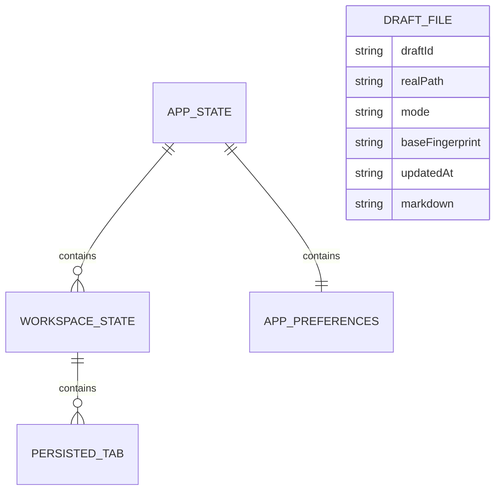

# 产品成熟度第一阶段设计文档

## 一、修订历史

| 版本号 | 修订内容 | 修订时间 | 修订人 |
|---|---|---|---|
| V1.0.0 | 新建初稿，覆盖未保存正文恢复、文件监听、全文搜索、UI 精修 | 2026-06-09 | Codex |

## 二、需求信息

### 2.1 需求背景

- 背景：MDX 已具备可打包桌面 MVP 能力，包括 Document Mode、Workspace Mode、文件树、多标签、目录、CLI、LLM Wiki、状态恢复和大量边界测试。但当前仍存在真实长期使用的信任缺口和可用性短板。
- 需求目的：把产品从“可试用 MVP”推进到第一阶段成熟版本，优先解决未保存内容丢失风险、外部文件变更不同步、工作区正文不可搜索和界面工程感偏重的问题。
- 目标用户/使用方：本地 Markdown 写作者、长期维护本地知识库的用户、使用 raw 目录存放资料并通过 MDX 管理 Markdown 工作区的用户。
- 需求链接：无外部链接，来源为本轮对产品成熟度评价的澄清。
- 关联原始材料：`.loopx/intake/clarify-product-maturity-20260609-183343.md`。

### 2.2 需求范围

- 本期范围：
  - Workspace Mode 和 Document Mode 的未保存正文草稿恢复。
  - 只读 diff viewer，用于草稿恢复和外部修改冲突处理。
  - Workspace Mode 和 Document Mode 的文件监听与外部变更处理。
  - 当前 Workspace root 下 `.md` / `.markdown` 的按需全文搜索，默认包含 `raw/`。
  - 搜索上限配置。
  - UI 精修，包括图标、状态层级、错误/冲突提示、设置弹窗、LLM Wiki 面板和窄宽适配。
  - README.zh-CN.md 和 README.md 更新。
  - 最终打包并安装到 `/Applications/MDX.app`。
- 非目标：
  - LLM Wiki onboarding。
  - 发布/自动更新链路。
  - 自动更新、签名公证、崩溃上报、外部发布闭环。
  - 工作区多根。
  - 实时全文索引。
  - 正则搜索、模糊搜索、语义搜索。
  - PDF、图片、二进制、`.mdx` 搜索。
  - 可编辑三方 merge 或逐块合并器。
  - 大规模 redesign、品牌色重设、营销式视觉。
- 决策边界：
  - 第一阶段一次性交付四块能力，但实现内部可按依赖顺序推进。
  - `state.json` 继续负责偏好、窗口、tab 状态；草稿正文单独存储。
  - 草稿允许明文保存在本机，必须做权限收紧和文档说明。
  - 文件监听由 Rust 后端实现，前端通过 Tauri event 消费。
  - 全文搜索由后端按需扫描，支持取消、上限和配置。
  - 允许新增 `lucide-react` 和 Rust `notify`。
- 依赖方：
  - Tauri/Rust 文件系统能力。
  - 当前 Workspace/Document 状态机。
  - 当前编辑器组件的打开、保存、滚动定位能力。
  - 当前 AppPreferences/state store。
  - 当前 UI 控件体系。
- 约束条件：
  - 不允许静默覆盖用户未保存内容。
  - 不能让大 workspace 或 raw 目录搜索冻结 UI。
  - 文件监听不能把应用自身写入误判为外部冲突。
  - Document Mode 不能变成隐形 workspace。
  - 第一版 diff viewer 只读，不承担合并编辑能力。

### 2.3 可行性分析

- 业务可行性：四块能力直接对应产品成熟度短板，能显著提升写作工具信任感和日常可用性。
- 技术可行性：现有代码已有状态持久化、文件读写安全边界、Document/Workspace dirty 状态、当前文档查找和 UI 控件基础，可扩展实现。
- 团队接受能力：范围较大但需求边界已经明确；需要先按设计文档拆计划，避免直接编码造成状态机混乱。
- 时间成本：一次性交付预计为中等偏大工作量，重点在状态机、Tauri 命令/事件、watcher、diff viewer 和搜索 UI。
- 资源成本：新增前端依赖 `lucide-react`；新增 Rust 监听依赖 `notify`。
- 替代方案：
  - 草稿写入 `state.json`：拒绝。会让状态文件膨胀并混淆窗口状态和正文恢复职责。
  - 文件监听用前端轮询：拒绝。性能、实时性和桌面语义较弱。
  - 全文搜索实时索引：拒绝。第一版生命周期和一致性成本过高。
  - 不做 diff viewer：拒绝。用户已明确要求第一版加入。
- 关键风险：
  - 同一路径在 Workspace 和 Document 两边同时编辑导致草稿所有权冲突。
  - iCloud 路径文件事件可能批量、延迟或乱序。
  - raw 目录数据量大，全文搜索性能压力高。
  - 明文草稿有隐私感知风险。

## 三、概要设计

### 3.1 方案总述

- 设计目标：
  - 未保存正文可恢复且不被静默覆盖。
  - 外部文件变化可感知、可同步、可冲突处理。
  - 工作区 Markdown 正文可搜索，包含 raw 下 Markdown。
  - UI 从工程面板感提升为稳定、清晰、可长期使用的桌面工具体验。
- 总体思路：
  - 新增独立 Draft Store 管理 `~/.mdx/drafts/`。
  - 新增 Watch Service 监听 workspace/document 文件变化，经 event 通知前端。
  - 新增 Search Service 后端按需扫描 Markdown，前端左侧面板展示结果。
  - 新增 Conflict/Diff UI，统一处理草稿恢复和外部修改冲突。
  - 扩展 AppPreferences 存储搜索和 watcher 配置。
  - 引入 `lucide-react` 统一主要工具图标。
- 核心模块：
  - Draft Store。
  - Draft Recovery Coordinator。
  - File Watch Service。
  - External Change Resolver。
  - Workspace Full Text Search。
  - Diff Viewer。
  - UI Icon/System polish。
- 主要难点：
  - 草稿、dirty、磁盘指纹、外部事件之间的状态一致性。
  - Workspace/Document 跨模式同一路径所有权。
  - watcher 事件去重和自写入事件过滤。
  - 搜索取消、结果限制和 dirty tab 内容覆盖。
- 技术指标：
  - 10k Markdown 文件搜索不冻结 UI。
  - 搜索输入期间上一轮可取消。
  - watcher 批量事件 debounce/coalesce。
  - 草稿保存 debounce 1-2 秒，关闭/切换/退出前 flush。

### 3.2 整体架构设计

- 业务模式：
  - Document Mode：单文档编辑、单文档草稿恢复、单文档监听。
  - Workspace Mode：多 tab、工作区文件树、全文搜索、workspace 草稿恢复、workspace 监听。
- 系统边界：
  - 前端负责 UI、状态协调、提示、diff viewer、dirty tab 搜索覆盖。
  - Rust 后端负责安全文件读写、草稿存储、搜索扫描、文件监听、权限和路径保护。
- 上下游系统：
  - 无外部服务。
  - Tauri event 是 Rust 与前端之间的消息通道。
- 应用架构：
  - 现有 workspace/document shell 上增加 draft/watch/search hooks。
  - 现有 state store 增加 preferences 字段，不存正文。
  - Rust 新增模块建议：
    - `draft_store.rs`
    - `workspace_search.rs`
    - `file_watch.rs`
- 技术架构：
  - 草稿：JSON 或结构化文件，原子写入，权限收紧。
  - 文件监听：`notify` watcher + debounce/coalesce + fingerprint。
  - 搜索：后端任务扫描 + request id/cancel token + bounded results。
  - UI：React 状态机 + Tauri commands/events。
- 数据流转：
  - 编辑器内容变 dirty -> 前端 debounce -> `draft_save` -> `~/.mdx/drafts/<hash>.json`。
  - 启动/打开文件 -> `draft_list`/`draft_get` -> 恢复 banner -> diff modal -> 用户选择 -> 草稿删除或恢复。
  - watcher event -> 前端按路径匹配打开 tab/document -> 指纹确认 -> 自动刷新或冲突 banner。
  - 搜索输入 -> 后端扫描磁盘 + 前端传入 dirty tab overrides -> 返回 bounded results。

### 3.3 核心流程设计

| 流程 | 触发条件 | 参与系统/模块 | 主流程 | 异常/补偿 | 输出 |
|---|---|---|---|---|---|
| 草稿自动保存 | 编辑内容 dirty | Editor、Draft Coordinator、Draft Store | debounce 后保存正文和元数据 | 保存失败显示非阻塞错误，关闭/切换时再次 flush | 本地 draft 文件 |
| 草稿恢复 | 启动/打开文件发现 draft | Draft Store、Recovery UI、Diff Viewer | 提示草稿，用户查看差异并选择恢复/丢弃/稍后 | 原文件不存在走孤立草稿流程 | 编辑器内容恢复或草稿删除 |
| 外部修改处理 | watcher 发现打开文件变化 | Watch Service、External Change Resolver | 无 dirty 自动刷新；dirty 显示冲突 banner 和 diff | 指纹确认失败则忽略或重试 | 文件内容同步或冲突待处理 |
| 外部删除处理 | watcher 发现打开文件删除 | Watch Service、Tab/Document State | 保留 tab/document，显示删除提示 | 父目录不存在时禁用恢复原路径 | 用户另存为/恢复/关闭 |
| 全文搜索 | 用户在左侧搜索输入全文查询 | Search UI、Search Service | 取消旧请求，扫描 Markdown，合并 dirty tab override，返回结果 | 超限显示截断/跳过提示 | 搜索结果列表 |
| UI 精修 | 第一阶段改版 | UI components | 替换字符图标、调整状态层级、适配窄宽 | 不改变三栏架构 | 更成熟的界面 |

### 3.4 功能模块

| 模块 | 职责 | 关键功能 | 依赖 | 备注 |
|---|---|---|---|---|
| Draft Store | 草稿持久化 | 保存、读取、列出、删除、清理过期草稿 | Rust FS、安全路径 | 不写入原文件 |
| Draft Coordinator | 前端草稿状态协调 | debounce、flush、恢复提示、跨模式所有权 | Workspace/Document state | 处理 banner 和 diff modal |
| Watch Service | 文件监听 | workspace/document watch、event coalesce、自写过滤 | `notify`、Tauri event | 默认开启，可关闭 |
| External Change Resolver | 外部变化解析 | 自动刷新、冲突提示、删除/重命名处理 | fingerprint、dirty state | 复用 diff viewer |
| Full Text Search | 工作区搜索 | 按需扫描、取消、上限、dirty override | Rust FS、preferences | 默认包含 raw |
| Search UI | 搜索入口和结果 | 左侧区域、模式切换、结果点击定位 | Workspace shell、editor scroll | 不破坏文件树 |
| Diff Viewer | 差异查看 | 只读对比、高亮增删改、动作按钮 | React UI | 不做合并器 |
| UI Polish | 精修 | 图标、状态、错误、窄宽、设置 | `lucide-react` | 保留布局 |

### 3.5 新增/调整功能说明

- Workspace Mode：
  - 支持 workspace 草稿恢复、watcher、全文搜索、搜索配置、外部变更冲突提示。
  - 左侧文件树区域新增全文搜索入口和结果展示。
  - 打开的 dirty tab 参与搜索。
- Document Mode：
  - 支持当前文档草稿恢复、当前文档监听、外部变更冲突提示。
  - 不提供全文搜索，不监听整个父目录。
- 设置：
  - 新增搜索配置组。
  - 新增文件监听开关。
  - 增加本地草稿说明入口或文案。
- README：
  - 更新能力范围和隐私说明。

## 四、详细设计

### 4.1 未保存正文恢复详细设计

#### 4.1.1 需求内容

- 入口：Workspace tab 编辑器、Document Mode 编辑器。
- 操作人/调用方：用户编辑 Markdown；前端自动保存草稿。
- 前置条件：文件是 `.md` 或 `.markdown`；内容 dirty。
- 输出结果：本地草稿文件；启动/打开时恢复提示。

#### 4.1.2 方案设计

- 核心逻辑：
  - 每个真实文件路径对应一个 draft id，建议为 canonical path + namespace 的 SHA-256 或稳定 hash。
  - 前端在编辑器 dirty 后 1-2 秒 debounce 调用 `draft_save`。
  - 保存原文件成功后调用 `draft_delete`。
  - tab 切换、关闭窗口、应用退出前调用 flush。
  - 启动 workspace 时调用 `draft_list_for_workspace(root)` 获取数量和路径摘要。
  - 打开文件时调用 `draft_get_for_path(path)` 判断是否需要文件级恢复提示。
  - Document Mode 打开当前文档时只检查当前路径 draft。
- 状态流转：
  - `none` -> `dirtyPendingSave` -> `draftSaved` -> `recoveryAvailable` -> `restored` / `discarded` / `deferred`。
  - 保存成功后：任意状态 -> `none`。
- 数据变更：
  - 写入 `~/.mdx/drafts/<draftId>.json`。
  - 删除草稿时移除对应文件。
  - 清理过期草稿时批量删除 `updatedAt` 超过 30 天的文件。
- 幂等设计：
  - 同一路径重复保存覆盖同一 draft id。
  - 删除不存在草稿返回成功。
  - 恢复草稿不删除草稿，直到用户保存成功或明确丢弃。
- 权限/越权控制：
  - 草稿 API 只接受 canonicalized `.md` / `.markdown` 文件路径。
  - 草稿文件写入只发生在 `~/.mdx/drafts/`。
  - Unix 下草稿文件权限尽量设为 `0600`，目录 `0700`。
- 异常处理：
  - 草稿保存失败显示非阻塞提示，不改变 dirty。
  - 草稿 JSON 损坏时隔离为 corrupt 文件或忽略并记录日志，不阻塞应用启动。
  - 原文件不存在进入孤立草稿流程。
- 补偿/重试：
  - debounce 保存失败后，下一次编辑、tab 切换、关闭/退出前 flush 再尝试。
- 日志与审计：
  - 本地日志记录草稿读写失败、清理失败、恢复/丢弃动作。不记录正文内容。

#### 4.1.3 流程步骤

1. 用户编辑 Markdown，tab/document 变 dirty。
2. 前端启动 debounce。
3. debounce 到期后调用 `draft_save`，传入 real path、markdown、当前磁盘 fingerprint、mode。
4. 后端原子写入 draft 文件。
5. 用户保存原文件成功后，前端调用 `draft_delete`。
6. 用户重新启动或打开文件时，前端查询 draft。
7. 如存在 draft，显示 banner；用户可打开 diff viewer。
8. 用户选择恢复、保留磁盘版本或稍后处理。

#### 4.1.4 边界条件

| 场景 | 处理方式 | 用户/调用方感知 | 监控/告警 |
|---|---|---|---|
| 原文件不存在 | 孤立草稿提示，允许另存为/恢复原路径/删除/稍后 | 高优先级 banner | 本地日志 |
| 原路径父目录不存在 | 禁用恢复原路径 | 动作不可用并说明 | 无 |
| 草稿损坏 | 忽略或隔离 corrupt | 可显示“草稿无法读取” | 本地日志 |
| Workspace 和 Document 同一路径 | 以活跃 dirty 所有者为准，另一侧提示已有编辑 | 不自动恢复第二份 | 本地日志 |
| 用户保存成功 | 删除草稿 | 无额外提示或短提示 | 无 |

### 4.2 Diff Viewer 详细设计

#### 4.2.1 需求内容

- 入口：草稿恢复 banner、外部修改冲突 banner。
- 操作人/调用方：用户。
- 前置条件：存在两份可对比 Markdown 内容。
- 输出结果：用户选择恢复/保留/稍后/重新加载/另存为等动作。

#### 4.2.2 方案设计

- 核心逻辑：
  - 输入为 `left` 和 `right` 两份文本及标题。
  - 草稿恢复：左侧可为磁盘版本，右侧为草稿版本。
  - 外部冲突：左侧为当前编辑内容，右侧为最新磁盘内容。
  - 使用行级 diff，标记新增、删除、修改。
  - 第一版只读，不支持逐块合并。
- 状态流转：
  - `bannerVisible` -> `diffOpen` -> `actionSelected` -> `resolved` 或 `deferred`。
- 数据变更：
  - diff 本身不写数据。
  - 动作触发恢复编辑器内容、删除草稿、重新加载磁盘或另存为。
- 幂等设计：
  - 重复打开 diff 不改变数据。
  - “稍后处理”只关闭 modal，保留 banner/draft。
- 异常处理：
  - diff 生成失败时 fallback 展示两份纯文本和动作按钮。

#### 4.2.3 流程步骤

1. 用户点击 banner 的“查看差异”。
2. 前端读取需要对比的内容。
3. Diff viewer 生成行级对比。
4. 用户选择动作。
5. 前端按动作更新编辑器、草稿或磁盘。

#### 4.2.4 边界条件

| 场景 | 处理方式 | 用户/调用方感知 | 监控/告警 |
|---|---|---|---|
| 超大文本 diff | 可限制 diff 大小，fallback 文本预览 | 提示内容过大 | 本地日志 |
| 二者相同 | 显示无差异，允许删除草稿/关闭提示 | 明确“无差异” | 无 |
| 文件读取失败 | 显示失败并保留原动作 | 错误提示 | 本地日志 |

### 4.3 文件监听与外部变更详细设计

#### 4.3.1 需求内容

- 入口：Workspace root 打开、Document Mode 文件打开、设置开关启用。
- 操作人/调用方：后端 watcher，前端 shell。
- 前置条件：文件监听配置开启。
- 输出结果：文件树刷新、打开文件内容刷新、冲突提示。

#### 4.3.2 方案设计

- 核心逻辑：
  - Rust 后端维护 watcher registry。
  - Workspace Mode 调用 `watch_start_workspace(rootPath, windowLabel)`。
  - Document Mode 调用 `watch_start_document(realPath, windowLabel)`。
  - watcher 事件 coalesce 后通过 Tauri event 发送：
    - `mdx-file-changed`
    - `mdx-file-deleted`
    - `mdx-file-renamed`
    - `mdx-file-created`
    - `mdx-watch-error`
  - 前端接收事件后按路径匹配 tab/document。
  - 对打开文件做指纹确认，避免处理重复/无实际变化事件。
  - 应用保存前登记 pending self-write，保存完成后更新 fingerprint；对应事件不弹冲突。
- 状态流转：
  - `watching` -> `eventPending` -> `coalesced` -> `resolvedNoDirty` / `conflictDirty` / `deleted`。
- 数据变更：
  - watcher 不直接写文件。
  - 无 dirty 自动刷新时更新 editor markdown、savedMarkdown、fingerprint。
  - 重命名可靠匹配时更新 tab path/title。
- 幂等设计：
  - 重复 change event 通过 fingerprint 忽略。
  - stop watcher 可重复调用。
- 权限/越权控制：
  - watcher 只监听当前 workspace root 或当前 document path 相关范围。
  - 不跟随 symlink 到 workspace 外执行文件读写。
- 异常处理：
  - watcher 启动失败显示非阻塞错误，并允许继续编辑。
  - 监听错误 event 显示状态并建议刷新。
- 补偿/重试：
  - watcher 失败可由用户刷新或切换设置重新启动。
- 日志与审计：
  - 记录 watcher 启动失败、路径异常、事件处理失败。

#### 4.3.3 流程步骤

1. 打开 workspace/document。
2. 前端根据 preference 请求后端启动 watcher。
3. 后端创建 `notify` watcher 并绑定 window label。
4. 文件事件发生，后端 debounce/coalesce。
5. 后端发送 Tauri event。
6. 前端刷新文件树或打开文件状态。
7. 如 dirty 冲突，显示 banner 和 diff viewer。

#### 4.3.4 边界条件

| 场景 | 处理方式 | 用户/调用方感知 | 监控/告警 |
|---|---|---|---|
| 应用自己保存 | self-write 标记过滤冲突 | 不弹冲突 | 本地日志可记录 |
| LLM Wiki 写入 clean tab | 刷新文件树和内容 | 内容更新 | 无 |
| LLM Wiki 写入 dirty tab | 显示冲突 | 高优先级 banner | 本地日志 |
| 外部删除 clean tab | 保留 tab，显示删除提示 | 可关闭/另存为 | 无 |
| 外部删除 dirty tab | 保留内容，提示另存为/恢复 | 高优先级 banner | 本地日志 |
| 重命名无法可靠匹配 | 当作删除 + 新增 | 文件树变化，tab 可能提示旧路径删除 | 无 |

### 4.4 工作区全文搜索详细设计

#### 4.4.1 需求内容

- 入口：Workspace 左侧文件树区域。
- 操作人/调用方：用户输入搜索词。
- 前置条件：Workspace Mode 已打开 root。
- 输出结果：匹配结果列表，可点击打开并滚动到匹配行。

#### 4.4.2 方案设计

- 核心逻辑：
  - 左侧区域保留文件名过滤能力，新增全文搜索模式或入口。
  - 输入 debounce 300ms 后发起搜索。
  - 前端为每次请求生成 request id，取消上一轮。
  - 后端扫描 `.md` / `.markdown`，默认包含 raw。
  - 跳过隐藏目录、`.git`、`node_modules`、二进制、超大文件。
  - 前端将已打开 dirty tab 的内容作为 overrides 传给后端或在前端合并搜索结果；推荐传给后端统一匹配和排序。
  - 返回路径、行号、列范围、匹配行、上下文、是否 dirty override。
  - 点击结果打开文件并滚动到匹配行。
- 状态流转：
  - `idle` -> `typing` -> `searching` -> `partial/complete` -> `cancelled` 或 `error`。
- 数据变更：
  - 不写文件。
  - preferences 可更新搜索上限。
- 幂等设计：
  - 同一 query 重复搜索返回同样结果，受磁盘和 dirty override 变化影响。
  - 旧 request 结果到达时如果 request id 不是当前，丢弃。
- 权限/越权控制：
  - 搜索路径必须在 workspace root 内。
  - 不读取 symlink 指向 workspace 外的文件。
- 异常处理：
  - 单文件读取失败计入 skipped/error summary，不让整次搜索失败。
  - 后端整体失败显示搜索错误。
- 补偿/重试：
  - 用户修改 query 或点击重试重新发起。
- 日志与审计：
  - 不记录搜索词到持久日志，除非已有开发日志。避免隐私问题。

#### 4.4.3 流程步骤

1. 用户在左侧输入全文搜索关键词。
2. 前端 debounce。
3. 前端取消上一轮请求。
4. 前端收集 dirty tab overrides。
5. 调用搜索命令。
6. 后端扫描并返回 bounded results。
7. 前端展示结果和 skipped/truncated summary。
8. 用户点击结果，打开文件并滚动到行。

#### 4.4.4 边界条件

| 场景 | 处理方式 | 用户/调用方感知 | 监控/告警 |
|---|---|---|---|
| 查询为空 | 不搜索或显示空状态 | 搜索结果清空 | 无 |
| 文件超过大小上限 | 跳过并计数 | 显示“跳过 N 个大文件” | 无 |
| 结果超过上限 | 截断 | 显示“仅显示前 N 条” | 无 |
| dirty tab 匹配 | 使用编辑器内容 | 结果标记“未保存” | 无 |
| 文件被搜索中删除 | 单文件跳过 | skipped summary | 本地日志可选 |

### 4.5 UI 精修详细设计

#### 4.5.1 需求内容

- 入口：主 workspace UI、Document Mode、设置、LLM Wiki 面板、文件树、搜索结果、冲突提示。
- 操作人/调用方：用户。
- 前置条件：无。
- 输出结果：更统一、清晰、成熟的桌面 UI。

#### 4.5.2 方案设计

- 核心逻辑：
  - 新增 `lucide-react`。
  - 统一 `IconButton` icon 尺寸和状态，字符图标替换为 lucide 图标。
  - 状态提示分层：
    - 顶部短消息用于轻量反馈。
    - tab/editor 上方 banner 用于草稿、冲突、删除。
    - modal 用于 diff 和明确决策。
  - 搜索结果、失败明细、LLM Wiki 进度均使用可滚动区域，并保证主要进度优先显示。
  - 设置弹窗增加搜索和文件监听配置组。
  - 保留 light/dark 和 daisyUI，不重做主题。
- 状态流转：
  - 不涉及独立业务状态，跟随各功能模块。
- 数据变更：
  - preferences 中新增配置项。
- 异常处理：
  - UI 不应因长路径、长错误、窄窗口溢出。

#### 4.5.3 流程步骤

1. 引入图标库并建立统一映射或直接替换主要按钮。
2. 调整公共控件样式。
3. 增加 banner/diff/search result UI。
4. 调整设置弹窗。
5. 截图验证宽屏和窄窗口。

#### 4.5.4 边界条件

| 场景 | 处理方式 | 用户/调用方感知 | 监控/告警 |
|---|---|---|---|
| 长路径/长错误 | break words + scroll | 不溢出 | 无 |
| 窄窗口 | 面板内滚动和固定尺寸 | 控件可用 | 截图验证 |
| 暗色主题 | 沿用 token | 对比度可读 | 截图验证 |

## 五、存储类设计

### 5.1 库表设计

#### 5.1.1 数据库模型图

不涉及数据库。使用本地文件存储。



#### 5.1.2 表结构

| 表名 | 用途 | 主键 | 关键索引 | 数据量预估 | 备注 |
|---|---|---|---|---|---|
| `~/.mdx/state.json` | 应用偏好、窗口、workspace tab 元数据 | 不适用 | recentWorkspaceRoot | 小 | 继续不存 Markdown 正文 |
| `~/.mdx/drafts/<draftId>.json` | 单文件未保存草稿 | draftId | realPath | 小到中 | 明文本地保存 |

字段明细：

| 字段 | 类型 | 是否必填 | 默认值 | 含义 | 来源/取值逻辑 | 备注 |
|---|---|---|---|---|---|---|
| `draftId` | string | 是 | 无 | 草稿 ID | canonical real path hash | 文件名也使用该 ID |
| `realPath` | string | 是 | 无 | 原文件真实路径 | 后端 canonicalize | 用于恢复和匹配 |
| `displayPath` | string | 否 | 空 | 展示路径 | 前端/后端传入 | UI 用 |
| `mode` | string | 是 | `workspace` | 来源模式 | workspace/document | 草稿按路径共享，mode 为最近来源 |
| `baseFingerprint` | string | 否 | null | 保存草稿时磁盘指纹 | 当前文件 fingerprint | 判断磁盘是否变化 |
| `updatedAt` | string | 是 | 当前时间 | 草稿更新时间 | 后端生成 | 清理过期 |
| `markdown` | string | 是 | 空 | 草稿正文 | 编辑器内容 | 明文 |

AppPreferences 新增字段建议：

| 字段 | 类型 | 是否必填 | 默认值 | 含义 | 来源/取值逻辑 | 备注 |
|---|---|---|---|---|---|---|
| `fileWatchEnabled` | boolean | 否 | true | 是否启用文件监听 | 设置 | 动态生效需重启 watcher |
| `searchMaxFileBytes` | number | 否 | 2097152 | 单文件搜索最大读取字节 | 设置 | 2 MB |
| `searchMaxResults` | number | 否 | 200 | 单次最大结果数 | 设置 | bounded |
| `searchMaxMatchesPerFile` | number | 否 | 20 | 单文件最大匹配数 | 设置 | bounded |

### 5.2 数据迁移/初始化

- DDL：不涉及。
- DML：不涉及。
- 数据回填：
  - `state.json` 新字段通过 serde/default 和前端 normalizeAppState 默认值兼容。
  - 首次启动创建 `~/.mdx/drafts/`。
- 老数据兼容：
  - 旧 `state.json` 没有新 preferences 时使用默认值。
  - 旧 workspace tab dirty 但没有 draft 时，仅保留 dirty 标记，不制造草稿。
- 新老系统读写关系：
  - 新版本写入新 preferences；旧版本忽略未知字段的能力取决于 serde 结构。需要确认 Rust 反序列化是否允许未知字段，默认 serde 对 struct 会忽略未知字段。

### 5.3 缓存设计

| 场景 | Key | Value | 数据结构 | 过期时长 | 容量预估 | 失效/刷新策略 |
|---|---|---|---|---|---|---|
| 草稿 | draftId | Draft metadata + markdown | JSON file | 30 天默认保留 | 取决于 dirty 文件数 | 保存成功/丢弃/过期删除 |
| watcher self-write | realPath | 写入事务/fingerprint/时间 | 内存 map | 数秒 | 小 | 事件匹配后删除或超时删除 |
| 搜索请求 | requestId | cancel token | 内存 map | 请求结束 | 小 | 取消或完成删除 |

## 六、其他组件设计

### 6.1 消息设计

| 场景 | Group | Topic | 生产者 | 消费者 | 幂等键 | 失败补偿 |
|---|---|---|---|---|---|---|
| 文件变化 | Tauri event | `mdx-file-changed` | Rust Watch Service | Workspace/Document 前端 | path + fingerprint | 前端指纹确认 |
| 文件删除 | Tauri event | `mdx-file-deleted` | Rust Watch Service | Workspace/Document 前端 | path + event time | 保留 tab 并提示 |
| 文件重命名 | Tauri event | `mdx-file-renamed` | Rust Watch Service | Workspace 前端 | oldPath + newPath | 不可靠时删除+新增 |
| watcher 错误 | Tauri event | `mdx-watch-error` | Rust Watch Service | 前端 shell | watcher id | 提示并允许刷新 |
| LLM Wiki 文件更新 | 现有或新增 Tauri event | 复用文件变化事件 | Rust/LLM Wiki | Workspace 前端 | path | 刷新树/内容 |

### 6.2 配置设计

| 配置项 | 环境 | 默认值 | 是否动态生效 | 说明 | 风险 |
|---|---|---|---|---|---|
| `fileWatchEnabled` | 本地 | true | 是 | 启用/关闭文件监听 | 关闭后外部变更不同步 |
| `searchMaxFileBytes` | 本地 | 2097152 | 是 | 单文件搜索最大读取字节 | 太大可能卡顿 |
| `searchMaxResults` | 本地 | 200 | 是 | 单次最大结果 | 太大影响 UI |
| `searchMaxMatchesPerFile` | 本地 | 20 | 是 | 单文件最大匹配 | 太大结果噪声 |
| search debounce | 内部 | 300ms | 是 | 输入防抖，不暴露设置 | 过短请求频繁 |
| draft retention | 内部 | 30 天 | 否/可后续设置 | 草稿保留期 | 太短可能误清 |

### 6.3 定时任务/批处理

| 任务 | 触发时间 | 处理范围 | 幂等 | 失败重试 | 影响评估 |
|---|---|---|---|---|---|
| 草稿过期清理 | 应用启动、可选每日一次 | `~/.mdx/drafts/` | 删除不存在即成功 | 下次启动再清 | 释放磁盘，避免长期留存 |
| watcher event coalesce | 文件事件后短延迟 | 当前 watcher 批量事件 | path 去重 | 下一批事件处理 | 降低刷新风暴 |

### 6.4 技术组件

- 分布式锁：不涉及。
- 唯一 ID：draftId 使用真实路径 hash；搜索 request id 用前端生成或后端生成。
- 加解密/验签：第一版不加密。Unix 权限收紧到当前用户。
- 字典转换：前后端字段使用 camelCase。
- Excel/文件处理：不涉及。
- 用户信息透传：不涉及。
- 限流/熔断：搜索通过取消、结果上限、文件大小上限控制。

## 七、接口设计

### 7.1 接口设计原则

- Tauri 命令参数必须明确 root/path 限制。
- 非纯查询命令必须说明幂等。
- 文件写入必须沿用安全路径和原子写入策略。
- 不返回不必要的 Markdown 正文，除非恢复/diff 必需。
- 搜索不持久化搜索词。

### 7.2 接口清单

| 接口 | 调用方 | 服务方 | 权限/认证 | 幂等 | 文档地址 | 备注 |
|---|---|---|---|---|---|---|
| `draft_save` | 前端 | Tauri/Rust | 本地 app | 是 | 本文 | 保存/覆盖同一路径草稿 |
| `draft_get` | 前端 | Tauri/Rust | 本地 app | 查询 | 本文 | 按真实路径取草稿 |
| `draft_list_for_workspace` | 前端 | Tauri/Rust | 本地 app | 查询 | 本文 | workspace 启动集中提醒 |
| `draft_delete` | 前端 | Tauri/Rust | 本地 app | 是 | 本文 | 丢弃/保存成功后删除 |
| `draft_cleanup_expired` | 前端/启动 | Tauri/Rust | 本地 app | 是 | 本文 | 清理 30 天过期 |
| `watch_start_workspace` | 前端 | Tauri/Rust | 本地 app | 是 | 本文 | 启动 workspace watcher |
| `watch_start_document` | 前端 | Tauri/Rust | 本地 app | 是 | 本文 | 启动 document watcher |
| `watch_stop` | 前端 | Tauri/Rust | 本地 app | 是 | 本文 | 停止 watcher |
| `workspace_search` | 前端 | Tauri/Rust | 本地 app | 查询 | 本文 | 按需全文搜索 |
| `workspace_search_cancel` | 前端 | Tauri/Rust | 本地 app | 是 | 本文 | 取消搜索 |

### 7.3 接口明细

#### 7.3.1 `draft_save`

- 路径/方法：Tauri command。
- 请求参数：
  - `realPath: string`
  - `displayPath?: string`
  - `markdown: string`
  - `baseFingerprint?: string`
  - `mode: "workspace" | "document"`
- 响应参数：
  - `draftId: string`
  - `updatedAt: string`
- 错误码：
  - `draft_path_failed`
  - `draft_write_failed`
  - `invalid_markdown_path`
  - `state_path_failed`
- 业务校验：
  - realPath 必须是 `.md` / `.markdown`。
  - 不写入 `~/.mdx/drafts/` 之外。
- 数据变更：写入或覆盖草稿。
- 日志字段：draftId、realPath hash、错误码；不记录正文。

#### 7.3.2 `draft_get`

- 路径/方法：Tauri command。
- 请求参数：
  - `realPath: string`
- 响应参数：
  - `draft: DraftRecord | null`
  - `fileExists: boolean`
  - `currentFingerprint?: string`
- 错误码：
  - `draft_read_failed`
  - `invalid_markdown_path`
- 业务校验：realPath 必须是 Markdown 路径。
- 数据变更：无。
- 日志字段：错误码。

#### 7.3.3 `draft_list_for_workspace`

- 路径/方法：Tauri command。
- 请求参数：
  - `rootPath: string`
- 响应参数：
  - `drafts: DraftSummary[]`
- 错误码：
  - `draft_scan_failed`
  - `path_failed`
- 业务校验：只返回 root 内草稿。
- 数据变更：无。
- 日志字段：数量、错误码。

#### 7.3.4 `draft_delete`

- 路径/方法：Tauri command。
- 请求参数：
  - `draftId?: string`
  - `realPath?: string`
- 响应参数：
  - `deleted: boolean`
- 错误码：
  - `draft_delete_failed`
- 业务校验：必须提供 draftId 或 realPath。
- 数据变更：删除草稿文件。
- 日志字段：draftId、错误码。

#### 7.3.5 `watch_start_workspace`

- 路径/方法：Tauri command。
- 请求参数：
  - `rootPath: string`
  - `windowLabel: string`
- 响应参数：
  - `watchId: string`
- 错误码：
  - `watch_start_failed`
  - `path_failed`
- 业务校验：root 必须是当前 workspace root。
- 数据变更：后端 watcher registry 增加 watcher。
- 日志字段：watchId、root hash、错误码。

#### 7.3.6 `watch_start_document`

- 路径/方法：Tauri command。
- 请求参数：
  - `realPath: string`
  - `windowLabel: string`
- 响应参数：
  - `watchId: string`
- 错误码：
  - `watch_start_failed`
  - `invalid_markdown_path`
- 业务校验：realPath 必须是 Markdown 文件。
- 数据变更：后端 watcher registry 增加 watcher。
- 日志字段：watchId、path hash。

#### 7.3.7 `workspace_search`

- 路径/方法：Tauri command。
- 请求参数：
  - `rootPath: string`
  - `query: string`
  - `caseSensitive: boolean`
  - `maxFileBytes: number`
  - `maxResults: number`
  - `maxMatchesPerFile: number`
  - `dirtyOverrides: Array<{ path: string; markdown: string }>`
  - `requestId: string`
- 响应参数：
  - `requestId: string`
  - `results: SearchResult[]`
  - `skippedLargeFiles: number`
  - `skippedUnreadableFiles: number`
  - `truncated: boolean`
  - `searchedFiles: number`
- 错误码：
  - `search_failed`
  - `search_cancelled`
  - `path_failed`
- 业务校验：
  - query trim 后为空则返回空结果。
  - rootPath 必须是当前 workspace root。
  - dirty override path 必须在 root 内且为 Markdown。
- 数据变更：无。
- 日志字段：requestId、结果数量、跳过数量；不记录 query。

#### 7.3.8 `draft_cleanup_expired`

- 路径/方法：Tauri command。
- 请求参数：
  - `retentionDays: number`
- 响应参数：
  - `deleted: number`
  - `kept: number`
- 错误码：
  - `draft_cleanup_failed`
- 业务校验：
  - retentionDays 必须为正数。
  - 默认值为 30。
- 数据变更：删除超过保留期的草稿文件。
- 日志字段：删除数量、保留数量、错误码。

#### 7.3.9 `watch_stop`

- 路径/方法：Tauri command。
- 请求参数：
  - `watchId: string`
- 响应参数：
  - `stopped: boolean`
- 错误码：
  - `watch_stop_failed`
  - `watch_not_found`
- 业务校验：watchId 必须来自 `watch_start_workspace` 或 `watch_start_document`。
- 数据变更：后端 watcher registry 移除 watcher。
- 日志字段：watchId、错误码。

#### 7.3.10 `workspace_search_cancel`

- 路径/方法：Tauri command。
- 请求参数：
  - `requestId: string`
- 响应参数：
  - `cancelled: boolean`
- 错误码：
  - `search_cancel_failed`
  - `search_request_not_found`
- 业务校验：requestId 必须是仍在执行或可取消的搜索请求。
- 数据变更：取消令牌置为取消状态。
- 日志字段：requestId、错误码。

## 八、系统发布

### 8.1 灰度方案

- 灰度范围：本地开发环境和用户本机 `/Applications/MDX.app`。
- 灰度开关：
  - 文件监听可通过设置关闭。
  - 搜索上限可通过设置调低/调高。
- 验证指标：
  - 草稿恢复场景通过手测和自动化测试。
  - watcher 外部修改/删除/重命名场景通过手测和单测。
  - 搜索不会冻结 UI，结果限制生效。
  - 宽屏/窄窗口截图无明显溢出。
- 放量节奏：本地安装验证后再考虑外部用户。

### 8.2 降级方案

- 降级触发条件：
  - watcher 异常频繁或影响性能。
  - 搜索大目录性能不可接受。
  - 草稿保存出现错误。
- 降级行为：
  - watcher 可设置关闭。
  - 搜索可降低结果/文件大小上限。
  - 草稿保存失败不阻塞编辑和保存原文件。
- 用户影响：
  - watcher 关闭后外部变化不实时同步。
  - 搜索上限降低后结果可能被截断。
  - 草稿保存失败时崩溃恢复能力下降。
- 恢复方式：
  - 修复配置或代码后重新启动应用。

### 8.3 关联系统/功能影响

| 系统/功能 | 影响 | 依赖动作 | 负责人 | 验证方式 |
|---|---|---|---|---|
| Workspace Mode | 新增草稿、watcher、搜索、冲突 UI | 修改 hooks/reducer/shell | 本项目 | 前端测试、手测 |
| Document Mode | 新增草稿、watcher、冲突 UI | 修改 document shell/state | 本项目 | 前端测试、手测 |
| Tauri 后端 | 新增 draft/search/watch commands | Rust 模块和命令注册 | 本项目 | cargo test |
| State Store | 新增 preferences | serde 默认兼容 | 本项目 | state_store_tests |
| README | 更新范围和隐私说明 | 文档修改 | 本项目 | 文档审阅 |

### 8.4 回滚方案

- 回滚条件：
  - 新版本草稿/watch/search 导致严重不可用。
  - 构建或安装后应用无法启动。
- 回滚步骤：
  - 使用上一版 `/Applications/MDX.app` 或重新安装旧 DMG。
  - 如 watcher 配置导致问题，关闭 `fileWatchEnabled`。
  - 如搜索性能问题，降低搜索配置上限。
- 数据回滚：
  - `state.json` 新字段可被旧版本忽略。
  - `~/.mdx/drafts/` 可保留，不影响旧版本；如需清理可手动删除。
- 配置回滚：
  - 删除新增 preferences 或恢复默认。
- 风险：
  - 回滚旧版本后不会读取新草稿，未保存恢复能力暂不可用。

## 九、系统监控与维护

### 9.1 监控与告警

- 系统异常：
  - 草稿读写失败。
  - watcher 启动失败。
  - 搜索任务失败。
- 业务异常：
  - 草稿损坏。
  - 外部冲突未解决。
  - 文件删除但 tab 仍打开。
- 重试异常：
  - 草稿保存失败后下次 flush 重试。
  - watcher 错误需用户刷新/重启 watcher。
- 超时：
  - 搜索请求可取消；超长扫描不应阻塞后续请求。
- 关键接口指标：
  - 搜索 scanned files、results、skipped、duration。
  - watcher coalesced events 数量。
  - draft save latency/failure。
- 告警渠道：
  - 本地 UI 提示和本地日志。第一阶段不做远程告警。

### 9.2 性能与容量

- TPS/吞吐：本地桌面单用户，不按服务端 TPS 设计。
- CPU/内存/磁盘 IO/网络 IO：
  - 搜索必须 bounded，避免 raw 大目录长时间占用。
  - watcher 批量事件 debounce，避免重复扫描。
  - 草稿写入 debounce，避免每次按键写盘。
- 数据容量：
  - 草稿数量等于未保存文件数量；默认 30 天清理。
  - 单个草稿大小等于 Markdown 正文大小。
- 缓存容量：
  - self-write map 和 cancel token 都是短生命周期内存。
- 跑批耗时：
  - 草稿清理在启动时执行，应限制遍历在 `~/.mdx/drafts/`。
- 是否压测：
  - 需要用测试目录或脚本验证 10k Markdown 文件搜索不会冻结 UI。

### 9.3 可靠性与兜底

- 幂等击穿：
  - draft save/delete 必须幂等。
  - watcher start/stop 必须可重复。
- 并发失效：
  - 同一路径 Workspace/Document 双编辑必须提示所有权/dirty 冲突。
  - 搜索旧请求返回必须按 request id 丢弃。
- 冷热备：不涉及。
- 关键任务独立性：
  - 草稿、watcher、搜索互相独立；任一失败不阻塞基础编辑和保存。
- 字段兜底：
  - preferences 新字段有默认值。
  - draft 缺少可选字段时仍可读取基本正文。
- 老新数据兼容：
  - 旧 state 可加载。
  - 新 drafts 不影响旧版本启动。

## 十、排期与规划

### 10.1 任务拆分与工作量评估

| 任务 | 范围 | 负责人 | 工作量 | 依赖 | 备注 |
|---|---|---|---|---|---|
| 草稿存储后端 | Draft Store commands、权限、清理 | 待计划分配 | 中 | state/path guard | P0 |
| Workspace/Document 草稿协调 | debounce、flush、恢复 banner | 待计划分配 | 中 | 草稿后端 | P0 |
| Diff Viewer | 只读 diff modal 和动作 | 待计划分配 | 中 | 草稿/冲突 UI | P0/P1 |
| 文件监听后端 | notify watcher、event coalesce | 待计划分配 | 中-大 | Tauri event | P1 |
| 外部变更处理 | 自动刷新、冲突、删除/重命名 | 待计划分配 | 大 | watcher、diff | P1 |
| 全文搜索后端 | scan/cancel/limits/dirty override | 待计划分配 | 中 | preferences | P1 |
| 搜索 UI | 左侧入口、结果、定位 | 待计划分配 | 中 | search backend | P1 |
| UI 精修 | lucide、状态层级、设置、窄宽 | 待计划分配 | 中 | 各功能 UI | P2 |
| 文档和验收 | README、打包安装、checksum | 待计划分配 | 小 | 全部功能 | 收尾 |

### 10.2 计划时间

- 数据方案评审：进入 `$plan` 前完成设计评审。
- 开发开始/结束：由 `$plan` 决定。
- CR：由 `$plan` 决定。
- 联调完成/提测：由 `$plan` 决定。
- 测试用例评审：由 `$plan` 决定。
- 测试开始/结束：由 `$plan` 决定。
- 预发布：不涉及外部预发布。
- 上线：本地打包并安装 `/Applications/MDX.app`。
- 线上验证：本机安装包验证。

### 10.3 发布计划

1. 需求设计评审。
2. `$plan` 拆分实现任务和验证点。
3. 按计划实现草稿、diff、watcher、搜索、UI、文档。
4. 跑完整验证命令。
5. `npx tauri build`。
6. 覆盖安装 `/Applications/MDX.app`。
7. 校验 installed app checksum。

### 10.4 遗留问题与后续规划

| 问题 | 影响 | 处理计划 | 负责人 | 截止时间 |
|---|---|---|---|---|
| LLM Wiki onboarding | 高级功能上手成本仍高 | 后续阶段单独设计 | 待定 | 后续 |
| 发布/自动更新链路 | 外部发布仍不完整 | 后续阶段补签名、公证、更新 | 待定 | 后续 |
| 草稿加密 | 明文草稿有隐私感知风险 | 后续评估密钥管理 | 待定 | 后续 |
| 实时全文索引 | 大 workspace 搜索仍需按需扫描 | watcher 稳定后再评估增量索引 | 待定 | 后续 |
| 正则/模糊/语义搜索 | 搜索能力有限 | 后续按用户反馈扩展 | 待定 | 后续 |

### 10.5 Planning Handoff

- `plan` 可以决定：
  - 具体文件拆分、函数命名、hook 命名、组件命名。
  - 具体 diff 算法实现方式，只要满足只读行级 diff。
  - watcher debounce 时间、search request id 具体实现。
  - `notify` 版本和 Tauri event payload 的局部字段细节。
  - UI 精修的具体 lucide 图标选择。
  - 测试文件组织和 staged verification 顺序。
- 必须返回 `spec` 的事项：
  - 草稿从明文改为加密。
  - diff viewer 从只读升级为逐块合并。
  - 全文搜索从按需扫描改为实时索引。
  - 文件监听扩大到多 root 或 Document Mode 父目录全量监听。
  - 搜索 PDF/raw binary。
  - 修改 `state.json` 以存储 Markdown 正文。
- 必须返回 `clarify` 的事项：
  - 用户改变一次性交付范围。
  - 用户要求加入 LLM Wiki onboarding 或自动更新链路。
  - 用户改变 raw 目录搜索策略。
  - 用户不再允许明文草稿。
  - 用户要求 UI 大规模 redesign。
- 推荐下一步：

```text
$plan docs/loopx/design/产品成熟度第一阶段需求设计文档.md
```

## 十一、QA

### 11.1 评审记录

| 评审时间 | 评审人 | 评审问题 | 处理进展 | 结论 |
|---|---|---|---|---|
| 2026-06-09 | 用户、Codex | 第一阶段是否纳入 UI 精修 | 已确认纳入 | closed |
| 2026-06-09 | 用户、Codex | LLM Wiki onboarding 和发布链路是否纳入 | 已确认后置 | closed |
| 2026-06-09 | 用户、Codex | 草稿是否明文保存 | 已确认允许 | closed |
| 2026-06-09 | 用户、Codex | 是否需要 diff viewer | 已确认需要 | closed |
| 2026-06-09 | 用户、Codex | raw 是否纳入全文搜索 | 已确认默认纳入 raw Markdown | closed |
| 2026-06-09 | 用户、Codex | 是否打包安装验收 | 已确认需要 | closed |

### 11.2 待确认问题

| 问题 | 需要谁确认 | 阻塞阶段 | 推荐答案 | 状态 |
|---|---|---|---|---|
| 无仍阻塞设计的问题 | 不涉及 | 不阻塞 | 进入 `$plan` | closed |
