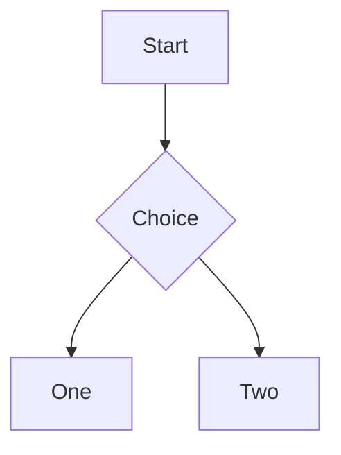

# Editor Mermaid Live Preview Implementation Plan

> **For agentic workers:** REQUIRED SUB-SKILL: Use loopx:subagent-exec (recommended) or loopx:exec to implement this plan task-by-task. Steps use checkbox (`- [ ]`) syntax for tracking.

**Source:** `.loopx/intake/clarify-editor-mermaid-preview-20260605-105303.md`

**Goal:** Add secure inline Mermaid live previews to the shared Markdown editor without modifying the closed-source `@do-md/react` kernel.

**Architecture:** Keep Markdown source as the single source of truth. Parse Mermaid fenced blocks from `bridge.currentMarkdown`, map them to rendered `.DOMD-Pre` code blocks by fenced-code order, and mount a scoped preview node next to each matched code block. Hide Mermaid source by default, reveal it for editing on click, and use Mermaid's client renderer with strict security.

**Tech Stack:** TypeScript, React 19, Next.js 16, Mermaid, DOM MutationObserver, Vitest, existing `@do-md/react` adapter.

---

## File Structure

- Modify `package.json` and `package-lock.json`: add the `mermaid` runtime dependency through `npm install mermaid`.
- Create `features/editor/lib/mermaid-code-fences.ts`: pure Markdown fenced-code parser and Mermaid language matcher.
- Create `features/editor/lib/mermaid-code-fences.test.ts`: parser tests for language matching, fence order, and non-Mermaid exclusions.
- Create `features/editor/lib/mermaid-dom.ts`: pure DOM helpers that map parsed fences to `.DOMD-Pre` elements and apply/remove source visibility state.
- Create `features/editor/lib/mermaid-dom.test.ts`: DOM helper tests using lightweight fixture elements.
- Create `features/editor/lib/mermaid-renderer.ts`: Mermaid import/initialize/render wrapper with strict security, app theme mapping, unique render IDs, and normalized error result.
- Create `features/editor/lib/mermaid-renderer.test.ts`: mocked Mermaid tests for config and success/error result shapes.
- Create `features/editor/components/editor-mermaid-preview-layer.tsx`: React layer that observes editor/root changes, inserts preview containers, handles edit/preview transitions, debounce, render cancellation, blur, and `Esc`.
- Create `features/editor/components/editor-mermaid-preview-layer.test.tsx`: component tests with mocked renderer and synthetic DOMD code blocks.
- Modify `features/editor/components/editor-pane.tsx`: render `EditorMermaidPreviewLayer` next to `<DOMD />` and pass `editorRoot`, `bridge.currentMarkdown`, and `contentRootNode`.
- Modify `features/editor/lib/visible-text-search.test.ts`: add a regression test proving hidden Mermaid source is excluded and revealed source is included.
- Modify `app/globals.css`: add scoped `.mdx-mermaid-*` styles for preview container, toolbar, error state, hidden source, and horizontal overflow.

## Task 1: Add Mermaid Dependency

**Files:**
- Modify: `package.json`
- Modify: `package-lock.json`

- [ ] **Step 1: Install Mermaid**

Run:

```bash
npm install mermaid
```

Expected:

- `package.json` gains a `dependencies.mermaid` entry.
- `package-lock.json` records the resolved Mermaid package tree.
- No unrelated dependency is added for icons or UI.

- [ ] **Step 2: Verify dependency tree installs cleanly**

Run:

```bash
npm install
```

Expected: command exits 0 and reports packages are up to date or successfully audited.

- [ ] **Step 3: Commit dependency change**

Run:

```bash
git add package.json package-lock.json
git commit -m "chore: add mermaid dependency"
```

Expected: commit succeeds.

## Task 2: Parse Mermaid Fenced Blocks

**Files:**
- Create: `features/editor/lib/mermaid-code-fences.ts`
- Create: `features/editor/lib/mermaid-code-fences.test.ts`

- [ ] **Step 1: Write parser tests**

Create `features/editor/lib/mermaid-code-fences.test.ts`:

```ts
import { describe, expect, it } from "vitest";
import {
    findMermaidCodeFences,
    isMermaidFenceLanguage,
} from "./mermaid-code-fences";

describe("mermaid code fences", () => {
    it("matches mermaid as the first info-string token case-insensitively", () => {
        expect(isMermaidFenceLanguage("mermaid")).toBe(true);
        expect(isMermaidFenceLanguage("MERMAID")).toBe(true);
        expect(isMermaidFenceLanguage("mermaid title='Flow'")).toBe(true);
        expect(isMermaidFenceLanguage("mmd")).toBe(false);
        expect(isMermaidFenceLanguage("diagram")).toBe(false);
        expect(isMermaidFenceLanguage("")).toBe(false);
    });

    it("returns mermaid fences with fenced-code order", () => {
        const markdown = [
            "```ts",
            "const a = 1;",
            "```",
            "",
            "```mermaid",
            "graph TD",
            "  A --> B",
            "```",
            "",
            "~~~MERMAID",
            "sequenceDiagram",
            "  A->>B: hi",
            "~~~",
        ].join("\n");

        expect(findMermaidCodeFences(markdown)).toEqual([
            {
                code: "graph TD\n  A --> B",
                codeBlockIndex: 1,
                fenceChar: "`",
                fenceLength: 3,
                info: "mermaid",
                language: "mermaid",
            },
            {
                code: "sequenceDiagram\n  A->>B: hi",
                codeBlockIndex: 2,
                fenceChar: "~",
                fenceLength: 3,
                info: "MERMAID",
                language: "mermaid",
            },
        ]);
    });

    it("ignores unclosed fences and longer closing fences are accepted", () => {
        expect(
            findMermaidCodeFences("````mermaid\ngraph TD\n  A --> B\n````"),
        ).toHaveLength(1);
        expect(findMermaidCodeFences("```mermaid\ngraph TD")).toEqual([]);
    });
});
```

- [ ] **Step 2: Run parser tests and verify failure**

Run:

```bash
npx vitest run features/editor/lib/mermaid-code-fences.test.ts
```

Expected: FAIL because `features/editor/lib/mermaid-code-fences.ts` does not exist.

- [ ] **Step 3: Implement the parser**

Create `features/editor/lib/mermaid-code-fences.ts`:

```ts
export interface MermaidCodeFence {
    code: string;
    codeBlockIndex: number;
    fenceChar: "`" | "~";
    fenceLength: number;
    info: string;
    language: "mermaid";
}

const OPENING_FENCE = /^([`~]{3,})([^\n`]*)$/;

export function isMermaidFenceLanguage(info: string): boolean {
    const firstToken = info.trim().split(/\s+/, 1)[0] ?? "";
    return firstToken.toLowerCase() === "mermaid";
}

export function findMermaidCodeFences(markdown: string): MermaidCodeFence[] {
    const lines = markdown.split(/\r?\n/);
    const fences: MermaidCodeFence[] = [];
    let codeBlockIndex = 0;
    let open:
        | {
              code: string[];
              codeBlockIndex: number;
              fenceChar: "`" | "~";
              fenceLength: number;
              info: string;
              isMermaid: boolean;
          }
        | null = null;

    for (const line of lines) {
        if (!open) {
            const match = line.match(OPENING_FENCE);
            if (!match) {
                continue;
            }

            const marker = match[1];
            const fenceChar = marker[0] as "`" | "~";
            open = {
                code: [],
                codeBlockIndex,
                fenceChar,
                fenceLength: marker.length,
                info: match[2].trim(),
                isMermaid: isMermaidFenceLanguage(match[2]),
            };
            continue;
        }

        if (isClosingFence(line, open.fenceChar, open.fenceLength)) {
            if (open.isMermaid) {
                fences.push({
                    code: open.code.join("\n"),
                    codeBlockIndex: open.codeBlockIndex,
                    fenceChar: open.fenceChar,
                    fenceLength: open.fenceLength,
                    info: open.info,
                    language: "mermaid",
                });
            }
            codeBlockIndex += 1;
            open = null;
            continue;
        }

        open.code.push(line);
    }

    return fences;
}

function isClosingFence(
    line: string,
    fenceChar: "`" | "~",
    fenceLength: number,
): boolean {
    const trimmed = line.trim();
    if (!trimmed || trimmed[0] !== fenceChar) {
        return false;
    }

    for (const char of trimmed) {
        if (char !== fenceChar) {
            return false;
        }
    }

    return trimmed.length >= fenceLength;
}
```

- [ ] **Step 4: Run parser tests and verify pass**

Run:

```bash
npx vitest run features/editor/lib/mermaid-code-fences.test.ts
```

Expected: PASS, all 3 tests pass.

- [ ] **Step 5: Commit parser**

Run:

```bash
git add features/editor/lib/mermaid-code-fences.ts features/editor/lib/mermaid-code-fences.test.ts
git commit -m "feat: parse mermaid code fences"
```

Expected: commit succeeds.

## Task 3: Add Mermaid DOM Mapping Helpers

**Files:**
- Create: `features/editor/lib/mermaid-dom.ts`
- Create: `features/editor/lib/mermaid-dom.test.ts`
- Modify: `features/editor/lib/visible-text-search.test.ts`

- [ ] **Step 1: Write DOM helper tests**

Create `features/editor/lib/mermaid-dom.test.ts`:

```ts
import { describe, expect, it } from "vitest";
import {
    applyMermaidSourceVisibility,
    mapMermaidFencesToPreElements,
} from "./mermaid-dom";
import type { MermaidCodeFence } from "./mermaid-code-fences";

describe("mermaid dom helpers", () => {
    it("maps mermaid fences to DOMD pre elements by fenced-code order", () => {
        const root = document.createElement("div");
        root.append(pre("ts"));
        const mermaidPre = pre("mermaid");
        root.append(mermaidPre);

        const fences: MermaidCodeFence[] = [
            {
                code: "graph TD\n  A --> B",
                codeBlockIndex: 1,
                fenceChar: "`",
                fenceLength: 3,
                info: "mermaid",
                language: "mermaid",
            },
        ];

        expect(mapMermaidFencesToPreElements(root, fences)).toEqual([
            {
                fence: fences[0],
                pre: mermaidPre,
                stableId: "mermaid-1",
            },
        ]);
    });

    it("hides preview-mode sources and reveals editing sources", () => {
        const source = pre("mermaid");

        applyMermaidSourceVisibility(source, "preview");
        expect(source.hidden).toBe(true);
        expect(source.getAttribute("aria-hidden")).toBe("true");
        expect(source.classList.contains("mdx-mermaid-source-hidden")).toBe(true);

        applyMermaidSourceVisibility(source, "editing");
        expect(source.hidden).toBe(false);
        expect(source.getAttribute("aria-hidden")).toBeNull();
        expect(source.classList.contains("mdx-mermaid-source-hidden")).toBe(false);
    });
});

function pre(language: string): HTMLPreElement {
    const element = document.createElement("pre");
    element.className = "DOMD-Pre";
    element.dataset.testLanguage = language;
    const code = document.createElement("code");
    code.className = "DOMD-PreCode";
    code.textContent = language;
    element.append(code);
    return element;
}
```

- [ ] **Step 2: Write visible search regression**

Append this test to `features/editor/lib/visible-text-search.test.ts` inside the existing `describe("visible text search", ...)` block:

```ts
    it("excludes hidden mermaid source and includes it when revealed", () => {
        const root = element("div", "DOMD-Root");
        const pre = child(root, "pre", "DOMD-Pre mdx-mermaid-source-hidden");
        pre.hidden = true;
        pre.setAttribute("aria-hidden", "true");
        child(pre, "code", "DOMD-PreCode", "graph TD\n  HiddenRaw --> B");

        expect(buildVisibleTextIndex(root).text).toBe("");

        pre.hidden = false;
        pre.removeAttribute("aria-hidden");
        pre.className = "DOMD-Pre";

        expect(buildVisibleTextIndex(root).text).toContain("HiddenRaw");
    });
```

- [ ] **Step 3: Run tests and verify failure**

Run:

```bash
npx vitest run features/editor/lib/mermaid-dom.test.ts features/editor/lib/visible-text-search.test.ts
```

Expected: FAIL because `features/editor/lib/mermaid-dom.ts` does not exist.

- [ ] **Step 4: Implement DOM helpers**

Create `features/editor/lib/mermaid-dom.ts`:

```ts
import type { MermaidCodeFence } from "./mermaid-code-fences";

export interface MermaidPreMapping {
    fence: MermaidCodeFence;
    pre: HTMLPreElement;
    stableId: string;
}

export type MermaidSourceMode = "preview" | "editing" | "error";

export function mapMermaidFencesToPreElements(
    editorRoot: ParentNode,
    fences: MermaidCodeFence[],
): MermaidPreMapping[] {
    const preElements = Array.from(
        editorRoot.querySelectorAll<HTMLPreElement>("pre.DOMD-Pre"),
    );

    return fences.flatMap((fence) => {
        const pre = preElements[fence.codeBlockIndex];
        if (!pre) {
            return [];
        }

        return [
            {
                fence,
                pre,
                stableId: `mermaid-${fence.codeBlockIndex}`,
            },
        ];
    });
}

export function applyMermaidSourceVisibility(
    pre: HTMLPreElement,
    mode: MermaidSourceMode,
): void {
    const hidden = mode === "preview";
    pre.hidden = hidden;
    pre.toggleAttribute("aria-hidden", hidden);
    pre.classList.toggle("mdx-mermaid-source-hidden", hidden);
    pre.classList.toggle("mdx-mermaid-source-editing", mode === "editing");
    pre.classList.toggle("mdx-mermaid-source-error", mode === "error");
}
```

- [ ] **Step 5: Run DOM and search tests**

Run:

```bash
npx vitest run features/editor/lib/mermaid-dom.test.ts features/editor/lib/visible-text-search.test.ts
```

Expected: PASS.

- [ ] **Step 6: Commit DOM helpers**

Run:

```bash
git add features/editor/lib/mermaid-dom.ts features/editor/lib/mermaid-dom.test.ts features/editor/lib/visible-text-search.test.ts
git commit -m "feat: map mermaid blocks in editor dom"
```

Expected: commit succeeds.

## Task 4: Add Secure Mermaid Renderer Wrapper

**Files:**
- Create: `features/editor/lib/mermaid-renderer.ts`
- Create: `features/editor/lib/mermaid-renderer.test.ts`

- [ ] **Step 1: Write renderer tests with a mocked Mermaid module**

Create `features/editor/lib/mermaid-renderer.test.ts`:

```ts
import { beforeEach, describe, expect, it, vi } from "vitest";

const initialize = vi.fn();
const render = vi.fn();

vi.mock("mermaid", () => ({
    default: {
        initialize,
        render,
    },
}));

describe("mermaid renderer", () => {
    beforeEach(() => {
        vi.clearAllMocks();
        vi.resetModules();
    });

    it("initializes mermaid with strict security and matching theme", async () => {
        render.mockResolvedValue({ svg: "<svg></svg>" });
        const { renderMermaidDiagram } = await import("./mermaid-renderer");

        await renderMermaidDiagram({
            code: "graph TD\n  A --> B",
            id: "chart-1",
            theme: "dark",
        });

        expect(initialize).toHaveBeenCalledWith({
            securityLevel: "strict",
            startOnLoad: false,
            theme: "dark",
        });
        expect(render).toHaveBeenCalledWith("chart-1", "graph TD\n  A --> B");
    });

    it("normalizes render failures", async () => {
        render.mockRejectedValue(new Error("Parse error"));
        const { renderMermaidDiagram } = await import("./mermaid-renderer");

        await expect(
            renderMermaidDiagram({
                code: "not mermaid",
                id: "chart-2",
                theme: "light",
            }),
        ).resolves.toEqual({
            ok: false,
            error: "Parse error",
        });
    });
});
```

- [ ] **Step 2: Run renderer tests and verify failure**

Run:

```bash
npx vitest run features/editor/lib/mermaid-renderer.test.ts
```

Expected: FAIL because `features/editor/lib/mermaid-renderer.ts` does not exist.

- [ ] **Step 3: Implement renderer wrapper**

Create `features/editor/lib/mermaid-renderer.ts`:

```ts
import mermaid from "mermaid";

export type MermaidEditorTheme = "light" | "dark";

export type MermaidRenderResult =
    | { ok: true; svg: string }
    | { ok: false; error: string };

export interface MermaidRenderRequest {
    code: string;
    id: string;
    theme: MermaidEditorTheme;
}

let initializedTheme: MermaidEditorTheme | null = null;

export async function renderMermaidDiagram({
    code,
    id,
    theme,
}: MermaidRenderRequest): Promise<MermaidRenderResult> {
    initializeMermaid(theme);

    try {
        const result = await mermaid.render(id, code);
        return { ok: true, svg: result.svg };
    } catch (error) {
        return {
            ok: false,
            error: error instanceof Error ? error.message : String(error),
        };
    }
}

export function initializeMermaid(theme: MermaidEditorTheme): void {
    if (initializedTheme === theme) {
        return;
    }

    mermaid.initialize({
        securityLevel: "strict",
        startOnLoad: false,
        theme,
    });
    initializedTheme = theme;
}
```

- [ ] **Step 4: Run renderer tests and verify pass**

Run:

```bash
npx vitest run features/editor/lib/mermaid-renderer.test.ts
```

Expected: PASS.

- [ ] **Step 5: Commit renderer wrapper**

Run:

```bash
git add features/editor/lib/mermaid-renderer.ts features/editor/lib/mermaid-renderer.test.ts
git commit -m "feat: render mermaid diagrams securely"
```

Expected: commit succeeds.

## Task 5: Build Editor Mermaid Preview Layer

**Files:**
- Create: `features/editor/components/editor-mermaid-preview-layer.tsx`
- Create: `features/editor/components/editor-mermaid-preview-layer.test.tsx`

- [ ] **Step 1: Write component tests**

Create `features/editor/components/editor-mermaid-preview-layer.test.tsx`:

```tsx
import { act, createRoot } from "react-dom/client";
import { afterEach, beforeEach, describe, expect, it, vi } from "vitest";
import { EditorMermaidPreviewLayer } from "./editor-mermaid-preview-layer";

const renderMermaidDiagram = vi.fn();

vi.mock("../lib/mermaid-renderer", () => ({
    renderMermaidDiagram: (
        request: Parameters<typeof renderMermaidDiagram>[0],
    ) => renderMermaidDiagram(request),
}));

describe("EditorMermaidPreviewLayer", () => {
    let host: HTMLDivElement;
    let root: ReturnType<typeof createRoot>;
    let editorRoot: HTMLDivElement;

    beforeEach(() => {
        vi.useFakeTimers();
        renderMermaidDiagram.mockResolvedValue({
            ok: true,
            svg: "<svg><text>A</text></svg>",
        });
        host = document.createElement("div");
        document.body.append(host);
        root = createRoot(host);
        editorRoot = document.createElement("div");
        editorRoot.className = "DOMD-Root";
        editorRoot.append(pre("graph TD\n  A --> B"));
        document.body.append(editorRoot);
    });

    afterEach(() => {
        act(() => root.unmount());
        editorRoot.remove();
        host.remove();
        vi.useRealTimers();
        vi.clearAllMocks();
    });

    it("hides mermaid source and inserts a preview block", async () => {
        await renderLayer("```mermaid\ngraph TD\n  A --> B\n```");

        expect(editorRoot.querySelector("pre")?.hidden).toBe(true);
        expect(
            editorRoot.querySelector("[data-mdx-mermaid-preview]"),
        ).not.toBeNull();
        expect(renderMermaidDiagram).toHaveBeenCalledWith(
            expect.objectContaining({
                code: "graph TD\n  A --> B",
                theme: expect.any(String),
            }),
        );
    });

    it("reveals source when the preview is clicked", async () => {
        await renderLayer("```mermaid\ngraph TD\n  A --> B\n```");

        const preview = editorRoot.querySelector<HTMLElement>(
            "[data-mdx-mermaid-preview]",
        );
        act(() => preview?.click());

        expect(editorRoot.querySelector("pre")?.hidden).toBe(false);
    });

    it("keeps invalid source visible and shows an error", async () => {
        renderMermaidDiagram.mockResolvedValue({
            ok: false,
            error: "Parse error",
        });

        await renderLayer("```mermaid\nnot mermaid\n```");

        expect(editorRoot.querySelector("pre")?.hidden).toBe(false);
        expect(editorRoot.textContent).toContain("Mermaid 语法无法渲染");
    });

    async function renderLayer(markdown: string) {
        await act(async () => {
            root.render(
                <EditorMermaidPreviewLayer
                    editorRoot={editorRoot}
                    markdown={markdown}
                />,
            );
        });
        await act(async () => {
            await vi.runAllTimersAsync();
        });
    }
});

function pre(text: string): HTMLPreElement {
    const element = document.createElement("pre");
    element.className = "DOMD-Pre";
    const code = document.createElement("code");
    code.className = "DOMD-PreCode";
    code.textContent = text;
    element.append(code);
    return element;
}
```

- [ ] **Step 2: Run component tests and verify failure**

Run:

```bash
npx vitest run features/editor/components/editor-mermaid-preview-layer.test.tsx
```

Expected: FAIL because `features/editor/components/editor-mermaid-preview-layer.tsx` does not exist.

- [ ] **Step 3: Implement preview layer**

Create `features/editor/components/editor-mermaid-preview-layer.tsx` with these exported props and behavior:

```tsx
"use client";

import { useEffect, useRef, useState } from "react";
import { findMermaidCodeFences } from "../lib/mermaid-code-fences";
import {
    applyMermaidSourceVisibility,
    mapMermaidFencesToPreElements,
} from "../lib/mermaid-dom";
import { renderMermaidDiagram } from "../lib/mermaid-renderer";
import type { MermaidEditorTheme } from "../lib/mermaid-renderer";

interface EditorMermaidPreviewLayerProps {
    editorRoot: HTMLElement | null;
    markdown: string;
}

interface RenderState {
    error: string | null;
    svg: string | null;
}

const RENDER_DEBOUNCE_MS = 300;

export function EditorMermaidPreviewLayer({
    editorRoot,
    markdown,
}: EditorMermaidPreviewLayerProps) {
    const [editingId, setEditingId] = useState<string | null>(null);
    const renderStatesRef = useRef(new Map<string, RenderState>());

    useEffect(() => {
        if (!editorRoot) {
            return;
        }

        const fences = findMermaidCodeFences(markdown);
        const mappings = mapMermaidFencesToPreElements(editorRoot, fences);
        const activeIds = new Set(mappings.map((mapping) => mapping.stableId));
        cleanupStalePreviewNodes(editorRoot, activeIds);

        const timers = mappings.map((mapping) => {
            const preview = ensurePreviewNode(mapping.pre, mapping.stableId);
            const state = renderStatesRef.current.get(mapping.stableId) ?? {
                error: null,
                svg: null,
            };
            const isEditing = editingId === mapping.stableId;
            const hasError = Boolean(state.error);

            applyMermaidSourceVisibility(
                mapping.pre,
                hasError ? "error" : isEditing ? "editing" : "preview",
            );
            renderPreviewNode(preview, state, hasError, () =>
                setEditingId(mapping.stableId),
            );

            const timer = window.setTimeout(() => {
                const theme = currentMermaidTheme();
                void renderMermaidDiagram({
                    code: mapping.fence.code,
                    id: `mdx-${mapping.stableId}`,
                    theme,
                }).then((result) => {
                    renderStatesRef.current.set(
                        mapping.stableId,
                        result.ok
                            ? { error: null, svg: result.svg }
                            : { error: result.error, svg: null },
                    );
                    const nextState = renderStatesRef.current.get(
                        mapping.stableId,
                    );
                    if (!nextState) {
                        return;
                    }
                    applyMermaidSourceVisibility(
                        mapping.pre,
                        nextState.error
                            ? "error"
                            : editingId === mapping.stableId
                              ? "editing"
                              : "preview",
                    );
                    renderPreviewNode(preview, nextState, Boolean(nextState.error), () =>
                        setEditingId(mapping.stableId),
                    );
                });
            }, RENDER_DEBOUNCE_MS);

            return timer;
        });

        const handleKeyDown = (event: KeyboardEvent) => {
            if (event.key === "Escape") {
                setEditingId(null);
            }
        };
        const handleFocusOut = (event: FocusEvent) => {
            if (
                editingId &&
                event.target instanceof Node &&
                !editorRoot.contains(event.relatedTarget as Node | null)
            ) {
                setEditingId(null);
            }
        };

        editorRoot.addEventListener("keydown", handleKeyDown, true);
        editorRoot.addEventListener("focusout", handleFocusOut, true);

        return () => {
            for (const timer of timers) {
                window.clearTimeout(timer);
            }
            editorRoot.removeEventListener("keydown", handleKeyDown, true);
            editorRoot.removeEventListener("focusout", handleFocusOut, true);
        };
    }, [editingId, editorRoot, markdown]);

    return null;
}

function currentMermaidTheme(): MermaidEditorTheme {
    return document.documentElement.dataset.theme === "dark" ? "dark" : "light";
}

function ensurePreviewNode(pre: HTMLPreElement, stableId: string): HTMLElement {
    const existing = pre.nextElementSibling;
    if (
        existing instanceof HTMLElement &&
        existing.dataset.mdxMermaidPreview === stableId
    ) {
        return existing;
    }

    const node = document.createElement("div");
    node.dataset.mdxMermaidPreview = stableId;
    node.className = "mdx-mermaid-preview";
    node.contentEditable = "false";
    pre.after(node);
    return node;
}

function renderPreviewNode(
    node: HTMLElement,
    state: RenderState,
    hasError: boolean,
    onEdit: () => void,
) {
    node.replaceChildren();
    node.onclick = (event) => {
        event.preventDefault();
        event.stopPropagation();
        onEdit();
    };

    const toolbar = document.createElement("div");
    toolbar.className = "mdx-mermaid-preview-toolbar";
    const button = document.createElement("button");
    button.type = "button";
    button.textContent = "编辑";
    button.className = "mdx-mermaid-edit-button";
    toolbar.append(button);
    node.append(toolbar);

    if (hasError) {
        const error = document.createElement("div");
        error.className = "mdx-mermaid-error";
        error.textContent = "Mermaid 语法无法渲染";
        error.title = state.error ?? "";
        node.append(error);
        return;
    }

    const output = document.createElement("div");
    output.className = "mdx-mermaid-svg";
    output.innerHTML = state.svg ?? "";
    node.append(output);
}

function cleanupStalePreviewNodes(
    editorRoot: HTMLElement,
    activeIds: Set<string>,
): void {
    for (const node of Array.from(
        editorRoot.querySelectorAll<HTMLElement>("[data-mdx-mermaid-preview]"),
    )) {
        const id = node.dataset.mdxMermaidPreview;
        if (!id || !activeIds.has(id)) {
            node.remove();
        }
    }
}
```

While implementing, keep the public export name `EditorMermaidPreviewLayer`. If TypeScript requires small adjustments around `relatedTarget`, make the null checks explicit instead of loosening the prop types.

- [ ] **Step 4: Run component tests and verify pass**

Run:

```bash
npx vitest run features/editor/components/editor-mermaid-preview-layer.test.tsx
```

Expected: PASS.

- [ ] **Step 5: Commit preview layer**

Run:

```bash
git add features/editor/components/editor-mermaid-preview-layer.tsx features/editor/components/editor-mermaid-preview-layer.test.tsx
git commit -m "feat: add mermaid preview layer"
```

Expected: commit succeeds.

## Task 6: Wire Preview Layer Into The Shared Editor

**Files:**
- Modify: `features/editor/components/editor-pane.tsx`
- Modify: `app/globals.css`
- Modify: `features/editor/components/editor-pane.test.tsx`

- [ ] **Step 1: Add editor-pane integration test**

Modify `features/editor/components/editor-pane.test.tsx` to mock the preview layer near the existing `@do-md/react` mocks:

```ts
vi.mock("./editor-mermaid-preview-layer", () => ({
    EditorMermaidPreviewLayer: () => null,
}));
```

No assertion is required for rendering internals in this file; this mock keeps existing helper tests isolated after the import is added.

- [ ] **Step 2: Import and render the layer**

Modify `features/editor/components/editor-pane.tsx`:

```ts
import { EditorMermaidPreviewLayer } from "./editor-mermaid-preview-layer";
```

Render the layer immediately after `<DOMD />`:

```tsx
                    <DOMD />
                    <EditorMermaidPreviewLayer
                        editorRoot={editorRoot}
                        markdown={bridge.currentMarkdown}
                    />
```

- [ ] **Step 3: Add scoped Mermaid styles**

Append to `app/globals.css`:

```css
.mdx-mermaid-source-hidden {
    display: none !important;
}

.mdx-mermaid-source-editing,
.mdx-mermaid-source-error {
    display: block;
}

.mdx-mermaid-preview {
    border: 1px solid color-mix(in srgb, var(--color-base-content) 10%, transparent);
    border-radius: 6px;
    background: var(--color-base-100);
    margin: 0.5rem 0;
    overflow-x: auto;
    padding: 0.75rem;
    position: relative;
}

.mdx-mermaid-preview-toolbar {
    display: flex;
    justify-content: flex-end;
    margin-bottom: 0.5rem;
}

.mdx-mermaid-edit-button {
    border: 1px solid color-mix(in srgb, var(--color-base-content) 12%, transparent);
    border-radius: 4px;
    color: var(--color-base-content);
    cursor: pointer;
    font-size: 0.75rem;
    line-height: 1;
    padding: 0.35rem 0.5rem;
}

.mdx-mermaid-edit-button:hover,
.mdx-mermaid-edit-button:focus-visible {
    background: var(--color-base-200);
}

.mdx-mermaid-svg {
    min-width: max-content;
}

.mdx-mermaid-svg svg {
    display: block;
    height: auto;
    max-width: none;
}

.mdx-mermaid-error {
    color: var(--color-error);
    font-size: 0.875rem;
}
```

- [ ] **Step 4: Run editor component tests**

Run:

```bash
npx vitest run features/editor/components/editor-pane.test.tsx features/editor/components/editor-mermaid-preview-layer.test.tsx
```

Expected: PASS.

- [ ] **Step 5: Commit editor wiring**

Run:

```bash
git add features/editor/components/editor-pane.tsx features/editor/components/editor-pane.test.tsx app/globals.css
git commit -m "feat: show mermaid previews in editor"
```

Expected: commit succeeds.

## Task 7: Full Verification And Manual Smoke

**Files:**
- No planned source changes unless verification exposes defects.

- [ ] **Step 1: Run focused editor test suite**

Run:

```bash
npx vitest run features/editor
```

Expected: PASS.

- [ ] **Step 2: Run full frontend verification**

Run:

```bash
npm test
npm run lint
npm run build
```

Expected:

- `npm test` passes all Vitest suites.
- `npm run lint` exits 0.
- `npm run build` exits 0.

- [ ] **Step 3: Run Rust verification**

Run:

```bash
cargo test --manifest-path src-tauri/Cargo.toml
```

Expected: PASS.

- [ ] **Step 4: Start the app for manual smoke**

Run:

```bash
npm run dev
```

Expected: Next.js dev server starts. Use the printed localhost URL.

Manual smoke document:

```md
# Mermaid Smoke



```mermaid
not valid mermaid
```
```

Expected manual results:

- The first block shows a diagram by default.
- The first block source is hidden until the diagram or "编辑" is clicked.
- After clicking, source is editable.
- Pressing `Esc` returns to preview when syntax is valid.
- The invalid block keeps source visible and shows "Mermaid 语法无法渲染".
- Find/replace does not find hidden Mermaid source text before clicking into the block.
- Find/replace does find source text after the block is in source editing mode.
- Saving preserves fenced Mermaid Markdown rather than SVG.

- [ ] **Step 5: Commit any verification fixes**

If verification required fixes, commit them:

```bash
git add <changed-files>
git commit -m "fix: stabilize mermaid preview"
```

Expected: commit succeeds only if files changed. If no fixes were needed, skip this step.

## Self-Review Checklist

- Spec coverage: The plan covers preview by default, hidden source, click-to-edit, blur/Esc exit, invalid syntax behavior, 300ms debounce, strict security, theme following, Workspace/Document shared integration, and original Markdown persistence.
- Placeholder scan: No step contains unresolved placeholders such as TBD, TODO, "implement later", or "add appropriate".
- Type consistency: `MermaidCodeFence`, `MermaidPreMapping`, `MermaidRenderResult`, and `EditorMermaidPreviewLayer` are defined before use.
- Design drift: The plan does not add aliases, export behavior, image caching, icon dependencies, or kernel modifications.

## Execution Handoff

Plan complete and saved to `docs/loopx/plans/2026-06-05-editor-mermaid-live-preview.md`.

Two execution options:

1. Subagent-Driven (recommended) - dispatch a fresh subagent per task, review between tasks, fast iteration
2. Inline Execution - execute tasks in this session using exec, batch execution with checkpoints

Which approach?
