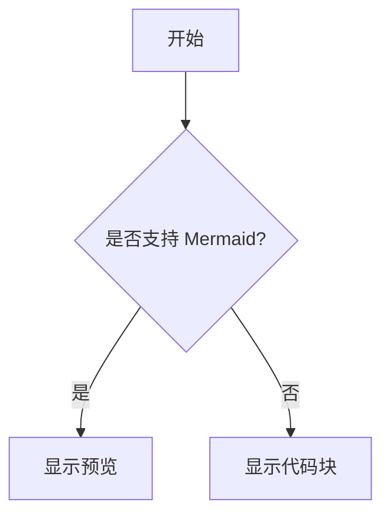
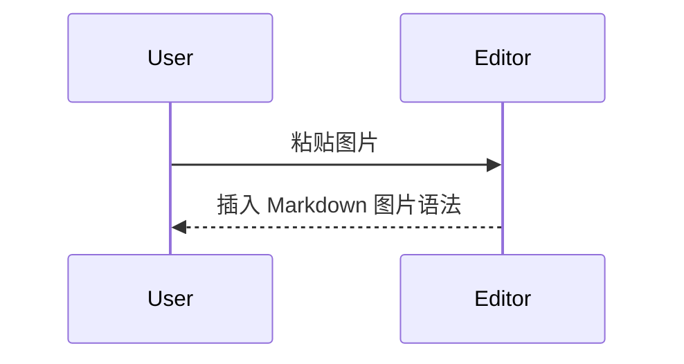

# Markdown 语法支持检查

这个文档用于检查编辑器对 Markdown、GFM 和本项目扩展语法的支持情况。建议打开后逐段检查：是否正确渲染、是否可编辑、复制出来是否仍是合理 Markdown、撤销/重做是否正常。

## 1. 标题

# 一级标题

## 二级标题

### 三级标题

#### 四级标题

##### 五级标题

###### 六级标题

普通正文。标题应该比正文更大、更粗，并且回车后不应继续保持标题样式。

## 2. 段落与换行

这是第一段文字。它包含中文、English、数字 12345，以及标点符号。

这是第二段文字。段落之间应有垂直间距。

这一行末尾有两个空格用于硬换行。  
这一行应该紧接着上一行显示为换行，而不是新段落。

## 3. 行内样式

普通文字、**加粗文字**、*斜体文字*、***加粗斜体***、~~删除线~~、`行内代码`。

混合样式：这是 **加粗中的 `行内代码`**，这是 *斜体中的 `code`*。

边界字符：a**bold**b、a*em*b、中文**加粗**中文、中文`代码`中文。

## 4. 链接

[百度](http://baidu.com)

[带标题的链接](https://example.com "Example Title")

[相对路径链接](./memory-usage.md)

[锚点链接](#markdown-语法支持检查)

空文本链接不应消失，应该可编辑：[](https://example.com)

编辑链接时，应能移动光标到括号里的地址；失焦后应恢复为链接样式。光标在这个链接后面粘贴图片时，不应把图片插到 URL 中间：[测试链接](http://baidu.com)

## 5. 图片

普通图片：


带标题图片：


空图片占位符应该保持可编辑，不应直接消失：


图片地址不存在时，不应显示成蓝色链接，也不应影响继续编辑：


## 6. 无序列表

- 一级项目 A
- 一级项目 B
  - 二级项目 B.1
  - 二级项目 B.2
    - 三级项目 B.2.a
    - 三级项目 B.2.b
- 一级项目 C

星号列表：

* 星号项目 A
* 星号项目 B

## 7. 有序列表

1. 第一步
2. 第二步
3. 第三步

嵌套有序列表：

1. 外层 1
   1. 内层 1.1
   2. 内层 1.2
2. 外层 2

非 1 起始编号：

3. 第三项
4. 第四项

## 8. 任务列表

- [ ] 未完成任务
- [x] 已完成任务
- [X] 大写 X 的已完成任务
  - [ ] 子任务
  - [x] 已完成子任务

## 9. 引用块

> 这是普通引用块。
>
> 引用块第二段。
>
> - 引用中的列表
> - 第二项

嵌套引用：

> 第一层引用
>
> > 第二层引用
> >
> > **第二层引用中的加粗**

懒续行引用，第二行没有 `>`，有些 Markdown 解析器会把它归入引用：

> 第一行引用
第二行懒续行

## 10. Callout

> [!NOTE]
> 这是 NOTE callout。正文应该在提示框内。

> [!TIP] 自定义标题
> 这是 TIP callout，带标题。
>
> - 可以包含列表
> - 可以包含 **加粗**

> [!WARNING]
> 这是 WARNING callout。
> 这段文字也应该在同一个缩进框内。

> [!IMPORTANT]
> 这是 IMPORTANT callout。

> [!CAUTION]
> 这是 CAUTION callout。

## 11. 分割线

上方文字。

---

中间文字。

***

下方文字。

## 12. 代码

行内代码：`const value = 1`。

普通代码块：

```
plain text
line 2
```

带语言的代码块：

```ts
type User = {
  id: string;
  name: string;
};

const user: User = {
  id: "u1",
  name: "Alice",
};
```

带文本语言标记：

```text
qbt_bark_pg/
├─ qbt_download_started.py
├─ qbt_download_finished.py
├─ docker-compose.bark.yml
└─ README_操作文档.md
```

代码块里出现 Markdown 语法不应被渲染：

```md
# 这里不应该变成标题
[百度](http://baidu.com)

> [!WARNING]
```

四反引号包三反引号：

````
```js
console.log("nested fence");
```
````

## 13. 表格

| 姓名 | 年龄 | 城市 |
|---|---:|:---:|
| 张三 | 18 | 北京 |
| 李四 | 22 | 上海 |
| 王五 | 30 | 深圳 |

包含行内样式的表格：

| 类型 | 示例 | 备注 |
|---|---|---|
| 加粗 | **bold** | 应显示为加粗 |
| 行内代码 | `code` | 应保持等宽 |
| 链接 | [百度](http://baidu.com) | 应可编辑 |

包含转义竖线的表格：

| 表达式 | 说明 |
|---|---|
| A \| B | 单元格内的竖线 |
| `A | B` | 行内代码中的竖线 |

## 14. 转义字符

这些字符前面有反斜杠，应显示为普通符号：

\*不是斜体\*

\[不是链接文本\]\(不是链接地址\)

\# 不是标题

\- 不是列表

普通方括号不应该被复制成自动转义形式：[]、[普通文本]、

## 15. 脚注

这里有一个脚注引用[^note1]，还有另一个脚注引用[^long-note]。

[^note1]: 这是第一个脚注定义。

[^long-note]: 这是一个较长的脚注定义。
    第二行是缩进续行。
    第三行仍然属于脚注。

## 16. 数学公式

行内数学：$E = mc^2$，以及 $\alpha + \beta = \gamma$。

块级数学：

$$
\int_0^1 x^2 dx = \frac{1}{3}
$$

多行数学：

$$
\begin{aligned}
a^2 + b^2 &= c^2 \\
e^{i\pi} + 1 &= 0
\end{aligned}
$$

## 17. Mermaid

流程图：



时序图：



## 18. Wikilink

普通 wikilink：[[Purpose]]

带别名 wikilink：[[Purpose|目的文档]]

包含空格：[[Markdown Syntax]]

包含括号：[[A)B]]

代码块内的 wikilink 不应被转换：

```md
[[CodeOnly]]
```

## 19. HTML 与不支持块

行内 HTML：这是 <kbd>Command</kbd> + <kbd>Z</kbd>。

块级 HTML：

<div class="custom-block">
  <p>这是一个 HTML 块。如果编辑器不支持结构化编辑，应作为 fallback/source block 保真。</p>
</div>

表单 HTML：

<details>
  <summary>展开详情</summary>
  <p>详情内容。</p>
</details>

## 20. 自动链接与邮箱

https://example.com

http://baidu.com

user@example.com

## 21. 复杂组合

> [!WARNING] 复杂组合
> 这是一个 callout，里面包含：
>
> 1. 有序列表
> 2. [链接](http://baidu.com)
> 3. `行内代码`
> 4. **加粗文字**
>
> ```ts
> console.log("code inside callout");
> ```

列表中包含代码块：

1. 安装依赖

   ```bash
   npm install
   ```

2. 运行测试

   ```bash
   npm run test
   ```

列表中包含引用：

- 外层列表
  > 列表里的引用
  >
  > 第二行引用

## 22. 粘贴与撤销检查区

请在下一行末尾粘贴一张图片，期望图片插入到光标位置，并且 `Command+Z` 可以撤销：

图片粘贴测试：[百度](http://baidu.com)

请在这里输入 ``，期望它保持可编辑，不应直接消失：


请在这里输入 `[百度](http://baidu.com)`，期望链接失焦后变成蓝色链接，重新点击可编辑 Markdown 语法：


## 23. 边界样例

中文段落后紧跟链接：[百度](http://baidu.com)下一段文字。

链接后紧跟标点：[Example](https://example.com)，然后继续中文。

图片后紧跟文字：后面的文字。

行首特殊字符应按语义处理：

- [x] 这是任务

\- [x] 这不是任务，应该显示为普通文本

1. 这是有序列表

\1. 这不是有序列表，应该显示为普通文本

## 24. 原始 Markdown 保真检查

复制整个文档后，重点检查：

- `[` 和 `]` 不应被无故变成 `\[` 和 `\]`
- `` 不应消失
- 代码块内容不应被富文本化
- 表格行列分隔线应可见
- 标题应比正文更大更粗
- 分割线应显示为水平线
- callout 内正文应在提示框内
- 图片粘贴应在光标位置
- 图片粘贴后 `Command+Z` 应可撤销
